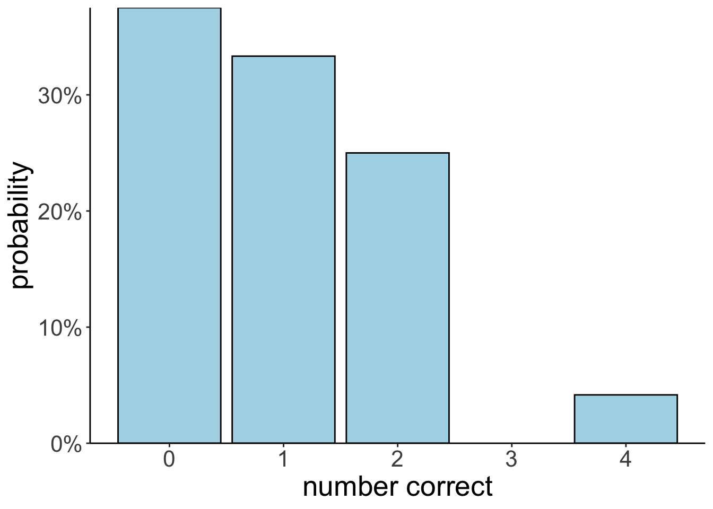

# Probability

## Load packages, load data, set theme

Let's load the packages that we need for this chapter. 


```r
library("knitr")        # for rendering the RMarkdown file
library("kableExtra")   # for nicely formatted tables
library("arrangements") # fast generators and iterators for creating combinations
library("DiagrammeR")   # for drawing diagrams
library("tidyverse")    # for data wrangling 
```

```
## Warning: package 'ggplot2' was built under R version 4.3.1
```

```
## Warning: package 'dplyr' was built under R version 4.3.1
```

Set the plotting theme.


```r
theme_set(theme_classic() + 
            theme(text = element_text(size = 20)))

opts_chunk$set(comment = "",
               fig.show = "hold")
```

## Learning goals

I like to think of statistics as "applied epistemology", the art of making precise statements about what we can and can't "know" from limited and noisy observations.
When we're trying to do science under these conditions, we're usually expressing our (lack of) knowledge as *uncertainty*.
We're often not sure whether there's really an effect in our experiments, or how big it might be.
We can measure a number, but we know that if we did the experiment again, we would get a slightly different number.
*Probability theory* gives us a language for talking about these concepts in a less hand-wavy way; it helps us *quantify* uncertainty.
Probabilities are the conceptual foundation of everything we're going to do in this course, and we're going to start out by learning to look at the phenomena from PSYCH 610 from a different perspective.

## Counting

Imagine that there are three balls in an urn. The balls are labeled 1, 2, and 3. Let's consider a few possible situations.


```r
balls = 1:3 # number of balls in urn 
ndraws = 2 # number of draws

# order matters, without replacement
permutations(balls, ndraws)
```

```
     [,1] [,2]
[1,]    1    2
[2,]    1    3
[3,]    2    1
[4,]    2    3
[5,]    3    1
[6,]    3    2
```

```r
# order matters, with replacement
permutations(balls, ndraws, replace = T)
```

```
      [,1] [,2]
 [1,]    1    1
 [2,]    1    2
 [3,]    1    3
 [4,]    2    1
 [5,]    2    2
 [6,]    2    3
 [7,]    3    1
 [8,]    3    2
 [9,]    3    3
```

```r
# order doesn't matter, with replacement 
combinations(balls, ndraws, replace = T)
```

```
     [,1] [,2]
[1,]    1    1
[2,]    1    2
[3,]    1    3
[4,]    2    2
[5,]    2    3
[6,]    3    3
```

```r
# order doesn't matter, without replacement 
combinations(balls, ndraws)
```

```
     [,1] [,2]
[1,]    1    2
[2,]    1    3
[3,]    2    3
```

I've generated the figures below using the `DiagrammeR` package. It's a powerful package for drawing diagrams in R. See information on how to use the DiagrammeR package [here](https://rich-iannone.github.io/DiagrammeR/). 

<div class="figure">

```{=html}
<div class="grViz html-widget html-fill-item-overflow-hidden html-fill-item" id="htmlwidget-ea91d679331281d84c01" style="width:672px;height:480px;"></div>
<script type="application/json" data-for="htmlwidget-ea91d679331281d84c01">{"x":{"diagram":"\ndigraph dot{\n  \n  # general settings for all nodes\n  node [\n    shape = circle,\n    style = filled,\n    color = black,\n    label = \"\"\n    fontname = \"Helvetica\",\n    fontsize = 24,\n    fillcolor = lightblue\n    ]\n  \n  # edges between nodes\n  edge [color = black]\n  0 -> {1 2 3}\n  1 -> {11 12 13}\n  2 -> {21 22 23}\n  3 -> {31 32 33}\n  \n  # labels for each node\n  0 [fillcolor = \"black\", width = 0.1]\n  1 [label = \"1\"]\n  2 [label = \"2\"]\n  3 [label = \"3\"]\n  11 [label = \"1\"]\n  12 [label = \"2\"]\n  13 [label = \"3\"]\n  21 [label = \"1\"]\n  22 [label = \"2\"]\n  23 [label = \"3\"]\n  31 [label = \"1\"]\n  32 [label = \"2\"]\n  33 [label = \"3\"]\n    \n  # direction in which arrows are drawn (from left to right)\n  rankdir = LR\n}\n","config":{"engine":"dot","options":null}},"evals":[],"jsHooks":[]}</script>
```

<p class="caption">(\#fig:unnamed-chunk-4)Drawing two marbles out of an urn __with__ replacement.</p>
</div>

<div class="figure">

```{=html}
<div class="grViz html-widget html-fill-item-overflow-hidden html-fill-item" id="htmlwidget-774fee7107a284813e80" style="width:672px;height:480px;"></div>
<script type="application/json" data-for="htmlwidget-774fee7107a284813e80">{"x":{"diagram":"\ndigraph dot{\n  \n  # general settings for all nodes\n  node [\n    shape = circle,\n    style = filled,\n    color = black,\n    label = \"\"\n    fontname = \"Helvetica\",\n    fontsize = 24,\n    fillcolor = lightblue\n    ]\n  \n  # edges between nodes\n  edge [color = black]\n  0 -> {1 2 3}\n  1 -> {12 13}\n  2 -> {21 23}\n  3 -> {31 32}\n  \n  # labels for each node\n  0 [fillcolor = \"black\", width = 0.1]\n  1 [label = \"1\"]\n  2 [label = \"2\"]\n  3 [label = \"3\"]\n  12 [label = \"2\"]\n  13 [label = \"3\"]\n  21 [label = \"1\"]\n  23 [label = \"3\"]\n  31 [label = \"1\"]\n  32 [label = \"2\"]\n  \n  # direction in which arrows are drawn (from left to right)\n  rankdir = LR\n}\n","config":{"engine":"dot","options":null}},"evals":[],"jsHooks":[]}</script>
```

<p class="caption">(\#fig:unnamed-chunk-5)Drawing two marbles out of an urn __without__ replacement.</p>
</div>

## Sampling

We can also draw *samples* from the urn:


```r
numbers = 1:3

numbers %>% 
  sample(size = 10,
         replace = T)
```

```
 [1] 3 3 1 2 2 1 2 2 2 2
```

Use the `prob = ` argument to change the probability with which each number should be drawn. 


```r
numbers = 1:3

numbers %>% 
  sample(size = 10,
         replace = T,
         prob = c(0.8, 0.1, 0.1))
```

```
 [1] 1 1 1 1 3 1 1 1 3 1
```

Make sure to set the seed in order to make your code reproducible. The code chunk below may give a different outcome each time is run. 


```r
numbers = 1:5

numbers %>% 
  sample(5)
```

```
[1] 2 3 4 1 5
```

The chunk below will produce the same outcome every time it's run. 


```r
set.seed(1)

numbers = 1:5

numbers %>% 
  sample(5)
```

```
[1] 1 4 3 5 2
```

### Drawing rows from a data frame

We can do this with data frames too, imagining our data frame is the urn and the rows are balls. 


```r
set.seed(1)
n = 10
df.data = tibble(trial = 1:n,
                 stimulus = sample(c("flower", "pet"), size = n, replace = T),
                 rating = sample(1:10, size = n, replace = T))
```

Sample a given number of rows. 


```r
set.seed(1)
df.data %>% 
  slice_sample(n = 6, 
               replace = T)
```

```
# A tibble: 6 × 3
  trial stimulus rating
  <int> <chr>     <int>
1     9 pet           9
2     4 flower        5
3     7 flower       10
4     1 flower        3
5     2 pet           1
6     7 flower       10
```


```r
set.seed(1)
df.data %>% 
  slice_sample(prop = 0.5)
```

```
# A tibble: 5 × 3
  trial stimulus rating
  <int> <chr>     <int>
1     9 pet           9
2     4 flower        5
3     7 flower       10
4     1 flower        3
5     2 pet           1
```

## More complex counting / matching

Imagine a secretary types four letters to four people and addresses the four envelopes. If they insert the letters at random, each in a different envelope, what is the probability that exactly three letters will go into the right envelope?


```r
df.letters = permutations(x = 1:4, k = 4) %>% 
  as_tibble(.name_repair = ~ str_c("person_", 1:4)) %>%
  mutate(n_correct = (person_1 == 1) + 
           (person_2 == 2) + 
           (person_3 == 3) +
           (person_4 == 4))

df.letters %>% 
  summarize(prob_3_correct = sum(n_correct == 3) / n())
```

```
# A tibble: 1 × 1
  prob_3_correct
           <dbl>
1              0
```


```r
ggplot(data = df.letters,
       mapping = aes(x = n_correct)) + 
  geom_bar(aes(y = stat(count)/sum(count)),
           color = "black",
           fill = "lightblue") +
  scale_y_continuous(labels = scales::percent,
                     expand = c(0, 0)) + 
  labs(x = "number correct",
       y = "probability")
```

```
Warning: `stat(count)` was deprecated in ggplot2 3.4.0.
ℹ Please use `after_stat(count)` instead.
This warning is displayed once every 8 hours.
Call `lifecycle::last_lifecycle_warnings()` to see where this warning was generated.
```



## Conditional probability


```r
who = c("ms_scarlet", "col_mustard", "mrs_white",
        "mr_green", "mrs_peacock", "prof_plum")
what = c("candlestick", "knife", "lead_pipe",
         "revolver", "rope", "wrench")
where = c("study", "kitchen", "conservatory",
          "lounge", "billiard_room", "hall",
          "dining_room", "ballroom", "library")

df.clue = expand_grid(who = who,
                      what = what,
                      where = where)

df.suspects = df.clue %>% 
  distinct(who) %>% 
  mutate(gender = ifelse(test = who %in% c("ms_scarlet", "mrs_white", "mrs_peacock"), 
                         yes = "female", 
                         no = "male"))
```


```r
df.suspects %>% 
  arrange(desc(gender)) %>% 
  kable() %>% 
  kable_styling("striped", full_width = F)
```

<table class="table table-striped" style="width: auto !important; margin-left: auto; margin-right: auto;">
 <thead>
  <tr>
   <th style="text-align:left;"> who </th>
   <th style="text-align:left;"> gender </th>
  </tr>
 </thead>
<tbody>
  <tr>
   <td style="text-align:left;"> col_mustard </td>
   <td style="text-align:left;"> male </td>
  </tr>
  <tr>
   <td style="text-align:left;"> mr_green </td>
   <td style="text-align:left;"> male </td>
  </tr>
  <tr>
   <td style="text-align:left;"> prof_plum </td>
   <td style="text-align:left;"> male </td>
  </tr>
  <tr>
   <td style="text-align:left;"> ms_scarlet </td>
   <td style="text-align:left;"> female </td>
  </tr>
  <tr>
   <td style="text-align:left;"> mrs_white </td>
   <td style="text-align:left;"> female </td>
  </tr>
  <tr>
   <td style="text-align:left;"> mrs_peacock </td>
   <td style="text-align:left;"> female </td>
  </tr>
</tbody>
</table>


```r
# conditional probability (via rules of probability)
df.suspects %>% 
  summarize(p_prof_plum_given_male = 
              sum(gender == "male" & who == "prof_plum") /
              sum(gender == "male"))
```

```
# A tibble: 1 × 1
  p_prof_plum_given_male
                   <dbl>
1                  0.333
```


```r
# conditional probability (via rejection)
df.suspects %>% 
  filter(gender == "male") %>% 
  summarize(p_prof_plum_given_male = 
              sum(who == "prof_plum") /
              n())
```

```
# A tibble: 1 × 1
  p_prof_plum_given_male
                   <dbl>
1                  0.333
```

## Law of total probability


```{=html}
<div class="grViz html-widget html-fill-item-overflow-hidden html-fill-item" id="htmlwidget-aa2faac603ea91129c08" style="width:672px;height:480px;"></div>
<script type="application/json" data-for="htmlwidget-aa2faac603ea91129c08">{"x":{"diagram":"\ndigraph dot{\n  \n  # general settings for all nodes\n  node [\n    shape = circle,\n    style = filled,\n    color = black,\n    label = \"\"\n    fontname = \"Helvetica\",\n    fontsize = 9,\n    fillcolor = lightblue,\n    fixedsize=true,\n    width = 0.8\n    ]\n  \n  # edges between nodes\n  edge [color = black,\n        fontname = \"Helvetica\",\n        fontsize = 10]\n  1 -> 2 [label = \"p(female)\"]\n  1 -> 3 [label = \"p(male)\"]\n  2 -> 4 [label = \"p(revolver | female)\"] \n  3 -> 4 [label = \"p(revolver | male)\"]\n  \n  \n\n  # labels for each node\n  1 [label = \"Gender?\"]\n  2 [label = \"If female\nuse revolver?\"]\n  3 [label = \"If male\nuse revolver?\"]\n  4 [label = \"Revolver\nused?\"]\n  \n  rankdir=\"LR\"\n  }","config":{"engine":"dot","options":null}},"evals":[],"jsHooks":[]}</script>
```


```r
# Make a deck of cards 
df.cards = tibble(suit = rep(c("Clubs", "Spades", "Hearts", "Diamonds"), each = 8),
                  value = rep(c("7", "8", "9", "10", "Jack", "Queen", "King", "Ace"), 4)) 
```


```r
# conditional probability: p(Hearts | Queen) (via rules of probability)
df.cards %>% 
  summarize(p_hearts_given_queen = 
              sum(suit == "Hearts" & value == "Queen") / 
              sum(value == "Queen"))
```

```
# A tibble: 1 × 1
  p_hearts_given_queen
                 <dbl>
1                 0.25
```


```r
# conditional probability: p(Hearts | Queen) (via rejection)
df.cards %>% 
  filter(value == "Queen") %>%
  summarize(p_hearts_given_queen = sum(suit == "Hearts")/n())
```

```
# A tibble: 1 × 1
  p_hearts_given_queen
                 <dbl>
1                 0.25
```

## Additional resources

### Cheatsheets

- [Probability cheatsheet](figures/probability.pdf)

### Books and chapters

- [Probability and Statistics with examples using R](http://www.isibang.ac.in/~athreya/psweur/)
- [Learning statistics with R: Chapter 9 Introduction to probability](https://learningstatisticswithr-bookdown.netlify.com/probability.html#probstats)

### Misc

- [Bayes' theorem in three panels](https://www.tjmahr.com/bayes-theorem-in-three-panels/)
- [Statistics 110: Probability; course at Harvard](https://projects.iq.harvard.edu/stat110)  
- [Bayes theorem and making probability intuitive](https://www.youtube.com/watch?v=HZGCoVF3YvM&feature=youtu.be)

## Session info

Information about this R session including which version of R was used, and what packages were loaded. 


```
R version 4.3.0 (2023-04-21)
Platform: aarch64-apple-darwin20 (64-bit)
Running under: macOS 14.1.1

Matrix products: default
BLAS:   /Library/Frameworks/R.framework/Versions/4.3-arm64/Resources/lib/libRblas.0.dylib 
LAPACK: /Library/Frameworks/R.framework/Versions/4.3-arm64/Resources/lib/libRlapack.dylib;  LAPACK version 3.11.0

locale:
[1] en_US.UTF-8/en_US.UTF-8/en_US.UTF-8/C/en_US.UTF-8/en_US.UTF-8

time zone: America/Chicago
tzcode source: internal

attached base packages:
[1] stats     graphics  grDevices utils     datasets  methods   base     

other attached packages:
 [1] lubridate_1.9.2    forcats_1.0.0      stringr_1.5.0      dplyr_1.1.4       
 [5] purrr_1.0.2        readr_2.1.4        tidyr_1.3.0        tibble_3.2.1      
 [9] ggplot2_3.4.4      tidyverse_2.0.0    DiagrammeR_1.0.10  arrangements_1.1.9
[13] kableExtra_1.3.4   knitr_1.42        

loaded via a namespace (and not attached):
 [1] gmp_0.7-3          sass_0.4.6         utf8_1.2.3         generics_0.1.3    
 [5] xml2_1.3.4         stringi_1.7.12     hms_1.1.3          digest_0.6.31     
 [9] magrittr_2.0.3     timechange_0.2.0   evaluate_0.21      grid_4.3.0        
[13] RColorBrewer_1.1-3 bookdown_0.34      fastmap_1.1.1      jsonlite_1.8.4    
[17] httr_1.4.6         rvest_1.0.3        fansi_1.0.4        viridisLite_0.4.2 
[21] scales_1.3.0       jquerylib_0.1.4    cli_3.6.1          crayon_1.5.2      
[25] rlang_1.1.1        visNetwork_2.1.2   ellipsis_0.3.2     munsell_0.5.0     
[29] withr_2.5.0        cachem_1.0.8       yaml_2.3.7         tools_4.3.0       
[33] tzdb_0.4.0         colorspace_2.1-0   webshot_0.5.4      vctrs_0.6.5       
[37] R6_2.5.1           lifecycle_1.0.3    htmlwidgets_1.6.2  pkgconfig_2.0.3   
[41] bslib_0.4.2        pillar_1.9.0       gtable_0.3.3       glue_1.6.2        
[45] systemfonts_1.0.4  highr_0.10         xfun_0.39          tidyselect_1.2.0  
[49] rstudioapi_0.14    farver_2.1.1       htmltools_0.5.5    labeling_0.4.2    
[53] rmarkdown_2.21     svglite_2.1.1      compiler_4.3.0    
```
