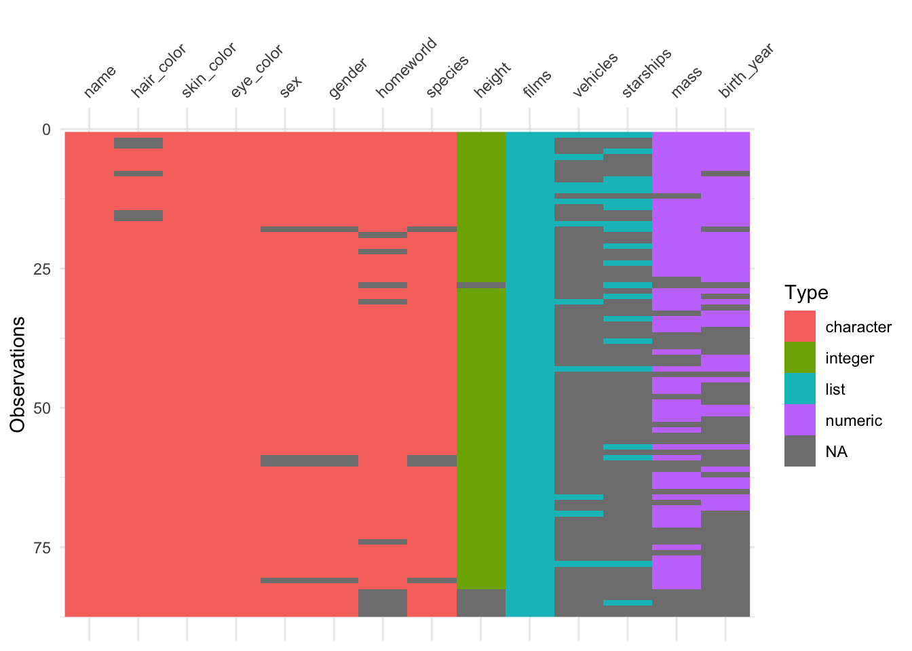

# Appendix B: Data wrangling

In this lecture, we will take a look at how to wrangle data using the [dplyr](https://dplyr.tidyverse.org/) package. Again, getting our data into shape is something we'll need to do throughout the course, so it's worth spending some time getting a good sense for how this works. The nice thing about R is that (thanks to the `tidyverse`), both visualization and data wrangling are particularly powerful. 

## Learning goals

- Review R basics (incl. variable modes, data types, operators, control flow, and functions). 
- Learn how the pipe operator `%>%` works. 
- See different ways for getting a sense of one's data. 
- Master key data manipulation verbs from the `dplyr` package (incl. `filter()`, `arrange()`, `rename()`, `relocate()`, `select()`, `mutate()`) as well as the helper functions `across()` and `where()`.

## Load packages

Let's first load the packages that we need for this chapter. 


```r
library("knitr")        # for rendering the RMarkdown file
library("skimr")        # for visualizing data 
library("visdat")       # for visualizing data 
library("DT")           # for visualizing data 
```

```
## Warning: package 'DT' was built under R version 4.3.1
```

```r
library("tidyverse")    # for data wrangling
```

```
## Warning: package 'ggplot2' was built under R version 4.3.1
```

```
## Warning: package 'dplyr' was built under R version 4.3.1
```

```r
opts_chunk$set(comment = "",
               fig.show = "hold")
```

## Some R basics

To test your knowledge of the R basics, I recommend taking the free interactive tutorial on datacamp: [Introduction to R](https://www.datacamp.com/courses/free-introduction-to-r). Here, I will just give a very quick overview of some of the basics. 

### Modes

Variables in R can have different modes. Table \@ref(tab:variable-modes) shows the most common ones. 


Table: (\#tab:variable-modes)Most commonly used variable modes in R.

|          name|example                  |
|-------------:|:------------------------|
|       numeric|`1`, `3`, `48`           |
|     character|`'Steve'`, `'a'`, `'78'` |
|       logical|`TRUE`, `FALSE`          |
| not available|`NA`                     |

For characters you can either use `"` or `'`. R has a number of functions to convert a variable from one mode to another. `NA` is used for missing values.


```r
tmp1 = "1" # we start with a character
str(tmp1) 
```

```
 chr "1"
```

```r
tmp2 = as.numeric(tmp1) # turn it into a numeric
str(tmp2) 
```

```
 num 1
```

```r
tmp3 = as.factor(tmp2) # turn that into a factor
str(tmp3)
```

```
 Factor w/ 1 level "1": 1
```

```r
tmp4 = as.character(tmp3) # and go full cycle by turning it back into a character
str(tmp4)
```

```
 chr "1"
```

```r
identical(tmp1, tmp4) # checks whether tmp1 and tmp4 are the same
```

```
[1] TRUE
```

The `str()` function displays the structure of an R object. Here, it shows us what mode the variable is. 

### Data types

R has a number of different data types. Table \@ref(tab:data-types) shows the ones you're most likely to come across (taken from [this source](https://www.statmethods.net/input/datatypes.html)): 


Table: (\#tab:data-types)Most commonly used data types in R.

|       name|description                                                   |
|----------:|:-------------------------------------------------------------|
|     vector|list of values with of the same variable mode                 |
|     factor|for ordinal variables                                         |
|     matrix|2D data structure                                             |
|      array|same as matrix for higher dimensional data                    |
| data frame|similar to matrix but with column names                       |
|       list|flexible type that can contain different other variable types |

#### Vectors

We build vectors using the concatenate function `c()`, and we use `[]` to access one or more elements of a vector.  


```r
numbers = c(1, 4, 5) # make a vector
numbers[2] # access the second element 
```

```
[1] 4
```

```r
numbers[1:2] # access the first two elements
```

```
[1] 1 4
```

```r
numbers[c(1, 3)] # access the first and last element
```

```
[1] 1 5
```

In R (unlike in Python for example), 1 refers to the first element of a vector (or list). 

#### Matrix

We build a matrix using the `matrix()` function, and we use `[]` to access its elements. 


```r
matrix = matrix(data = c(1, 2, 3, 4, 5, 6),
                nrow = 3,
                ncol = 2)
matrix # the full matrix
```

```
     [,1] [,2]
[1,]    1    4
[2,]    2    5
[3,]    3    6
```

```r
matrix[1, 2] # element in row 1, column 2
```

```
[1] 4
```

```r
matrix[1, ] # all elements in the first row 
```

```
[1] 1 4
```

```r
matrix[ , 1] # all elements in the first column 
```

```
[1] 1 2 3
```

```r
matrix[-1, ] # a matrix which excludes the first row
```

```
     [,1] [,2]
[1,]    2    5
[2,]    3    6
```

Note how we use an empty placeholder to indicate that we want to select all the values in a row or column, and `-` to indicate that we want to remove something.

#### Array

Arrays work the same was as matrices with data of more than two dimensions. 

#### Data frame


```r
df = tibble(participant_id = c(1, 2, 3),
            participant_name = c("Leia", "Luke", "Darth")) # make the data frame 

df # the complete data frame
```

```
# A tibble: 3 × 2
  participant_id participant_name
           <dbl> <chr>           
1              1 Leia            
2              2 Luke            
3              3 Darth           
```

```r
df[1, 2] # a single element using numbers 
```

```
# A tibble: 1 × 1
  participant_name
  <chr>           
1 Leia            
```

```r
df$participant_id # all participants 
```

```
[1] 1 2 3
```

```r
df[["participant_id"]] # same as before but using [[]] instead of $
```

```
[1] 1 2 3
```

```r
df$participant_name[2] # name of the second participant
```

```
[1] "Luke"
```

```r
df[["participant_name"]][2] # same as above
```

```
[1] "Luke"
```

We'll use data frames a lot. Data frames are like a matrix with column names. Data frames are also more general than matrices in that different columns can have different modes. For example, one column might be a character, another one numeric, and another one a factor. 

Here we used the `tibble()` function to create the data frame. A `tibble` is almost the same as a data frame but it has better defaults for formatting output in the console (more information on tibbles is [here](http://r4ds.had.co.nz/tibbles.html)). 

#### Lists


```r
l.mixed = list(number = 1, 
               character = "2", 
               factor = factor(3), 
               matrix = matrix(1:4, ncol = 2),
               df = tibble(x = c(1, 2), y = c(3, 4)))
l.mixed
```

```
$number
[1] 1

$character
[1] "2"

$factor
[1] 3
Levels: 3

$matrix
     [,1] [,2]
[1,]    1    3
[2,]    2    4

$df
# A tibble: 2 × 2
      x     y
  <dbl> <dbl>
1     1     3
2     2     4
```

```r
# three different ways of accessing a list
l.mixed$character
```

```
[1] "2"
```

```r
l.mixed[["character"]]
```

```
[1] "2"
```

```r
l.mixed[[2]] 
```

```
[1] "2"
```

Lists are a very flexible data format. You can put almost anything in a list.

### Operators

Table \@ref(tab:logical-operators) shows the comparison operators that result in logical outputs. 


Table: (\#tab:logical-operators)Table of comparison operators that result in 
      boolean (TRUE/FALSE) outputs.

|symbol             |name                                      |
|:------------------|:-----------------------------------------|
|`==`               |equal to                                  |
|`!=`               |not equal to                              |
|`>`, `<`           |greater/less than                         |
|`>=`, `<=`         |greater/less than or equal                |
|`&`, `&#124;`, `!` |logical operators: and, or, not           |
|`%in%`             |checks whether an element is in an object |

The `%in%` operator is very useful, and we can use it like so: 


```r
x = c(1, 2, 3)
2 %in% x 
```

```
[1] TRUE
```

```r
c(3, 4) %in% x
```

```
[1]  TRUE FALSE
```

It's particularly useful for filtering data as we will see below. 

### Control flow

#### if-then {#if-else}


```r
number = 3

if (number == 1) {
  print("The number is 1.")
} else if (number == 2) {
  print("The number is 2.")
} else {
  print("The number is neither 1 nor 2.")
}
```

```
[1] "The number is neither 1 nor 2."
```

As a shorthand version, we can also use the `ifelse()` function like so: 


```r
number = 3
ifelse(test = number == 1, yes = "correct", no = "false")
```

```
[1] "false"
```

#### for loop


```r
sequence = 1:10

for(i in 1:length(sequence)){
  print(i)
}
```

```
[1] 1
[1] 2
[1] 3
[1] 4
[1] 5
[1] 6
[1] 7
[1] 8
[1] 9
[1] 10
```

#### while loop


```r
number = 1 

while(number <= 10){
  print(number)
  number = number + 1
}
```

```
[1] 1
[1] 2
[1] 3
[1] 4
[1] 5
[1] 6
[1] 7
[1] 8
[1] 9
[1] 10
```

### Functions


```r
fun.add_two_numbers = function(a, b){
  x = a + b
  return(str_c("The result is ", x))
}

fun.add_two_numbers(1, 2)
```

```
[1] "The result is 3"
```

I've used the `str_c()` function here to concatenate the string with the number. (R converts the number `x` into a string for us.) Note, R functions can only return a single object. However, this object can be a list (which can contain anything). 

#### Some often used functions


Table: (\#tab:unnamed-chunk-12)Some frequently used functions.

|          name|description                                               |
|-------------:|:---------------------------------------------------------|
|    `length()`|length of an object                                       |
|       `dim()`|dimensions of an object (e.g. number of rows and columns) |
|      `rm()  `|remove an object                                          |
|       `seq()`|generate a sequence of numbers                            |
|       `rep()`|repeat something n times                                  |
|       `max()`|maximum                                                   |
|       `min()`|minimum                                                   |
| `which.max()`|index of the maximum                                      |
| `which.min()`|index of the maximum                                      |
|      `mean()`|mean                                                      |
|    `median()`|median                                                    |
|       `sum()`|sum                                                       |
|       `var()`|variance                                                  |
|        `sd()`|standard deviation                                        |

### The pipe operator `%>%`

<div class="figure">

<p class="caption">(\#fig:unnamed-chunk-13)Inspiration for the `magrittr` package name.</p>
</div>

<div class="figure">

<p class="caption">(\#fig:unnamed-chunk-14)The `magrittr` package logo.</p>
</div>

The pipe operator `%>%` is a special operator introduced in the `magrittr` package. It is used heavily in the tidyverse. The basic idea is simple: this operator allows us to "pipe" several functions into one long chain that matches the order in which we want to do stuff.  

Let's consider the following example of making and eating a cake (thanks to https://twitter.com/dmi3k/status/1191824875842879489?s=09). This would be the traditional way of writing some code: 


```r
eat(
  slice(
    bake(
      put(
        pour(
          mix(ingredients),
          into = baking_form),
        into = oven),
      time = 30),
    pieces = 6),
  1)
```

To see what's going on here, we need to read the code inside out. That is, we have to start in the innermost bracket, and then work our way outward. However, there is a natural causal ordering to these steps and wouldn't it be nice if we could just write code in that order? Thanks to the pipe operator `%>%` we can! Here is the same example using the pipe: 


```r
ingredients %>% 
  mix %>% 
  pour(into = baking_form) %>% 
  put(into = oven) %>% 
  bake(time = 30) %>% 
  slice(pieces = 6) %>% 
  eat(1)
```

This code is much easier to read and write, since it represents the order in which we want to do things! 

Abstractly, the pipe operator does the following: 

> `f(x)` can be rewritten as `x %>% f()`

For example, in standard R, we would write: 


```r
x = 1:3

# standard R 
sum(x)
```

```
[1] 6
```

With the pipe, we can rewrite this as: 


```r
x = 1:3

# with the pipe  
x %>% sum()
```

```
[1] 6
```

This doesn't seem super useful yet, but just hold on a little longer. 

> `f(x, y)` can be rewritten as `x %>% f(y)`

So, we could rewrite the following standard R code ... 


```r
# rounding pi to 6 digits, standard R 
round(pi, digits = 6)
```

```
[1] 3.141593
```

... by using the pipe: 


```r
# rounding pi to 6 digits, standard R 
pi %>% round(digits = 6)
```

```
[1] 3.141593
```

Here is another example: 


```r
a = 3
b = 4
sum(a, b) # standard way 
```

```
[1] 7
```

```r
a %>% sum(b) # the pipe way 
```

```
[1] 7
```

The pipe operator inserts the result of the previous computation as a first element into the next computation. So, `a %>% sum(b)` is equivalent to `sum(a, b)`. We can also specify to insert the result at a different position via the `.` operator. For example:  


```r
a = 1
b = 10 
b %>% seq(from = a, to = .)
```

```
 [1]  1  2  3  4  5  6  7  8  9 10
```

Here, I used the `.` operator to specify that I woud like to insert the result of `b` where I've put the `.` in the `seq()` function. 

> `f(x, y)` can be rewritten as `y %>% f(x, .)`

Still not to thrilled about the pipe? We can keep going though (and I'm sure you'll be convinced eventually.)

> `h(g(f(x)))` can be rewritten as `x %>% f() %>% g() %>% h()`

For example, consider that we want to calculate the root mean squared error (RMSE) between prediction and data. 

Here is how the RMSE is defined: 

$$
\text{RMSE} = \sqrt\frac{\sum_{i=1}^n(\hat{y}_i-y_i)^2}{n}
$$
where $\hat{y}_i$ denotes the prediction, and $y_i$ the actually observed value.

In base R, we would do the following. 


```r
data = c(1, 3, 4, 2, 5)
prediction = c(1, 2, 2, 1, 4)

# calculate root mean squared error
rmse = sqrt(mean((prediction-data)^2))
print(rmse)
```

```
[1] 1.183216
```

Using the pipe operator makes the operation more intuitive: 


```r
data = c(1, 3, 4, 2, 5)
prediction = c(1, 2, 2, 1, 4)

# calculate root mean squared error the pipe way 
rmse = (prediction-data)^2 %>% 
  mean() %>% 
  sqrt() %>% 
  print() 
```

```
[1] 1.183216
```

First, we calculate the squared error, then we take the mean, then the square root, and then print the result. 

The pipe operator `%>%` is similar to the `+` used in `ggplot2`. It allows us to take step-by-step actions in a way that fits the causal ordering of how we want to do things. 

> __Tip__: The keyboard shortcut for the pipe operator is:   
> `cmd/ctrl + shift + m`   
> __Definitely learn this one__ -- we'll use the pipe a lot!! 

> __Tip__: Code is generally easier to read when the pipe `%>%` is at the end of a line (just like the `+` in `ggplot2`).

A key advantage of using the pipe is that you don't have to save intermediate computations as new variables and this helps to keep your environment nice and clean! 

#### Practice 1

Let's practice the pipe operator. 


```r
# here are some numbers
x = seq(from = 1, to = 5, by = 1)

# taking the log the standard way
log(x)
```

```
[1] 0.0000000 0.6931472 1.0986123 1.3862944 1.6094379
```

```r
# now take the log the pipe way (write your code underneath)
```


```r
# some more numbers
x = seq(from = 10, to = 5, by = -1)

# the standard way
mean(round(sqrt(x), digits = 2))
```

```
[1] 2.721667
```

```r
# the pipe way (write your code underneath)
```

## A quick note on naming things

Personally, I like to name things in a (pretty) consistent way so that I have no trouble finding stuff even when I open up a project that I haven't worked on for a while. I try to use the following naming conventions: 


Table: (\#tab:unnamed-chunk-27)Some naming conventions I adopt to make my life easier.

|      name|use                     |
|---------:|:-----------------------|
|  df.thing|for data frames         |
|   l.thing|for lists               |
| fun.thing|for functions           |
| tmp.thing|for temporary variables |

## Looking at data

The package `dplyr` which we loaded as part of the tidyverse, includes a data set with information about starwars characters. Let's store this as  `df.starwars`. 


```r
df.starwars = starwars
```

> Note: Unlike in other languages (such as Python or Matlab), a `.` in a variable name has no special meaning and can just be used as part of the name. I've used `df` here to indicate for myself that this variable is a data frame. 
Before visualizing the data, it's often useful to take a quick direct look at the data. 

There are several ways of taking a look at data in R. Personally, I like to look at the data within RStudio's data viewer. To do so, you can: 

- click on the `df.starwars` variable in the "Environment" tab  
- type `View(df.starwars)` in the console 
- move your mouse over (or select) the variable in the editor (or console) and hit `F2` 

I like the `F2` route the best as it's fast and flexible. 

Sometimes it's also helpful to look at data in the console instead of the data viewer. Particularly when the data is very large, the data viewer can be sluggish. 

Here are some useful functions: 

### `head()`

Without any extra arguments specified, `head()` shows the top six rows of the data. 


```r
head(df.starwars)
```

```
# A tibble: 6 × 14
  name      height  mass hair_color skin_color eye_color birth_year sex   gender
  <chr>      <int> <dbl> <chr>      <chr>      <chr>          <dbl> <chr> <chr> 
1 Luke Sky…    172    77 blond      fair       blue            19   male  mascu…
2 C-3PO        167    75 <NA>       gold       yellow         112   none  mascu…
3 R2-D2         96    32 <NA>       white, bl… red             33   none  mascu…
4 Darth Va…    202   136 none       white      yellow          41.9 male  mascu…
5 Leia Org…    150    49 brown      light      brown           19   fema… femin…
6 Owen Lars    178   120 brown, gr… light      blue            52   male  mascu…
# ℹ 5 more variables: homeworld <chr>, species <chr>, films <list>,
#   vehicles <list>, starships <list>
```

### `glimpse()`

`glimpse()` is helpful when the data frame has many columns. The data is shown in a transposed way with columns as rows. 


```r
glimpse(df.starwars)
```

```
Rows: 87
Columns: 14
$ name       <chr> "Luke Skywalker", "C-3PO", "R2-D2", "Darth Vader", "Leia Or…
$ height     <int> 172, 167, 96, 202, 150, 178, 165, 97, 183, 182, 188, 180, 2…
$ mass       <dbl> 77.0, 75.0, 32.0, 136.0, 49.0, 120.0, 75.0, 32.0, 84.0, 77.…
$ hair_color <chr> "blond", NA, NA, "none", "brown", "brown, grey", "brown", N…
$ skin_color <chr> "fair", "gold", "white, blue", "white", "light", "light", "…
$ eye_color  <chr> "blue", "yellow", "red", "yellow", "brown", "blue", "blue",…
$ birth_year <dbl> 19.0, 112.0, 33.0, 41.9, 19.0, 52.0, 47.0, NA, 24.0, 57.0, …
$ sex        <chr> "male", "none", "none", "male", "female", "male", "female",…
$ gender     <chr> "masculine", "masculine", "masculine", "masculine", "femini…
$ homeworld  <chr> "Tatooine", "Tatooine", "Naboo", "Tatooine", "Alderaan", "T…
$ species    <chr> "Human", "Droid", "Droid", "Human", "Human", "Human", "Huma…
$ films      <list> <"A New Hope", "The Empire Strikes Back", "Return of the J…
$ vehicles   <list> <"Snowspeeder", "Imperial Speeder Bike">, <>, <>, <>, "Imp…
$ starships  <list> <"X-wing", "Imperial shuttle">, <>, <>, "TIE Advanced x1",…
```

### `distinct()`

`distinct()` shows all the distinct values for a character or factor column. 


```r
df.starwars %>% 
  distinct(species)
```

```
# A tibble: 38 × 1
   species       
   <chr>         
 1 Human         
 2 Droid         
 3 Wookiee       
 4 Rodian        
 5 Hutt          
 6 <NA>          
 7 Yoda's species
 8 Trandoshan    
 9 Mon Calamari  
10 Ewok          
# ℹ 28 more rows
```

### `count()`

`count()` shows a count of all the different distinct values in a column. 


```r
df.starwars %>% 
  count(eye_color)
```

```
# A tibble: 15 × 2
   eye_color         n
   <chr>         <int>
 1 black            10
 2 blue             19
 3 blue-gray         1
 4 brown            21
 5 dark              1
 6 gold              1
 7 green, yellow     1
 8 hazel             3
 9 orange            8
10 pink              1
11 red               5
12 red, blue         1
13 unknown           3
14 white             1
15 yellow           11
```

It's possible to do grouped counts by combining several variables.


```r
df.starwars %>% 
  count(eye_color, gender) %>% 
  head(n = 10)
```

```
# A tibble: 10 × 3
   eye_color gender        n
   <chr>     <chr>     <int>
 1 black     feminine      2
 2 black     masculine     8
 3 blue      feminine      6
 4 blue      masculine    12
 5 blue      <NA>          1
 6 blue-gray masculine     1
 7 brown     feminine      4
 8 brown     masculine    15
 9 brown     <NA>          2
10 dark      masculine     1
```

### `datatable()`

For RMardkown files specifically, we can use the `datatable()` function from the `DT` package to get an interactive table widget.


```r
df.starwars %>% 
  DT::datatable()
```

```{=html}
<div class="datatables html-widget html-fill-item-overflow-hidden html-fill-item" id="htmlwidget-459f6c33102a7928643e" style="width:100%;height:auto;"></div>
<script type="application/json" data-for="htmlwidget-459f6c33102a7928643e">{"x":{"filter":"none","vertical":false,"data":[["1","2","3","4","5","6","7","8","9","10","11","12","13","14","15","16","17","18","19","20","21","22","23","24","25","26","27","28","29","30","31","32","33","34","35","36","37","38","39","40","41","42","43","44","45","46","47","48","49","50","51","52","53","54","55","56","57","58","59","60","61","62","63","64","65","66","67","68","69","70","71","72","73","74","75","76","77","78","79","80","81","82","83","84","85","86","87"],["Luke Skywalker","C-3PO","R2-D2","Darth Vader","Leia Organa","Owen Lars","Beru Whitesun Lars","R5-D4","Biggs Darklighter","Obi-Wan Kenobi","Anakin Skywalker","Wilhuff Tarkin","Chewbacca","Han Solo","Greedo","Jabba Desilijic Tiure","Wedge Antilles","Jek Tono Porkins","Yoda","Palpatine","Boba Fett","IG-88","Bossk","Lando Calrissian","Lobot","Ackbar","Mon Mothma","Arvel Crynyd","Wicket Systri Warrick","Nien Nunb","Qui-Gon Jinn","Nute Gunray","Finis Valorum","Padmé Amidala","Jar Jar Binks","Roos Tarpals","Rugor Nass","Ric Olié","Watto","Sebulba","Quarsh Panaka","Shmi Skywalker","Darth Maul","Bib Fortuna","Ayla Secura","Ratts Tyerel","Dud Bolt","Gasgano","Ben Quadinaros","Mace Windu","Ki-Adi-Mundi","Kit Fisto","Eeth Koth","Adi Gallia","Saesee Tiin","Yarael Poof","Plo Koon","Mas Amedda","Gregar Typho","Cordé","Cliegg Lars","Poggle the Lesser","Luminara Unduli","Barriss Offee","Dormé","Dooku","Bail Prestor Organa","Jango Fett","Zam Wesell","Dexter Jettster","Lama Su","Taun We","Jocasta Nu","R4-P17","Wat Tambor","San Hill","Shaak Ti","Grievous","Tarfful","Raymus Antilles","Sly Moore","Tion Medon","Finn","Rey","Poe Dameron","BB8","Captain Phasma"],[172,167,96,202,150,178,165,97,183,182,188,180,228,180,173,175,170,180,66,170,183,200,190,177,175,180,150,null,88,160,193,191,170,185,196,224,206,183,137,112,183,163,175,180,178,79,94,122,163,188,198,196,171,184,188,264,188,196,185,157,183,183,170,166,165,193,191,183,168,198,229,213,167,96,193,191,178,216,234,188,178,206,null,null,null,null,null],[77,75,32,136,49,120,75,32,84,77,84,null,112,80,74,1358,77,110,17,75,78.2,140,113,79,79,83,null,null,20,68,89,90,null,45,66,82,null,null,null,40,null,null,80,null,55,15,45,null,65,84,82,87,null,50,null,null,80,null,85,null,null,80,56.2,50,null,80,null,79,55,102,88,null,null,null,48,null,57,159,136,79,48,80,null,null,null,null,null],["blond",null,null,"none","brown","brown, grey","brown",null,"black","auburn, white","blond","auburn, grey","brown","brown",null,null,"brown","brown","white","grey","black","none","none","black","none","none","auburn","brown","brown","none","brown","none","blond","brown","none","none","none","brown","black","none","black","black","none","none","none","none","none","none","none","none","white","none","black","none","none","none","none","none","black","brown","brown","none","black","black","brown","white","black","black","blonde","none","none","none","white","none","none","none","none","none","brown","brown","none","none","black","brown","brown","none","none"],["fair","gold","white, blue","white","light","light","light","white, red","light","fair","fair","fair","unknown","fair","green","green-tan, brown","fair","fair","green","pale","fair","metal","green","dark","light","brown mottle","fair","fair","brown","grey","fair","mottled green","fair","light","orange","grey","green","fair","blue, grey","grey, red","dark","fair","red","pale","blue","grey, blue","blue, grey","white, blue","grey, green, yellow","dark","pale","green","brown","dark","pale","white","orange","blue","dark","light","fair","green","yellow","yellow","light","fair","tan","tan","fair, green, yellow","brown","grey","grey","fair","silver, red","green, grey","grey","red, blue, white","brown, white","brown","light","pale","grey","dark","light","light","none","none"],["blue","yellow","red","yellow","brown","blue","blue","red","brown","blue-gray","blue","blue","blue","brown","black","orange","hazel","blue","brown","yellow","brown","red","red","brown","blue","orange","blue","brown","brown","black","blue","red","blue","brown","orange","orange","orange","blue","yellow","orange","brown","brown","yellow","pink","hazel","unknown","yellow","black","orange","brown","yellow","black","brown","blue","orange","yellow","black","blue","brown","brown","blue","yellow","blue","blue","brown","brown","brown","brown","yellow","yellow","black","black","blue","red, blue","unknown","gold","black","green, yellow","blue","brown","white","black","dark","hazel","brown","black","unknown"],[19,112,33,41.9,19,52,47,null,24,57,41.9,64,200,29,44,600,21,null,896,82,31.5,15,53,31,37,41,48,null,8,null,92,null,91,46,52,null,null,null,null,null,62,72,54,null,48,null,null,null,null,72,92,null,null,null,null,null,22,null,null,null,82,null,58,40,null,102,67,66,null,null,null,null,null,null,null,null,null,null,null,null,null,null,null,null,null,null,null],["male","none","none","male","female","male","female","none","male","male","male","male","male","male","male","hermaphroditic","male",null,"male","male","male","none","male","male","male","male","female","male","male","male","male","male","male","female","male","male","male","male","male","male","male","female","male","male","female","male","male","male","male","male","male","male","male","female","male","male","male","male",null,null,"male","male","female","female","female","male","male","male","female","male","male","female","female","none","male","male","female","male","male","male",null,"male","male","female","male","none","female"],["masculine","masculine","masculine","masculine","feminine","masculine","feminine","masculine","masculine","masculine","masculine","masculine","masculine","masculine","masculine","masculine","masculine",null,"masculine","masculine","masculine","masculine","masculine","masculine","masculine","masculine","feminine","masculine","masculine","masculine","masculine","masculine","masculine","feminine","masculine","masculine","masculine","masculine","masculine","masculine","masculine","feminine","masculine","masculine","feminine","masculine","masculine","masculine","masculine","masculine","masculine","masculine","masculine","feminine","masculine","masculine","masculine","masculine",null,null,"masculine","masculine","feminine","feminine","feminine","masculine","masculine","masculine","feminine","masculine","masculine","feminine","feminine","feminine","masculine","masculine","feminine","masculine","masculine","masculine",null,"masculine","masculine","feminine","masculine","masculine","feminine"],["Tatooine","Tatooine","Naboo","Tatooine","Alderaan","Tatooine","Tatooine","Tatooine","Tatooine","Stewjon","Tatooine","Eriadu","Kashyyyk","Corellia","Rodia","Nal Hutta","Corellia","Bestine IV",null,"Naboo","Kamino",null,"Trandosha","Socorro","Bespin","Mon Cala","Chandrila",null,"Endor","Sullust",null,"Cato Neimoidia","Coruscant","Naboo","Naboo","Naboo","Naboo","Naboo","Toydaria","Malastare","Naboo","Tatooine","Dathomir","Ryloth","Ryloth","Aleen Minor","Vulpter","Troiken","Tund","Haruun Kal","Cerea","Glee Anselm","Iridonia","Coruscant","Iktotch","Quermia","Dorin","Champala","Naboo","Naboo","Tatooine","Geonosis","Mirial","Mirial","Naboo","Serenno","Alderaan","Concord Dawn","Zolan","Ojom","Kamino","Kamino","Coruscant",null,"Skako","Muunilinst","Shili","Kalee","Kashyyyk","Alderaan","Umbara","Utapau",null,null,null,null,null],["Human","Droid","Droid","Human","Human","Human","Human","Droid","Human","Human","Human","Human","Wookiee","Human","Rodian","Hutt","Human",null,"Yoda's species","Human","Human","Droid","Trandoshan","Human","Human","Mon Calamari","Human","Human","Ewok","Sullustan","Human","Neimodian","Human","Human","Gungan","Gungan","Gungan","Human","Toydarian","Dug","Human","Human","Zabrak","Twi'lek","Twi'lek","Aleena","Vulptereen","Xexto","Toong","Human","Cerean","Nautolan","Zabrak","Tholothian","Iktotchi","Quermian","Kel Dor","Chagrian",null,null,"Human","Geonosian","Mirialan","Mirialan","Human","Human","Human","Human","Clawdite","Besalisk","Kaminoan","Kaminoan","Human","Droid","Skakoan","Muun","Togruta","Kaleesh","Wookiee","Human",null,"Pau'an","Human","Human","Human","Droid","Human"],[["A New Hope","The Empire Strikes Back","Return of the Jedi","Revenge of the Sith","The Force Awakens"],["A New Hope","The Empire Strikes Back","Return of the Jedi","The Phantom Menace","Attack of the Clones","Revenge of the Sith"],["A New Hope","The Empire Strikes Back","Return of the Jedi","The Phantom Menace","Attack of the Clones","Revenge of the Sith","The Force Awakens"],["A New Hope","The Empire Strikes Back","Return of the Jedi","Revenge of the Sith"],["A New Hope","The Empire Strikes Back","Return of the Jedi","Revenge of the Sith","The Force Awakens"],["A New Hope","Attack of the Clones","Revenge of the Sith"],["A New Hope","Attack of the Clones","Revenge of the Sith"],["A New Hope"],["A New Hope"],["A New Hope","The Empire Strikes Back","Return of the Jedi","The Phantom Menace","Attack of the Clones","Revenge of the Sith"],["The Phantom Menace","Attack of the Clones","Revenge of the Sith"],["A New Hope","Revenge of the Sith"],["A New Hope","The Empire Strikes Back","Return of the Jedi","Revenge of the Sith","The Force Awakens"],["A New Hope","The Empire Strikes Back","Return of the Jedi","The Force Awakens"],["A New Hope"],["A New Hope","Return of the Jedi","The Phantom Menace"],["A New Hope","The Empire Strikes Back","Return of the Jedi"],["A New Hope"],["The Empire Strikes Back","Return of the Jedi","The Phantom Menace","Attack of the Clones","Revenge of the Sith"],["The Empire Strikes Back","Return of the Jedi","The Phantom Menace","Attack of the Clones","Revenge of the Sith"],["The Empire Strikes Back","Return of the Jedi","Attack of the Clones"],["The Empire Strikes Back"],["The Empire Strikes Back"],["The Empire Strikes Back","Return of the Jedi"],["The Empire Strikes Back"],["Return of the Jedi","The Force Awakens"],["Return of the Jedi"],["Return of the Jedi"],["Return of the Jedi"],["Return of the Jedi"],["The Phantom Menace"],["The Phantom Menace","Attack of the Clones","Revenge of the Sith"],["The Phantom Menace"],["The Phantom Menace","Attack of the Clones","Revenge of the Sith"],["The Phantom Menace","Attack of the Clones"],["The Phantom Menace"],["The Phantom Menace"],["The Phantom Menace"],["The Phantom Menace","Attack of the Clones"],["The Phantom Menace"],["The Phantom Menace"],["The Phantom Menace","Attack of the Clones"],["The Phantom Menace"],["Return of the Jedi"],["The Phantom Menace","Attack of the Clones","Revenge of the Sith"],["The Phantom Menace"],["The Phantom Menace"],["The Phantom Menace"],["The Phantom Menace"],["The Phantom Menace","Attack of the Clones","Revenge of the Sith"],["The Phantom Menace","Attack of the Clones","Revenge of the Sith"],["The Phantom Menace","Attack of the Clones","Revenge of the Sith"],["The Phantom Menace","Revenge of the Sith"],["The Phantom Menace","Revenge of the Sith"],["The Phantom Menace","Revenge of the Sith"],["The Phantom Menace"],["The Phantom Menace","Attack of the Clones","Revenge of the Sith"],["The Phantom Menace","Attack of the Clones"],["Attack of the Clones"],["Attack of the Clones"],["Attack of the Clones"],["Attack of the Clones","Revenge of the Sith"],["Attack of the Clones","Revenge of the Sith"],["Attack of the Clones"],["Attack of the Clones"],["Attack of the Clones","Revenge of the Sith"],["Attack of the Clones","Revenge of the Sith"],["Attack of the Clones"],["Attack of the Clones"],["Attack of the Clones"],["Attack of the Clones"],["Attack of the Clones"],["Attack of the Clones"],["Attack of the Clones","Revenge of the Sith"],["Attack of the Clones"],["Attack of the Clones"],["Attack of the Clones","Revenge of the Sith"],["Revenge of the Sith"],["Revenge of the Sith"],["A New Hope","Revenge of the Sith"],["Attack of the Clones","Revenge of the Sith"],["Revenge of the Sith"],["The Force Awakens"],["The Force Awakens"],["The Force Awakens"],["The Force Awakens"],["The Force Awakens"]],[["Snowspeeder","Imperial Speeder Bike"],[],[],[],["Imperial Speeder Bike"],[],[],[],[],["Tribubble bongo"],["Zephyr-G swoop bike","XJ-6 airspeeder"],[],["AT-ST"],[],[],[],["Snowspeeder"],[],[],[],[],[],[],[],[],[],[],[],[],[],["Tribubble bongo"],[],[],[],[],[],[],[],[],[],[],[],["Sith speeder"],[],[],[],[],[],[],[],[],[],[],[],[],[],[],[],[],[],[],[],[],[],[],["Flitknot speeder"],[],[],["Koro-2 Exodrive airspeeder"],[],[],[],[],[],[],[],[],["Tsmeu-6 personal wheel bike"],[],[],[],[],[],[],[],[],[]],[["X-wing","Imperial shuttle"],[],[],["TIE Advanced x1"],[],[],[],[],["X-wing"],["Jedi starfighter","Trade Federation cruiser","Naboo star skiff","Jedi Interceptor","Belbullab-22 starfighter"],["Naboo fighter","Trade Federation cruiser","Jedi Interceptor"],[],["Millennium Falcon","Imperial shuttle"],["Millennium Falcon","Imperial shuttle"],[],[],["X-wing"],["X-wing"],[],[],["Slave 1"],[],[],["Millennium Falcon"],[],[],[],["A-wing"],[],["Millennium Falcon"],[],[],[],["Naboo fighter","H-type Nubian yacht","Naboo star skiff"],[],[],[],["Naboo Royal Starship"],[],[],[],[],["Scimitar"],[],[],[],[],[],[],[],[],[],[],[],[],[],["Jedi starfighter"],[],["Naboo fighter"],[],[],[],[],[],[],[],[],[],[],[],[],[],[],[],[],[],[],["Belbullab-22 starfighter"],[],[],[],[],[],[],["X-wing"],[],[]]],"container":"<table class=\"display\">\n  <thead>\n    <tr>\n      <th> <\/th>\n      <th>name<\/th>\n      <th>height<\/th>\n      <th>mass<\/th>\n      <th>hair_color<\/th>\n      <th>skin_color<\/th>\n      <th>eye_color<\/th>\n      <th>birth_year<\/th>\n      <th>sex<\/th>\n      <th>gender<\/th>\n      <th>homeworld<\/th>\n      <th>species<\/th>\n      <th>films<\/th>\n      <th>vehicles<\/th>\n      <th>starships<\/th>\n    <\/tr>\n  <\/thead>\n<\/table>","options":{"columnDefs":[{"className":"dt-right","targets":[2,3,7]},{"orderable":false,"targets":0},{"name":" ","targets":0},{"name":"name","targets":1},{"name":"height","targets":2},{"name":"mass","targets":3},{"name":"hair_color","targets":4},{"name":"skin_color","targets":5},{"name":"eye_color","targets":6},{"name":"birth_year","targets":7},{"name":"sex","targets":8},{"name":"gender","targets":9},{"name":"homeworld","targets":10},{"name":"species","targets":11},{"name":"films","targets":12},{"name":"vehicles","targets":13},{"name":"starships","targets":14}],"order":[],"autoWidth":false,"orderClasses":false}},"evals":[],"jsHooks":[]}</script>
```

### Other tools for taking a quick look at data

#### `vis_dat()`

The `vis_dat()` function from the `visdat` package, gives a visual summary that makes it easy to see the variable types and whether there are missing values in the data. 


```r
visdat::vis_dat(df.starwars)
```



<div class="info">
<p>When R loads packages, functions loaded in earlier packages are
overwritten by functions of the same name from later packages. This
means that the order in which packages are loaded matters. To make sure
that a function from the correct package is used, you can use the
<code>package_name::function_name()</code> construction. This way, the
<code>function_name()</code> from the <code>package_name</code> is used,
rather than the same function from a different package.</p>
<p>This is why, in general, I recommend to load the tidyverse package
last (since it contains a large number of functions that we use a
lot).</p>
</div>

#### `skim()`

The `skim()` function from the `skimr` package provides a nice overview of the data, separated by variable types. 


```r
# install.packages("skimr")
skimr::skim(df.starwars)
```


Table: (\#tab:unnamed-chunk-37)Data summary

|                         |            |
|:------------------------|:-----------|
|Name                     |df.starwars |
|Number of rows           |87          |
|Number of columns        |14          |
|_______________________  |            |
|Column type frequency:   |            |
|character                |8           |
|list                     |3           |
|numeric                  |3           |
|________________________ |            |
|Group variables          |None        |


**Variable type: character**

|skim_variable | n_missing| complete_rate| min| max| empty| n_unique| whitespace|
|:-------------|---------:|-------------:|---:|---:|-----:|--------:|----------:|
|name          |         0|          1.00|   3|  21|     0|       87|          0|
|hair_color    |         5|          0.94|   4|  13|     0|       11|          0|
|skin_color    |         0|          1.00|   3|  19|     0|       31|          0|
|eye_color     |         0|          1.00|   3|  13|     0|       15|          0|
|sex           |         4|          0.95|   4|  14|     0|        4|          0|
|gender        |         4|          0.95|   8|   9|     0|        2|          0|
|homeworld     |        10|          0.89|   4|  14|     0|       48|          0|
|species       |         4|          0.95|   3|  14|     0|       37|          0|


**Variable type: list**

|skim_variable | n_missing| complete_rate| n_unique| min_length| max_length|
|:-------------|---------:|-------------:|--------:|----------:|----------:|
|films         |         0|             1|       24|          1|          7|
|vehicles      |         0|             1|       11|          0|          2|
|starships     |         0|             1|       16|          0|          5|


**Variable type: numeric**

|skim_variable | n_missing| complete_rate|   mean|     sd| p0|   p25| p50|   p75| p100|hist  |
|:-------------|---------:|-------------:|------:|------:|--:|-----:|---:|-----:|----:|:-----|
|height        |         6|          0.93| 174.60|  34.77| 66| 167.0| 180| 191.0|  264|▂▁▇▅▁ |
|mass          |        28|          0.68|  97.31| 169.46| 15|  55.6|  79|  84.5| 1358|▇▁▁▁▁ |
|birth_year    |        44|          0.49|  87.57| 154.69|  8|  35.0|  52|  72.0|  896|▇▁▁▁▁ |

#### `dfSummary()`

The `summarytools` package is another great package for taking a look at the data. It renders a nice html output for the data frame including a lot of helpful information. You can find out more about this package [here](https://cran.r-project.org/web/packages/summarytools/index.html).


```r
df.starwars %>% 
  select(where(~ !is.list(.))) %>% # this removes all list columns
  summarytools::dfSummary() %>% 
  summarytools::view()
```

> Note: The summarytools::view() function will not show up here in the html. It generates a summary of the data that is displayed in the Viewer in RStudio. 

Once we've taken a look at the data, the next step would be to visualize relationships between variables of interest. 

## Wrangling data

We use the functions in the package `dplyr` to manipulate our data. 

### `filter()`

`filter()` lets us apply logical (and other) operators (see Table \@ref(tab:logical-operators)) to subset the data. Here, I've filtered out the masculine characters. 


```r
df.starwars %>% 
  filter(gender == "masculine")
```

```
# A tibble: 66 × 14
   name     height  mass hair_color skin_color eye_color birth_year sex   gender
   <chr>     <int> <dbl> <chr>      <chr>      <chr>          <dbl> <chr> <chr> 
 1 Luke Sk…    172    77 blond      fair       blue            19   male  mascu…
 2 C-3PO       167    75 <NA>       gold       yellow         112   none  mascu…
 3 R2-D2        96    32 <NA>       white, bl… red             33   none  mascu…
 4 Darth V…    202   136 none       white      yellow          41.9 male  mascu…
 5 Owen La…    178   120 brown, gr… light      blue            52   male  mascu…
 6 R5-D4        97    32 <NA>       white, red red             NA   none  mascu…
 7 Biggs D…    183    84 black      light      brown           24   male  mascu…
 8 Obi-Wan…    182    77 auburn, w… fair       blue-gray       57   male  mascu…
 9 Anakin …    188    84 blond      fair       blue            41.9 male  mascu…
10 Wilhuff…    180    NA auburn, g… fair       blue            64   male  mascu…
# ℹ 56 more rows
# ℹ 5 more variables: homeworld <chr>, species <chr>, films <list>,
#   vehicles <list>, starships <list>
```

We can combine multiple conditions in the same call. Here, I've filtered out masculine characters, whose height is greater than the median height (i.e. they are in the top 50 percentile), and whose mass was not `NA`. 


```r
df.starwars %>% 
  filter(gender == "masculine",
         height > median(height, na.rm = T),
         !is.na(mass))
```

```
# A tibble: 26 × 14
   name     height  mass hair_color skin_color eye_color birth_year sex   gender
   <chr>     <int> <dbl> <chr>      <chr>      <chr>          <dbl> <chr> <chr> 
 1 Darth V…    202 136   none       white      yellow          41.9 male  mascu…
 2 Biggs D…    183  84   black      light      brown           24   male  mascu…
 3 Obi-Wan…    182  77   auburn, w… fair       blue-gray       57   male  mascu…
 4 Anakin …    188  84   blond      fair       blue            41.9 male  mascu…
 5 Chewbac…    228 112   brown      unknown    blue           200   male  mascu…
 6 Boba Fe…    183  78.2 black      fair       brown           31.5 male  mascu…
 7 IG-88       200 140   none       metal      red             15   none  mascu…
 8 Bossk       190 113   none       green      red             53   male  mascu…
 9 Qui-Gon…    193  89   brown      fair       blue            92   male  mascu…
10 Nute Gu…    191  90   none       mottled g… red             NA   male  mascu…
# ℹ 16 more rows
# ℹ 5 more variables: homeworld <chr>, species <chr>, films <list>,
#   vehicles <list>, starships <list>
```

Many functions like `mean()`, `median()`, `var()`, `sd()`, `sum()` have the argument `na.rm` which is set to `FALSE` by default. I set the argument to `TRUE` here (or `T` for short), which means that the `NA` values are ignored, and the `median()` is calculated based on the remaining values.

You can use `,` and `&` interchangeably in `filter()`. Make sure to use parentheses when combining several logical operators to indicate which logical operation should be performed first: 


```r
df.starwars %>% 
  filter((skin_color %in% c("dark", "pale") | sex == "hermaphroditic") & height > 170)
```

```
# A tibble: 10 × 14
   name     height  mass hair_color skin_color eye_color birth_year sex   gender
   <chr>     <int> <dbl> <chr>      <chr>      <chr>          <dbl> <chr> <chr> 
 1 Jabba D…    175  1358 <NA>       green-tan… orange           600 herm… mascu…
 2 Lando C…    177    79 black      dark       brown             31 male  mascu…
 3 Quarsh …    183    NA black      dark       brown             62 male  mascu…
 4 Bib For…    180    NA none       pale       pink              NA male  mascu…
 5 Mace Wi…    188    84 none       dark       brown             72 male  mascu…
 6 Ki-Adi-…    198    82 white      pale       yellow            92 male  mascu…
 7 Adi Gal…    184    50 none       dark       blue              NA fema… femin…
 8 Saesee …    188    NA none       pale       orange            NA male  mascu…
 9 Gregar …    185    85 black      dark       brown             NA <NA>  <NA>  
10 Sly Moo…    178    48 none       pale       white             NA <NA>  <NA>  
# ℹ 5 more variables: homeworld <chr>, species <chr>, films <list>,
#   vehicles <list>, starships <list>
```

The starwars characters that have either a `"dark"` or a `"pale"` skin tone, or whose sex is `"hermaphroditic"`, and whose height is at least `170` cm. The `%in%` operator is useful when there are multiple options. Instead of `skin_color %in% c("dark", "pale")`, I could have also written `skin_color == "dark" | skin_color == "pale"` but this gets cumbersome as the number of options increases. 

### `arrange()`

`arrange()` allows us to sort the values in a data frame by one or more column entries. 


```r
df.starwars %>% 
  arrange(hair_color, desc(height))
```

```
# A tibble: 87 × 14
   name     height  mass hair_color skin_color eye_color birth_year sex   gender
   <chr>     <int> <dbl> <chr>      <chr>      <chr>          <dbl> <chr> <chr> 
 1 Mon Mot…    150  NA   auburn     fair       blue            48   fema… femin…
 2 Wilhuff…    180  NA   auburn, g… fair       blue            64   male  mascu…
 3 Obi-Wan…    182  77   auburn, w… fair       blue-gray       57   male  mascu…
 4 Bail Pr…    191  NA   black      tan        brown           67   male  mascu…
 5 Gregar …    185  85   black      dark       brown           NA   <NA>  <NA>  
 6 Biggs D…    183  84   black      light      brown           24   male  mascu…
 7 Boba Fe…    183  78.2 black      fair       brown           31.5 male  mascu…
 8 Quarsh …    183  NA   black      dark       brown           62   male  mascu…
 9 Jango F…    183  79   black      tan        brown           66   male  mascu…
10 Lando C…    177  79   black      dark       brown           31   male  mascu…
# ℹ 77 more rows
# ℹ 5 more variables: homeworld <chr>, species <chr>, films <list>,
#   vehicles <list>, starships <list>
```

Here, I've sorted the data frame first by `hair_color`, and then by `height`. I've used the `desc()` function to sort `height` in descending order. Bail Prestor Organa is the tallest black character in starwars. 

### `rename() `

`rename()` renames column names.


```r
df.starwars %>% 
  rename(person = name,
         mass_kg = mass)
```

```
# A tibble: 87 × 14
   person height mass_kg hair_color skin_color eye_color birth_year sex   gender
   <chr>   <int>   <dbl> <chr>      <chr>      <chr>          <dbl> <chr> <chr> 
 1 Luke …    172      77 blond      fair       blue            19   male  mascu…
 2 C-3PO     167      75 <NA>       gold       yellow         112   none  mascu…
 3 R2-D2      96      32 <NA>       white, bl… red             33   none  mascu…
 4 Darth…    202     136 none       white      yellow          41.9 male  mascu…
 5 Leia …    150      49 brown      light      brown           19   fema… femin…
 6 Owen …    178     120 brown, gr… light      blue            52   male  mascu…
 7 Beru …    165      75 brown      light      blue            47   fema… femin…
 8 R5-D4      97      32 <NA>       white, red red             NA   none  mascu…
 9 Biggs…    183      84 black      light      brown           24   male  mascu…
10 Obi-W…    182      77 auburn, w… fair       blue-gray       57   male  mascu…
# ℹ 77 more rows
# ℹ 5 more variables: homeworld <chr>, species <chr>, films <list>,
#   vehicles <list>, starships <list>
```

The new variable names goes on the LHS of the`=` sign, and the old name on the RHS.  

To rename all variables at the same time use `rename_with()`: 


```r
df.starwars %>%
  rename_with(.fn = ~ toupper(.))
```

```
# A tibble: 87 × 14
   NAME     HEIGHT  MASS HAIR_COLOR SKIN_COLOR EYE_COLOR BIRTH_YEAR SEX   GENDER
   <chr>     <int> <dbl> <chr>      <chr>      <chr>          <dbl> <chr> <chr> 
 1 Luke Sk…    172    77 blond      fair       blue            19   male  mascu…
 2 C-3PO       167    75 <NA>       gold       yellow         112   none  mascu…
 3 R2-D2        96    32 <NA>       white, bl… red             33   none  mascu…
 4 Darth V…    202   136 none       white      yellow          41.9 male  mascu…
 5 Leia Or…    150    49 brown      light      brown           19   fema… femin…
 6 Owen La…    178   120 brown, gr… light      blue            52   male  mascu…
 7 Beru Wh…    165    75 brown      light      blue            47   fema… femin…
 8 R5-D4        97    32 <NA>       white, red red             NA   none  mascu…
 9 Biggs D…    183    84 black      light      brown           24   male  mascu…
10 Obi-Wan…    182    77 auburn, w… fair       blue-gray       57   male  mascu…
# ℹ 77 more rows
# ℹ 5 more variables: HOMEWORLD <chr>, SPECIES <chr>, FILMS <list>,
#   VEHICLES <list>, STARSHIPS <list>
```

Notice that I used the `~` here in the function call. I will explain what this does shortly. 

### `relocate()`

`relocate()` moves columns. For example, the following piece of code moves the `species` column to the front of the data frame: 


```r
df.starwars %>% 
  relocate(species)
```

```
# A tibble: 87 × 14
   species name    height  mass hair_color skin_color eye_color birth_year sex  
   <chr>   <chr>    <int> <dbl> <chr>      <chr>      <chr>          <dbl> <chr>
 1 Human   Luke S…    172    77 blond      fair       blue            19   male 
 2 Droid   C-3PO      167    75 <NA>       gold       yellow         112   none 
 3 Droid   R2-D2       96    32 <NA>       white, bl… red             33   none 
 4 Human   Darth …    202   136 none       white      yellow          41.9 male 
 5 Human   Leia O…    150    49 brown      light      brown           19   fema…
 6 Human   Owen L…    178   120 brown, gr… light      blue            52   male 
 7 Human   Beru W…    165    75 brown      light      blue            47   fema…
 8 Droid   R5-D4       97    32 <NA>       white, red red             NA   none 
 9 Human   Biggs …    183    84 black      light      brown           24   male 
10 Human   Obi-Wa…    182    77 auburn, w… fair       blue-gray       57   male 
# ℹ 77 more rows
# ℹ 5 more variables: gender <chr>, homeworld <chr>, films <list>,
#   vehicles <list>, starships <list>
```

We could also move the `species` column after the name column like so: 


```r
df.starwars %>% 
  relocate(species, .after = name)
```

```
# A tibble: 87 × 14
   name    species height  mass hair_color skin_color eye_color birth_year sex  
   <chr>   <chr>    <int> <dbl> <chr>      <chr>      <chr>          <dbl> <chr>
 1 Luke S… Human      172    77 blond      fair       blue            19   male 
 2 C-3PO   Droid      167    75 <NA>       gold       yellow         112   none 
 3 R2-D2   Droid       96    32 <NA>       white, bl… red             33   none 
 4 Darth … Human      202   136 none       white      yellow          41.9 male 
 5 Leia O… Human      150    49 brown      light      brown           19   fema…
 6 Owen L… Human      178   120 brown, gr… light      blue            52   male 
 7 Beru W… Human      165    75 brown      light      blue            47   fema…
 8 R5-D4   Droid       97    32 <NA>       white, red red             NA   none 
 9 Biggs … Human      183    84 black      light      brown           24   male 
10 Obi-Wa… Human      182    77 auburn, w… fair       blue-gray       57   male 
# ℹ 77 more rows
# ℹ 5 more variables: gender <chr>, homeworld <chr>, films <list>,
#   vehicles <list>, starships <list>
```

### `select()`

`select()` allows us to select a subset of the columns in the data frame. 


```r
df.starwars %>% 
  select(name, height, mass)
```

```
# A tibble: 87 × 3
   name               height  mass
   <chr>               <int> <dbl>
 1 Luke Skywalker        172    77
 2 C-3PO                 167    75
 3 R2-D2                  96    32
 4 Darth Vader           202   136
 5 Leia Organa           150    49
 6 Owen Lars             178   120
 7 Beru Whitesun Lars    165    75
 8 R5-D4                  97    32
 9 Biggs Darklighter     183    84
10 Obi-Wan Kenobi        182    77
# ℹ 77 more rows
```

We can select multiple columns using the `(from:to)` syntax: 


```r
df.starwars %>%  
  select(name:birth_year) # from name to birth_year
```

```
# A tibble: 87 × 7
   name               height  mass hair_color    skin_color eye_color birth_year
   <chr>               <int> <dbl> <chr>         <chr>      <chr>          <dbl>
 1 Luke Skywalker        172    77 blond         fair       blue            19  
 2 C-3PO                 167    75 <NA>          gold       yellow         112  
 3 R2-D2                  96    32 <NA>          white, bl… red             33  
 4 Darth Vader           202   136 none          white      yellow          41.9
 5 Leia Organa           150    49 brown         light      brown           19  
 6 Owen Lars             178   120 brown, grey   light      blue            52  
 7 Beru Whitesun Lars    165    75 brown         light      blue            47  
 8 R5-D4                  97    32 <NA>          white, red red             NA  
 9 Biggs Darklighter     183    84 black         light      brown           24  
10 Obi-Wan Kenobi        182    77 auburn, white fair       blue-gray       57  
# ℹ 77 more rows
```

Or use a variable for column selection: 


```r
columns = c("name", "height", "species")

df.starwars %>% 
  select(one_of(columns)) # useful when using a variable for column selection
```

```
# A tibble: 87 × 3
   name               height species
   <chr>               <int> <chr>  
 1 Luke Skywalker        172 Human  
 2 C-3PO                 167 Droid  
 3 R2-D2                  96 Droid  
 4 Darth Vader           202 Human  
 5 Leia Organa           150 Human  
 6 Owen Lars             178 Human  
 7 Beru Whitesun Lars    165 Human  
 8 R5-D4                  97 Droid  
 9 Biggs Darklighter     183 Human  
10 Obi-Wan Kenobi        182 Human  
# ℹ 77 more rows
```

We can also _deselect_ (multiple) columns:


```r
df.starwars %>% 
  select(-name, -(birth_year:vehicles))
```

```
# A tibble: 87 × 6
   height  mass hair_color    skin_color  eye_color starships
    <int> <dbl> <chr>         <chr>       <chr>     <list>   
 1    172    77 blond         fair        blue      <chr [2]>
 2    167    75 <NA>          gold        yellow    <chr [0]>
 3     96    32 <NA>          white, blue red       <chr [0]>
 4    202   136 none          white       yellow    <chr [1]>
 5    150    49 brown         light       brown     <chr [0]>
 6    178   120 brown, grey   light       blue      <chr [0]>
 7    165    75 brown         light       blue      <chr [0]>
 8     97    32 <NA>          white, red  red       <chr [0]>
 9    183    84 black         light       brown     <chr [1]>
10    182    77 auburn, white fair        blue-gray <chr [5]>
# ℹ 77 more rows
```

And select columns by partially matching the column name:


```r
df.starwars %>% 
  select(contains("_")) # every column that contains the character "_"
```

```
# A tibble: 87 × 4
   hair_color    skin_color  eye_color birth_year
   <chr>         <chr>       <chr>          <dbl>
 1 blond         fair        blue            19  
 2 <NA>          gold        yellow         112  
 3 <NA>          white, blue red             33  
 4 none          white       yellow          41.9
 5 brown         light       brown           19  
 6 brown, grey   light       blue            52  
 7 brown         light       blue            47  
 8 <NA>          white, red  red             NA  
 9 black         light       brown           24  
10 auburn, white fair        blue-gray       57  
# ℹ 77 more rows
```


```r
df.starwars %>% 
  select(starts_with("h")) # every column that starts with an "h"
```

```
# A tibble: 87 × 3
   height hair_color    homeworld
    <int> <chr>         <chr>    
 1    172 blond         Tatooine 
 2    167 <NA>          Tatooine 
 3     96 <NA>          Naboo    
 4    202 none          Tatooine 
 5    150 brown         Alderaan 
 6    178 brown, grey   Tatooine 
 7    165 brown         Tatooine 
 8     97 <NA>          Tatooine 
 9    183 black         Tatooine 
10    182 auburn, white Stewjon  
# ℹ 77 more rows
```

We can rename some of the columns using `select()` like so: 


```r
df.starwars %>% 
  select(person = name, height, mass_kg = mass)
```

```
# A tibble: 87 × 3
   person             height mass_kg
   <chr>               <int>   <dbl>
 1 Luke Skywalker        172      77
 2 C-3PO                 167      75
 3 R2-D2                  96      32
 4 Darth Vader           202     136
 5 Leia Organa           150      49
 6 Owen Lars             178     120
 7 Beru Whitesun Lars    165      75
 8 R5-D4                  97      32
 9 Biggs Darklighter     183      84
10 Obi-Wan Kenobi        182      77
# ℹ 77 more rows
```

#### `where()`

`where()` is a useful helper function that comes in handy, for example, when we want to select columns based on their data type. 


```r
df.starwars %>% 
  select(where(fn = is.numeric)) # just select numeric columns
```

```
# A tibble: 87 × 3
   height  mass birth_year
    <int> <dbl>      <dbl>
 1    172    77       19  
 2    167    75      112  
 3     96    32       33  
 4    202   136       41.9
 5    150    49       19  
 6    178   120       52  
 7    165    75       47  
 8     97    32       NA  
 9    183    84       24  
10    182    77       57  
# ℹ 77 more rows
```

The following selects all columns that are not numeric: 


```r
df.starwars %>% 
  select(where(fn = ~ !is.numeric(.))) # selects all columns that are not numeric
```

```
# A tibble: 87 × 11
   name     hair_color skin_color eye_color sex   gender homeworld species films
   <chr>    <chr>      <chr>      <chr>     <chr> <chr>  <chr>     <chr>   <lis>
 1 Luke Sk… blond      fair       blue      male  mascu… Tatooine  Human   <chr>
 2 C-3PO    <NA>       gold       yellow    none  mascu… Tatooine  Droid   <chr>
 3 R2-D2    <NA>       white, bl… red       none  mascu… Naboo     Droid   <chr>
 4 Darth V… none       white      yellow    male  mascu… Tatooine  Human   <chr>
 5 Leia Or… brown      light      brown     fema… femin… Alderaan  Human   <chr>
 6 Owen La… brown, gr… light      blue      male  mascu… Tatooine  Human   <chr>
 7 Beru Wh… brown      light      blue      fema… femin… Tatooine  Human   <chr>
 8 R5-D4    <NA>       white, red red       none  mascu… Tatooine  Droid   <chr>
 9 Biggs D… black      light      brown     male  mascu… Tatooine  Human   <chr>
10 Obi-Wan… auburn, w… fair       blue-gray male  mascu… Stewjon   Human   <chr>
# ℹ 77 more rows
# ℹ 2 more variables: vehicles <list>, starships <list>
```

Note that I used `~` here to indicate that I'm creating an anonymous function to check whether column type is numeric. A one-sided formula (expression beginning with `~`) is interpreted as `function(x)`, and wherever `x` would go in the function is represented by `.`.

So, I could write the same code like so: 


```r
df.starwars %>% 
  select(where(function(x) !is.numeric(x))) # selects all columns that are not numeric
```

```
# A tibble: 87 × 11
   name     hair_color skin_color eye_color sex   gender homeworld species films
   <chr>    <chr>      <chr>      <chr>     <chr> <chr>  <chr>     <chr>   <lis>
 1 Luke Sk… blond      fair       blue      male  mascu… Tatooine  Human   <chr>
 2 C-3PO    <NA>       gold       yellow    none  mascu… Tatooine  Droid   <chr>
 3 R2-D2    <NA>       white, bl… red       none  mascu… Naboo     Droid   <chr>
 4 Darth V… none       white      yellow    male  mascu… Tatooine  Human   <chr>
 5 Leia Or… brown      light      brown     fema… femin… Alderaan  Human   <chr>
 6 Owen La… brown, gr… light      blue      male  mascu… Tatooine  Human   <chr>
 7 Beru Wh… brown      light      blue      fema… femin… Tatooine  Human   <chr>
 8 R5-D4    <NA>       white, red red       none  mascu… Tatooine  Droid   <chr>
 9 Biggs D… black      light      brown     male  mascu… Tatooine  Human   <chr>
10 Obi-Wan… auburn, w… fair       blue-gray male  mascu… Stewjon   Human   <chr>
# ℹ 77 more rows
# ℹ 2 more variables: vehicles <list>, starships <list>
```

For more details, take a look at the help file for `select()`, and this [this great tutorial](https://suzan.rbind.io/2018/01/dplyr-tutorial-1/) in which I learned about some of the more advanced ways of using `select()`.
 
### Practice 2

Create a data frame that: 
- only has the species `Human` and `Droid` 
- with the following data columns (in this order): name, species, birth_year, homeworld
- is arranged according to birth year (with the lowest entry at the top of the data frame)
- and has the `name` column renamed to `person`


```r
# write your code here 
```

### `mutate() `

`mutate()` is used to change existing columns or make new ones. 


```r
df.starwars %>% 
  mutate(height = height / 100, # to get height in meters
         bmi = mass / (height^2)) %>% # bmi = kg / (m^2)
  select(name, height, mass, bmi)
```

```
# A tibble: 87 × 4
   name               height  mass   bmi
   <chr>               <dbl> <dbl> <dbl>
 1 Luke Skywalker       1.72    77  26.0
 2 C-3PO                1.67    75  26.9
 3 R2-D2                0.96    32  34.7
 4 Darth Vader          2.02   136  33.3
 5 Leia Organa          1.5     49  21.8
 6 Owen Lars            1.78   120  37.9
 7 Beru Whitesun Lars   1.65    75  27.5
 8 R5-D4                0.97    32  34.0
 9 Biggs Darklighter    1.83    84  25.1
10 Obi-Wan Kenobi       1.82    77  23.2
# ℹ 77 more rows
```

Here, I've calculated the bmi for the different starwars characters. I first mutated the height variable by going from cm to m, and then created the new column "bmi".

A useful helper function for `mutate()` is `ifelse()` which is a shorthand for the if-else control flow (Section \@ref(if-else)). Here is an example: 


```r
df.starwars %>% 
  mutate(height_categorical = ifelse(height > median(height, na.rm = T),
                                     "tall",
                                     "short")) %>% 
  select(name, contains("height"))
```

```
# A tibble: 87 × 3
   name               height height_categorical
   <chr>               <int> <chr>             
 1 Luke Skywalker        172 short             
 2 C-3PO                 167 short             
 3 R2-D2                  96 short             
 4 Darth Vader           202 tall              
 5 Leia Organa           150 short             
 6 Owen Lars             178 short             
 7 Beru Whitesun Lars    165 short             
 8 R5-D4                  97 short             
 9 Biggs Darklighter     183 tall              
10 Obi-Wan Kenobi        182 tall              
# ℹ 77 more rows
```

`ifelse()` works in the following way: we first specify the condition, then what should be returned if the condition is true, and finally what should be returned otherwise. The more verbose version of the statement above would be: `ifelse(test = height > median(height, na.rm = T), yes = "tall", no = "short")` 

In previous versions of `dplyr` (the package we use for data wrangling), there were a variety of additional mutate functions such as `mutate_at()`, `mutate_if()`, and `mutate_all()`. In the most recent version of `dplyr`, these additional functions have been deprecated, and replaced with the flexible `across()` helper function. 

#### `across()`

`across()` allows us to use the syntax that we've learned for `select()` to select particular variables and apply a function to each of the selected variables. 

For example, let's imagine that we want to z-score a number of variables in our data frame. We can do this like so: 


```r
df.starwars %>%  
  mutate(across(.cols = c(height, mass, birth_year),
                .fns = scale))
```

```
# A tibble: 87 × 14
   name       height[,1] mass[,1] hair_color skin_color eye_color birth_year[,1]
   <chr>           <dbl>    <dbl> <chr>      <chr>      <chr>              <dbl>
 1 Luke Skyw…    -0.0749  -0.120  blond      fair       blue              -0.443
 2 C-3PO         -0.219   -0.132  <NA>       gold       yellow             0.158
 3 R2-D2         -2.26    -0.385  <NA>       white, bl… red               -0.353
 4 Darth Vad…     0.788    0.228  none       white      yellow            -0.295
 5 Leia Orga…    -0.708   -0.285  brown      light      brown             -0.443
 6 Owen Lars      0.0976   0.134  brown, gr… light      blue              -0.230
 7 Beru Whit…    -0.276   -0.132  brown      light      blue              -0.262
 8 R5-D4         -2.23    -0.385  <NA>       white, red red               NA    
 9 Biggs Dar…     0.241   -0.0786 black      light      brown             -0.411
10 Obi-Wan K…     0.213   -0.120  auburn, w… fair       blue-gray         -0.198
# ℹ 77 more rows
# ℹ 7 more variables: sex <chr>, gender <chr>, homeworld <chr>, species <chr>,
#   films <list>, vehicles <list>, starships <list>
```

In the `.cols = ` argument of `across()`, I've specified what variables to mutate. In the `.fns = ` argument, I've specified that I want to use the function `scale`. Note that I wrote the function without `()`. The `.fns` argument expects allows these possible values: 

- the function itself, e.g. `mean`
- a call to the function with `.` as a dummy argument, `~ mean(.)` (note the `~` before the function call)
- a list of functions `list(mean = mean, median = ~ median(.))` (where I've mixed both of the other ways)

We can also use names to create new columns:


```r
df.starwars %>%  
  mutate(across(.cols = c(height, mass, birth_year),
                .fns = scale,
                .names = "{.col}_z")) %>% 
  select(name, contains("height"), contains("mass"), contains("birth_year"))
```

```
# A tibble: 87 × 7
   name         height height_z[,1]  mass mass_z[,1] birth_year birth_year_z[,1]
   <chr>         <int>        <dbl> <dbl>      <dbl>      <dbl>            <dbl>
 1 Luke Skywal…    172      -0.0749    77    -0.120        19             -0.443
 2 C-3PO           167      -0.219     75    -0.132       112              0.158
 3 R2-D2            96      -2.26      32    -0.385        33             -0.353
 4 Darth Vader     202       0.788    136     0.228        41.9           -0.295
 5 Leia Organa     150      -0.708     49    -0.285        19             -0.443
 6 Owen Lars       178       0.0976   120     0.134        52             -0.230
 7 Beru Whites…    165      -0.276     75    -0.132        47             -0.262
 8 R5-D4            97      -2.23      32    -0.385        NA             NA    
 9 Biggs Darkl…    183       0.241     84    -0.0786       24             -0.411
10 Obi-Wan Ken…    182       0.213     77    -0.120        57             -0.198
# ℹ 77 more rows
```

I've specified how I'd like the new variables to be called by using the `.names = ` argument of `across()`. `{.col}` stands of the name of the original column, and here I've just added `_z` to each column name for the scaled columns. 

We can also apply several functions at the same time. 


```r
df.starwars %>% 
  mutate(across(.cols = c(height, mass, birth_year),
                .fns = list(z = scale,
                            centered = ~ scale(., scale = FALSE)))) %>%
  select(name, contains("height"), contains("mass"), contains("birth_year"))
```

```
# A tibble: 87 × 10
   name               height height_z[,1] height_centered[,1]  mass mass_z[,1]
   <chr>               <int>        <dbl>               <dbl> <dbl>      <dbl>
 1 Luke Skywalker        172      -0.0749               -2.60    77    -0.120 
 2 C-3PO                 167      -0.219                -7.60    75    -0.132 
 3 R2-D2                  96      -2.26                -78.6     32    -0.385 
 4 Darth Vader           202       0.788                27.4    136     0.228 
 5 Leia Organa           150      -0.708               -24.6     49    -0.285 
 6 Owen Lars             178       0.0976                3.40   120     0.134 
 7 Beru Whitesun Lars    165      -0.276                -9.60    75    -0.132 
 8 R5-D4                  97      -2.23                -77.6     32    -0.385 
 9 Biggs Darklighter     183       0.241                 8.40    84    -0.0786
10 Obi-Wan Kenobi        182       0.213                 7.40    77    -0.120 
# ℹ 77 more rows
# ℹ 4 more variables: mass_centered <dbl[,1]>, birth_year <dbl>,
#   birth_year_z <dbl[,1]>, birth_year_centered <dbl[,1]>
```

Here, I've created z-scored and centered (i.e. only subtracted the mean but didn't divide by the standard deviation) versions of the `height`, `mass`, and `birth_year` columns in one go. 

You can use the `everything()` helper function if you want to apply a function to all of the columns in your data frame. 


```r
df.starwars %>% 
  select(height, mass) %>%
  mutate(across(.cols = everything(),
                .fns = as.character)) # transform all columns to characters
```

```
# A tibble: 87 × 2
   height mass 
   <chr>  <chr>
 1 172    77   
 2 167    75   
 3 96     32   
 4 202    136  
 5 150    49   
 6 178    120  
 7 165    75   
 8 97     32   
 9 183    84   
10 182    77   
# ℹ 77 more rows
```

Here, I've selected some columns first, and then changed the mode to character in each of them. 

Sometimes, you want to apply a function only to those columns that have a particular data type. This is where `where()` comes in handy! 

For example, the following code changes all the numeric columns to character columns:


```r
df.starwars %>% 
  mutate(across(.cols = where(~ is.numeric(.)),
                .fns = ~ as.character(.)))
```

```
# A tibble: 87 × 14
   name     height mass  hair_color skin_color eye_color birth_year sex   gender
   <chr>    <chr>  <chr> <chr>      <chr>      <chr>     <chr>      <chr> <chr> 
 1 Luke Sk… 172    77    blond      fair       blue      19         male  mascu…
 2 C-3PO    167    75    <NA>       gold       yellow    112        none  mascu…
 3 R2-D2    96     32    <NA>       white, bl… red       33         none  mascu…
 4 Darth V… 202    136   none       white      yellow    41.9       male  mascu…
 5 Leia Or… 150    49    brown      light      brown     19         fema… femin…
 6 Owen La… 178    120   brown, gr… light      blue      52         male  mascu…
 7 Beru Wh… 165    75    brown      light      blue      47         fema… femin…
 8 R5-D4    97     32    <NA>       white, red red       <NA>       none  mascu…
 9 Biggs D… 183    84    black      light      brown     24         male  mascu…
10 Obi-Wan… 182    77    auburn, w… fair       blue-gray 57         male  mascu…
# ℹ 77 more rows
# ℹ 5 more variables: homeworld <chr>, species <chr>, films <list>,
#   vehicles <list>, starships <list>
```

Or we could round all the numeric columns to one digit: 


```r
df.starwars %>% 
  mutate(across(.cols = where(~ is.numeric(.)),
                .fns = ~ round(., digits = 1)))
```

```
# A tibble: 87 × 14
   name     height  mass hair_color skin_color eye_color birth_year sex   gender
   <chr>     <dbl> <dbl> <chr>      <chr>      <chr>          <dbl> <chr> <chr> 
 1 Luke Sk…    172    77 blond      fair       blue            19   male  mascu…
 2 C-3PO       167    75 <NA>       gold       yellow         112   none  mascu…
 3 R2-D2        96    32 <NA>       white, bl… red             33   none  mascu…
 4 Darth V…    202   136 none       white      yellow          41.9 male  mascu…
 5 Leia Or…    150    49 brown      light      brown           19   fema… femin…
 6 Owen La…    178   120 brown, gr… light      blue            52   male  mascu…
 7 Beru Wh…    165    75 brown      light      blue            47   fema… femin…
 8 R5-D4        97    32 <NA>       white, red red             NA   none  mascu…
 9 Biggs D…    183    84 black      light      brown           24   male  mascu…
10 Obi-Wan…    182    77 auburn, w… fair       blue-gray       57   male  mascu…
# ℹ 77 more rows
# ℹ 5 more variables: homeworld <chr>, species <chr>, films <list>,
#   vehicles <list>, starships <list>
```

### Practice 3

Compute the body mass index for `masculine` characters who are `human`.

- select only the columns you need 
- filter out only the rows you need 
- make the new variable with the body mass index 
- arrange the data frame starting with the highest body mass index 


```r
# write your code here 
```

### Summarizing data

OK, let's load the `starwars` data set again:


```r
df.starwars = starwars
```

A particularly powerful way of interacting with data is by grouping and summarizing it. `summarize()` returns a single value for each summary that we ask for:


```r
df.starwars %>%
  summarize(height_mean = mean(height, na.rm = T),
            height_max = max(height, na.rm = T),
            n = n())
```

```
# A tibble: 1 × 3
  height_mean height_max     n
        <dbl>      <int> <int>
1        175.        264    87
```

Here, I computed the mean height, the maximum height, and the total number of observations (using the function `n()`).
Let's say we wanted to get a quick sense for how tall starwars characters from different species are. To do that, we combine grouping with summarizing:


```r
df.starwars %>%
  group_by(species) %>%
  summarize(height_mean = mean(height, na.rm = T))
```

```
# A tibble: 38 × 2
   species   height_mean
   <chr>           <dbl>
 1 Aleena            79 
 2 Besalisk         198 
 3 Cerean           198 
 4 Chagrian         196 
 5 Clawdite         168 
 6 Droid            131.
 7 Dug              112 
 8 Ewok              88 
 9 Geonosian        183 
10 Gungan           209.
# ℹ 28 more rows
```

I've first used `group_by()` to group our data frame by the different species, and then used `summarize()` to calculate the mean height of each species.

It would also be useful to know how many observations there are in each group.


```r
df.starwars %>%
  group_by(species) %>%
  summarize(height_mean = mean(height, na.rm = T),
            group_size = n()) %>%
  arrange(desc(group_size))
```

```
# A tibble: 38 × 3
   species  height_mean group_size
   <chr>          <dbl>      <int>
 1 Human           178          35
 2 Droid           131.          6
 3 <NA>            175           4
 4 Gungan          209.          3
 5 Kaminoan        221           2
 6 Mirialan        168           2
 7 Twi'lek         179           2
 8 Wookiee         231           2
 9 Zabrak          173           2
10 Aleena           79           1
# ℹ 28 more rows
```

Here, I've used the `n()` function to get the number of observations in each group, and then I've arranged the data frame according to group size in descending order.

Note that `n()` always yields the number of observations in each group. If we don't group the data, then we get the overall number of observations in our data frame (i.e. the number of rows).

So, Humans are the largest group in our data frame, followed by Droids (who are considerably smaller) and Gungans (who would make for good Basketball players).

Sometimes `group_by()` is also useful without summarizing the data. For example, we often want to z-score (i.e. normalize) data on the level of individual participants. To do so, we first group the data on the level of participants, and then use `mutate()` to scale the data. Here is an example:


```r
# first let's generate some random data
set.seed(1) # to make this reproducible

df.summarize = tibble(participant = rep(1:3, each = 5),
                      judgment = sample(0:100, size = 15, replace = TRUE)) %>%
  print()
```

```
# A tibble: 15 × 2
   participant judgment
         <int>    <int>
 1           1       67
 2           1       38
 3           1        0
 4           1       33
 5           1       86
 6           2       42
 7           2       13
 8           2       81
 9           2       58
10           2       50
11           3       96
12           3       84
13           3       20
14           3       53
15           3       73
```


```r
df.summarize %>%
  group_by(participant) %>% # group by participants
  mutate(judgment_zscored = scale(judgment)) %>% # z-score data of individual participants
  ungroup() %>% # ungroup the data frame
  head(n = 10) # print the top 10 rows
```

```
# A tibble: 10 × 3
   participant judgment judgment_zscored[,1]
         <int>    <int>                <dbl>
 1           1       67               0.671 
 2           1       38              -0.205 
 3           1        0              -1.35  
 4           1       33              -0.356 
 5           1       86               1.24  
 6           2       42              -0.275 
 7           2       13              -1.45  
 8           2       81               1.30  
 9           2       58               0.372 
10           2       50               0.0485
```

First, I've generated some random data using the repeat function `rep()` for making a `participant` column, and the `sample()` function to randomly choose values from a range between 0 and 100 with replacement. (We will learn more about these functions later when we look into how to simulate data.) I've then grouped the data by participant, and used the scale function to z-score the data.

> __TIP__: Don't forget to `ungroup()` your data frame. Otherwise, any subsequent operations are applied per group.

Sometimes, I want to run operations on each row, rather than per column. For example, let's say that I wanted each character's average combined height and mass.

Let's see first what doesn't work:


```r
df.starwars %>%
  mutate(mean_height_mass = mean(c(height, mass), na.rm = T)) %>%
  select(name, height, mass, mean_height_mass)
```

```
# A tibble: 87 × 4
   name               height  mass mean_height_mass
   <chr>               <int> <dbl>            <dbl>
 1 Luke Skywalker        172    77             142.
 2 C-3PO                 167    75             142.
 3 R2-D2                  96    32             142.
 4 Darth Vader           202   136             142.
 5 Leia Organa           150    49             142.
 6 Owen Lars             178   120             142.
 7 Beru Whitesun Lars    165    75             142.
 8 R5-D4                  97    32             142.
 9 Biggs Darklighter     183    84             142.
10 Obi-Wan Kenobi        182    77             142.
# ℹ 77 more rows
```

Note that all the values are the same. The value shown here is just the mean of all the values in `height` and `mass`.


```r
df.starwars %>%
  select(height, mass) %>%
  unlist() %>% # turns the data frame into a vector
  mean(na.rm = T)
```

```
[1] 142.0314
```

To get the mean by row, we can either spell out the arithmetic


```r
df.starwars %>%
  mutate(mean_height_mass = (height + mass) / 2) %>% # here, I've replaced the mean() function
  select(name, height, mass, mean_height_mass)
```

```
# A tibble: 87 × 4
   name               height  mass mean_height_mass
   <chr>               <int> <dbl>            <dbl>
 1 Luke Skywalker        172    77            124. 
 2 C-3PO                 167    75            121  
 3 R2-D2                  96    32             64  
 4 Darth Vader           202   136            169  
 5 Leia Organa           150    49             99.5
 6 Owen Lars             178   120            149  
 7 Beru Whitesun Lars    165    75            120  
 8 R5-D4                  97    32             64.5
 9 Biggs Darklighter     183    84            134. 
10 Obi-Wan Kenobi        182    77            130. 
# ℹ 77 more rows
```

or use the `rowwise()` helper function which is like `group_by()` but treats each row like a group:


```r
df.starwars %>%
  rowwise() %>% # now, each row is treated like a separate group
  mutate(mean_height_mass = mean(c(height, mass), na.rm = T)) %>%
  ungroup() %>%
  select(name, height, mass, mean_height_mass)
```

```
# A tibble: 87 × 4
   name               height  mass mean_height_mass
   <chr>               <int> <dbl>            <dbl>
 1 Luke Skywalker        172    77            124. 
 2 C-3PO                 167    75            121  
 3 R2-D2                  96    32             64  
 4 Darth Vader           202   136            169  
 5 Leia Organa           150    49             99.5
 6 Owen Lars             178   120            149  
 7 Beru Whitesun Lars    165    75            120  
 8 R5-D4                  97    32             64.5
 9 Biggs Darklighter     183    84            134. 
10 Obi-Wan Kenobi        182    77            130. 
# ℹ 77 more rows
```

#### Practice 1

Find out what the average `height` and `mass` (as well as the standard deviation) is from different `species` in different `homeworld`s. Why is the standard deviation `NA` for many groups?


```r
# write your code here
```

Who is the tallest member of each species? What eye color do they have? The `top_n()` function or the `row_number()` function (in combination with `filter()`) will be useful here.


```r
# write your code here
```

### Reshaping data

We want our data frames to be tidy. What's tidy?

1. Each variable must have its own column.
2. Each observation must have its own row.
3. Each value must have its own cell.

For more information on tidy data frames see the [Tidy data](http://r4ds.had.co.nz/tidy-data.html) chapter in Hadley Wickham's R for Data Science book.

> "Happy families are all alike; every unhappy family is unhappy in its own way." –– Leo Tolstoy

> "Tidy datasets are all alike, but every messy dataset is messy in its own way." –– Hadley Wickham

#### `pivot_longer()` and `pivot_wider()`

Let's first generate a data set that is _not_ tidy.


```r
# construct data frame
df.reshape = tibble(participant = c(1, 2),
                    observation_1 = c(10, 25),
                    observation_2 = c(100, 63),
                    observation_3 = c(24, 45)) %>%
  print()
```

```
# A tibble: 2 × 4
  participant observation_1 observation_2 observation_3
        <dbl>         <dbl>         <dbl>         <dbl>
1           1            10           100            24
2           2            25            63            45
```

Here, I've generated data from two participants with three observations. This data frame is not tidy since each row contains more than a single observation. Data frames that have one row per participant but many observations are called _wide_ data frames.

We can make it tidy using the `pivot_longer()` function.


```r
df.reshape.long = df.reshape %>%
  pivot_longer(cols = -participant,
               names_to = "index",
               values_to = "rating") %>%
  arrange(participant) %>%
  print()
```

```
# A tibble: 6 × 3
  participant index         rating
        <dbl> <chr>          <dbl>
1           1 observation_1     10
2           1 observation_2    100
3           1 observation_3     24
4           2 observation_1     25
5           2 observation_2     63
6           2 observation_3     45
```

`df.reshape.long` now contains one observation in each row. Data frames with one row per observation are called _long_ data frames.

The `pivot_longer()` function takes at least four arguments:

1. the data which I've passed to it via the pipe `%>%`
2. a specification for which columns we want to gather -- here I've specified that we want to gather the values from all columns except the `participant` column
3. a `names_to` argument which specifies the name of the column which will contain the column names of the original data frame
4. a `values_to` argument which specifies the name of the column which will contain the values that were spread across different columns in the original data frame

`pivot_wider()` is the counterpart of `pivot_longer()`. We can use it to go from a data frame that is in _long_ format, to a data frame in _wide_ format, like so:


```r
df.reshape.wide = df.reshape.long %>%
  pivot_wider(names_from = index,
              values_from = rating) %>%
  print()
```

```
# A tibble: 2 × 4
  participant observation_1 observation_2 observation_3
        <dbl>         <dbl>         <dbl>         <dbl>
1           1            10           100            24
2           2            25            63            45
```

For my data, I often have a wide data frame that contains demographic information about participants, and a long data frame that contains participants' responses in the experiment. In Section \@ref(joining-multiple-data-frames), we will learn how to combine information from multiple data frames (with potentially different formats).

Here is a more advanced example that involves reshaping a data frame. Let's consider the following data frame to start with:


```r
# construct data frame
df.reshape2 = tibble(participant = c(1, 2),
                     stimulus_1 = c("flower", "car"),
                     observation_1 = c(10, 25),
                     stimulus_2 = c("house", "flower"),
                     observation_2 = c(100, 63),
                     stimulus_3 = c("car", "house"),
                     observation_3 = c(24, 45)) %>%
  print()
```

```
# A tibble: 2 × 7
  participant stimulus_1 observation_1 stimulus_2 observation_2 stimulus_3
        <dbl> <chr>              <dbl> <chr>              <dbl> <chr>     
1           1 flower                10 house                100 car       
2           2 car                   25 flower                63 house     
# ℹ 1 more variable: observation_3 <dbl>
```

The data frame contains in each row: which stimuli a participant saw, and what rating she gave. The participants saw a picture of a flower, car, and house, and rated how much they liked the picture on a scale from 0 to 100. The order at which the pictures were presented was randomized between participants. I will use a combination of `pivot_longer()`, and `pivot_wider()` to turn this into a data frame in long format.


```r
df.reshape2 %>%
  pivot_longer(cols = -participant,
               names_to = c("index", "order"),
               names_sep = "_",
               values_to = "rating",
               values_transform = list(rating = as.character)) %>%
  pivot_wider(names_from = "index",
              values_from = "rating") %>%
  mutate(across(.cols = c(order, observation),
                .fns = ~ as.numeric(.))) %>%
  select(participant, order, stimulus, rating = observation)
```

```
# A tibble: 6 × 4
  participant order stimulus rating
        <dbl> <dbl> <chr>     <dbl>
1           1     1 flower       10
2           1     2 house       100
3           1     3 car          24
4           2     1 car          25
5           2     2 flower       63
6           2     3 house        45
```

Voilà! Getting the desired data frame involved a few new tricks. Let's take it step by step.

First, I use `pivot_longer()` to make a long table.


```r
df.reshape2 %>%
  pivot_longer(cols = -participant,
               names_to = c("index", "order"),
               names_sep = "_",
               values_to = "rating",
               values_transform = list(rating = as.character))
```

```
# A tibble: 12 × 4
   participant index       order rating
         <dbl> <chr>       <chr> <chr> 
 1           1 stimulus    1     flower
 2           1 observation 1     10    
 3           1 stimulus    2     house 
 4           1 observation 2     100   
 5           1 stimulus    3     car   
 6           1 observation 3     24    
 7           2 stimulus    1     car   
 8           2 observation 1     25    
 9           2 stimulus    2     flower
10           2 observation 2     63    
11           2 stimulus    3     house 
12           2 observation 3     45    
```

Notice how I've used a combination of the `names_to = ` and `names_sep = ` arguments to create two columns. Because I'm combining data of two different types ("character" and "numeric"), I needed to specify what I want the resulting data type to be via the `values_transform = ` argument.

I would like to have the information about the stimulus and the observation in the same row. That is, I want to see what rating a participant gave to the flower stimulus, for example. To get there, I can use the `pivot_wider()` function to make a separate column for each entry in `index` that contains the values in `rating`.


```r
df.reshape2 %>%
  pivot_longer(cols = -participant,
               names_to = c("index", "order"),
               names_sep = "_",
               values_to = "rating",
               values_transform = list(rating = as.character)) %>%
  pivot_wider(names_from = "index",
              values_from = "rating")
```

```
# A tibble: 6 × 4
  participant order stimulus observation
        <dbl> <chr> <chr>    <chr>      
1           1 1     flower   10         
2           1 2     house    100        
3           1 3     car      24         
4           2 1     car      25         
5           2 2     flower   63         
6           2 3     house    45         
```

That's pretty much it. Now, each row contains information about the order in which a stimulus was presented, what the stimulus was, and the judgment that a participant made in this trial.


```r
df.reshape2 %>%
  pivot_longer(cols = -participant,
               names_to = c("index", "order"),
               names_sep = "_",
               values_to = "rating",
               values_transform = list(rating = as.character)) %>%
  pivot_wider(names_from = "index",
              values_from = "rating") %>%
  mutate(across(.cols = c(order, observation),
                .fns = ~ as.numeric(.))) %>%
  select(participant, order, stimulus, rating = observation)
```

```
# A tibble: 6 × 4
  participant order stimulus rating
        <dbl> <dbl> <chr>     <dbl>
1           1     1 flower       10
2           1     2 house       100
3           1     3 car          24
4           2     1 car          25
5           2     2 flower       63
6           2     3 house        45
```

The rest is familiar. I've used `mutate()` with `across()` to turn `order` and `observation` into numeric columns, `select()` to change the order of the columns (and renamed the `observation` column to `rating` along the way).

Getting familiar with `pivot_longer()` and `pivot_wider()` takes some time plus trial and error. So don't be discouraged if you don't get what you want straight away. Once you've mastered these functions, they will make it much easier to beat your data frames into shape.

After having done some transformations like this, it's worth checking that nothing went wrong. I often compare a few values in the transformed and original data frame to make sure everything is legit.

When reading older code, you will often see `gather()` (instead of `pivot_longer()`), and `spread()` (instead of `pivot_wider()`). `gather` and `spread` are not developed anymore now, and their newer counterparts have additional functionality that comes in handy.

#### `separate()` and `unite()`

Sometimes, we want to separate one column into multiple columns. For example, we could have achieved the same result we did above slightly differently, like so:


```r
df.reshape2 %>%
  pivot_longer(cols = -participant,
               names_to = "index",
               values_to = "rating",
               values_transform = list(rating = as.character)) %>%
  separate(col = index,
           into = c("index", "order"),
           sep = "_")
```

```
# A tibble: 12 × 4
   participant index       order rating
         <dbl> <chr>       <chr> <chr> 
 1           1 stimulus    1     flower
 2           1 observation 1     10    
 3           1 stimulus    2     house 
 4           1 observation 2     100   
 5           1 stimulus    3     car   
 6           1 observation 3     24    
 7           2 stimulus    1     car   
 8           2 observation 1     25    
 9           2 stimulus    2     flower
10           2 observation 2     63    
11           2 stimulus    3     house 
12           2 observation 3     45    
```

Here, I've used the `separate()` function to separate the original `index` column into two columns. The `separate()` function takes four arguments:

1. the data which I've passed to it via the pipe `%>%`
2. the name of the column `col` which we want to separate
3. the names of the columns `into` into which we want to separate the original column
4. the separator `sep` that we want to use to split the columns.

Note, like `pivot_longer()` and `pivot_wider()`, there is a partner for `separate()`, too. It's called `unite()` and it allows you to combine several columns into one, like so:


```r
tibble(index = c("flower", "observation"),
       order = c(1, 2)) %>%
  unite("combined", index, order)
```

```
# A tibble: 2 × 1
  combined     
  <chr>        
1 flower_1     
2 observation_2
```

Sometimes, we may have a data frame where data is recorded in a long string.


```r
df.reshape3 = tibble(participant = 1:2,
                     judgments = c("10, 4, 12, 15", "3, 4")) %>%
  print()
```

```
# A tibble: 2 × 2
  participant judgments    
        <int> <chr>        
1           1 10, 4, 12, 15
2           2 3, 4         
```

Here, I've created a data frame with data from two participants. For whatever reason, we have four judgments from participant 1 and only two judgments from participant 2 (data is often messy in real life, too!).

We can use the `separate_rows()` function to turn this into a tidy data frame in long format.


```r
df.reshape3 %>%
  separate_rows(judgments)
```

```
# A tibble: 6 × 2
  participant judgments
        <int> <chr>    
1           1 10       
2           1 4        
3           1 12       
4           1 15       
5           2 3        
6           2 4        
```

#### Practice 2

Load this data frame first.


```r
df.practice2 = tibble(participant = 1:10,
                      initial = c("AR", "FA", "IR", "NC", "ER", "PI", "DH", "CN", "WT", "JD"),
                      judgment_1 = c(12, 13, 1, 14, 5, 6, 12, 41, 100, 33),
                      judgment_2 = c(2, 20, 10, 89, 94, 27, 29, 19, 57, 74),
                      judgment_3 = c(2, 20, 10, 89, 94, 27, 29, 19, 57, 74))
```

- Make the `df.practice2` data frame tidy (by turning into a long format).
- Compute the z-score of each participants' judgments (using the `scale()` function).
- Calculate the mean and standard deviation of each participants' z-scored judgments.
- Notice anything interesting? Think about what [z-scoring](https://www.statisticshowto.com/probability-and-statistics/z-score/) does ...


```r
# write your code here
```


### Joining multiple data frames

It's nice to have all the information we need in a single, tidy data frame. We have learned above how to go from a single untidy data frame to a tidy one. However, often our situation to start off with is even worse. The information we need sits in several, messy data frames.

For example, we may have one data frame `df.stimuli` with information about each stimulus, and then have another data frame with participants' responses `df.responses` that only contains a stimulus index but no other infromation about the stimuli.


```r
set.seed(1) # setting random seed to make this example reproducible

# data frame with stimulus information
df.stimuli = tibble(index = 1:5,
  height = c(2, 3, 1, 4, 5),
  width = c(4, 5, 2, 3, 1),
  n_dots = c(12, 15, 5, 13, 7),
  color = c("green", "blue", "white", "red", "black")) %>%
  print()
```

```
# A tibble: 5 × 5
  index height width n_dots color
  <int>  <dbl> <dbl>  <dbl> <chr>
1     1      2     4     12 green
2     2      3     5     15 blue 
3     3      1     2      5 white
4     4      4     3     13 red  
5     5      5     1      7 black
```

```r
# data frame with participants' responses
df.responses = tibble(participant = rep(1:3, each = 5),
  index = rep(1:5, 3),
  response = sample(0:100, size = 15, replace = TRUE)) %>% # randomly sample 15 values from 0 to 100
  print()
```

```
# A tibble: 15 × 3
   participant index response
         <int> <int>    <int>
 1           1     1       67
 2           1     2       38
 3           1     3        0
 4           1     4       33
 5           1     5       86
 6           2     1       42
 7           2     2       13
 8           2     3       81
 9           2     4       58
10           2     5       50
11           3     1       96
12           3     2       84
13           3     3       20
14           3     4       53
15           3     5       73
```

The `df.stimuli` data frame contains an `index`, information about the `height`, and `width`, as well as the number of `dots`, and their `color`. Let's imagine that participants had to judge how much they liked each image from a scale of 0 ("not liking this dot pattern at all") to 100 ("super thrilled about this dot pattern").

Let's say that I now wanted to know what participants' average response for the differently colored dot patterns are. Here is how I would do this:


```r
df.responses %>%
  left_join(df.stimuli %>%
              select(index, color),
            by = "index") %>%
  group_by(color) %>%
  summarize(response_mean = mean(response))
```

```
# A tibble: 5 × 2
  color response_mean
  <chr>         <dbl>
1 black          69.7
2 blue           45  
3 green          68.3
4 red            48  
5 white          33.7
```

Let's take it step by step. The key here is to add the information from the `df.stimuli` data frame to the `df.responses` data frame.


```r
df.responses %>%
  left_join(df.stimuli %>%
              select(index, color),
            by = "index")
```

```
# A tibble: 15 × 4
   participant index response color
         <int> <int>    <int> <chr>
 1           1     1       67 green
 2           1     2       38 blue 
 3           1     3        0 white
 4           1     4       33 red  
 5           1     5       86 black
 6           2     1       42 green
 7           2     2       13 blue 
 8           2     3       81 white
 9           2     4       58 red  
10           2     5       50 black
11           3     1       96 green
12           3     2       84 blue 
13           3     3       20 white
14           3     4       53 red  
15           3     5       73 black
```

I've joined the `df.stimuli` table in which I've only selected the `index` and `color` column, with the `df.responses` table, and specified the `index` column as the one by which the tables should be joined. This is the only column that both of the data frames have in common.

To specify multiple columns by which we would like to join tables, we specify the `by` argument as follows: `by = c("one_column", "another_column")`.

Sometimes, the tables I want to join don't have any column names in common. In that case, we can tell the `left_join()` function which column pair(s) should be used for joining.


```r
df.responses %>%
  rename(stimuli = index) %>% # I've renamed the index column to stimuli
  left_join(df.stimuli %>%
              select(index, color),
            by = c("stimuli" = "index"))
```

```
# A tibble: 15 × 4
   participant stimuli response color
         <int>   <int>    <int> <chr>
 1           1       1       67 green
 2           1       2       38 blue 
 3           1       3        0 white
 4           1       4       33 red  
 5           1       5       86 black
 6           2       1       42 green
 7           2       2       13 blue 
 8           2       3       81 white
 9           2       4       58 red  
10           2       5       50 black
11           3       1       96 green
12           3       2       84 blue 
13           3       3       20 white
14           3       4       53 red  
15           3       5       73 black
```

Here, I've first renamed the index column (to create the problem) and then used the `by = c("stimuli" = "index")` construction (to solve the problem).

In my experience, it often takes a little bit of playing around to make sure that the data frames were joined as intended. One very good indicator is the row number of the initial data frame, and the joined one. For a `left_join()`, most of the time, we want the row number of the original data frame ("the one on the left") and the joined data frame to be the same. If the row number changed, something probably went wrong.

Take a look at the `join` help file to see other operations for combining two or more data frames into one (make sure to look at the one from the `dplyr` package).

#### Practice 3

Load these three data frames first:


```r
set.seed(1)

df.judgments = tibble(participant = rep(1:3, each = 5),
                      stimulus = rep(c("red", "green", "blue"), 5),
                      judgment = sample(0:100, size = 15, replace = T))

df.information = tibble(number = seq(from = 0, to = 100, length.out = 5),
                        color = c("red", "green", "blue", "black", "white"))
```

Create a new data frame called `df.join` that combines the information from both `df.judgments` and `df.information`. Note that column with the colors is called `stimulus` in `df.judgments` and `color` in `df.information`. At the end, you want a data frame that contains the following columns: `participant`, `stimulus`, `number`, and `judgment`.


```r
# write your code here
```


### Dealing with missing data

There are two ways for data to be missing.

- __implicit__: data is not present in the table
- __explicit__: data is flagged with `NA`

We can check for explicit missing values using the `is.na()` function like so:


```r
tmp.na = c(1, 2, NA, 3)
is.na(tmp.na)
```

```
[1] FALSE FALSE  TRUE FALSE
```

I've first created a vector `tmp.na` with a missing value at index 3. Calling the `is.na()` function on this vector yields a logical vector with `FALSE` for each value that is not missing, and `TRUE` for each missing value.

Let's say that we have a data frame with missing values and that we want to replace those missing values with something else. Let's first create a data frame with missing values.


```r
df.missing = tibble(x = c(1, 2, NA),
                    y = c("a", NA, "b"))
print(df.missing)
```

```
# A tibble: 3 × 2
      x y    
  <dbl> <chr>
1     1 a    
2     2 <NA> 
3    NA b    
```

We can use the `replace_na()` function to replace the missing values with something else.


```r
df.missing %>%
  mutate(x = replace_na(x, replace = 0),
         y = replace_na(y, replace = "unknown"))
```

```
# A tibble: 3 × 2
      x y      
  <dbl> <chr>  
1     1 a      
2     2 unknown
3     0 b      
```

We can also remove rows with missing values using the `drop_na()` function.


```r
df.missing %>%
  drop_na()
```

```
# A tibble: 1 × 2
      x y    
  <dbl> <chr>
1     1 a    
```

If we only want to drop values from specific columns, we can specify these columns within the `drop_na()` function call. So, if we only want to drop rows that have missing values in the `x` column, we can write:


```r
df.missing %>%
  drop_na(x)
```

```
# A tibble: 2 × 2
      x y    
  <dbl> <chr>
1     1 a    
2     2 <NA> 
```

To make the distinction between implicit and explicit missing values more concrete, let's consider the following example (taken from [here](https://r4ds.had.co.nz/tidy-data.html#missing-values-3)):


```r
df.stocks = tibble(year   = c(2015, 2015, 2015, 2015, 2016, 2016, 2016),
                   qtr    = c(   1,    2,    3,    4,    2,    3,    4),
                   return = c(1.88, 0.59, 0.35,   NA, 0.92, 0.17, 2.66))
```

There are two missing values in this dataset:

- The return for the fourth quarter of 2015 is explicitly missing, because the cell where its value should be instead contains `NA`.
- The return for the first quarter of 2016 is implicitly missing, because it simply does not appear in the dataset.

We can use the `complete()` function to make implicit missing values explicit:


```r
df.stocks %>%
  complete(year, qtr)
```

```
# A tibble: 8 × 3
   year   qtr return
  <dbl> <dbl>  <dbl>
1  2015     1   1.88
2  2015     2   0.59
3  2015     3   0.35
4  2015     4  NA   
5  2016     1  NA   
6  2016     2   0.92
7  2016     3   0.17
8  2016     4   2.66
```

Note how now, the data frame contains an additional row in which `year = 2016`, `qtr = 1` and `return = NA` even though we didn't originally specify this.

We can also directly tell the `complete()` function to replace the `NA` values via passing a list to its `fill` argument like so:


```r
df.stocks %>%
  complete(year, qtr, fill = list(return = 0))
```

```
# A tibble: 8 × 3
   year   qtr return
  <dbl> <dbl>  <dbl>
1  2015     1   1.88
2  2015     2   0.59
3  2015     3   0.35
4  2015     4   0   
5  2016     1   0   
6  2016     2   0.92
7  2016     3   0.17
8  2016     4   2.66
```

This specifies that we would like to replace any `NA` in the `return` column with `0`. Again, if we had multiple columns with `NA`s, we could speficy for each column separately how to replace it.

## Reading in data

So far, we've used data sets that already came with the packages we've loaded. In the visualization chapters, we used the `diamonds` data set from the `ggplot2` package, and in the data wrangling chapters, we used the `starwars` data set from the `dplyr` package.


| file type|platform   |description                                  |
|---------:|:----------|:--------------------------------------------|
|     `csv`|general    |medium-size data frames                      |
|   `RData`|R          |saving the results of intensive computations |
|     `xls`|excel      |people who use excel                         |
|    `json`|general    |more complex data structures                 |
| `feather`|python & R |fast interaction between R and python        |


The `foreign` [package](https://cran.r-project.org/web/packages/foreign/index.html) helps with importing data that was saved in SPSS, Stata, or Minitab.

For data in a json format, I highly recommend the `tidyjson` [package](https://github.com/sailthru/tidyjson).

### csv

I've stored some data files in the `data/` subfolder. Let's first read a csv (= **c**omma-**s**eparated-**v**alue) file.


```r
df.csv = read_csv("data/movies.csv")
```

```
Rows: 2961 Columns: 11
── Column specification ────────────────────────────────────────────────────────────────────────────────────────────────────────────────────────────────────────────────────────────────────────────────────
Delimiter: ","
chr (3): title, genre, director
dbl (8): year, duration, gross, budget, cast_facebook_likes, votes, reviews,...

ℹ Use `spec()` to retrieve the full column specification for this data.
ℹ Specify the column types or set `show_col_types = FALSE` to quiet this message.
```

The `read_csv()` function gives us information about how each column was parsed. Here, we have some columns that are characters (such as `title` and `genre`), and some columns that are numeric (such as `year` and `duration`). Note that it says `double()` in the specification but double and numeric are identical.

And let's take a quick peek at the data:


```r
df.csv %>% glimpse()
```

```
Rows: 2,961
Columns: 11
$ title               <chr> "Over the Hill to the Poorhouse", "The Broadway Me…
$ genre               <chr> "Crime", "Musical", "Comedy", "Comedy", "Comedy", …
$ director            <chr> "Harry F. Millarde", "Harry Beaumont", "Lloyd Baco…
$ year                <dbl> 1920, 1929, 1933, 1935, 1936, 1937, 1939, 1939, 19…
$ duration            <dbl> 110, 100, 89, 81, 87, 83, 102, 226, 88, 144, 172, …
$ gross               <dbl> 3000000, 2808000, 2300000, 3000000, 163245, 184925…
$ budget              <dbl> 100000, 379000, 439000, 609000, 1500000, 2000000, …
$ cast_facebook_likes <dbl> 4, 109, 995, 824, 352, 229, 2509, 1862, 1178, 2037…
$ votes               <dbl> 5, 4546, 7921, 13269, 143086, 133348, 291875, 2153…
$ reviews             <dbl> 2, 107, 162, 164, 331, 349, 746, 863, 252, 119, 33…
$ rating              <dbl> 4.8, 6.3, 7.7, 7.8, 8.6, 7.7, 8.1, 8.2, 7.5, 6.9, …
```

The data frame contains a bunch of movies with information about their genre, director, rating, etc.

The `readr` package (which contains the `read_csv()` function) has a number of other functions for reading data. Just type `read_` in the console below and take a look at the suggestions that autocomplete offers.

### RData

RData is a data format native to R. Since this format can only be read by R, it's not a good format for sharing data. However, it's a useful format that allows us to flexibly save and load R objects. For example, consider that we always start our script by reading in and structuring data, and that this takes quite a while. One thing we can do is to save the output of intermediate steps as an RData object, and then simply load this object (instead of re-running the whole routine every time).

We read (or load) an RData file in the following way:


```r
load("data/test.RData", verbose = TRUE)
```

```
Loading objects:
  df.test
```

I've set the `verbose = ` argument to `TRUE` here so that the `load()` function tells me what objects it added to the environment. This is useful for checking whether existing objects were overwritten.

## Saving data

### csv

To save a data frame as a csv file, we simply write:


```r
df.test = tibble(x = 1:3,
                 y = c("test1", "test2", "test3"))

write_csv(df.test, file = "data/test.csv")
```

Just like for reading in data, the `readr` package has a number of other functions for saving data. Just type `write_` in the console below and take a look at the autocomplete suggestions.

### RData

To save objects as an RData file, we write:


```r
save(df.test, file = "data/test.RData")
```

We can add multiple objects simply by adding them at the beginning, like so:


```r
save(df.test, df.starwars, file = "data/test_starwars.RData")
```


## Additional resources

### Cheatsheets

- [base R](figures/base-r.pdf) --> summary of how to use base R (we will mostly use the tidyverse but it's still important to know how to do things in base R)
- [data transformation](figures/data-transformation.pdf) --> transforming data using `dplyr`

### Data camp courses

- [dplyr](https://www.datacamp.com/courses/dplyr-data-manipulation-r-tutorial)
- [tidyverse](https://www.datacamp.com/courses/introduction-to-the-tidyverse)
- [working with data in the tidyverse](https://www.datacamp.com/courses/working-with-data-in-the-tidyverse)
- [cleaning data](https://www.datacamp.com/courses/importing-cleaning-data-in-r-case-studies)
- [cleaning data: case studies](https://www.datacamp.com/courses/importing-cleaning-data-in-r-case-studies)
- [string manipulation in R](https://www.datacamp.com/courses/string-manipulation-in-r-with-stringr)
- [Intermediate R](https://www.datacamp.com/courses/intermediate-r)
- [Writing functions in R](https://www.datacamp.com/courses/introduction-to-function-writing-in-r)

### Books and chapters

- [Chapters 9-15 in "R for Data Science"](https://r4ds.had.co.nz/wrangle-intro.html)
- [Chapter 5 in "Data Visualization - A practical introduction"](http://socviz.co/workgeoms.html#workgeoms)

## Session info

Information about this R session including which version of R was used, and what packages were loaded. 


```r
sessionInfo()
```

```
R version 4.3.0 (2023-04-21)
Platform: aarch64-apple-darwin20 (64-bit)
Running under: macOS 14.1.1

Matrix products: default
BLAS:   /Library/Frameworks/R.framework/Versions/4.3-arm64/Resources/lib/libRblas.0.dylib 
LAPACK: /Library/Frameworks/R.framework/Versions/4.3-arm64/Resources/lib/libRlapack.dylib;  LAPACK version 3.11.0

locale:
[1] en_US.UTF-8/en_US.UTF-8/en_US.UTF-8/C/en_US.UTF-8/en_US.UTF-8

time zone: America/Chicago
tzcode source: internal

attached base packages:
[1] stats     graphics  grDevices utils     datasets  methods   base     

other attached packages:
 [1] lubridate_1.9.2 forcats_1.0.0   stringr_1.5.0   dplyr_1.1.4    
 [5] purrr_1.0.2     readr_2.1.4     tidyr_1.3.0     tibble_3.2.1   
 [9] ggplot2_3.4.4   tidyverse_2.0.0 DT_0.31         visdat_0.6.0   
[13] skimr_2.1.5     knitr_1.42     

loaded via a namespace (and not attached):
 [1] sass_0.4.6        utf8_1.2.3        generics_0.1.3    stringi_1.7.12   
 [5] hms_1.1.3         digest_0.6.31     magrittr_2.0.3    evaluate_0.21    
 [9] grid_4.3.0        timechange_0.2.0  bookdown_0.34     fastmap_1.1.1    
[13] jsonlite_1.8.4    fansi_1.0.4       crosstalk_1.2.0   scales_1.3.0     
[17] jquerylib_0.1.4   cli_3.6.1         crayon_1.5.2      rlang_1.1.1      
[21] bit64_4.0.5       ellipsis_0.3.2    munsell_0.5.0     base64enc_0.1-3  
[25] withr_2.5.0       repr_1.1.6        cachem_1.0.8      yaml_2.3.7       
[29] parallel_4.3.0    tools_4.3.0       tzdb_0.4.0        colorspace_2.1-0 
[33] vctrs_0.6.5       R6_2.5.1          lifecycle_1.0.3   bit_4.0.5        
[37] htmlwidgets_1.6.2 vroom_1.6.3       pkgconfig_2.0.3   pillar_1.9.0     
[41] bslib_0.4.2       gtable_0.3.3      glue_1.6.2        xfun_0.39        
[45] tidyselect_1.2.0  highr_0.10        farver_2.1.1      htmltools_0.5.5  
[49] labeling_0.4.2    rmarkdown_2.21    compiler_4.3.0   
```
