--- 
title: "Psych 252: Statistical Methods for Behavioral and Social Sciences"
author: "Tobias Gerstenberg"
date: "`r Sys.Date()`"
book_filename: "psych710"
language:
  ui:
    chapter_name: "Chapter "
delete_merged_file: true
output_dir: "docs"
site: bookdown::bookdown_site
documentclass: book
bibliography: [book.bib, packages.bib]
biblio-style: apalike
link-citations: yes
github-repo: SocialInteractionLab/psych710-notes
description: "Course notes for Psych 710."
---

# Preface {-}

This book contains the course notes for [Psych 252](https://psych252.github.io/). The book is not intended to be self-explanatory and instead should be used in combination with the course lectures posted [here](https://github.com/psych252/psych252slides). 

If you have any questions about the notes, please feel free to contact me at: gerstenberg@stanford.edu or post an issue on the book's [github repository](https://github.com/psych252/psych252book). 

## Course description {-}

This course offers an introduction to advanced topics in statistics with the focus of understanding data in the behavioral and social sciences. It is a practical course in which learning statistical concepts and building models in R go hand in hand. The course is organized into three parts: In the first part, we will learn how to visualize, wrangle, and simulate data in R. In the second part, we will cover topics in frequentist statistics (such as multiple regression, logistic regression, and mixed effects models) using the general linear model as an organizing framework. We will learn how to compare models using simulation methods such as bootstrapping and cross-validation. In the third part, we will focus on Bayesian data analysis as an alternative framework for answering statistical questions.

## Course homepage {-}

https://psych252.github.io/


## License and citation {-}

This book is licensed under the [Creative Commons Zero v1.0 Universal license](https://github.com/psych252/psych252book/blob/master/LICENSE). If you find these materials helpful for your work, I'd appreciate you citing the book: 

```
@book{gerstenberg2022methods,
  title = {Statistical methods for the behavioral and social sciences},
  author = {Tobias Gerstenberg},
  year = {2022},
  url = {https://psych252.github.io/psych252book/}
}
```


```{r index-01, include=FALSE}
# automatically create a bib database for R packages
knitr::write_bib(c(
  .packages(), 'bookdown', 'knitr', 'rmarkdown'
), 'packages.bib')

knitr::opts_chunk$set(
  comment = "",
  results = "hold",
  fig.show = "hold")

library("ggplot2")
# set plotting theme
theme_set(theme_classic() + #set the theme 
    theme(text = element_text(size = 20))) #set the default text size

# export figures as pdf in latex 
options(knitr.graphics.auto_pdf = TRUE)
```


<!--chapter:end:index.Rmd-->

# Introduction

## Thanks

Various people have helped in the process of putting together these materials (either knowingly, or unknowingly). Big thanks go to: 

- [Alexandra Chouldechova](https://www.andrew.cmu.edu/user/achoulde/)
- [Allison Horst](https://www.allisonhorst.com/)
- [Andrew Heiss](https://www.andrewheiss.com/)
- [Ben Baumer](https://www.smith.edu/academics/faculty/ben-baumer)
- [Benoit Monin](https://www.gsb.stanford.edu/faculty-research/faculty/benoit-monin)
- [Bodo Winter](https://bodowinter.com/)
- [David Lagnado](https://www.ucl.ac.uk/pals/people/david-lagnado)
- [Ewart Thomas](https://profiles.stanford.edu/ewart-thomas)
- [Henrik Singmann](http://singmann.org/)
- [Julian Jara-Ettinger](https://psychology.yale.edu/people/julian-jara-ettinger)
- [Justin Gardner](https://profiles.stanford.edu/justin-gardner)
- [Kevin Smith](http://www.mit.edu/~k2smith/)
- [Lisa DeBruine](https://debruine.github.io/)
- [Maarten Speekenbrink](https://www.ucl.ac.uk/pals/people/maarten-speekenbrink)
- [Matthew Kay](https://www.mjskay.com/)
- [Matthew Salganik](http://www.princeton.edu/~mjs3/)
- [Michael Franke](https://michael-franke.github.io/heimseite/)
- [Mika Braginsky](https://mikabr.io/) 
- [Mike Frank](https://web.stanford.edu/~mcfrank/) 
- [Mine Çetinkaya-Rundel](https://mine-cr.com/)
- [Nick C. Huntington-Klein](https://www.nickchk.com/)
- [Nilam Ram](https://profiles.stanford.edu/nilam-ram)
- [Patrick Mair](https://psychology.fas.harvard.edu/people/patrick-mair)
- [Paul-Christian Bürkner](https://paul-buerkner.github.io/about/) 
- [Peter Cushner Mohanty](https://explorecourses.stanford.edu/instructor/pmohanty)
- [Richard McElreath](https://xcelab.net/rm/)
- [Russ Poldrack](https://profiles.stanford.edu/russell-poldrack) 
- [Stephen Dewitt](https://www.ucl.ac.uk/pals/research/experimental-psychology/person/stephen-dewitt/)
- [Solomon Kurz](https://solomonkurz.netlify.app/) 
- [Tom Hardwicke](https://tomhardwicke.netlify.app/)
- [Tristan Mahr](https://www.tjmahr.com/) 

Special thanks go to my teaching teams: 

- 2024: 
  - Ari Beller
  - Beth Rispoli
  - Satchel Grant 
  - Shawn Schwartz
- 2023: 
  - Nilam Ram (instructor)
  - Ari Beller
  - Yoonji Lee
  - Satchel Grant 
  - Josh Wilson
- 2022: 
  - Ari Beller
  - Sarah Wu
  - Chengxu Zhuang 
- 2021: 
  - Andrew Nam 
  - Catherine Thomas 
  - Jon Walters
  - Dan Yamins
- 2020: 
  - Tyler Bonnen
  - Andrew Nam 
  - Jinxiao Zhang
- 2019:
  - Andrew Lampinen
  - Mona Rosenke 
  - Shao-Fang (Pam) Wang

## List of R packages used in this book

```{r, eval=FALSE, message=FALSE}
# RMarkdown
library("knitr")            # markdown things
library("bookdown")         # markdown things
library("kableExtra")       # for nicely formatted tables

# Datasets
library("gapminder")        # data available from Gapminder.org
library("NHANES")           # data set
library("datarium")         # data set
library("titanic")          # titanic dataset

# Data manipulation
library("arrangements")     # fast generators and iterators for permutations, combinations and partitions
library("magrittr")         # for wrangling
library("tidyverse")        # everything else

# Visualization
library("patchwork")        # making figure panels
library("ggpol")            # for making fancy boxplots
library("ggridges")         # for making joyplots
library("gganimate")        # for making animations
library("GGally")           # for pairs plot
library("ggrepel")          # for labels in ggplots
library("corrr")            # for calculating correlations between many variables
library("corrplot")         # for plotting correlations
library("DiagrammeR")       # for drawing diagrams
library("DiagrammeRsvg")    # for visualizing diagrams
library("ggeffects")        # for visualizing effects
library("bayesplot")        # for visualization of Bayesian model fits
library("skimr")            # for quick data visualizations
library("visdat")           # for quick data visualizations
library("rsvg")             # for visualization
library("see")              # for visualizing data

# Modeling
library("afex")             # also for running ANOVAs
library("lme4")             # mixed effects models
library("emmeans")          # comparing estimated marginal means
library("broom.mixed")      # getting tidy mixed model summaries
library("janitor")          # cleaning variable names
library("car")              # for running ANOVAs
library("rstanarm")         # for Bayesian models
library("greta")            # Bayesian models
library("tidybayes")        # tidying up results from Bayesian models
library("boot")             # bootstrapping
library("modelr")           # cross-validation and bootstrapping
library("mediation")        # for mediation and moderation analysis
library("multilevel")       # Sobel test
library("extraDistr")       # additional probability distributions
library("effects")          # for showing effects in linear, generalized linear, and other models
library("brms")             # Bayesian regression
library("parameters")       # For extracting parameters

# Misc
library("tictoc")           # timing things
library("MASS")             # various useful functions (e.g. bootstrapped confidence intervals)
library("lsr")              # for computing effect size measures
library("extrafont")        # additional fonts
library("pwr")              # for power calculations
library("arrangements")     # fast generators and iterators for permutations, combinations and partitions
library("stargazer")        # for regression tables
library("sjPlot")           # for regression tables
library("xtable")           # for tables
library("DT")               # for tables
library("papaja")           # for reporting results
library("statsExpressions") # for extracting stats results APA style
```

## Session info

```{r, echo=F}
sessionInfo()
```

<!--chapter:end:01-introduction.Rmd-->

# Visualization 1

In this lecture, we will take a look at how to visualize data using the powerful [ggplot2](https://ggplot2.tidyverse.org/) package. We will use `ggplot2` a lot throughout the rest of the course! 

## Learning goals

- Take a look at some suboptimal plots, and think about how to make them better.
- Get familiar with the RStudio interface.
- Understand the general philosophy behind `ggplot2` -- a grammar of graphics. 
- Understand the mapping from data to geoms in `ggplot2`.
- Create informative figures using grouping and facets. 

## Load packages

Let's first load the packages that we need for this chapter. You can click on the green arrow to execute the code chunk below. 

```{r, message=FALSE}
library("knitr")     # for rendering the RMarkdown file
library("tidyverse") # for plotting (and many more cool things we'll discover later)

# these options here change the formatting of how comments are rendered
# in RMarkdown 
opts_chunk$set(comment = "",
               fig.show = "hold")
```

The `tidyverse` is a collection of packages that includes `ggplot2`.

## Why visualize data?

```{r hiding, echo=FALSE, fig.cap="Are you hiding anything?", out.width="95%"}
include_graphics("figures/hiding_data.png")
```

> The greatest value of a picture is when it forces us to notice what we never expected to see. — John Tukey

> There is no single statistical tool that is as powerful as a well‐chosen graph. [@chambers1983graphical]

> ...make __both__ calculations __and__ graphs. Both sorts of output should be studied; each will contribute to understanding. [@anscombe1973american]

```{r anscombe, echo=FALSE, fig.cap="Anscombe's quartet.", out.width="95%"}
include_graphics("figures/anscombe.png")
```

Anscombe's quartet in Figure \@ref(fig:anscombe) (left side) illustrates the importance of visualizing data. Even though the datasets I-IV have the same summary statistics (mean, standard deviation, correlation), they are importantly different from each other. On the right side, we have four data sets with the same summary statistics that are very similar to each other.

```{r healy, echo=FALSE, fig.cap= "The Pearson's $r$ correlation coefficient is the same for all of these datasets. Source: [Data Visualization -- A practical introduction by Kieran Healy](http://socviz.co/lookatdata.html#lookatdata)", out.width="95%"}
include_graphics("figures/correlations.png")
```
All the datasets in Figure \@ref(fig:healy) share the same correlation coefficient. However, again, they are very different from each other.

```{r datasaurus, echo=FALSE, fig.cap="__The Datasaurus Dozen__. While different in appearance, each dataset has the same summary statistics to two decimal places (mean, standard deviation, and Pearson's correlation).", out.width="95%"}
include_graphics("figures/datasaurus_dozen.png")
```

The data sets in Figure \@ref(fig:datasaurus) all share the same summary statistics. Clearly, the data sets are not the same though.

> __Tip__: Always plot the data first!

[Here](https://www.autodeskresearch.com/publications/samestats) is the paper from which I took Figure \@ref(fig:datasaurus). It explains how the figures were generated and shows more examples for how summary statistics and some kinds of plots are insufficient to get a good sense for what's going on in the data.

## Some basics

### Setting up RStudio

```{r, echo=FALSE, fig.cap="General preferences.", out.width="50%"}
include_graphics("figures/r_preferences_general.png")
```

__Make sure that__:

- Restore .RData into workspace at startup is _unselected_
- Save workspace to .RData on exit is set to _Never_

This can otherwise cause problems with reproducibility and weird behavior between R sessions because certain things may still be saved in your workspace.

```{r, out.width='100%', echo=FALSE, fig.cap="Code window preferences.", out.width="95%"}
include_graphics("figures/r_preferences_code.png")
```

__Make sure that__:

- Soft-wrap R source files is _selected_

This way you don't have to scroll horizontally. At the same time, avoid writing long single lines of code. For example, instead of writing code like so:

```{r, eval=FALSE}
ggplot(data = diamonds, mapping = aes(x = cut, y = price)) +
  stat_summary(fun = "mean", geom = "bar", color = "black", fill = "lightblue", width = 0.85) +
  stat_summary(fun.data = "mean_cl_boot", geom = "linerange", size = 1.5) +
  labs(title = "Price as a function of quality of cut", subtitle = "Note: The price is in US dollars", tag = "A", x = "Quality of the cut", y = "Price")
```

You may want to write it this way instead:

```{r, eval=FALSE}
ggplot(data = diamonds, 
       mapping = aes(x = cut,
                     y = price)) +
  # display the means
  stat_summary(fun = "mean",
               geom = "bar",
               color = "black",
               fill = "lightblue",
               width = 0.85) +
  # display the error bars
  stat_summary(fun.data = "mean_cl_boot",
               geom = "linerange",
               size = 1.5) +
  # change labels
  labs(title = "Price as a function of quality of cut",
       subtitle = "Note: The price is in US dollars", # we might want to change this later
       tag = "A",
       x = "Quality of the cut",
       y = "Price")
```

This makes it much easier to see what's going on, and you can easily add comments to individual lines of code.

>__Tip__: If a function has more than two arguments put each argument on a new line.

RStudio makes it easy to write nice code. It figures out where to put the next line of code when you press `ENTER`. And if things ever get messy, just select the code of interest and hit `cmd + i` to re-indent the code.

Here are some more resources with tips for how to write nice code in R:

- [Advanced R style guide](http://adv-r.had.co.nz/Style.html)

>__Tip__: Use a consistent coding style. This makes reading code and debugging much easier! 

### Getting help

There are three simple ways to get help in R. You can either put a `?` in front of the function you'd like to learn more about, or use the `help()` function.

```{r, eval=FALSE}
?print
help("print")
```

>__Tip__: To see the help file, hover over a function (or dataset) with the mouse (or select the text) and then press `F1`.

I recommend using `F1` to get to help files -- it's the fastest way!

R help files can sometimes look a little cryptic. Most R help files have the following sections (copied from [here](https://www.dummies.com/programming/r/r-for-dummies-cheat-sheet/)):

---

__Title__: A one-sentence overview of the function.

__Description__: An introduction to the high-level objectives of the function.

__Usage__: A description of the syntax of the function (in other words, how the function is called). This is where you find all the arguments that you can supply to the function, as well as any default values of these arguments.

__Arguments__: A description of each argument. Usually this includes a specification of the class (for example, character, numeric, list, and so on). This section is an important one to understand, because arguments are frequently a cause of errors in R.

__Details__: Extended details about how the function works, provides longer descriptions of the various ways to call the function (if applicable), and a longer discussion of the arguments.

__Value__: A description of the class of the value returned by the function.

__See also__: Links to other relevant functions. In most of the R editors, you can click these links to read the Help files for these functions.

__Examples__: Worked examples of real R code that you can paste into your console and run.

---

Here is the help file for the `print()` function:

```{r, echo=FALSE, fig.cap="Help file for the print() function.", out.width="95%"}
  include_graphics("figures/help_print.png")
```

### R Markdown infos

An RMarkdown file has four key components: 

1. YAML header 
2. Headings to structure the document
3. Text 
4. Code chunks 

The **YAML** (*Y*et *A*nother *M*arkdown *L*anguage) header specifies general options such as whether you'd like to have a table of content displayed, and in what output format you want to create your report (e.g. html or pdf). Notice that the YAML header cares about indentation, so make sure to get that right!  

**Headings** are very useful for structuring your RMarkdown file. For your reports, it's often a good idea to have one header for each code chunk. The outline viewer here on the right is great for navigating large analysis files. 

**Text** is self-explanatory. 

**Code chunks** is where the coding happens. You can add one via the Insert button above, or via the shortcut `cmd + option + i` (the much cooler way of doing it!)

```{r another-code-chunk, eval=FALSE}

```

Code chunks can have code chunk options which we can set by clicking on the cog symbol on the right. You can also give code chunks a name, so that we can refer to it in text. I've named the one above "another-code-chunk". Make sure to have no white space or underscore in a code chunk name. 

### Helpful keyboard shortcuts

- `cmd + enter`: run selected code 
- `cmd + shift + enter`: run code chunk 
- `cmd + i`: re-indent selected code 
- `cmd + shift + c`: comment/uncomment several lines of code 
- `cmd + shift + d`: duplicate line underneath 
- set up your own shortcuts to do useful things like 
  - switch tabs 
  - jump up and down between code chunks 
  - ... 

## Data visualization

We will use the `ggplot2` package to visualize data. By the end of next class, you'll be able to make a figure like this:

```{r, echo=FALSE, fig.cap="What a nice figure!", out.width="95%"}
  include_graphics("figures/combined_plot.png")
```

Now let's figure out (pun intended!) how to get there.

### Setting up a plot

Let's first get some data.

```{r}
df.diamonds = diamonds
```

The `diamonds` dataset comes with the `ggplot2` package. We can get a description of the dataset by running the following command:

```{r, eval=FALSE}
?diamonds
```

Above, we assigned the `diamonds` dataset to the variable `df.diamonds` so that we can see it in the data explorer.

Let's take a look at the full dataset by clicking on it in the explorer.

>__Tip__: You can view a data frame by highlighting the text in the editor (or simply moving the mouse above the text), and then pressing `F2`.

The `df.diamonds` data frame contains information about almost 60,000 diamonds, including their `price`, `carat` value, size, etc. Let's use visualization to get a better sense for this dataset.

We start by setting up the plot. To do so, we pass a data frame to the function `ggplot()` in the following way.

```{r}
ggplot(data = df.diamonds)
```

This, by itself, won't do anything yet. We also need to specify what to plot.

Let's take a look at how much diamonds of different color cost. The help file says that diamonds labeled D have the best color, and diamonds labeled J the worst color. Let's make a bar plot that shows the average price of diamonds for different colors.

We do so via specifying a mapping from the data to the plot aesthetics with the function `aes()`. We need to tell `aes()` what we would like to display on the x-axis, and the y-axis of the plot.

```{r}
ggplot(data = df.diamonds,
       mapping = aes(x = color,
                     y = price))
```

Here, we specified that we want to plot `color` on the x-axis, and `price` on the y-axis. As you can see, `ggplot2` has already figured out how to label the axes. However, we still need to specify _how_ to plot it. 

### Bar plot

Let's make a __bar graph__:

```{r}
ggplot(data = df.diamonds,
       mapping = aes(x = color,
                     y = price)) +
  stat_summary(fun = "mean",
               geom = "bar")
```

Neat! Three lines of code produce an almost-publication-ready plot (to be published in the _Proceedings of Unnecessary Diamonds_)! Note how we used a `+` at the end of the first line of code to specify that there will be more. This is a very powerful idea underlying `ggplot2`. We can start simple and keep adding things to the plot step by step.

We used the `stat_summary()` function to define _what_ we want to plot (the "mean"), and _how_ (as a "bar" chart). Let's take a closer look at that function.

```{r, eval=FALSE}
help(stat_summary)
```

Not the the easiest help file ... We supplied two arguments to the function, `fun = ` and `geom = `.

1. The `fun` argument specifies _what_ function we'd like to apply to the data for each value of `x`. Here, we said that we would like to take the `mean` and we specified that as a string.
2. The `geom` (= geometric object) argument specifies _how_ we would like to plot the result, namely as a "bar" plot.

Instead of showing the "mean", we could also show the "median" instead.

```{r}
ggplot(data = df.diamonds,
       mapping = aes(x = color,
                     y = price)) +
  stat_summary(fun = "median",
               geom = "bar")
```

And instead of making a bar plot, we could plot some points.

```{r}
ggplot(df.diamonds,
       aes(x = color,
           y = price)) +
  stat_summary(fun = "mean",
               geom = "point")
```

>__Tip__: Take a look [here](https://ggplot2.tidyverse.org/reference/#section-layer-geoms) to see what other geoms ggplot2 supports.

Somewhat surprisingly, diamonds with the best color (D) are not the most expensive ones. What's going on here? We'll need to do some more exploration to figure this out.

### Setting the default plot theme

Before moving on, let's set a different default theme for our plots. Personally, I'm not a big fan of the gray background and the white grid lines. Also, the default size of the text should be bigger. We can change the default theme using the `theme_set()` function like so:

```{r}
theme_set(theme_classic() + # set the theme
            theme(text = element_text(size = 20))) # set the default text size
```

From now on, all our plots will use what's specified in `theme_classic()`, and the default text size will be larger, too. For any individual plot, we can still override these settings.

### Scatter plot

I don't know much about diamonds, but I do know that diamonds with a higher `carat` value tend to be more expensive. `color` was a discrete variable with seven different values. `carat`, however, is a continuous variable. We want to see how the price of diamonds differs as a function of the `carat` value. Since we are interested in the relationship between two continuous variables, plotting a bar graph won't work. Instead, let's make a __scatter plot__. Let's put the `carat` value on the x-axis, and the `price` on the y-axis.

```{r scatter, fig.cap="Scatterplot."}
ggplot(data = df.diamonds,
       mapping = aes(x = carat,
                     y = price)) +
  geom_point()
```

Cool! That looks sensible. Diamonds with a higher `carat` value tend to have a higher `price`. Our dataset has `r nrow(diamonds)` rows. So the plot actually shows `r nrow(diamonds)` circles even though we can't see all of them since they overlap.

Let's make some progress on trying to figure out why the diamonds with the better color weren't the most expensive ones on average. We'll add some color to the scatter plot in Figure \@ref(fig:scatter). We color each of the points based on the diamond's color. To do so, we pass another argument to the aesthetics of the plot via `aes()`.

```{r scatter-color, fig.cap="Scatterplot with color."}
ggplot(data = df.diamonds,
       mapping = aes(x = carat,
                     y = price,
                     color = color)) +
  geom_point()
```

Aha! Now we've got some color. Notice how in Figure \@ref(fig:scatter-color) `ggplot2` added a legend for us, thanks! We'll see later how to play around with legends. Form just eye-balling the plot, it looks like the diamonds with the best `color` (D) tended to have a lower `carat` value, and the ones with the worst `color` (J), tended to have the highest carat values.

So this is why diamonds with better colors are less expensive -- these diamonds have a lower carat value overall.

There are many other things that we can define in `aes()`. Take a quick look at the vignette:

```{r, eval=FALSE}
vignette("ggplot2-specs")
```

#### Practice plot 1

Make a scatter plot that shows the relationship between the variables `depth` (on the x-axis), and `table` (on the y-axis). Take a look at the description for the `diamonds` dataset so you know what these different variables mean. Your plot should look like the one shown in Figure \@ref(fig:practice-plot1).

```{r}
# make practice plot 1 here
```

```{r practice-plot1, fig.align="center", fig.cap="Practice plot 1.", fig.height=6, fig.width=8, out.width="95%"}
include_graphics("figures/vis1_practice_plot1.png")
```

__Advanced__: A neat trick to get a better sense for the data here is to add transparency. Your plot should look like the one shown in Figure \@ref(fig:practice-plot1a).

```{r}
# make advanced practice plot 1 here
```

```{r practice-plot1a, fig.align="center", fig.cap="Practice plot 1.", fig.height=6, fig.width=8, out.width="95%"}
include_graphics("figures/vis1_practice_plot1a.png")
```

### Line plot

What else do we know about the diamonds? We actually know the quality of how they were cut. The `cut` variable ranges from "Fair" to "Ideal". First, let's take a look at the relationship between `cut` and `price`. This time, we'll make a line plot instead of a bar plot (just because we can).

```{r}
ggplot(data = df.diamonds,
       mapping = aes(x = cut,
                     y = price)) +
  stat_summary(fun = "mean",
               geom = "line")
```

Oops! All we did is that we replaced `x = color` with `x = cut`, and `geom = "bar"` with `geom = "line"`. However, the plot doesn't look like expected (i.e. there is no real plot). What happened here? The reason is that the line plot needs to know which points to connect. The error message tells us that each group consists of only one observation. Let's adjust the group aesthetic to fix this.

```{r}
ggplot(data = df.diamonds,
       mapping = aes(x = cut,
                     y = price,
                     group = 1)) +
  stat_summary(fun = "mean",
               geom = "line")
```

By adding the parameter `group = 1` to `mapping = aes()`, we specify that we would like all the levels in `x = cut` to be treated as coming from the same group. The reason for this is that `cut` (our x-axis variable) is a factor (and not a numeric variable), so, by default, `ggplot2` tries to draw a separate line for each factor level. We'll learn more about grouping below (and about factors later).

Interestingly, there is no simple relationship between the quality of the cut and the price of the diamond. In fact, "Ideal" diamonds tend to be cheapest.

### Adding error bars

We often don't just want to show the means but also give a sense for how much the data varies. `ggplot2` has some convenient ways of specifying error bars. Let's take a look at how much `price` varies as a function of `clarity` (another variable in our `diamonds` data frame).

```{r errorbars-normal, fig.cap="Relationship between diamond clarity and price. Error bars indicate 95% bootstrapped confidence intervals."}
ggplot(data = df.diamonds,
       mapping = aes(x = clarity,
                     y = price)) +
  stat_summary(fun.data = "mean_cl_boot",
               geom = "pointrange")
```

Here we have it. The average price of our diamonds for different levels of `clarity` together with bootstrapped 95% confidence intervals. How do we know that we have 95% confidence intervals? That's what `mean_cl_boot()` computes as a default. Let's take a look at that function:

```{r, eval=FALSE}
help(mean_cl_boot)
```

Note that I had to use the `fun.data = ` argument here instead of `fun = ` because the `mean_cl_boot()` function produces three data points for each value of the x-axis (the mean, lower, and upper confidence interval). 

### Order matters

The order in which we add geoms to a ggplot matters! Generally, we want to plot error bars before the points that represent the means. To illustrate, let's set the color in which we show the means to "red".

```{r good-figure, fig.cap='This figure looks good. Error bars and means are drawn in the correct order.'}
ggplot(data = df.diamonds,
       mapping = aes(x = clarity,
                     y = price)) +
  stat_summary(fun.data = "mean_cl_boot",
               geom = "linerange") +
  stat_summary(fun = "mean",
               geom = "point",
               color = "red")
```

Figure \@ref(fig:good-figure) looks good.

```{r bad-figure, fig.cap='This figure looks bad. Error bars and means are drawn in the incorrect order.'}
# I've changed the order in which the means and error bars are drawn.
ggplot(df.diamonds,
       aes(x = clarity,
           y = price)) +
  stat_summary(fun = "mean",
               geom = "point",
               color = "red") +
  stat_summary(fun.data = "mean_cl_boot",
               geom = "linerange")
```

Figure \@ref(fig:bad-figure) doesn't look good. The error bars are on top of the points that represent the means.

One cool feature about using `stat_summary()` is that we did not have to change anything about the data frame that we used to make the plots. We directly used our raw data instead of having to make separate data frames that contain the relevant information (such as the means and the confidence intervals).

You may not remember exactly what confidence intervals actually are. Don't worry! We'll have a recap later in class.

Let's take a look at two more principles for plotting data that are extremely helpful: groups and facets. But before, another practice plot. 

#### Practice plot 2

Make a bar plot that shows the average `price` of diamonds (on the y-axis) as a function of their `clarity` (on the x-axis). Also add error bars. Your plot should look like the one shown in Figure \@ref(fig:practice-plot2).

```{r}
# make practice plot 2 here
```

```{r practice-plot2, out.width="90%", fig.align="center", fig.cap="Practice plot 2.", out.width="95%"}
include_graphics("figures/vis1_practice_plot2.png")
```

__Advanced__: Try to make the plot shown in Figure \@ref(fig:practice-plot2a).

```{r}
# make advanced practice plot 2 here
```

```{r practice-plot2a, out.width="90%", fig.align="center", fig.cap="Practice plot 2.", out.width="95%"}
include_graphics("figures/vis1_practice_plot2a.png")
```

### Grouping data

Grouping in `ggplot2` is a very powerful idea. It allows us to plot subsets of the data -- again without the need to make separate data frames first.

Let's make a plot that shows the relationship between `price` and `color` separately for the different qualities of `cut`.

```{r}
ggplot(data = df.diamonds,
       mapping = aes(x = color,
                     y = price,
                     group = cut)) +
  stat_summary(fun = "mean",
               geom = "line")
```

Well, we got some separate lines here but we don't know which line corresponds to which cut. Let's add some color!

```{r}
ggplot(data = df.diamonds,
       mapping = aes(x = color,
                     y = price,
                     group = cut,
                     color = cut)) +
  stat_summary(fun = "mean",
               geom = "line",
               size = 2)
```

Nice! In addition to adding color, I've made the lines a little thicker here by setting the `size` argument to 2.

Grouping is very useful for bar plots. Let's take a look at how the average price of diamonds looks like taking into account both `cut` and `color` (I know -- exciting times!). Let's put the `color` on the x-axis and then group by the `cut`.

```{r}
ggplot(data = df.diamonds,
       mapping = aes(x = color,
                     y = price,
                     group = cut,
                     color = cut)) +
  stat_summary(fun = "mean",
               geom = "bar")
```

That's a fail! Several things went wrong here. All the bars are gray and only their outline is colored differently. Instead we want the bars to have a different color. For that we need to specify the `fill` argument rather than the `color` argument! But things are worse. The bars currently are shown on top of each other. Instead, we'd like to put them next to each other. Here is how we can do that:

```{r}
ggplot(data = df.diamonds,
       mapping = aes(x = color,
                     y = price,
                     group = cut,
                     fill = cut)) +
  stat_summary(fun = "mean",
               geom = "bar",
               position = position_dodge())
```

Neato! We've changed the `color` argument to `fill`, and have added the `position = position_dodge()` argument to the `stat_summary()` call. This argument makes it such that the bars are nicely dodged next to each other. Let's add some error bars just for kicks.

```{r}
ggplot(data = df.diamonds,
       mapping = aes(x = color,
                     y = price,
                     group = cut,
                     fill = cut)) +
  stat_summary(fun = "mean",
               geom = "bar",
               position = position_dodge(width = 0.9),
               color = "black") +
  stat_summary(fun.data = "mean_cl_boot",
               geom = "linerange",
               position = position_dodge(width = 0.9))
```

Voila! Now with error bars. Note that we've added the `width = 0.9` argument to `position_dodge()`. Somehow R was complaining when this was not defined for geom "linerange". I've also added some outline to the bars by including the argument `color = "black"`. I think it looks nicer this way.

So, still somewhat surprisingly, diamonds with the worst color (J) are more expensive than dimanods with the best color (D), and diamonds with better cuts are not necessarily more expensive.

#### Practice plot 3

Recreate the plot shown in Figure \@ref(fig:practice-plot3).

```{r}
# make practice plot 3 here
```

```{r practice-plot3, out.width="90%", fig.align="center", fig.cap="Practice plot 3.", out.width="95%"}
include_graphics("figures/vis1_practice_plot3.png")
```

__Advanced__: Try to recreate the plot show in in Figure \@ref(fig:practice-plot3a).

```{r}
# make advanced practice plot 3 here
```

```{r practice-plot3a, out.width="90%", fig.align="center", fig.cap="Practice plot 3.", out.width="95%"}
include_graphics("figures/vis1_practice_plot3a.png")
```

### Making facets

Having too much information in a single plot can be overwhelming. The previous plot is already pretty busy. Facets are a nice way of splitting up plots and showing information in separate panels.

Let's take a look at how wide these diamonds tend to be. The width in mm is given in the `y` column of the diamonds data frame. We'll make a histogram first. To make a histogram, the only aesthetic we needed to specify is `x`.

```{r}
ggplot(data = df.diamonds,
       mapping = aes(x = y)) +
  geom_histogram()
```

That looks bad! Let's pick a different value for the width of the bins in the histogram.

```{r}
ggplot(data = df.diamonds,
       mapping = aes(x = y)) +
  geom_histogram(binwidth = 0.1)
```

Still bad. There seems to be an outlier diamond that happens to be almost 60 mm wide, while most of the rest is much narrower. One option would be to remove the outlier from the data before plotting it. But generally, we don't want to make new data frames. Instead, let's just limit what data we show in the plot.

```{r}
ggplot(data = df.diamonds,
       mapping = aes(x = y)) +
  geom_histogram(binwidth = 0.1) +
  coord_cartesian(xlim = c(3, 10))
```

I've used the `coord_cartesian()` function to restrict the range of data to show by passing a minimum and maximum to the `xlim` argument. This looks better now.

Instead of histograms, we can also plot a density fitted to the distribution.

```{r}
ggplot(data = df.diamonds,
       mapping = aes(x = y)) +
  geom_density() +
  coord_cartesian(xlim = c(3, 10))
```

Looks pretty similar to our histogram above! Just like we can play around with the binwidth of the histogram, we can change the smoothing bandwidth of the kernel that is used to create the histogram. Here is a histogram with a much wider bandwidth:

```{r}
ggplot(data = df.diamonds,
       mapping = aes(x = y)) +
  geom_density(bw = 0.5) +
  coord_cartesian(xlim = c(3, 10))
```

We'll learn more about how these densities are determined later in class.

I promised that this section was about making facets, right? We're getting there! Let's first take a look at how wide diamonds of different `color` are. We can use grouping to make this happen.

```{r}
ggplot(data = df.diamonds,
       mapping = aes(x = y,
                     group = color,
                     fill = color)) +
  geom_density(bw = 0.2,
               alpha = 0.2) +
  coord_cartesian(xlim = c(3, 10))
```

OK! That's a little tricky to tell apart. Notice that I've specified the `alpha` argument in the `geom_density()` function so that the densities in the front don't completely hide the densities in the back. But this plot still looks too busy. Instead of grouping, let's put the densities for the different colors, in separate panels. That's what facetting allows you to do.

```{r}
ggplot(data = df.diamonds,
       mapping = aes(x = y,
                     fill = color)) +
  geom_density(bw = 0.2) +
  facet_grid(cols = vars(color)) +
  coord_cartesian(xlim = c(3, 10))
```

Now we have the densities next to each other in separate panels. I've removed the `alpha` argument since the densities aren't overlapping anymore. To make the different panels, I used the `facet_grid()` function and specified that I want separate columns for the different colors (`cols = vars(color)`). What's the deal with `vars()`? Why couldn't we just write `facet_grid(cols = color)` instead? The short answer is: that's what the function wants. The long answer is: long. (We'll learn more about this later in the course.)

To show the facets in different rows instead of columns we simply replace `cols = vars(color)` with `rows = vars(color)`.

```{r}
ggplot(data = df.diamonds,
       mapping = aes(x = y,
                     fill = color)) +
  geom_density(bw = 0.2) +
  facet_grid(rows = vars(color)) +
  coord_cartesian(xlim = c(3, 10))
```

Several aspects about this plot should be improved:

- the y-axis text is overlapping
- having both a legend and separate facet labels is redundant
- having separate fills is not really necessary here

So, what does this plot actually show us? Well, J-colored diamonds tend to be wider than D-colored diamonds. Fascinating!

Of course, we could go completely overboard with facets and groups. So let's do it! Let's look at how the average `price` (somewhat more interesting) varies as a function of `color`, `cut`, and `clarity`. We'll put color on the x-axis, and make separate rows for `cut` and columns for `clarity`.

```{r stretching-it, fig.cap="A figure that is stretching it in terms of information."}
ggplot(data = df.diamonds,
       mapping = aes(y = price,
                     x = color,
                     fill = color)) +
  stat_summary(fun = "mean",
               geom = "bar",
               color = "black") +
  stat_summary(fun.data = "mean_cl_boot",
               geom = "linerange") +
  facet_grid(rows = vars(cut),
             cols = vars(clarity))
```

Figure \@ref(fig:stretching-it) is stretching it in terms of how much information it presents. But it gives you a sense for how to combine the different bits and pieces we've learned so far.

#### Practice plot 4

Recreate the plot shown in Figure \@ref(fig:practice-plot4).

```{r}
# make practice plot 4 here
```

```{r practice-plot4, fig.align="center", fig.cap="Practice plot 4.", out.width="95%"}
include_graphics("figures/vis1_practice_plot4.png")
```

### Global, local, and setting `aes()`

`ggplot2` allows you to specify the plot aesthetics in different ways.

```{r}
ggplot(data = df.diamonds,
       mapping = aes(x = carat,
                     y = price,
                     color = color)) +
  geom_point() +
  geom_smooth(method = "lm",
              se = F)
```

Here, I've drawn a scatter plot of the relationship between `carat` and `price`, and I have added the best-fitting regression lines via the `geom_smooth(method = "lm")` call. (We will learn more about what these regression lines mean later in class.)

Because I have defined all the aesthetics at the top level (i.e. directly within the `ggplot()` function), the aesthetics apply to all the functions afterwards. Aesthetics defined in the `ggplot()` call are __global__. In this case, the `geom_point()` and the `geom_smooth()` functions. The `geom_smooth()` function produces separate best-fit regression lines for each different color.

But what if we only wanted to show one regression line instead that applies to all the data? Here is one way of doing so:

```{r}
ggplot(data = df.diamonds,
       mapping = aes(x = carat,
                     y = price)) +
  geom_point(mapping = aes(color = color)) +
  geom_smooth(method = "lm")
```

Here, I've moved the color aesthetic into the `geom_point()` function call. Now, the `x` and `y` aesthetics still apply to both the `geom_point()` and the `geom_smooth()` function call (they are __global__), but the `color` aesthetic applies only to `geom_point()` (it is __local__). Alternatively, we can simply overwrite global aesthetics within local function calls.

```{r}
ggplot(data = df.diamonds,
       mapping = aes(x = carat,
                     y = price,
                     color = color)) +
  geom_point() +
  geom_smooth(method = "lm",
              color = "black")
```

Here, I've set `color = "black"` within the `geom_smooth()` function, and now only one overall regression line is displayed since the global color aesthetic was overwritten in the local function call.

## Additional resources

### Cheatsheets

- [RStudio IDE](figures/rstudio-ide.pdf) --> information about RStudio
- [RMarkdown](figures/rmarkdown.pdf) --> information about writing in RMarkdown
- [RMarkdown reference](figures/rmarkdown-reference.pdf) --> RMarkdown reference sheet
- [Data visualization](figures/visualization-principles.pdf) --> general principles of effective graphic design
- [ggplot2](figures/data-visualization.pdf) --> specific information about ggplot

### Datacamp courses

- [Introduction to R](https://www.datacamp.com/courses/free-introduction-to-r)
- [ggplot (intro)](https://learn.datacamp.com/courses/introduction-to-data-visualization-with-ggplot2)
- [Reporting](https://www.datacamp.com/courses/communicating-with-data-in-the-tidyverse)
- [visualization best practices](https://www.datacamp.com/courses/visualization-best-practices-in-r)

### Books and chapters

- [R graphics cookbook](http://www.cookbook-r.com/Graphs/) --> quick intro to the the most common graphs
- [ggplot2 book](https://ggplot2-book.org/) 
- [R for Data Science book](http://r4ds.had.co.nz/)
	+ [Data visualization](http://r4ds.had.co.nz/data-visualisation.html)
	+ [Graphics for communication](http://r4ds.had.co.nz/graphics-for-communication.html)
- [Data Visualization -- A practical introduction (by Kieran Healy)](http://socviz.co/)
  + [Look at data](http://socviz.co/lookatdata.html#lookatdata)
  + [Make a plot](http://socviz.co/makeplot.html#makeplot)
  + [Show the right numbers](http://socviz.co/groupfacettx.html#groupfacettx)
- [Fundamentals of Data Visualization](https://serialmentor.com/dataviz/) --> very nice resource that goes beyond basic functionality of `ggplot` and focuses on how to make good figures (e.g. how to choose colors, axes, ...)

### Misc

- [nice online ggplot tutorial](https://evamaerey.github.io/ggplot2_grammar_guide/about)
- [how to read R help files](https://socviz.co/appendix.html#a-little-more-about-r)
- [ggplot2 extensions](https://exts.ggplot2.tidyverse.org/gallery/) --> gallery of ggplot2 extension packages
- [ggplot2 visualizations with code](http://r-statistics.co/Top50-Ggplot2-Visualizations-MasterList-R-Code.html) --> gallery of plots with code

## Session info

```{r, echo=F}
sessionInfo()
```

```{r, echo=FALSE, fig.cap="Defense at the reproducibility court (graphic by [Allison Horst](https://github.com/allisonhorst)).", out.width="95%"}
include_graphics("figures/reproducibility_court.jpg")
```

<!--chapter:end:02-visualization1.Rmd-->

# Visualization 2

In this lecture, we will lift our `ggplot2` skills to the next level! 

## Learning objectives

- Deciding what plot is appropriate for what kind of data.  
- Customizing plots: Take a sad plot and make it better. 
- Saving plots. 
- Making figure panels. 
- Debugging. 
- Making animations. 
- Defining snippets. 

## Install and load packages, load data, set theme

Let's first install the new packages that you might not have yet. 

```{r, eval=FALSE}
install.packages(c("gganimate", "gapminder", "ggridges", "devtools", "png", "gifski", "patchwork"))
```

Now, let's load the packages that we need for this chapter. 

```{r, message=FALSE}
library("knitr")     # for rendering the RMarkdown file
library("patchwork") # for making figure panels
library("ggridges")  # for making joyplots 
library("gganimate") # for making animations
library("gapminder") # data available from Gapminder.org 
library("tidyverse") # for plotting (and many more cool things we'll discover later)
```

And set some settings: 

```{r}
# these options here change the formatting of how comments are rendered
opts_chunk$set(comment = "",
               fig.show = "hold")

# this just suppresses an unnecessary message about grouping 
options(dplyr.summarise.inform = F)

# set the default plotting theme 
theme_set(theme_classic() + #set the theme 
            theme(text = element_text(size = 20))) #set the default text size
```

And let's load the diamonds data again. 

```{r}
df.diamonds = diamonds
```

## Overview of different plot types for different things

Different plots work best for different kinds of data. Let's take a look at some. 

### Proportions

#### Stacked bar charts

```{r}
ggplot(data = df.diamonds, 
       mapping = aes(x = cut,
                     fill = color)) +
  geom_bar(color = "black")
```

This bar chart shows for the different cuts (x-axis), the number of diamonds of different color. Stacked bar charts give a good general impression of the data. However, it's difficult to precisely compare different proportions. 

#### Pie charts

```{r, echo=FALSE, fig.align="center", out.width="90%", fig.cap="Finally a pie chart that makes sense."}
include_graphics("figures/pie_chart.jpg")
```

Pie charts have a bad reputation. And there are indeed a number of problems with pie charts: 

- proportions are difficult to compare 
- don't look good when there are many categories 

```{r}
ggplot(data = df.diamonds,
       mapping = aes(x = 1,
                     fill = cut)) +
  geom_bar() +
  coord_polar("y", start = 0) +
  theme_void()
```

We can create a pie chart with `ggplot2` by changing the coordinate system using `coord_polar()`.

If we are interested in comparing proportions and we don't have too many data points, then tables are a good alternative to showing figures. 

### Comparisons

Often we want to compare the data from many different conditions. And sometimes, it's also useful to get a sense for what the individual participant data look like. Here is a plot that achieves both. 

#### Means and individual data points

```{r diamonds-price, fig.cap='Price of differently colored diamonds. Large yellow circles are means, small black circles are individual data poins, and the error bars are 95% bootstrapped confidence intervals.'}
ggplot(data = df.diamonds[1:150, ],
       mapping = aes(x = color,
                     y = price)) +
  # means with confidence intervals 
  stat_summary(fun.data = "mean_cl_boot",
               geom = "pointrange",
               color = "black",
               fill = "yellow",
               shape = 21,
               size = 1) + 
  # individual data points (jittered horizontally)
  geom_point(alpha = 0.2,
             color = "blue",
             position = position_jitter(width = 0.1, height = 0),
             size = 2)
```

Note that I'm only plotting the first 150 entries of the data here by setting `data = df.diamonds[1:150,]` in `gpplot()`. 

This plot shows means, bootstrapped confidence intervals, and individual data points. I've used two tricks to make the individual data points easier to see. 
1. I've set the `alpha` attribute to make the points somewhat transparent.
2. I've used the `position_jitter()` function to jitter the points horizontally.
3. I've used `shape = 21` for displaying the mean. For this circle shape, we can set a `color` and `fill` (see Figure \@ref(fig:plotting-shapes))

```{r plotting-shapes, echo=FALSE, fig.cap="Different shapes that can be used for plotting."}
# plot showing the different shapes 
df.plot = tibble(x = rep(1:5, 5),
                 y = rep(seq(5, 1, -1), each = 5),
                 shape = 1:25) %>% 
  mutate(shape = as.factor(shape))

ggplot(data = df.plot,
       mapping = aes(x = x,
                     y = y,
                     shape = shape)) +
  geom_point(fill = "red",
             size = 5,
             show.legend = F) +
  geom_text(mapping = aes(label = shape),
            vjust = -1.3,
            size = 5) +
  scale_shape_manual(values = 1:25) +
  coord_cartesian(clip = "off") + 
  theme_void()+
  theme(plot.margin = margin(t = 0.2, unit = "inch"))
```

Here is an example of an actual plot that I've made for a paper that I'm working on (using the same techniques). 

```{r, echo=FALSE, fig.align="center", out.width="90%", fig.cap="Participants’ preference for the conjunctive (top) versus dis-junctive (bottom) structure as a function of the explanation (abnormal cause vs. normalcause) and the type of norm (statistical vs. prescriptive). Note: Large circles are groupmeans. Error bars are bootstrapped 95% confidence intervals. Small circles are individualparticipants’ judgments (jittered along the x-axis for visibility)"}
include_graphics("figures/normality_judgments.png")
```


#### Boxplots

Another way to get a sense for the distribution of the data is to use box plots.

```{r}
ggplot(data = df.diamonds[1:500,],
       mapping = aes(x = color, y = price)) +
  geom_boxplot()
```

What do boxplots show? Here adapted from `help(geom_boxplot())`:  

> The boxplots show the median as a horizontal black line. The lower and upper hinges correspond to the first and third quartiles (the 25th and 75th percentiles) of the data. The whiskers (= black vertical lines) extend from the top or bottom of the hinge by at most 1.5 * IQR (where IQR is the inter-quartile range, or distance between the first and third quartiles). Data beyond the end of the whiskers are called "outlying" points and are plotted individually.

Personally, I'm not a big fan of boxplots. Many data sets are consistent with the same boxplot. 

```{r box-plot-distributions1, echo=FALSE, fig.cap="Box plot distributions. Source: https://www.autodeskresearch.com/publications/samestats"}
include_graphics("figures/boxplots.gif")
```

Figure \@ref(fig:box-plot-distributions1) shows three different distributions that each correspond to the same boxplot. 

If there is not too much data, I recommend to plot jittered individual data points instead. If you do have a lot of data points, then violin plots can be helpful. 

```{r box-plot-distributions2, echo=FALSE, fig.cap="Boxplot distributions. Source: https://www.autodeskresearch.com/publications/samestats"}
include_graphics("figures/box_violin.gif")
```

Figure \@ref(fig:box-plot-distributions2) shows the same raw data represented as jittered dots, boxplots, and violin plots.  

#### Violin plots

We make violin plots like so: 

```{r}
ggplot(data = df.diamonds,
       mapping = aes(x = color, y = price)) +
  geom_violin()
```

Violin plots are good for detecting bimodal distributions. They work well when: 

1. You have many data points. 
2. The data is continuous.

Violin plots don't work well for Likert-scale data (e.g. ratings on a discrete scale from 1 to 7). Here is a simple example: 

```{r}
set.seed(1)
data = tibble(rating = sample(x = 1:7,
                              prob = c(0.1, 0.4, 0.1, 0.1, 0.2, 0, 0.1),
                              size = 500,
                              replace = T))

ggplot(data = data,
       mapping = aes(x = "Likert", y = rating)) +
  geom_violin() + 
  geom_point(position = position_jitter(width = 0.05,
                                        height = 0.1),
             alpha = 0.05)
```

This represents a vase much better than it represents the data.

#### Joy plots

We can also show the distributions along the x-axis using the `geom_density_ridges()` function from the `ggridges` package. 

```{r}
ggplot(data = df.diamonds,
       mapping = aes(x = price, y = color)) +
  ggridges::geom_density_ridges(scale = 1.5)
```

#### Practice plot 1

Try to make the plot shown in Figure \@ref(fig:visualization2-practice1). Here is a tip: 

- For the data argument in `ggplot()` use: `df.diamonds[1:10000, ]` (this selects the first 10000 rows).

```{r}
# write your code here
```

```{r visualization2-practice1, echo=FALSE, fig.cap='Practice plot 1.'}
include_graphics("figures/vis2_practice_plot1.png")
```

### Relationships

#### Scatter plots

Scatter plots are great for looking at the relationship between two continuous variables. 

```{r}
ggplot(data = df.diamonds,
       mapping = aes(x = carat,
                     y = price,
                     color = color)) +
  geom_point()
```

#### Raster plots

These are useful for looking how a variable of interest varies as a function of two other variables. For example, when we are trying to fit a model with two parameters, we might be interested to see how well the model does for different combinations of these two parameters. Here, we'll plot what `carat` values diamonds of different `color` and `clarity` have. 

```{r}
ggplot(data = df.diamonds,
       mapping = aes(x = color,
                     y = clarity,
                     z = carat)) +
  stat_summary_2d(fun = "mean", geom = "tile")
```

Not too bad. Let's add a few tweaks to make it look nicer. 

```{r}
ggplot(data = df.diamonds,
       mapping = aes(x = color,
                     y = clarity,
                     z = carat)) +
  stat_summary_2d(fun = "mean",
                  geom = "tile",
                  color = "black") +
  scale_fill_gradient(low = "white", high = "black") +
  labs(fill = "carat")
```

I've added some outlines to the tiles by specifying `color = "black"` in `geom_tile()` and I've changed the scale for the fill gradient. I've defined the color for the low value to be "white", and for the high value to be "black." Finally, I've changed the lower and upper limit of the scale via the `limits` argument. Looks much better now! We see that diamonds with clarity `I1` and color `J` tend to have the highest `carat` values on average. 

### Temporal data

Line plots are a good choice for temporal data. Here, I'll use the `txhousing` data that comes with the `ggplot2` package. The dataset contains information about housing sales in Texas. 

```{r}
# ignore this part for now (we'll learn about data wrangling soon)
df.plot = txhousing %>% 
  filter(city %in% c("Dallas", "Fort Worth", "San Antonio", "Houston")) %>% 
  mutate(city = factor(city, levels = c("Dallas", "Houston", "San Antonio", "Fort Worth")))

ggplot(data = df.plot,
       mapping = aes(x = year,
                     y = median,
                     color = city,
                     fill = city)) +
  stat_summary(fun.data = "mean_cl_boot",
               geom = "ribbon",
               alpha = 0.2,
               linetype = 0) +
  stat_summary(fun = "mean", geom = "line") +
  stat_summary(fun = "mean", geom = "point") 
```

Ignore the top part where I'm defining `df.plot` for now (we'll look into this in the next class). The other part is fairly straightforward. I've used `stat_summary()` three times: First, to define the confidence interval as a `geom = "ribbon"`. Second, to show the lines connecting the means, and third to put the means as data points points on top of the lines. 

Let's tweak the figure some more to make it look real good. 

```{r}
df.plot = txhousing %>% 
  filter(city %in% c("Dallas", "Fort Worth", "San Antonio", "Houston")) %>% 
  mutate(city = factor(city, levels = c("Dallas", "Houston", "San Antonio", "Fort Worth")))

df.text = df.plot %>% 
  filter(year == max(year)) %>% 
  group_by(city) %>% 
  summarize(year = mean(year) + 0.2, 
            median = mean(median))

ggplot(data = df.plot,
       mapping = aes(x = year, 
                     y = median,
                     color = city,
                     fill = city)) +
  # draw dashed horizontal lines in the background
  geom_hline(yintercept = seq(from = 100000,
                              to = 250000,
                              by = 50000),
             linetype = 2,
             alpha = 0.2) + 
  # draw ribbon
  stat_summary(fun.data = mean_cl_boot,
               geom = "ribbon",
               alpha = 0.2,
               linetype = 0) +
  # draw lines connecting the means
  stat_summary(fun = "mean", geom = "line") +
  # draw means as points
  stat_summary(fun = "mean", geom = "point") +
  # add the city names
  geom_text(data = df.text,
            mapping = aes(label = city),
            hjust = 0,
            size = 5) + 
  # set the limits for the coordinates
  coord_cartesian(xlim = c(1999, 2015),
                  clip = "off",
                  expand = F) + 
  # set the x-axis labels
  scale_x_continuous(breaks = seq(from = 2000,
                                  to = 2015,
                                  by = 5)) +
  # set the y-axis labels
  scale_y_continuous(breaks = seq(from = 100000,
                                  to = 250000,
                                  by = 50000),
                     labels = str_c("$",
                                    seq(from = 100,
                                        to = 250,
                                        by = 50),
                                    "K")) + 
  # set the plot title and axes titles
  labs(title = "Change of median house sale price in Texas",
       x = "Year",
       y = "Median house sale price",
       fill = "",
       color = "") + 
  theme(title = element_text(size = 16),
        legend.position = "none",
        plot.margin = margin(r = 1, unit = "in"))
```

## Customizing plots

So far, we've seen a number of different ways of plotting data. Now, let's look into how to customize the plots. For example, we may want to change the axis labels, add a title, increase the font size. `ggplot2` let's you customize almost anything. 

Let's start simple. 

```{r}
ggplot(data = df.diamonds,
       mapping = aes(x = cut, y = price)) +
  stat_summary(fun = "mean",
               geom = "bar",
               color = "black") +
  stat_summary(fun.data = "mean_cl_boot",
               geom = "linerange")
```

This plot shows the average price for diamonds with a different quality of the cut, as well as the bootstrapped confidence intervals. Here are some things we can do to make it look nicer. 

```{r}
ggplot(data = df.diamonds, 
       mapping = aes(x = cut,
                     y = price)) +
  # change color of the fill, make a little more space between bars by setting their width
  stat_summary(fun = "mean",
               geom = "bar",
               color = "black",
               fill = "lightblue",
               width = 0.85) + 
  # adjust the range of both axes
  coord_cartesian(xlim = c(0.25, 5.75),
                  ylim = c(0, 5000),
                  expand = F) + 
  # make error bars thicker
  stat_summary(fun.data = "mean_cl_boot",
               geom = "linerange",
               size = 1.5) + 
  # adjust what to show on the y-axis
  scale_y_continuous(breaks = seq(from = 0, to = 4000, by = 2000),
                     labels = seq(from = 0, to = 4000, by = 2000)) + 
  # add a title, subtitle, and changed axis labels 
  labs(title = "Price as a function of quality of cut", 
       subtitle = "Note: The price is in US dollars",
       tag = "A",
       x = "Quality of the cut", 
       y = "Price") + 
  theme(
    # adjust the text size 
    text = element_text(size = 20), 
    # add some space at top of x-title 
    axis.title.x = element_text(margin = margin(t = 0.2, unit = "inch")), 
    # add some space t the right of y-title
    axis.title.y = element_text(margin = margin(r = 0.1, unit = "inch")), 
    # add some space underneath the subtitle and make it gray
    plot.subtitle = element_text(margin = margin(b = 0.3, unit = "inch"),
                                 color = "gray70"),  
    # make the plot tag bold 
    plot.tag = element_text(face = "bold"), 
    # move the plot tag a little
    plot.tag.position = c(0.05, 0.99)
  )
```

I've tweaked quite a few things here (and I've added comments to explain what's happening). Take a quick look at the `theme()` function to see all the things you can change. 

### Anatomy of a `ggplot`

I suggest to use this general skeleton for creating a `ggplot`: 

```{r, eval = F}
# ggplot call with global aesthetics 
ggplot(data = data,
       mapping = aes(x = cause,
                     y = effect)) +
  # add geometric objects (geoms)
  geom_point() + 
  stat_summary(fun = "mean", geom = "point") + 
  ... + 
  # add text objects 
  geom_text() + 
  annotate() + 
  # adjust axes and coordinates 
  coord_cartesian() + 
  scale_x_continuous() + 
  scale_y_continuous() + 
  # define plot title, and axis titles 
  labs(title = "Title",
       x = "Cause",
       y = "Effect") + 
  # change global aspects of the plot 
  theme(text = element_text(size = 20),
        plot.margin = margin(t = 1, b = 1, l = 0.5, r = 0.5, unit = "cm")) +

# save the plot 
ggsave(filename = "super_nice_plot.pdf",
       width = 8,
       height = 6)
```

### Changing the order of things

Sometimes we don't have a natural ordering of our independent variable. In that case, it's nice to show the data in order. 

```{r}
ggplot(data = df.diamonds,
       mapping = aes(x = reorder(cut, price),
                     y = price)) +
       # mapping = aes(x = cut, y = price)) +
  stat_summary(fun = "mean",
               geom = "bar",
               color = "black",
               fill = "lightblue",
               width = 0.85) +
  stat_summary(fun.data = "mean_cl_boot",
               geom = "linerange",
               size = 1.5) +
  labs(x = "cut")
```

The `reorder()` function helps us to do just that. Now, the results are ordered according to price. To show the results in descending order, I would simply need to write `reorder(cut, -price)` instead.

### Dealing with legends

Legends form an important part of many figures. However, it is often better to avoid legends if possible, and directly label the data. This way, the reader doesn't have to look back and forth between the plot and the legend to understand what's going on. 

Here, we'll look into a few aspects that come up quite often. There are two main functions to manipulate legends with ggplot2 
1. `theme()` (there are a number of arguments starting with `legend.`)
2. `guide_legend()`

Let's make a plot with a legend. 

```{r}
ggplot(data = df.diamonds,
       mapping = aes(x = color,
                     y = price,
                     color = clarity)) +
  stat_summary(fun = "mean",
               geom = "point")
```

Let's move the legend to the bottom of the plot: 

```{r}
ggplot(data = df.diamonds,
       mapping = aes(x = color,
                     y = price,
                     color = clarity)) +
  stat_summary(fun = "mean",
               geom = "point") +
  theme(legend.position = "bottom")
```

Let's change a few more things in the legend using the `guides()` function: 

- have 3 rows 
- reverse the legend order 
- make the points in the legend larger 

```{r}
ggplot(data = df.diamonds,
       mapping = aes(x = color,
                     y = price,
                     color = clarity)) +
  stat_summary(fun = "mean",
               geom = "point",
               size = 2) +
  theme(legend.position = "bottom") +
  guides(color = guide_legend(nrow = 3, # 3 rows 
                              reverse = TRUE, # reversed order 
                              override.aes = list(size = 6))) # point size 
```

### Choosing good colors

[Color brewer](http://colorbrewer2.org/) helps with finding colors that are colorblind safe and printfriendly. For more information on how to use color effectively see [here](http://socviz.co/refineplots.html#refineplots). 

### Customizing themes

For a given project, I often want all of my plots to share certain visual features such as the font type, font size, how the axes are displayed, etc. Instead of defining these for each individual plot, I can set a theme at the beginning of my project so that it applies to all the plots in this file. To do so, I use the `theme_set()` command: 

```{r, eval=FALSE}
theme_set(theme_classic() + #classic theme
            theme(text = element_text(size = 20))) #text size 
```

Here, I've just defined that I want to use `theme_classic()` for all my plots, and that the text size should be 20. For any individual plot, I can still overwrite any of these defaults. 

## Saving plots

To save plots, use the `ggsave()` command. Personally, I prefer to save my plots as pdf files. This way, the plot looks good no matter what size you need it to be. This means it'll look good both in presentations as well as in a paper. You can save the plot in any format that you like. 

I strongly recommend to use a relative path to specify where the figure should be saved. This way, if you are sharing the project with someone else via Stanford Box, Dropbox, or Github, they will be able to run the code without errors. 

Here is an example for how to save one of the plots that we've created above. 

```{r, results = "hold"}
p1 = ggplot(data = df.diamonds,
            mapping = aes(x = cut, y = price)) +
  stat_summary(fun = "mean",
               geom = "bar",
               color = "black",
               fill = "lightblue") +
  stat_summary(fun.data = "mean_cl_boot",
               geom = "linerange",
               size = 1)
print(p1)

p2 = ggplot(data = df.diamonds,
            mapping = aes(x = cut, y = price)) +
  stat_summary(fun = "mean",
               geom = "bar",
               color = "black",
               fill = "lightblue") +
  stat_summary(fun.data = "mean_cl_boot",
               geom = "linerange",
               size = 1)

ggsave(filename = "figures/diamond_plot.pdf",
       plot = p1,
       width = 8,
       height = 6)
```

Here, I'm saving the plot in the `figures` folder and it's name is `diamond_plot.pdf`. I also specify the width and height as the plot in inches (which is the default unit). 

## Creating figure panels

Sometimes, we want to create a figure with several subfigures, each of which is labeled with a), b), etc. We have already learned how to make separate panels using `facet_wrap()` or `facet_grid()`. The R package `patchwork` makes it very easy to combine multiple plots. You can find out more about the package [here](https://patchwork.data-imaginist.com/articles/patchwork.html). 

Let's combine a few plots that we've made above into one. 

```{r}
# first plot
p1 = ggplot(data = df.diamonds,
            mapping = aes(x = y, fill = color)) +
  geom_density(bw = 0.2,
               show.legend = F) +
  facet_grid(cols = vars(color)) +
  labs(title = "Width of differently colored diamonds") + 
  coord_cartesian(xlim = c(3, 10),
                  expand = F) #setting expand to FALSE removes any padding on x and y axes

# second plot
p2 = ggplot(data = df.diamonds,
            mapping = aes(x = color,
                          y = clarity,
                          z = carat)) +
  stat_summary_2d(fun = "mean",
                  geom = "tile") +
  labs(title = "Carat values",
       subtitle = "For different color and clarity",
       x = "Color")

# third plot
p3 = ggplot(data = df.diamonds,
            mapping = aes(x = cut, y = price)) +
  stat_summary(fun = "mean",
               geom = "bar",
               color = "black",
               fill = "lightblue",
               width = 0.85) +
  stat_summary(fun.data = "mean_cl_boot",
               geom = "linerange",
               size = 1.5) + 
  scale_x_discrete(labels = c("fair", "good", "very\ngood", "premium", "ideal")) +
  labs(title = "Price as a function of cut", 
       subtitle = "Note: The price is in US dollars",
       x = "Quality of the cut", 
       y = "Price") + 
  coord_cartesian(xlim = c(0.25, 5.75),
                  ylim = c(0, 5000),
                  expand = F)

# combine the plots
p1 + (p2 + p3) + 
  plot_layout(ncol = 1) &
  plot_annotation(tag_levels = "A") & 
  theme_classic() &
  theme(plot.tag = element_text(face = "bold", size = 20))

# ggsave("figures/combined_plot.png", width = 10, height = 6)
```

Not a perfect plot yet, but you get the idea. To combine the plots, we defined that we would like p2 and p3 to be displayed in the same row using the `()` syntax. And we specified that we only want one column via the `plot_layout()` function. We also applied the same `theme_classic()` to all the plots using the `&` operator, and formatted how the plot tags should be displayed. For more info on how to use `patchwork`, take a look at the [readme](https://github.com/thomasp85/patchwork) on the github page. 

Other packages that provide additional functionality for combining multiple plots into one are 

- [`gridExtra`](https://cran.r-project.org/web/packages/gridExtra/index.html) and 
- [`cowplot`](https://cran.r-project.org/web/packages/cowplot/index.html). You can find more information on how to lay out multiple plots [here](https://cran.r-project.org/web/packages/egg/vignettes/Ecosystem.html).

An alternative way for making these plots is to use Adobe Illustrator, Powerpoint, or Keynote. However, you want to make changing plots as easy as possible. Adobe Illustrator has a feature that allows you to link to files. This way, if you change the plot, the plot within the illustrator file gets updated automatically as well. 

If possible, it's __much__ better to do everything in R though so that your plot can easily be reproduced by someone else. 

## Peeking behind the scenes

Sometimes it can be helpful for debugging to take a look behind the scenes. Silently, `ggplot()` computes a data frame based on the information you pass to it. We can take a look at the data frame that's underlying the plot. 

```{r}
p = ggplot(data = df.diamonds,
           mapping = aes(x = color,
                         y = clarity,
                         z = carat)) +
  stat_summary_2d(fun = "mean",
                  geom = "tile",
                  color = "black") +
  scale_fill_gradient(low = "white", high = "black")
print(p)

build = ggplot_build(p)
df.plot_info = build$data[[1]]
dim(df.plot_info) # data frame dimensions
```

I've called the `ggplot_build()` function on the ggplot2 object that we saved as `p`. I've then printed out the data associated with that plot object. The first thing we note about the data frame is how many entries it has, `r nrow(df.plot_info)`. That's good. This means there is one value for each of the 7 x 8 grids. The columns tell us what color was used for the `fill`, the `value` associated with each row, where each row is being displayed (`x` and `y`), etc.   

If a plot looks weird, it's worth taking a look behind the scenes. For example, something we thing we could have tried is the following (in fact, this is what I tried first): 

```{r}
p = ggplot(data = df.diamonds,
           mapping = aes(x = color,
                         y = clarity,
                         fill = carat)) +
  geom_tile(color = "black") +
  scale_fill_gradient(low = "white", high = "black")
print(p)

build = ggplot_build(p)
df.plot_info = build$data[[1]]
dim(df.plot_info) # data frame dimensions
```

Why does this plot look different from the one before? What went wrong here? Notice that the data frame associated with the ggplot2 object has `r nrow(df.plot_info)` rows. So instead of plotting means here, we plotted all the individual data points. So what we are seeing here is just the top layer of many, many layers. 

## Making animations

Animated plots can be a great way to illustrate your data in presentations. The R package `gganimate` lets you do just that. 

Here is an example showing how to use it. 

```{r, interval=1/60}
ggplot(data = gapminder,
       mapping = aes(x = gdpPercap,
                     y = lifeExp,
                     size = pop,
                     colour = country)) +
  geom_point(alpha = 0.7, show.legend = FALSE) +
  geom_text(data = gapminder %>% 
              filter(country %in% c("United States", "China", "India")), 
            mapping = aes(label = country),
            color = "black",
            vjust = -0.75,
            show.legend = FALSE) +
  scale_colour_manual(values = country_colors) +
  scale_size(range = c(2, 12)) +
  scale_x_log10(breaks = c(1e3, 1e4, 1e5),
                labels = c("1,000", "10,000", "100,000")) +
  theme_classic() +
  theme(text = element_text(size = 23)) +
  # Here come the gganimate specific bits
  labs(title = "Year: {frame_time}", x = "GDP per capita", y = "life expectancy") +
  transition_time(year) +
  ease_aes("linear")
# anim_save(filename = "figures/life_gdp_animation.gif") # to save the animation
```

This takes a while to run but it's worth the wait. The plot shows the relationship between GDP per capita (on the x-axis) and life expectancy (on the y-axis) changes across different years for the countries of different continents. The size of each dot represents the population size of the respective country. And different countries are shown in different colors. This animation is not super useful yet in that we don't know which continents and countries the different dots represent. I've added a label to the United States, China, and India. 

Note how little is required to define the `gganimate`-specific information! The `{frame_time}` variable changes the title for each frame. The `transition_time()` variable is set to `year`, and the kind of transition is set as 'linear' in `ease_aes()`. I've saved the animation as a gif in the figures folder. 
We won't have time to go into more detail here but I encourage you to play around with `gganimate`. It's fun, looks cool, and (if done well) makes for a great slide in your next presentation! 

## Shiny apps

The package [`shiny`](https://shiny.rstudio.com/) makes it relatively easy to create interactive plots that can be hosted online. Here is a [gallery](https://shiny.rstudio.com/gallery/) with some examples. 

## Defining snippets

Often, we want to create similar plots over and over again. One way to achieve this is by finding the original plot, copy and pasting it, and changing the bits that need changing. Another more flexible and faster way to do this is by using snippets. Snippets are short pieces of code that 

Here are some snippets I use: 

```{r, eval=FALSE}
snippet sngg
	ggplot(data = ${1:data},
	       mapping = aes(${2:aes})) +
		${0}

snippet sndf
	${1:data} = ${1:data} %>% 
		${0}
```

To make a bar plot, I now only need to type `snbar` and then hit TAB to activate the snippet. I can then cycle through the bits in the code that are marked with `${Number:word}` by hitting TAB again. 

In RStudio, you can change and add snippets by going to Tools --> Global Options... --> Code --> Edit Snippets. Make sure to set the tick mark in front of Enable Code Snippets (see Figure \@ref(fig:code-snippets)). 
). 

```{r code-snippets, echo=FALSE, fig.cap="Enable code snippets."}
include_graphics("figures/snippets.png")
```

To edit code snippets faster, run this command from the `usethis` package. Make sure to install the package first if you don't have it yet. 

```{r, eval=FALSE}
# install.packages("usethis")
usethis::edit_rstudio_snippets()
```

This command opens up a separate tab in RStudio called `r.snippets` so that you can make new snippets and adapt old ones more quickly. Take a look at the snippets that RStudio already comes with. And then, make some new ones! By using snippets you will be able to avoid typing the same code over and over again, and you won't have to memorize as much, too. 

## Additional resources

### Cheatsheets

- [shiny](figures/shiny.pdf) --> interactive plots 

### Data camp courses

- [shiny](https://www.datacamp.com/courses/building-web-applications-in-r-with-shiny-case-studies)

### Books and chapters

- [R for Data Science book](http://r4ds.had.co.nz/)
	+ [Data visualization](http://r4ds.had.co.nz/data-visualisation.html)
	+ [Graphics for communication](http://r4ds.had.co.nz/graphics-for-communication.html)
- [Data Visualization -- A practical introduction (by Kieran Healy)](http://socviz.co/)
  + [Refine your plots](http://socviz.co/refineplots.html#refineplots)

### Misc

- [ggplot2 extensions](https://z3tt.github.io/exciting-extensions/slides.html?s=09#/layers) --> gallery of ggplot2 extension packages 
- [ggplot2 gui](https://github.com/dreamRs/esquisse) --> ggplot2 extension package 
- [ggplot2 visualizations with code](http://r-statistics.co/Top50-Ggplot2-Visualizations-MasterList-R-Code.html) --> gallery of plots with code
- [Color brewer](http://colorbrewer2.org/) --> for finding colors 
- [shiny apps examples](https://sites.psu.edu/shinyapps/) --> shiny apps examples that focus on statistics teaching (made by students at PennState) 

## Session info

Information about this R session including which version of R was used, and what packages were loaded. 

```{r}
sessionInfo()
```

<!--chapter:end:03-visualization2.Rmd-->

# Data wrangling 1

In this lecture, we will take a look at how to wrangle data using the [dplyr](https://dplyr.tidyverse.org/) package. Again, getting our data into shape is something we'll need to do throughout the course, so it's worth spending some time getting a good sense for how this works. The nice thing about R is that (thanks to the `tidyverse`), both visualization and data wrangling are particularly powerful. 

## Learning goals

- Review R basics (incl. variable modes, data types, operators, control flow, and functions). 
- Learn how the pipe operator `%>%` works. 
- See different ways for getting a sense of one's data. 
- Master key data manipulation verbs from the `dplyr` package (incl. `filter()`, `arrange()`, `rename()`, `relocate()`, `select()`, `mutate()`) as well as the helper functions `across()` and `where()`.

## Load packages

Let's first load the packages that we need for this chapter. 

```{r, message=FALSE}
library("knitr")        # for rendering the RMarkdown file
library("skimr")        # for visualizing data 
library("visdat")       # for visualizing data 
library("DT")           # for visualizing data 
library("tidyverse")    # for data wrangling

opts_chunk$set(comment = "",
               fig.show = "hold")
```

## Some R basics

To test your knowledge of the R basics, I recommend taking the free interactive tutorial on datacamp: [Introduction to R](https://www.datacamp.com/courses/free-introduction-to-r). Here, I will just give a very quick overview of some of the basics. 

### Modes

Variables in R can have different modes. Table \@ref(tab:variable-modes) shows the most common ones. 

```{r variable-modes, echo=FALSE}
name = c("numeric", "character", "logical", "not available")
example = c("`1`, `3`, `48`",
            "`'Steve'`, `'a'`, `'78'`",
            "`TRUE`, `FALSE`","`NA`")
kable(x = tibble(name, example), 
      caption = "Most commonly used variable modes in R.",
      align = c("r", "l"),
      booktabs = TRUE)
```

For characters you can either use `"` or `'`. R has a number of functions to convert a variable from one mode to another. `NA` is used for missing values.

```{r}
tmp1 = "1" # we start with a character
str(tmp1) 

tmp2 = as.numeric(tmp1) # turn it into a numeric
str(tmp2) 

tmp3 = as.factor(tmp2) # turn that into a factor
str(tmp3)

tmp4 = as.character(tmp3) # and go full cycle by turning it back into a character
str(tmp4)

identical(tmp1, tmp4) # checks whether tmp1 and tmp4 are the same

```

The `str()` function displays the structure of an R object. Here, it shows us what mode the variable is. 

### Data types

R has a number of different data types. Table \@ref(tab:data-types) shows the ones you're most likely to come across (taken from [this source](https://www.statmethods.net/input/datatypes.html)): 

```{r data-types, echo=FALSE}
name = c("vector", "factor", "matrix", "array", "data frame", "list") 
description = c(
  "list of values with of the same variable mode",
  "for ordinal variables",
  "2D data structure",
  "same as matrix for higher dimensional data",
  "similar to matrix but with column names",
  "flexible type that can contain different other variable types"
  )
kable(x = tibble(name, description), 
      align = c("r", "l"),
      caption = "Most commonly used data types in R.",
      booktabs = TRUE)
```

#### Vectors

We build vectors using the concatenate function `c()`, and we use `[]` to access one or more elements of a vector.  

```{r}
numbers = c(1, 4, 5) # make a vector
numbers[2] # access the second element 
numbers[1:2] # access the first two elements
numbers[c(1, 3)] # access the first and last element
```

In R (unlike in Python for example), 1 refers to the first element of a vector (or list). 

#### Matrix

We build a matrix using the `matrix()` function, and we use `[]` to access its elements. 

```{r}
matrix = matrix(data = c(1, 2, 3, 4, 5, 6),
                nrow = 3,
                ncol = 2)
matrix # the full matrix
matrix[1, 2] # element in row 1, column 2
matrix[1, ] # all elements in the first row 
matrix[ , 1] # all elements in the first column 
matrix[-1, ] # a matrix which excludes the first row
```

Note how we use an empty placeholder to indicate that we want to select all the values in a row or column, and `-` to indicate that we want to remove something.

#### Array

Arrays work the same was as matrices with data of more than two dimensions. 

#### Data frame

```{r}
df = tibble(participant_id = c(1, 2, 3),
            participant_name = c("Leia", "Luke", "Darth")) # make the data frame 

df # the complete data frame
df[1, 2] # a single element using numbers 

df$participant_id # all participants 
df[["participant_id"]] # same as before but using [[]] instead of $

df$participant_name[2] # name of the second participant
df[["participant_name"]][2] # same as above
```

We'll use data frames a lot. Data frames are like a matrix with column names. Data frames are also more general than matrices in that different columns can have different modes. For example, one column might be a character, another one numeric, and another one a factor. 

Here we used the `tibble()` function to create the data frame. A `tibble` is almost the same as a data frame but it has better defaults for formatting output in the console (more information on tibbles is [here](http://r4ds.had.co.nz/tibbles.html)). 

#### Lists

```{r}
l.mixed = list(number = 1, 
               character = "2", 
               factor = factor(3), 
               matrix = matrix(1:4, ncol = 2),
               df = tibble(x = c(1, 2), y = c(3, 4)))
l.mixed

# three different ways of accessing a list
l.mixed$character
l.mixed[["character"]]
l.mixed[[2]] 
```

Lists are a very flexible data format. You can put almost anything in a list.

### Operators

Table \@ref(tab:logical-operators) shows the comparison operators that result in logical outputs. 

```{r logical-operators, echo=FALSE}
operators = c("`==`", "`!=`", "`>`, `<`", "`>=`, `<=`", "`&`, `|`, `!`", "`%in%`")
explanation = c("equal to", "not equal to", "greater/less than", 
                "greater/less than or equal", "logical operators: and, or, not", 
                "checks whether an element is in an object")
kable(tibble(symbol = operators, name = explanation), 
      caption = "Table of comparison operators that result in 
      boolean (TRUE/FALSE) outputs.", 
      booktabs = TRUE)
```

The `%in%` operator is very useful, and we can use it like so: 

```{r data-10}
x = c(1, 2, 3)
2 %in% x 
c(3, 4) %in% x
```

It's particularly useful for filtering data as we will see below. 

### Control flow

#### if-then {#if-else}

```{r}
number = 3

if (number == 1) {
  print("The number is 1.")
} else if (number == 2) {
  print("The number is 2.")
} else {
  print("The number is neither 1 nor 2.")
}
```

As a shorthand version, we can also use the `ifelse()` function like so: 

```{r}
number = 3
ifelse(test = number == 1, yes = "correct", no = "false")
```

#### for loop

```{r}
sequence = 1:10

for(i in 1:length(sequence)){
  print(i)
}
```

#### while loop

```{r}
number = 1 

while(number <= 10){
  print(number)
  number = number + 1
}
```

### Functions

```{r}
fun.add_two_numbers = function(a, b){
  x = a + b
  return(str_c("The result is ", x))
}

fun.add_two_numbers(1, 2)
```

I've used the `str_c()` function here to concatenate the string with the number. (R converts the number `x` into a string for us.) Note, R functions can only return a single object. However, this object can be a list (which can contain anything). 

#### Some often used functions

```{r, echo=FALSE}
name = c(
"`length()`",
"`dim()`",
"`rm()  `",
"`seq()`",
"`rep()`",
"`max()`",
"`min()`",
"`which.max()`",
"`which.min()`",
"`mean()`",
"`median()`",
"`sum()`",
"`var()`",
"`sd()`"
)
description = c(
"length of an object",
"dimensions of an object (e.g. number of rows and columns)",
"remove an object",
"generate a sequence of numbers",
"repeat something n times",
"maximum",
"minimum",
"index of the maximum",
"index of the maximum",
"mean",
"median",
"sum",
"variance",
"standard deviation"
)
kable(x = tibble(name, description), 
      caption = "Some frequently used functions.", 
      align = c("r", "l"),
      booktabs = TRUE)
```

### The pipe operator `%>%`

```{r, out.width = "80%", echo=FALSE, fig.cap="Inspiration for the `magrittr` package name."}
include_graphics("figures/pipe.jpg")
```

```{r, out.width = '40%', echo=FALSE, fig.cap="The `magrittr` package logo."}
include_graphics("figures/magrittr.png")
```

The pipe operator `%>%` is a special operator introduced in the `magrittr` package. It is used heavily in the tidyverse. The basic idea is simple: this operator allows us to "pipe" several functions into one long chain that matches the order in which we want to do stuff.  

Let's consider the following example of making and eating a cake (thanks to https://twitter.com/dmi3k/status/1191824875842879489?s=09). This would be the traditional way of writing some code: 

```{r, eval=F}
eat(
  slice(
    bake(
      put(
        pour(
          mix(ingredients),
          into = baking_form),
        into = oven),
      time = 30),
    pieces = 6),
  1)
```

To see what's going on here, we need to read the code inside out. That is, we have to start in the innermost bracket, and then work our way outward. However, there is a natural causal ordering to these steps and wouldn't it be nice if we could just write code in that order? Thanks to the pipe operator `%>%` we can! Here is the same example using the pipe: 

```{r, eval=F}
ingredients %>% 
  mix %>% 
  pour(into = baking_form) %>% 
  put(into = oven) %>% 
  bake(time = 30) %>% 
  slice(pieces = 6) %>% 
  eat(1)
```

This code is much easier to read and write, since it represents the order in which we want to do things! 

Abstractly, the pipe operator does the following: 

> `f(x)` can be rewritten as `x %>% f()`

For example, in standard R, we would write: 

```{r}
x = 1:3

# standard R 
sum(x)
```

With the pipe, we can rewrite this as: 

```{r}
x = 1:3

# with the pipe  
x %>% sum()
```

This doesn't seem super useful yet, but just hold on a little longer. 

> `f(x, y)` can be rewritten as `x %>% f(y)`

So, we could rewrite the following standard R code ... 

```{r}
# rounding pi to 6 digits, standard R 
round(pi, digits = 6)
```

... by using the pipe: 

```{r}
# rounding pi to 6 digits, standard R 
pi %>% round(digits = 6)
```

Here is another example: 

```{r}
a = 3
b = 4
sum(a, b) # standard way 
a %>% sum(b) # the pipe way 
```

The pipe operator inserts the result of the previous computation as a first element into the next computation. So, `a %>% sum(b)` is equivalent to `sum(a, b)`. We can also specify to insert the result at a different position via the `.` operator. For example:  

```{r}
a = 1
b = 10 
b %>% seq(from = a, to = .)
```

Here, I used the `.` operator to specify that I woud like to insert the result of `b` where I've put the `.` in the `seq()` function. 

> `f(x, y)` can be rewritten as `y %>% f(x, .)`

Still not to thrilled about the pipe? We can keep going though (and I'm sure you'll be convinced eventually.)

> `h(g(f(x)))` can be rewritten as `x %>% f() %>% g() %>% h()`

For example, consider that we want to calculate the root mean squared error (RMSE) between prediction and data. 

Here is how the RMSE is defined: 

$$
\text{RMSE} = \sqrt\frac{\sum_{i=1}^n(\hat{y}_i-y_i)^2}{n}
$$
where $\hat{y}_i$ denotes the prediction, and $y_i$ the actually observed value.

In base R, we would do the following. 

```{r}
data = c(1, 3, 4, 2, 5)
prediction = c(1, 2, 2, 1, 4)

# calculate root mean squared error
rmse = sqrt(mean((prediction-data)^2))
print(rmse)
```

Using the pipe operator makes the operation more intuitive: 

```{r}
data = c(1, 3, 4, 2, 5)
prediction = c(1, 2, 2, 1, 4)

# calculate root mean squared error the pipe way 
rmse = (prediction-data)^2 %>% 
  mean() %>% 
  sqrt() %>% 
  print() 
```

First, we calculate the squared error, then we take the mean, then the square root, and then print the result. 

The pipe operator `%>%` is similar to the `+` used in `ggplot2`. It allows us to take step-by-step actions in a way that fits the causal ordering of how we want to do things. 

> __Tip__: The keyboard shortcut for the pipe operator is:   
> `cmd/ctrl + shift + m`   
> __Definitely learn this one__ -- we'll use the pipe a lot!! 

> __Tip__: Code is generally easier to read when the pipe `%>%` is at the end of a line (just like the `+` in `ggplot2`).

A key advantage of using the pipe is that you don't have to save intermediate computations as new variables and this helps to keep your environment nice and clean! 

#### Practice 1

Let's practice the pipe operator. 

```{r}
# here are some numbers
x = seq(from = 1, to = 5, by = 1)

# taking the log the standard way
log(x)

# now take the log the pipe way (write your code underneath)
```

```{r}
# some more numbers
x = seq(from = 10, to = 5, by = -1)

# the standard way
mean(round(sqrt(x), digits = 2))

# the pipe way (write your code underneath)
```

## A quick note on naming things

Personally, I like to name things in a (pretty) consistent way so that I have no trouble finding stuff even when I open up a project that I haven't worked on for a while. I try to use the following naming conventions: 

```{r, echo=FALSE}
name = c("df.thing",
         "l.thing",
         "fun.thing",
         "tmp.thing")
use = c("for data frames",
        "for lists",
        "for functions",
        "for temporary variables")
kable(x = tibble(name, use), 
      caption = "Some naming conventions I adopt to make my life easier.", 
      align = c("r", "l"),
      booktabs = TRUE)
```

## Looking at data

The package `dplyr` which we loaded as part of the tidyverse, includes a data set with information about starwars characters. Let's store this as  `df.starwars`. 

```{r}
df.starwars = starwars
```

> Note: Unlike in other languages (such as Python or Matlab), a `.` in a variable name has no special meaning and can just be used as part of the name. I've used `df` here to indicate for myself that this variable is a data frame. 
Before visualizing the data, it's often useful to take a quick direct look at the data. 

There are several ways of taking a look at data in R. Personally, I like to look at the data within RStudio's data viewer. To do so, you can: 

- click on the `df.starwars` variable in the "Environment" tab  
- type `View(df.starwars)` in the console 
- move your mouse over (or select) the variable in the editor (or console) and hit `F2` 

I like the `F2` route the best as it's fast and flexible. 

Sometimes it's also helpful to look at data in the console instead of the data viewer. Particularly when the data is very large, the data viewer can be sluggish. 

Here are some useful functions: 

### `head()`

Without any extra arguments specified, `head()` shows the top six rows of the data. 

```{r}
head(df.starwars)
```

### `glimpse()`

`glimpse()` is helpful when the data frame has many columns. The data is shown in a transposed way with columns as rows. 

```{r}
glimpse(df.starwars)
```

### `distinct()`

`distinct()` shows all the distinct values for a character or factor column. 

```{r}
df.starwars %>% 
  distinct(species)
```

### `count()`

`count()` shows a count of all the different distinct values in a column. 

```{r}
df.starwars %>% 
  count(eye_color)
```

It's possible to do grouped counts by combining several variables.

```{r}
df.starwars %>% 
  count(eye_color, gender) %>% 
  head(n = 10)
```

### `datatable()`

For RMardkown files specifically, we can use the `datatable()` function from the `DT` package to get an interactive table widget.

```{r}
df.starwars %>% 
  DT::datatable()
```

### Other tools for taking a quick look at data

#### `vis_dat()`

The `vis_dat()` function from the `visdat` package, gives a visual summary that makes it easy to see the variable types and whether there are missing values in the data. 

```{r}
visdat::vis_dat(df.starwars)
```

```{block, type='info'}
When R loads packages, functions loaded in earlier packages are overwritten by functions of the same name from later packages. This means that the order in which packages are loaded matters. To make sure that a function from the correct package is used, you can use the `package_name::function_name()` construction. This way, the `function_name()` from the `package_name` is used, rather than the same function from a different package. 

This is why, in general, I recommend to load the tidyverse package last (since it contains a large number of functions that we use a lot).
```

#### `skim()`

The `skim()` function from the `skimr` package provides a nice overview of the data, separated by variable types. 

```{r}
# install.packages("skimr")
skimr::skim(df.starwars)
```

#### `dfSummary()`

The `summarytools` package is another great package for taking a look at the data. It renders a nice html output for the data frame including a lot of helpful information. You can find out more about this package [here](https://cran.r-project.org/web/packages/summarytools/index.html).

```{r, eval=FALSE}
df.starwars %>% 
  select(where(~ !is.list(.))) %>% # this removes all list columns
  summarytools::dfSummary() %>% 
  summarytools::view()
```

> Note: The summarytools::view() function will not show up here in the html. It generates a summary of the data that is displayed in the Viewer in RStudio. 

Once we've taken a look at the data, the next step would be to visualize relationships between variables of interest. 

## Wrangling data

We use the functions in the package `dplyr` to manipulate our data. 

### `filter()`

`filter()` lets us apply logical (and other) operators (see Table \@ref(tab:logical-operators)) to subset the data. Here, I've filtered out the masculine characters. 

```{r}
df.starwars %>% 
  filter(gender == "masculine")
```

We can combine multiple conditions in the same call. Here, I've filtered out masculine characters, whose height is greater than the median height (i.e. they are in the top 50 percentile), and whose mass was not `NA`. 

```{r}
df.starwars %>% 
  filter(gender == "masculine",
         height > median(height, na.rm = T),
         !is.na(mass))
```

Many functions like `mean()`, `median()`, `var()`, `sd()`, `sum()` have the argument `na.rm` which is set to `FALSE` by default. I set the argument to `TRUE` here (or `T` for short), which means that the `NA` values are ignored, and the `median()` is calculated based on the remaining values.

You can use `,` and `&` interchangeably in `filter()`. Make sure to use parentheses when combining several logical operators to indicate which logical operation should be performed first: 

```{r}
df.starwars %>% 
  filter((skin_color %in% c("dark", "pale") | sex == "hermaphroditic") & height > 170)
```

The starwars characters that have either a `"dark"` or a `"pale"` skin tone, or whose sex is `"hermaphroditic"`, and whose height is at least `170` cm. The `%in%` operator is useful when there are multiple options. Instead of `skin_color %in% c("dark", "pale")`, I could have also written `skin_color == "dark" | skin_color == "pale"` but this gets cumbersome as the number of options increases. 

### `arrange()`

`arrange()` allows us to sort the values in a data frame by one or more column entries. 

```{r}
df.starwars %>% 
  arrange(hair_color, desc(height))
```

Here, I've sorted the data frame first by `hair_color`, and then by `height`. I've used the `desc()` function to sort `height` in descending order. Bail Prestor Organa is the tallest black character in starwars. 

### `rename() `

`rename()` renames column names.

```{r}
df.starwars %>% 
  rename(person = name,
         mass_kg = mass)
```

The new variable names goes on the LHS of the`=` sign, and the old name on the RHS.  

To rename all variables at the same time use `rename_with()`: 

```{r}
df.starwars %>%
  rename_with(.fn = ~ toupper(.))
```

Notice that I used the `~` here in the function call. I will explain what this does shortly. 

### `relocate()`

`relocate()` moves columns. For example, the following piece of code moves the `species` column to the front of the data frame: 

```{r}
df.starwars %>% 
  relocate(species)
```

We could also move the `species` column after the name column like so: 

```{r}
df.starwars %>% 
  relocate(species, .after = name)
```

### `select()`

`select()` allows us to select a subset of the columns in the data frame. 

```{r}
df.starwars %>% 
  select(name, height, mass)
```

We can select multiple columns using the `(from:to)` syntax: 

```{r}
df.starwars %>%  
  select(name:birth_year) # from name to birth_year
```

Or use a variable for column selection: 

```{r}
columns = c("name", "height", "species")

df.starwars %>% 
  select(one_of(columns)) # useful when using a variable for column selection
```

We can also _deselect_ (multiple) columns:

```{r}
df.starwars %>% 
  select(-name, -(birth_year:vehicles))
```

And select columns by partially matching the column name:

```{r}
df.starwars %>% 
  select(contains("_")) # every column that contains the character "_"
```

```{r}
df.starwars %>% 
  select(starts_with("h")) # every column that starts with an "h"
```

We can rename some of the columns using `select()` like so: 

```{r}
df.starwars %>% 
  select(person = name, height, mass_kg = mass)
```

#### `where()`

`where()` is a useful helper function that comes in handy, for example, when we want to select columns based on their data type. 

```{r}
df.starwars %>% 
  select(where(fn = is.numeric)) # just select numeric columns
```

The following selects all columns that are not numeric: 

```{r}
df.starwars %>% 
  select(where(fn = ~ !is.numeric(.))) # selects all columns that are not numeric
```

Note that I used `~` here to indicate that I'm creating an anonymous function to check whether column type is numeric. A one-sided formula (expression beginning with `~`) is interpreted as `function(x)`, and wherever `x` would go in the function is represented by `.`.

So, I could write the same code like so: 

```{r}
df.starwars %>% 
  select(where(function(x) !is.numeric(x))) # selects all columns that are not numeric
```

For more details, take a look at the help file for `select()`, and this [this great tutorial](https://suzan.rbind.io/2018/01/dplyr-tutorial-1/) in which I learned about some of the more advanced ways of using `select()`.
 
### Practice 2

Create a data frame that: 
- only has the species `Human` and `Droid` 
- with the following data columns (in this order): name, species, birth_year, homeworld
- is arranged according to birth year (with the lowest entry at the top of the data frame)
- and has the `name` column renamed to `person`

```{r}
# write your code here 
```

### `mutate() `

`mutate()` is used to change existing columns or make new ones. 

```{r}
df.starwars %>% 
  mutate(height = height / 100, # to get height in meters
         bmi = mass / (height^2)) %>% # bmi = kg / (m^2)
  select(name, height, mass, bmi)
```

Here, I've calculated the bmi for the different starwars characters. I first mutated the height variable by going from cm to m, and then created the new column "bmi".

A useful helper function for `mutate()` is `ifelse()` which is a shorthand for the if-else control flow (Section \@ref(if-else)). Here is an example: 

```{r}
df.starwars %>% 
  mutate(height_categorical = ifelse(height > median(height, na.rm = T),
                                     "tall",
                                     "short")) %>% 
  select(name, contains("height"))
```

`ifelse()` works in the following way: we first specify the condition, then what should be returned if the condition is true, and finally what should be returned otherwise. The more verbose version of the statement above would be: `ifelse(test = height > median(height, na.rm = T), yes = "tall", no = "short")` 

In previous versions of `dplyr` (the package we use for data wrangling), there were a variety of additional mutate functions such as `mutate_at()`, `mutate_if()`, and `mutate_all()`. In the most recent version of `dplyr`, these additional functions have been deprecated, and replaced with the flexible `across()` helper function. 

#### `across()`

`across()` allows us to use the syntax that we've learned for `select()` to select particular variables and apply a function to each of the selected variables. 

For example, let's imagine that we want to z-score a number of variables in our data frame. We can do this like so: 

```{r}
df.starwars %>%  
  mutate(across(.cols = c(height, mass, birth_year),
                .fns = scale))
```

In the `.cols = ` argument of `across()`, I've specified what variables to mutate. In the `.fns = ` argument, I've specified that I want to use the function `scale`. Note that I wrote the function without `()`. The `.fns` argument expects allows these possible values: 

- the function itself, e.g. `mean`
- a call to the function with `.` as a dummy argument, `~ mean(.)` (note the `~` before the function call)
- a list of functions `list(mean = mean, median = ~ median(.))` (where I've mixed both of the other ways)

We can also use names to create new columns:

```{r}
df.starwars %>%  
  mutate(across(.cols = c(height, mass, birth_year),
                .fns = scale,
                .names = "{.col}_z")) %>% 
  select(name, contains("height"), contains("mass"), contains("birth_year"))
```

I've specified how I'd like the new variables to be called by using the `.names = ` argument of `across()`. `{.col}` stands of the name of the original column, and here I've just added `_z` to each column name for the scaled columns. 

We can also apply several functions at the same time. 

```{r}
df.starwars %>% 
  mutate(across(.cols = c(height, mass, birth_year),
                .fns = list(z = scale,
                            centered = ~ scale(., scale = FALSE)))) %>%
  select(name, contains("height"), contains("mass"), contains("birth_year"))
```

Here, I've created z-scored and centered (i.e. only subtracted the mean but didn't divide by the standard deviation) versions of the `height`, `mass`, and `birth_year` columns in one go. 

You can use the `everything()` helper function if you want to apply a function to all of the columns in your data frame. 

```{r}
df.starwars %>% 
  select(height, mass) %>%
  mutate(across(.cols = everything(),
                .fns = as.character)) # transform all columns to characters
```

Here, I've selected some columns first, and then changed the mode to character in each of them. 

Sometimes, you want to apply a function only to those columns that have a particular data type. This is where `where()` comes in handy! 

For example, the following code changes all the numeric columns to character columns:

```{r}
df.starwars %>% 
  mutate(across(.cols = where(~ is.numeric(.)),
                .fns = ~ as.character(.)))
```

Or we could round all the numeric columns to one digit: 

```{r}
df.starwars %>% 
  mutate(across(.cols = where(~ is.numeric(.)),
                .fns = ~ round(., digits = 1)))
```

### Practice 3

Compute the body mass index for `masculine` characters who are `human`.

- select only the columns you need 
- filter out only the rows you need 
- make the new variable with the body mass index 
- arrange the data frame starting with the highest body mass index 

```{r}
# write your code here 
```

## Additional resources

### Cheatsheets

- [base R](figures/base-r.pdf) --> summary of how to use base R (we will mostly use the tidyverse but it's still important to know how to do things in base R)
- [data transformation](figures/data-transformation.pdf) --> transforming data using `dplyr`

### Data camp courses

- [dplyr](https://www.datacamp.com/courses/dplyr-data-manipulation-r-tutorial)
- [tidyverse](https://www.datacamp.com/courses/introduction-to-the-tidyverse)
- [working with data in the tidyverse](https://www.datacamp.com/courses/working-with-data-in-the-tidyverse)
- [cleaning data](https://www.datacamp.com/courses/importing-cleaning-data-in-r-case-studies)
- [cleaning data: case studies](https://www.datacamp.com/courses/importing-cleaning-data-in-r-case-studies)
- [string manipulation in R](https://www.datacamp.com/courses/string-manipulation-in-r-with-stringr)
- [Intermediate R](https://www.datacamp.com/courses/intermediate-r)
- [Writing functions in R](https://www.datacamp.com/courses/introduction-to-function-writing-in-r)

### Books and chapters

- [Chapters 9-15 in "R for Data Science"](https://r4ds.had.co.nz/wrangle-intro.html)
- [Chapter 5 in "Data Visualization - A practical introduction"](http://socviz.co/workgeoms.html#workgeoms)

## Session info

Information about this R session including which version of R was used, and what packages were loaded. 

```{r}
sessionInfo()
```

<!--chapter:end:04-data_wrangling1.Rmd-->

# Data wrangling 2

In this session, we will continue to learn about wrangling data. Some of the functions that I'll introduce in this session are a little tricky to master. Like learning a new language, it takes some time to get fluent. However, it's worth investing the time. 

## Learning goals

- Learn how to group and summarize data using `group_by()` and `summarize()`. 
- Get familiar with how to reshape data using `pivot_longer()`, `pivot_wider()`, `separate()` and `unite()`.
- Learn the basics of how to join multiple data frames with a focus on `left_join()`. 
- Learn how to deal with missing data entries `NA`. 
- Master how to _read_ and _save_ data. 

## Load packages

Let's first load the packages that we need for this chapter. 

```{r, message=FALSE}
library("knitr") # for rendering the RMarkdown file
library("tidyverse") # for data wrangling 
```

## Settings

```{r}
# sets how code looks in knitted document
opts_chunk$set(comment = "")

# suppresses warning about grouping 
options(dplyr.summarise.inform = F)
```


## Wrangling data (continued)

### Summarizing data

Let's first load the `starwars` data set again: 

```{r}
df.starwars = starwars
```

A particularly powerful way of interacting with data is by grouping and summarizing it. `summarize()` returns a single value for each summary that we ask for: 

```{r}
df.starwars %>% 
  summarize(height_mean = mean(height, na.rm = T),
            height_max = max(height, na.rm = T),
            n = n())
```

Here, I computed the mean height, the maximum height, and the total number of observations (using the function `n()`). 
Let's say we wanted to get a quick sense for how tall starwars characters from different species are. To do that, we combine grouping with summarizing: 

```{r}
df.starwars %>% 
  group_by(species) %>% 
  summarize(height_mean = mean(height, na.rm = T))
```

I've first used `group_by()` to group our data frame by the different species, and then used `summarize()` to calculate the mean height of each species.

It would also be useful to know how many observations there are in each group. 

```{r}
df.starwars %>% 
  group_by(species) %>% 
  summarize(height_mean = mean(height, na.rm = T), 
            group_size = n()) %>% 
  arrange(desc(group_size)) 
```

Here, I've used the `n()` function to get the number of observations in each group, and then I've arranged the data frame according to group size in descending order. 

Note that `n()` always yields the number of observations in each group. If we don't group the data, then we get the overall number of observations in our data frame (i.e. the number of rows). 

So, Humans are the largest group in our data frame, followed by Droids (who are considerably smaller) and Gungans (who would make for good Basketball players). 

Sometimes `group_by()` is also useful without summarizing the data. For example, we often want to z-score (i.e. normalize) data on the level of individual participants. To do so, we first group the data on the level of participants, and then use `mutate()` to scale the data. Here is an example: 

```{r}
# first let's generate some random data 
set.seed(1) # to make this reproducible 

df.summarize = tibble(participant = rep(1:3, each = 5),
                      judgment = sample(0:100, size = 15, replace = TRUE)) %>% 
  print()
```

```{r}
df.summarize %>%   
  group_by(participant) %>% # group by participants
  mutate(judgment_zscored = scale(judgment)) %>% # z-score data of individual participants
  ungroup() %>% # ungroup the data frame
  head(n = 10) # print the top 10 rows 
```

First, I've generated some random data using the repeat function `rep()` for making a `participant` column, and the `sample()` function to randomly choose values from a range between 0 and 100 with replacement. (We will learn more about these functions later when we look into how to simulate data.) I've then grouped the data by participant, and used the scale function to z-score the data. 

> __TIP__: Don't forget to `ungroup()` your data frame. Otherwise, any subsequent operations are applied per group. 

Sometimes, I want to run operations on each row, rather than per column. For example, let's say that I wanted each character's average combined height and mass. 

Let's see first what doesn't work: 

```{r}
df.starwars %>% 
  mutate(mean_height_mass = mean(c(height, mass), na.rm = T)) %>% 
  select(name, height, mass, mean_height_mass)
```

Note that all the values are the same. The value shown here is just the mean of all the values in `height` and `mass`.

```{r}
df.starwars %>% 
  select(height, mass) %>% 
  unlist() %>% # turns the data frame into a vector
  mean(na.rm = T) 
```

To get the mean by row, we can either spell out the arithmetic

```{r}
df.starwars %>% 
  mutate(mean_height_mass = (height + mass) / 2) %>% # here, I've replaced the mean() function  
  select(name, height, mass, mean_height_mass)
```

or use the `rowwise()` helper function which is like `group_by()` but treats each row like a group: 

```{r}
df.starwars %>% 
  rowwise() %>% # now, each row is treated like a separate group 
  mutate(mean_height_mass = mean(c(height, mass), na.rm = T)) %>%
  ungroup() %>% 
  select(name, height, mass, mean_height_mass)
```

#### Practice 1

Find out what the average `height` and `mass` (as well as the standard deviation) is from different `species` in different `homeworld`s. Why is the standard deviation `NA` for many groups?  

```{r}
# write your code here 
```

Who is the tallest member of each species? What eye color do they have? The `top_n()` function or the `row_number()` function (in combination with `filter()`) will be useful here. 

```{r}
# write your code here 

```

### Reshaping data

We want our data frames to be tidy. What's tidy? 

1. Each variable must have its own column.
2. Each observation must have its own row.
3. Each value must have its own cell.

For more information on tidy data frames see the [Tidy data](http://r4ds.had.co.nz/tidy-data.html) chapter in Hadley Wickham's R for Data Science book. 

> "Happy families are all alike; every unhappy family is unhappy in its own way." –– Leo Tolstoy

> "Tidy datasets are all alike, but every messy dataset is messy in its own way." –– Hadley Wickham

#### `pivot_longer()` and `pivot_wider()`

Let's first generate a data set that is _not_ tidy. 

```{r}
# construct data frame 
df.reshape = tibble(participant = c(1, 2),
                    observation_1 = c(10, 25),
                    observation_2 = c(100, 63),
                    observation_3 = c(24, 45)) %>% 
  print()
```

Here, I've generated data from two participants with three observations. This data frame is not tidy since each row contains more than a single observation. Data frames that have one row per participant but many observations are called _wide_ data frames. 

We can make it tidy using the `pivot_longer()` function. 

```{r}
df.reshape.long = df.reshape %>% 
  pivot_longer(cols = -participant,
               names_to = "index",
               values_to = "rating") %>%
  arrange(participant) %>% 
  print()
```

`df.reshape.long` now contains one observation in each row. Data frames with one row per observation are called _long_ data frames. 

The `pivot_longer()` function takes at least four arguments: 

1. the data which I've passed to it via the pipe `%>%` 
2. a specification for which columns we want to gather -- here I've specified that we want to gather the values from all columns except the `participant` column
3. a `names_to` argument which specifies the name of the column which will contain the column names of the original data frame
4. a `values_to` argument which specifies the name of the column which will contain the values that were spread across different columns in the original data frame

`pivot_wider()` is the counterpart of `pivot_longer()`. We can use it to go from a data frame that is in _long_ format, to a data frame in _wide_ format, like so: 

```{r}
df.reshape.wide = df.reshape.long %>% 
  pivot_wider(names_from = index,
              values_from = rating) %>% 
  print()
```

For my data, I often have a wide data frame that contains demographic information about participants, and a long data frame that contains participants' responses in the experiment. In Section \@ref(joining-multiple-data-frames), we will learn how to combine information from multiple data frames (with potentially different formats).

Here is a more advanced example that involves reshaping a data frame. Let's consider the following data frame to start with: 

```{r}
# construct data frame 
df.reshape2 = tibble(participant = c(1, 2),
                     stimulus_1 = c("flower", "car"),
                     observation_1 = c(10, 25),
                     stimulus_2 = c("house", "flower"),
                     observation_2 = c(100, 63),
                     stimulus_3 = c("car", "house"),
                     observation_3 = c(24, 45)) %>% 
  print()
```

The data frame contains in each row: which stimuli a participant saw, and what rating she gave. The participants saw a picture of a flower, car, and house, and rated how much they liked the picture on a scale from 0 to 100. The order at which the pictures were presented was randomized between participants. I will use a combination of `pivot_longer()`, and `pivot_wider()` to turn this into a data frame in long format. 

```{r}
df.reshape2 %>% 
  pivot_longer(cols = -participant,
               names_to = c("index", "order"),
               names_sep = "_",
               values_to = "rating",
               values_transform = list(rating = as.character)) %>% 
  pivot_wider(names_from = "index",
              values_from = "rating") %>% 
  mutate(across(.cols = c(order, observation),
                .fns = ~ as.numeric(.))) %>% 
  select(participant, order, stimulus, rating = observation)
```

Voilà! Getting the desired data frame involved a few new tricks. Let's take it step by step. 

First, I use `pivot_longer()` to make a long table. 

```{r}
df.reshape2 %>% 
  pivot_longer(cols = -participant,
               names_to = c("index", "order"),
               names_sep = "_",
               values_to = "rating",
               values_transform = list(rating = as.character))
```

Notice how I've used a combination of the `names_to = ` and `names_sep = ` arguments to create two columns. Because I'm combining data of two different types ("character" and "numeric"), I needed to specify what I want the resulting data type to be via the `values_transform = ` argument. 

I would like to have the information about the stimulus and the observation in the same row. That is, I want to see what rating a participant gave to the flower stimulus, for example. To get there, I can use the `pivot_wider()` function to make a separate column for each entry in `index` that contains the values in `rating`. 

```{r}
df.reshape2 %>% 
  pivot_longer(cols = -participant,
               names_to = c("index", "order"),
               names_sep = "_",
               values_to = "rating",
               values_transform = list(rating = as.character)) %>% 
  pivot_wider(names_from = "index",
              values_from = "rating")
```

That's pretty much it. Now, each row contains information about the order in which a stimulus was presented, what the stimulus was, and the judgment that a participant made in this trial. 

```{r}
df.reshape2 %>% 
  pivot_longer(cols = -participant,
               names_to = c("index", "order"),
               names_sep = "_",
               values_to = "rating",
               values_transform = list(rating = as.character)) %>% 
  pivot_wider(names_from = "index",
              values_from = "rating") %>% 
  mutate(across(.cols = c(order, observation),
                .fns = ~ as.numeric(.))) %>% 
  select(participant, order, stimulus, rating = observation)
```

The rest is familiar. I've used `mutate()` with `across()` to turn `order` and `observation` into numeric columns, `select()` to change the order of the columns (and renamed the `observation` column to `rating` along the way). 

Getting familiar with `pivot_longer()` and `pivot_wider()` takes some time plus trial and error. So don't be discouraged if you don't get what you want straight away. Once you've mastered these functions, they will make it much easier to beat your data frames into shape. 

After having done some transformations like this, it's worth checking that nothing went wrong. I often compare a few values in the transformed and original data frame to make sure everything is legit. 

When reading older code, you will often see `gather()` (instead of `pivot_longer()`), and `spread()` (instead of `pivot_wider()`). `gather` and `spread` are not developed anymore now, and their newer counterparts have additional functionality that comes in handy.  

#### `separate()` and `unite()`

Sometimes, we want to separate one column into multiple columns. For example, we could have achieved the same result we did above slightly differently, like so: 

```{r}
df.reshape2 %>% 
  pivot_longer(cols = -participant,
               names_to = "index",
               values_to = "rating",
               values_transform = list(rating = as.character)) %>% 
  separate(col = index,
           into = c("index", "order"),
           sep = "_")
```

Here, I've used the `separate()` function to separate the original `index` column into two columns. The `separate()` function takes four arguments: 

1. the data which I've passed to it via the pipe `%>%` 
2. the name of the column `col` which we want to separate
3. the names of the columns `into` into which we want to separate the original column 
4. the separator `sep` that we want to use to split the columns. 

Note, like `pivot_longer()` and `pivot_wider()`, there is a partner for `separate()`, too. It's called `unite()` and it allows you to combine several columns into one, like so:

```{r}
tibble(index = c("flower", "observation"),
       order = c(1, 2)) %>% 
  unite("combined", index, order)
```

Sometimes, we may have a data frame where data is recorded in a long string. 

```{r}
df.reshape3 = tibble(participant = 1:2,
                     judgments = c("10, 4, 12, 15", "3, 4")) %>% 
  print()
```

Here, I've created a data frame with data from two participants. For whatever reason, we have four judgments from participant 1 and only two judgments from participant 2 (data is often messy in real life, too!). 

We can use the `separate_rows()` function to turn this into a tidy data frame in long format. 

```{r}
df.reshape3 %>% 
  separate_rows(judgments)
```

#### Practice 2

Load this data frame first.

```{r}
df.practice2 = tibble(participant = 1:10,
                      initial = c("AR", "FA", "IR", "NC", "ER", "PI", "DH", "CN", "WT", "JD"), 
                      judgment_1 = c(12, 13, 1, 14, 5, 6, 12, 41, 100, 33),
                      judgment_2 = c(2, 20, 10, 89, 94, 27, 29, 19, 57, 74),
                      judgment_3 = c(2, 20, 10, 89, 94, 27, 29, 19, 57, 74))
```

- Make the `df.practice2` data frame tidy (by turning into a long format).
- Compute the z-score of each participants' judgments (using the `scale()` function).
- Calculate the mean and standard deviation of each participants' z-scored judgments. 
- Notice anything interesting? Think about what [z-scoring](https://www.statisticshowto.com/probability-and-statistics/z-score/) does ... 

```{r}
# write your code here 

```


### Joining multiple data frames

It's nice to have all the information we need in a single, tidy data frame. We have learned above how to go from a single untidy data frame to a tidy one. However, often our situation to start off with is even worse. The information we need sits in several, messy data frames. 

For example, we may have one data frame `df.stimuli` with information about each stimulus, and then have another data frame with participants' responses `df.responses` that only contains a stimulus index but no other infromation about the stimuli. 

```{r}
set.seed(1) # setting random seed to make this example reproducible

# data frame with stimulus information
df.stimuli = tibble(index = 1:5,
  height = c(2, 3, 1, 4, 5),
  width = c(4, 5, 2, 3, 1),
  n_dots = c(12, 15, 5, 13, 7),
  color = c("green", "blue", "white", "red", "black")) %>% 
  print()

# data frame with participants' responses 
df.responses = tibble(participant = rep(1:3, each = 5),
  index = rep(1:5, 3), 
  response = sample(0:100, size = 15, replace = TRUE)) %>% # randomly sample 15 values from 0 to 100
  print()
```

The `df.stimuli` data frame contains an `index`, information about the `height`, and `width`, as well as the number of `dots`, and their `color`. Let's imagine that participants had to judge how much they liked each image from a scale of 0 ("not liking this dot pattern at all") to 100 ("super thrilled about this dot pattern"). 

Let's say that I now wanted to know what participants' average response for the differently colored dot patterns are. Here is how I would do this: 

```{r}
df.responses %>% 
  left_join(df.stimuli %>%
              select(index, color),
            by = "index") %>% 
  group_by(color) %>% 
  summarize(response_mean = mean(response))
```

Let's take it step by step. The key here is to add the information from the `df.stimuli` data frame to the `df.responses` data frame. 

```{r}
df.responses %>% 
  left_join(df.stimuli %>% 
              select(index, color),
            by = "index")
```

I've joined the `df.stimuli` table in which I've only selected the `index` and `color` column, with the `df.responses` table, and specified the `index` column as the one by which the tables should be joined. This is the only column that both of the data frames have in common. 

To specify multiple columns by which we would like to join tables, we specify the `by` argument as follows: `by = c("one_column", "another_column")`. 

Sometimes, the tables I want to join don't have any column names in common. In that case, we can tell the `left_join()` function which column pair(s) should be used for joining. 

```{r}
df.responses %>% 
  rename(stimuli = index) %>% # I've renamed the index column to stimuli
  left_join(df.stimuli %>% 
              select(index, color),
            by = c("stimuli" = "index")) 
```

Here, I've first renamed the index column (to create the problem) and then used the `by = c("stimuli" = "index")` construction (to solve the problem). 

In my experience, it often takes a little bit of playing around to make sure that the data frames were joined as intended. One very good indicator is the row number of the initial data frame, and the joined one. For a `left_join()`, most of the time, we want the row number of the original data frame ("the one on the left") and the joined data frame to be the same. If the row number changed, something probably went wrong. 

Take a look at the `join` help file to see other operations for combining two or more data frames into one (make sure to look at the one from the `dplyr` package). 

#### Practice 3

Load these three data frames first: 

```{r}
set.seed(1)

df.judgments = tibble(participant = rep(1:3, each = 5),
                      stimulus = rep(c("red", "green", "blue"), 5),
                      judgment = sample(0:100, size = 15, replace = T))

df.information = tibble(number = seq(from = 0, to = 100, length.out = 5),
                        color = c("red", "green", "blue", "black", "white"))
```

Create a new data frame called `df.join` that combines the information from both `df.judgments` and `df.information`. Note that column with the colors is called `stimulus` in `df.judgments` and `color` in `df.information`. At the end, you want a data frame that contains the following columns: `participant`, `stimulus`, `number`, and `judgment`. 

```{r}
# write your code here

```


### Dealing with missing data

There are two ways for data to be missing. 

- __implicit__: data is not present in the table 
- __explicit__: data is flagged with `NA`

We can check for explicit missing values using the `is.na()` function like so: 

```{r}
tmp.na = c(1, 2, NA, 3)
is.na(tmp.na)
```

I've first created a vector `tmp.na` with a missing value at index 3. Calling the `is.na()` function on this vector yields a logical vector with `FALSE` for each value that is not missing, and `TRUE` for each missing value.

Let's say that we have a data frame with missing values and that we want to replace those missing values with something else. Let's first create a data frame with missing values. 

```{r}
df.missing = tibble(x = c(1, 2, NA),
                    y = c("a", NA, "b"))
print(df.missing)
```

We can use the `replace_na()` function to replace the missing values with something else. 

```{r}
df.missing %>% 
  mutate(x = replace_na(x, replace = 0),
         y = replace_na(y, replace = "unknown"))
```

We can also remove rows with missing values using the `drop_na()` function. 

```{r}
df.missing %>% 
  drop_na()
```

If we only want to drop values from specific columns, we can specify these columns within the `drop_na()` function call. So, if we only want to drop rows that have missing values in the `x` column, we can write: 

```{r}
df.missing %>% 
  drop_na(x)
```

To make the distinction between implicit and explicit missing values more concrete, let's consider the following example (taken from [here](https://r4ds.had.co.nz/tidy-data.html#missing-values-3)): 

```{r}
df.stocks = tibble(year   = c(2015, 2015, 2015, 2015, 2016, 2016, 2016),
                   qtr    = c(   1,    2,    3,    4,    2,    3,    4),
                   return = c(1.88, 0.59, 0.35,   NA, 0.92, 0.17, 2.66))
```

There are two missing values in this dataset:

- The return for the fourth quarter of 2015 is explicitly missing, because the cell where its value should be instead contains `NA`.
- The return for the first quarter of 2016 is implicitly missing, because it simply does not appear in the dataset.

We can use the `complete()` function to make implicit missing values explicit: 

```{r}
df.stocks %>% 
  complete(year, qtr)
```

Note how now, the data frame contains an additional row in which `year = 2016`, `qtr = 1` and `return = NA` even though we didn't originally specify this. 

We can also directly tell the `complete()` function to replace the `NA` values via passing a list to its `fill` argument like so: 

```{r}
df.stocks %>% 
  complete(year, qtr, fill = list(return = 0))
```

This specifies that we would like to replace any `NA` in the `return` column with `0`. Again, if we had multiple columns with `NA`s, we could speficy for each column separately how to replace it. 

## Reading in data

So far, we've used data sets that already came with the packages we've loaded. In the visualization chapters, we used the `diamonds` data set from the `ggplot2` package, and in the data wrangling chapters, we used the `starwars` data set from the `dplyr` package. 

```{r, echo=FALSE}
file_type = c("`csv`", "`RData`", "`xls`", "`json`", "`feather`")
platform = c("general",
             "R",
             "excel",
             "general",
             "python & R")
description = c("medium-size data frames",
                "saving the results of intensive computations",
                "people who use excel",
                "more complex data structures",
                "fast interaction between R and python")

kable(tibble(`file type` = file_type,
             platform = platform,
             description = description),
      align = c("r", "l", "l"))
```


The `foreign` [package](https://cran.r-project.org/web/packages/foreign/index.html) helps with importing data that was saved in SPSS, Stata, or Minitab. 

For data in a json format, I highly recommend the `tidyjson` [package](https://github.com/sailthru/tidyjson).  

### csv

I've stored some data files in the `data/` subfolder. Let's first read a csv (= **c**omma-**s**eparated-**v**alue) file. 

```{r}
df.csv = read_csv("data/movies.csv")
```

The `read_csv()` function gives us information about how each column was parsed. Here, we have some columns that are characters (such as `title` and `genre`), and some columns that are numeric (such as `year` and `duration`). Note that it says `double()` in the specification but double and numeric are identical.  

And let's take a quick peek at the data: 

```{r}
df.csv %>% glimpse()
```

The data frame contains a bunch of movies with information about their genre, director, rating, etc. 

The `readr` package (which contains the `read_csv()` function) has a number of other functions for reading data. Just type `read_` in the console below and take a look at the suggestions that autocomplete offers. 

### RData

RData is a data format native to R. Since this format can only be read by R, it's not a good format for sharing data. However, it's a useful format that allows us to flexibly save and load R objects. For example, consider that we always start our script by reading in and structuring data, and that this takes quite a while. One thing we can do is to save the output of intermediate steps as an RData object, and then simply load this object (instead of re-running the whole routine every time). 

We read (or load) an RData file in the following way:

```{r}
load("data/test.RData", verbose = TRUE)
```

I've set the `verbose = ` argument to `TRUE` here so that the `load()` function tells me what objects it added to the environment. This is useful for checking whether existing objects were overwritten. 

## Saving data

### csv

To save a data frame as a csv file, we simply write: 

```{r}
df.test = tibble(x = 1:3,
                 y = c("test1", "test2", "test3"))

write_csv(df.test, file = "data/test.csv")
```

Just like for reading in data, the `readr` package has a number of other functions for saving data. Just type `write_` in the console below and take a look at the autocomplete suggestions.

### RData

To save objects as an RData file, we write: 

```{r}
save(df.test, file = "data/test.RData")
```

We can add multiple objects simply by adding them at the beginning, like so: 

```{r}
save(df.test, df.starwars, file = "data/test_starwars.RData")
```

## Additional resources

### Cheatsheets

-   [wrangling data](figures/data-wrangling.pdf) --> wrangling data using `dplyr` and `tidyr`
-   [importing & saving data](figures/data-import.pdf) --> importing and saving data with `readr`

### Data camp courses

-   [Joining tables](https://www.datacamp.com/courses/joining-data-in-r-with-dplyr)
-   [writing functions](https://www.datacamp.com/courses/writing-functions-in-r)
-   [importing data 1](https://www.datacamp.com/courses/importing-data-in-r-part-1)
-   [importing data 2](https://www.datacamp.com/courses/importing-data-in-r-part-2)
-   [categorical data](https://www.datacamp.com/courses/categorical-data-in-the-tidyverse)
-   [dealing with missing data](https://www.datacamp.com/courses/dealing-with-missing-data-in-r)

### Books and chapters

-   [Chapters 17-21 in R for Data Science](https://r4ds.had.co.nz/program-intro.html)
-   [Exploratory data analysis](https://bookdown.org/rdpeng/exdata/)
-   [R programming for data science](https://bookdown.org/rdpeng/rprogdatascience/)

### Tutorials

-   **Joining data**:

    -   [Two-table verbs](https://dplyr.tidyverse.org/articles/two-table.html)
    -   [Tutorial by Jenny Bryan](http://stat545.com/bit001_dplyr-cheatsheet.html)

-   [tidyexplain](https://github.com/gadenbuie/tidyexplain): Animations that illustrate how `pivot_longer()`, `pivot_wider()`, `left_join()`, etc. work

## Session info

```{r, echo=F}
sessionInfo()
```

<!--chapter:end:05-data_wrangling2.Rmd-->

# Probability and causality

## Load packages, load data, set theme

Let's load the packages that we need for this chapter. 

```{r, message=FALSE}
library("knitr")        # for rendering the RMarkdown file
library("kableExtra")   # for nicely formatted tables
library("arrangements") # fast generators and iterators for creating combinations
library("DiagrammeR")   # for drawing diagrams
library("tidyverse")    # for data wrangling 
```

Set the plotting theme.

```{r}
theme_set(theme_classic() + 
            theme(text = element_text(size = 20)))

opts_chunk$set(comment = "",
               fig.show = "hold")
```


## Counting

Imagine that there are three balls in an urn. The balls are labeled 1, 2, and 3. Let's consider a few possible situations. 

```{r}
balls = 1:3 # number of balls in urn 
ndraws = 2 # number of draws

# order matters, without replacement
permutations(balls, ndraws)

# order matters, with replacement
permutations(balls, ndraws, replace = T)

# order doesn't matter, with replacement 
combinations(balls, ndraws, replace = T)

# order doesn't matter, without replacement 
combinations(balls, ndraws)
```

I've generated the figures below using the `DiagrammeR` package. It's a powerful package for drawing diagrams in R. See information on how to use the DiagrammeR package [here](https://rich-iannone.github.io/DiagrammeR/). 

```{r, echo=FALSE, fig.cap="Drawing two marbles out of an urn __with__ replacement."}
grViz("
digraph dot{
  
  # general settings for all nodes
  node [
    shape = circle,
    style = filled,
    color = black,
    label = ''
    fontname = 'Helvetica',
    fontsize = 24,
    fillcolor = lightblue
    ]
  
  # edges between nodes
  edge [color = black]
  0 -> {1 2 3}
  1 -> {11 12 13}
  2 -> {21 22 23}
  3 -> {31 32 33}
  
  # labels for each node
  0 [fillcolor = 'black', width = 0.1]
  1 [label = '1']
  2 [label = '2']
  3 [label = '3']
  11 [label = '1']
  12 [label = '2']
  13 [label = '3']
  21 [label = '1']
  22 [label = '2']
  23 [label = '3']
  31 [label = '1']
  32 [label = '2']
  33 [label = '3']
    
  # direction in which arrows are drawn (from left to right)
  rankdir = LR
}
")

```

```{r, echo=FALSE, fig.cap="Drawing two marbles out of an urn __without__ replacement."}
grViz("
digraph dot{
  
  # general settings for all nodes
  node [
    shape = circle,
    style = filled,
    color = black,
    label = ''
    fontname = 'Helvetica',
    fontsize = 24,
    fillcolor = lightblue
    ]
  
  # edges between nodes
  edge [color = black]
  0 -> {1 2 3}
  1 -> {12 13}
  2 -> {21 23}
  3 -> {31 32}
  
  # labels for each node
  0 [fillcolor = 'black', width = 0.1]
  1 [label = '1']
  2 [label = '2']
  3 [label = '3']
  12 [label = '2']
  13 [label = '3']
  21 [label = '1']
  23 [label = '3']
  31 [label = '1']
  32 [label = '2']
  
  # direction in which arrows are drawn (from left to right)
  rankdir = LR
}
")
```

## The random secretary

A secretary types four letters to four people and addresses the four envelopes. If he inserts the letters at random, each in a different envelope, what is the probability that exactly three letters will go into the right envelope?

```{r}
df.letters = permutations(x = 1:4, k = 4) %>% 
  as_tibble(.name_repair = ~ str_c("person_", 1:4)) %>%
  mutate(n_correct = (person_1 == 1) + 
           (person_2 == 2) + 
           (person_3 == 3) +
           (person_4 == 4))

df.letters %>% 
  summarize(prob_3_correct = sum(n_correct == 3) / n())
```

```{r}
ggplot(data = df.letters,
       mapping = aes(x = n_correct)) + 
  geom_bar(aes(y = stat(count)/sum(count)),
           color = "black",
           fill = "lightblue") +
  scale_y_continuous(labels = scales::percent,
                     expand = c(0, 0)) + 
  labs(x = "number correct",
       y = "probability")
```

## Flipping a coin many times

```{r, fig.cap='A demonstration of the law of large numbers.'}

# Example taken from here: http://statsthinking21.org/probability.html#empirical-frequency

set.seed(1) # set the seed so that the outcome is consistent
nsamples = 50000 # how many flips do we want to make?

# create some random coin flips using the rbinom() function with
# a true probability of 0.5

df.samples = tibble(trial_number = seq(nsamples), 
                    outcomes = rbinom(nsamples, 1, 0.5)) %>% 
  mutate(mean_probability = cumsum(outcomes) / seq_along(outcomes)) %>% 
  filter(trial_number >= 10) # start with a minimum sample of 10 flips

ggplot(data = df.samples, 
       mapping = aes(x = trial_number, y = mean_probability)) +
  geom_hline(yintercept = 0.5, color = "gray", linetype = "dashed") +
  geom_line() +
  labs(x = "Number of trials",
       y = "Estimated probability of heads") +
  theme_classic() +
  theme(text = element_text(size = 20))
```

## Clue guide to probability

```{r}
who = c("ms_scarlet", "col_mustard", "mrs_white",
        "mr_green", "mrs_peacock", "prof_plum")
what = c("candlestick", "knife", "lead_pipe",
         "revolver", "rope", "wrench")
where = c("study", "kitchen", "conservatory",
          "lounge", "billiard_room", "hall",
          "dining_room", "ballroom", "library")

df.clue = expand_grid(who = who,
                      what = what,
                      where = where)

df.suspects = df.clue %>% 
  distinct(who) %>% 
  mutate(gender = ifelse(test = who %in% c("ms_scarlet", "mrs_white", "mrs_peacock"), 
                         yes = "female", 
                         no = "male"))
```

```{r}
df.suspects %>% 
  arrange(desc(gender)) %>% 
  kable() %>% 
  kable_styling("striped", full_width = F)
```

### Conditional probability

```{r}
# conditional probability (via rules of probability)
df.suspects %>% 
  summarize(p_prof_plum_given_male = 
              sum(gender == "male" & who == "prof_plum") /
              sum(gender == "male"))
```
```{r}
# conditional probability (via rejection)
df.suspects %>% 
  filter(gender == "male") %>% 
  summarize(p_prof_plum_given_male = 
              sum(who == "prof_plum") /
              n())
```

### Law of total probability

```{r, echo=FALSE}
grViz("
digraph dot{
  
  # general settings for all nodes
  node [
    shape = circle,
    style = filled,
    color = black,
    label = ''
    fontname = 'Helvetica',
    fontsize = 9,
    fillcolor = lightblue,
    fixedsize=true,
    width = 0.8
    ]
  
  # edges between nodes
  edge [color = black,
        fontname = 'Helvetica',
        fontsize = 10]
  1 -> 2 [label = 'p(female)']
  1 -> 3 [label = 'p(male)']
  2 -> 4 [label = 'p(revolver | female)'] 
  3 -> 4 [label = 'p(revolver | male)']
  
  

  # labels for each node
  1 [label = 'Gender?']
  2 [label = 'If female\nuse revolver?']
  3 [label = 'If male\nuse revolver?']
  4 [label = 'Revolver\nused?']
  
  rankdir='LR'
  }"
)
```

## Probability operations

```{r}
# Make a deck of cards 
df.cards = tibble(suit = rep(c("Clubs", "Spades", "Hearts", "Diamonds"), each = 8),
                  value = rep(c("7", "8", "9", "10", "Jack", "Queen", "King", "Ace"), 4)) 
```

```{r}
# conditional probability: p(Hearts | Queen) (via rules of probability)
df.cards %>% 
  summarize(p_hearts_given_queen = 
              sum(suit == "Hearts" & value == "Queen") / 
              sum(value == "Queen"))
```

```{r}
# conditional probability: p(Hearts | Queen) (via rejection)
df.cards %>% 
  filter(value == "Queen") %>%
  summarize(p_hearts_given_queen = sum(suit == "Hearts")/n())
```

## Bayesian reasoning explained

```{r, echo=FALSE}
grViz("
digraph dot{
  
  # general settings for all nodes
  node [
    shape = circle,
    style = filled,
    color = black,
    label = ''
    fontname = 'Helvetica',
    fontsize = 10,
    fillcolor = lightblue,
    fixedsize=true,
    width = 0.8
    ]
  
  # edges between nodes
  edge [color = black,
        fontname = 'Helvetica',
        fontsize = 10]
  1 -> 2 [label = 'ill']
  1 -> 3 [label = 'healthy']
  2 -> 4 [label = 'test +'] 
  2 -> 5 [label = 'test -']
  3 -> 6 [label = 'test +']
  3 -> 7 [label = 'test -']
  

  # labels for each node
  1 [label = '10000\npeople']
  2 [label = '100']
  3 [label = '9900']
  4 [label = '95']
  5 [label = '5']
  6 [label = '495']
  7 [label = '9405']
  
  rankdir='LR'
  }"
)
```

## Getting Bayes right matters

### Bayesian reasoning example

```{r}
# prior probability of the disease
p.D = 0.0001

# sensitivity of the test 
p.T_given_D = 0.999

# specificity of the test 
p.notT_given_notD = 0.999
p.T_given_notD = (1 - p.notT_given_notD)

# posterior given a positive test result 
p.D_given_T = (p.T_given_D * p.D) / ((p.T_given_D * p.D) + (p.T_given_notD * (1-p.D)))

p.D_given_T
```

### Bayesian reasoning example (COVID rapid test)

https://pubmed.ncbi.nlm.nih.gov/34242764/#:~:text=The%20overall%20sensitivity%20of%20the,%25%20CI%2024.4%2D65.1).

```{r}
# prior probability of the disease
p.D = 0.1 

# sensitivity covid rapid test
p.T_given_D = 0.653

# specificity of covid rapid test
p.notT_given_notD = 0.999

p.T_given_notD = (1 - p.notT_given_notD)

# posterior given a positive test result 
p.D_given_T = (p.T_given_D * p.D) / ((p.T_given_D * p.D) + (p.T_given_notD * (1-p.D)))

# posterior given a negative test result 
p.D_given_notT = ((1-p.T_given_D) * p.D) / (((1-p.T_given_D) * p.D) + ((1-p.T_given_notD) * (1-p.D)))

str_c("Probability of COVID given a positive test: ", round(p.D_given_T * 100, 1), "%")
str_c("Probability of COVID given a negative test: ", round(p.D_given_notT * 100, 1), "%")
```

### Most people in the hospital are vaccinated

```{r}
# probability of being vaccinated 
p.V = 0.8 

# likelihood of hospital 
p.H_given_V = 0.2
p.H_given_notV = 0.5

# posterior probability 
p.V_given_H = (p.H_given_V * p.V) / ((p.H_given_V * p.V) + (p.H_given_notV * (1-p.V)))

p.V_given_H
```

## Building a Bayesis

### Dice example

```{r}
# prior
p.four = 0.5
p.six = 0.5

# possibilities 
df.possibilities = tibble(observation = 1:6,
                          p.four = c(rep(1/4, 4), rep(0, 2)),
                          p.six = c(rep(1/6, 6)))

# data
# data = c(4)
# data = c(4, 2, 1)
data = c(4, 2, 1, 3, 1)
# data = c(4, 2, 1, 3, 1, 5)

# likelihood
p.data_given_four = prod(df.possibilities$p.four[data])
p.data_given_six = prod(df.possibilities$p.six[data])

# posterior
p.four_given_data = (p.data_given_four * p.four) /  
  ((p.data_given_four * p.four) + 
     (p.data_given_six * p.six))

p.four_given_data
```

Given this data $d$ = [`r data`], there is a `r round(p.four_given_data * 100)`% chance that the four sided die was rolled rather than the six sided die. 

## Additional resources

### Cheatsheets

- [Probability cheatsheet](figures/probability.pdf)

### Books and chapters

- [Probability and Statistics with examples using R](http://www.isibang.ac.in/~athreya/psweur/)
- [Learning statistics with R: Chapter 9 Introduction to probability](https://learningstatisticswithr-bookdown.netlify.com/probability.html#probstats)

### Misc

- [Bayes' theorem in three panels](https://www.tjmahr.com/bayes-theorem-in-three-panels/)
- [Statistics 110: Probability; course at Harvard](https://projects.iq.harvard.edu/stat110)  
- [Bayes theorem and making probability intuitive](https://www.youtube.com/watch?v=HZGCoVF3YvM&feature=youtu.be)

## Session info

Information about this R session including which version of R was used, and what packages were loaded. 

```{r, echo=F}
sessionInfo()
```

<!--chapter:end:06-probability.Rmd-->

# Simulation 1

## Load packages and set plotting theme

```{r, message=FALSE}
library("knitr")
library("kableExtra")
library("MASS")
library("patchwork")
library("tidyverse")
```

```{r}
theme_set(theme_classic() + #set the theme 
            theme(text = element_text(size = 20))) #set the default text size

opts_chunk$set(comment = "",
               fig.show = "hold")
```

## Sampling

### Drawing numbers from a vector

```{r}
numbers = 1:3

numbers %>% 
  sample(size = 10,
         replace = T)
```

Use the `prob = ` argument to change the probability with which each number should be drawn. 

```{r}
numbers = 1:3

numbers %>% 
  sample(size = 10,
         replace = T,
         prob = c(0.8, 0.1, 0.1))
```

Make sure to set the seed in order to make your code reproducible. The code chunk below may give a different outcome each time is run. 


```{r no-seed}
numbers = 1:5

numbers %>% 
  sample(5)
```

The chunk below will produce the same outcome every time it's run. 

```{r with-seed}
set.seed(1)

numbers = 1:5

numbers %>% 
  sample(5)
```

### Drawing rows from a data frame

Generate a data frame. 

```{r}
set.seed(1)
n = 10
df.data = tibble(trial = 1:n,
                 stimulus = sample(c("flower", "pet"), size = n, replace = T),
                 rating = sample(1:10, size = n, replace = T))
```

Sample a given number of rows. 

```{r}
set.seed(1)
df.data %>% 
  slice_sample(n = 6, 
               replace = T)
```

```{r}
set.seed(1)
df.data %>% 
  slice_sample(prop = 0.5)
```

Note that there is a whole family of `slice()` functions in dplyr. Take a look at the help file here: 

```{r, eval=FALSE}
help(slice)
```


## Working with distributions

Every distribution that R handles has four functions. There is a root name, for example, the root name for the normal distribution is `norm`. This root is prefixed by one of the letters here:

```{r, echo=F}
tibble(letter = c("`d`","`p`","`q`","`r`"),
  description = c('for "__density__", the density function (probability function (for _discrete_ variables) or probability density function (for _continuous_ variables))',
                  'for "__probability__", the cumulative distribution function',
                  'for "__quantile__", the inverse cumulative distribution function',
                  'for "__random__", a random variable having the specified distribution'),
  example = c("`dnorm()`", "`pnorm()`", "`qnorm()`", "`rnorm()`")) %>% 
kable() %>% 
kable_styling(bootstrap_options = "striped",
              full_width = F)
```

For the normal distribution, these functions are `dnorm`, `pnorm`, `qnorm`, and `rnorm`. For the binomial distribution, these functions are `dbinom`, `pbinom`, `qbinom`, and `rbinom`. And so forth.

You can get more info about the distributions that come with R via running `help(Distributions)` in your console. If you need a distribution that doesn't already come with R, then take a look [here](https://cran.r-project.org/web/views/Distributions.html) for many more distributions that can be loaded with different R packages. 

### Plotting distributions

Here's an easy way to plot distributions in `ggplot2` using the `stat_function()` function. We take a look at a normal distribution of height (in cm) with `mean = 180` and `sd = 10` (as this is the example we run with in class).

```{r, results = "hold"}
ggplot(data = tibble(height = c(150, 210)),
       mapping = aes(x = height)) +
  stat_function(fun = ~ dnorm(., mean = 180, sd = 10))
```

Note that the data frame I created with `tibble()` only needs to have the minimum and the maximum value of the x-range that we are interested in. Here, I chose `150` and `210` as the minimum and maximum, respectively (which is the mean +/- 3 standard deviations). 

The `stat_function()` is very flexible. We can define our own functions and plot these like here: 

```{r, results='hold'}
# define the breakpoint function 
fun.breakpoint = function(x, breakpoint){
  x[x < breakpoint] = breakpoint
  return(x)
}

# plot the function
ggplot(data = tibble(x = c(-5, 5)),
       mapping = aes(x = x)) +
  stat_function(fun = ~ fun.breakpoint(., breakpoint = 2))
```

Here, I defined a breakpoint function. If the value of `x` is below the breakpoint, `y` equals the value of the breakpoint. If the value of `x` is greater than the breakpoint, then `y` equals `x`. 


### Sampling from distributions

For each distribution, R provides a way of sampling random number from this distribution. For the normal distribution, we can use the `rnorm()` function to take random samples. 

So let's take some random samples and plot a histogram. 

```{r}
# make this example reproducible 
set.seed(1)

# define how many samples to draw 
tmp.nsamples = 100

# make a data frame with the samples
df.plot = tibble(height = rnorm(n = tmp.nsamples, mean = 180, sd = 10))

# plot the samples using a histogram 
ggplot(data = df.plot,
       mapping = aes(x = height)) +
  geom_histogram(binwidth = 1,
                 color = "black",
                 fill = "lightblue") +
  scale_x_continuous(breaks = c(160, 180, 200)) +
  coord_cartesian(xlim = c(150, 210), expand = F)

# remove all variables with tmp in their name 
rm(list = ls() %>% str_subset(pattern = "tmp."))
```

Let's see how many samples it takes to closely approximate the shape of the normal distribution with our histogram of samples. 

```{r}
# make this example reproducible 
set.seed(1)

# play around with this value
# tmp.nsamples = 100
tmp.nsamples = 10000
tmp.binwidth = 1

# make a data frame with the samples
df.plot = tibble(height = rnorm(n = tmp.nsamples,
                                mean = 180,
                                sd = 10)) 

# adjust the density of the normal distribution based on the samples and binwidth 
fun.dnorm = function(x, mean, sd, n, binwidth){
  dnorm(x = x, mean = mean, sd = sd) * n * binwidth
}

# plot the samples using a histogram 
ggplot(data = df.plot,
       mapping = aes(x = height)) +
  geom_histogram(binwidth = tmp.binwidth,
                 color = "black",
                 fill = "lightblue") +
  stat_function(fun = ~ fun.dnorm(x = .,
                                  mean = 180,
                                  sd = 10,
                                  n = tmp.nsamples,
                                  binwidth = tmp.binwidth),
                xlim = c(min(df.plot$height), max(df.plot$height)),
                size = 2) +
  annotate(geom = "text",
           label = str_c("n = ", tmp.nsamples),
           x = -Inf,
           y = Inf,
           hjust = -0.1,
           vjust = 1.1,
           size = 10,
           family = "Courier New") +
  scale_x_continuous(breaks = c(160, 180, 200)) +
  coord_cartesian(xlim = c(150, 210), expand = F)

# remove all variables with tmp in their name 
rm(list = ls() %>% str_subset(pattern = "tmp."))
```
With 10,000 samples, our histogram of samples already closely resembles the theoretical shape of the normal distribution. 

To keep my environment clean, I've named the parameters `tmp.nsamples` and `tmp.binwidth` and then, at the end of the code chunk, I removed all variables from the environment that have "tmp." in their name using the `ls()` function (which prints out all variables in the environment as a vector), and the `str_subset()` function which filters out only those variables that contain the specified pattern.

### Understanding `density()`

First, let's calculate the density for a set of observations and store them in a data frame.

```{r, fig.cap='Density estimation.'}

# calculate density
observations = c(1, 1.2, 1.5, 2, 3)
bandwidth = 0.25 # bandwidth (= sd) of the Gaussian distribution 
tmp.density = density(observations,
        kernel = "gaussian",
        bw = bandwidth,
        n = 512)

# save density as data frame 
df.density = tibble(x = tmp.density$x,
                    y = tmp.density$y) 

df.density %>% 
  head() %>% 
  kable(digits = 3) %>% 
  kable_styling(bootstrap_options = "striped",
                full_width = F)
```

Now, let's plot the density. 

```{r}
ggplot(data = df.density, 
       mapping = aes(x = x, y = y)) +
  geom_line(size = 2) +
  geom_point(data = enframe(observations),
             mapping = aes(x = value, y = 0),
             size = 3)
```

This density shows the sum of the densities of normal distributions that are centered at the observations with the specified bandwidth. 

```{r}
# add densities for the individual normal distributions
for (i in 1:length(observations)){
  df.density[[str_c("observation_",i)]] = dnorm(df.density$x,
                                                mean = observations[i],
                                                sd = bandwidth)
}

# sum densities
df.density = df.density %>%
  mutate(sum_norm = rowSums(select(., contains("observation_"))),
         y = y * length(observations))

df.density %>% 
  head() %>% 
  kable(digits = 3) %>% 
  kable_styling(bootstrap_options = "striped",
                full_width = F)
```

Now, let's plot the individual densities as well as the overall density.

```{r}
# colors of individual Gaussian distributions 
colors = c("blue", "green", "red", "purple", "orange")

# original density 
p = ggplot(data = df.density, aes(x = x, y = y)) +
  geom_line(size = 2)

# individual densities 
for (i in 1:length(observations)){
  p = p + stat_function(fun = "dnorm",
                        args = list(mean = observations[i], sd = bandwidth),
                        color = colors[i])
}

# individual observations 
p = p + geom_point(data = enframe(observations),
             mapping = aes(x = value, y = 0, color = factor(1:5)),
             size = 3,
             show.legend = F) +
  scale_color_manual(values = colors)

# sum of the individual densities
p = p +
  geom_line(data = df.density,
            aes(x = x, y = sum_norm),
            size = 1,
            color = "red",
            linetype = 2)
p # print the figure
```

Here are the same results when specifying a different bandwidth: 

```{r}
# colors of individual Gaussian distributions 
colors = c("blue", "green", "red", "purple", "orange")

# calculate density
observations = c(1, 1.2, 1.5, 2, 3)
bandwidth = 0.5 # bandwidth (= sd) of the Gaussian distribution 
tmp.density = density(observations,
        kernel = "gaussian",
        bw = bandwidth,
        n = 512)

# save density as data frame 
df.density = tibble(
  x = tmp.density$x,
  y = tmp.density$y
) 

# add densities for the individual normal distributions
for (i in 1:length(observations)){
  df.density[[str_c("observation_",i)]] = dnorm(df.density$x,
                                                mean = observations[i],
                                                sd = bandwidth)
}

# sum densities
df.density = df.density %>%
  mutate(sum_norm = rowSums(select(., contains("observation_"))),
         y = y * length(observations))

# original plot 
p = ggplot(data = df.density, aes(x = x, y = y)) +
  geom_line(size = 2) +
  geom_point(data = enframe(observations),
             mapping = aes(x = value,
                           y = 0,
                           color = factor(1:5)),
             size = 3,
             show.legend = F) +
  scale_color_manual(values = colors)

# add individual Gaussians
for (i in 1:length(observations)){
  p = p + stat_function(fun = "dnorm",
                        args = list(mean = observations[i], sd = bandwidth),
                        color = colors[i])
}

# add the sum of Gaussians
p = p +
  geom_line(data = df.density,
            aes(x = x, y = sum_norm),
            size = 1,
            color = "red",
            linetype = 2)
p
```


### Cumulative probability distribution

```{r}
ggplot(data = tibble(height = c(150, 210)),
       mapping = aes(x = height)) +
  stat_function(fun = ~ pnorm(q = ., 
                              mean = 180, 
                              sd = 10)) + 
  labs(x = "height", y = "cumulative probability") + 
  scale_x_continuous(breaks = c(160, 180, 200)) + 
  coord_cartesian(xlim = c(150, 210),
                  ylim = c(0, 1.05),
                  expand = F)
```

Let's find the cumulative probability of a particular value. 

```{r}
tmp.x = 190
tmp.y = pnorm(tmp.x, mean = 180, sd = 10)

print(tmp.y %>% round(3))

# draw the cumulative probability distribution and show the value
ggplot(data = tibble(height = c(150, 210)),
       mapping = aes(x = height)) +
  stat_function(fun = ~ pnorm(q = .,
                              mean = 180, 
                              sd = 10 )) +
  annotate(geom = "point",
           x = tmp.x, 
           y = tmp.y,
           size = 4,
           color = "blue") +
  geom_segment(mapping = aes(x = tmp.x,
                             xend = tmp.x,
                             y = 0,
                             yend = tmp.y),
               size = 1,
               color = "blue") +
  geom_segment(mapping = aes(x = -5,
                             xend = tmp.x,
                             y = tmp.y,
                             yend = tmp.y),
               size = 1,
               color = "blue") +
  labs(x = "height", y = "cumulative probability") + 
  scale_x_continuous(breaks = c(160, 180, 200)) + 
  coord_cartesian(xlim = c(150, 210),
                  ylim = c(0, 1.05),
                  expand = F)

# remove all variables with tmp in their name 
rm(list = str_subset(string = ls(), pattern = "tmp."))
```

Let's illustrate what this would look like using a normal density plot. 

```{r}
ggplot(data = tibble(height = c(150, 210)),
       mapping = aes(x = height)) + 
  stat_function(fun = ~ dnorm(., mean = 180, sd = 10),
                geom = "area",
                fill = "lightblue",
                xlim = c(150, 190)) +
  stat_function(fun = ~ dnorm(., mean = 180, sd = 10),
                size = 1.5) +
  labs(x = "height", y = "density") + 
  scale_y_continuous(expand = expansion(mult = c(0, 0.1))) +
  scale_x_continuous(breaks = c(160, 180, 200)) + 
  coord_cartesian(xlim = c(150, 210))
```

### Inverse cumulative distribution

```{r}
ggplot(data = tibble(probability = c(0, 1)),
       mapping = aes(x = probability)) +
  stat_function(fun = ~ qnorm(p = ., 
                              mean = 180,
                              sd = 10)) + 
  labs(y = "height", 
       x = "cumulative probability") + 
  scale_x_continuous(breaks = seq(from = 0, to = 1, by = 0.1)) + 
  scale_y_continuous(limits = c(160, 200)) + 
  coord_cartesian(xlim = c(0, 1.05),
                  expand = F)
```

And let's compute the inverse cumulative probability for a particular value. 

```{r}
tmp.x = 0.3
tmp.y = qnorm(tmp.x, mean = 180, sd = 10)

print(tmp.y %>% round(3))

# draw the cumulative probability distribution and show the value
ggplot(data = tibble(probability = c(0, 1)),
       mapping = aes(x = probability)) +
  stat_function(fun = ~ qnorm(., mean = 180, sd = 10)) +
  annotate(geom = "point",
           x = tmp.x, 
           y = tmp.y,
           size = 4,
           color = "blue") +
  geom_segment(mapping = aes(x = tmp.x,
                             xend = tmp.x,
                             y = 160,
                             yend = tmp.y),
               size = 1,
               color = "blue") +
  geom_segment(mapping = aes(x = 0,
                             xend = tmp.x,
                             y = tmp.y,
                             yend = tmp.y),
               size = 1,
               color = "blue") +
  labs(x = "cumulative probability",
       y = "height") + 
  scale_x_continuous(breaks = seq(from = 0, to = 1, by = 0.1)) + 
  scale_y_continuous(limits = c(160, 200)) + 
  coord_cartesian(xlim = c(0, 1.05),
                  expand = F)

# remove all variables with tmp in their name 
rm(list = str_subset(string = ls(), pattern = "tmp."))
```

### Computing probabilities

#### Via probability distributions

Let's compute the probability of observing a particular value $x$ in a given range. 

```{r}
tmp.lower = 170
tmp.upper = 180

tmp.prob = pnorm(tmp.upper, mean = 180, sd = 10) - 
  pnorm(tmp.lower, mean = 180, sd = 10)

tmp.prob

ggplot(data = tibble(x = c(150, 210)),
       mapping = aes(x = x)) + 
  stat_function(fun = ~ dnorm(., mean = 180, sd = 10),
                geom = "area",
                fill = "lightblue",
                xlim = c(tmp.lower, tmp.upper),
                color = "black",
                linetype = 2) +
  stat_function(fun = ~ dnorm(., mean = 180, sd = 10),
                size = 1.5) +
  labs(x = "height",
       y = "density") + 
  scale_y_continuous(expand = expansion(mult = c(0, 0.1))) +
  scale_x_continuous(breaks = c(160, 180, 200)) + 
  coord_cartesian(xlim = c(150, 210))

# remove all variables with tmp in their name 
rm(list = str_subset(string = ls(), pattern = "tmp."))
```

We find that ~34% of the heights are between 170 and 180 cm. 

#### Via sampling

We can also compute the probability of observing certain events using sampling. We first generate samples from the desired probability distribution, and then use these samples to compute our statistic of interest. 


```{r}
# let's compute the probability of observing a value within a certain range 
tmp.lower = 170
tmp.upper = 180

# make example reproducible
set.seed(1)

# generate some samples and store them in a data frame 
tmp.nsamples = 10000

df.samples = tibble(height = rnorm(n = tmp.nsamples, mean = 180, sd = 10))

# compute the probability that sample lies within the range of interest
tmp.prob = df.samples %>% 
  filter(height >= tmp.lower,
         height <= tmp.upper) %>% 
  summarize(prob = n()/tmp.nsamples)

# illustrate the result using a histogram 
ggplot(data = df.samples,
       mapping = aes(x = height)) + 
  geom_histogram(binwidth = 1,
                 color = "black",
                 fill = "lightblue") +
  geom_vline(xintercept = tmp.lower,
             size = 1, 
             color = "red",
             linetype = 2) +
  geom_vline(xintercept = tmp.upper,
             size = 1, 
             color = "red",
             linetype = 2) +
  annotate(geom = "label",
           label = str_c(tmp.prob %>% round(3) * 100, "%"),
           x = 175,
           y = 200,
           hjust = 0.5,
           size = 10) + 
  scale_y_continuous(expand = expansion(mult = c(0, 0.1))) +
  labs(x = "height")

# remove all variables with tmp in their name 
rm(list = str_subset(string = ls(), pattern = "tmp."))
```
## Breakout room exercise

### Make the plot

```{r}
ggplot(data = tibble(height = c(30, 70)),
       mapping = aes(x = height)) +
  stat_function(fun = ~ dgamma(., shape = 50, rate = 1))
```

### Analytic solutions

#### Question: A 60cm tall Penguin claims that no more than 10% are taller than her. Is she correct?

```{r}
1 - pgamma(60, shape = 50, rate = 1)
```

Answer: Yes, she is correct. Only ~ 8.4% of Penguins are taller than her. 

#### Question:  Are there more penguins between 50 and 55cm or between 55 and 65cm?

```{r}
first_range = pgamma(55, shape = 50, rate = 1) - pgamma(50, shape = 50, rate = 1)
second_range = pgamma(65, shape = 50, rate = 1) - pgamma(55, shape = 50, rate = 1)

first_range - second_range
```

Answer: There are 4% more Penguins between 50 and 55cm than between 55 and 65 cm. 

#### Question: What size is a Penguin who is taller than 75% of the rest?

```{r}
qgamma(0.75, shape = 50, rate = 1)
```

Answer: A Penguin who is ~54.6cm tall is taller than 75% of the rest. 

### Sampling solution

Let's just simulate a bunch of Penguins, yay! 

```{r}
set.seed(1)
df.penguins = tibble(height = rgamma(n = 100000, shape = 50, rate = 1))
```
  
#### Question: A 60cm tall Penguin claims that no more than 10% are taller than her. Is she correct?

```{r}
df.penguins %>% 
  summarize(probability = sum(height > 60) / n())
```

Answer: Yes, she is correct. Only ~ 8.3% of Penguins are taller than her. 

#### Question: Are there more penguins between 50 and 55cm or between 55 and 65cm?

```{r}
df.penguins %>% 
  summarize(probability = (sum(between(height, 50, 55)) - sum(between(height, 55, 65)))/n())
```

Answer: There are 3.9% more Penguins between 50 and 55cm than between 55 and 65 cm. 

#### Question: What size is a Penguin who is taller than 75% of the rest?

```{r}
df.penguins %>% 
  arrange(height) %>%
  slice_head(prop = 0.75) %>% 
  summarize(height = max(height))
```

Answer: A Penguin who is ~54.6cm tall is taller than 75% of the rest.


## Bayesian inference with the normal distribution

Let's consider the following scenario. You are helping out at a summer camp. This summer, two different groups of kids go to the same summer camp. The chess kids, and the basketball kids. The chess summer camp is not quite as popular as the basketball summer camp (shocking, I know!). In fact, twice as many children have signed up for the basketball camp. 

When signing up for the camp, the children were asked for some demographic information including their height in cm. Unsurprisingly, the basketball players tend to be taller on average than the chess players. In fact, the basketball players' height is approximately normally distributed with a mean of 180cm and a standard deviation of 10cm. For the chess players, the mean height is 170cm with a standard deviation of 8cm. 

At the camp site, a child walks over to you and asks you where their gym is. You gage that the child is around 175cm tall. Where should you direct the child to? To the basketball gym, or to the chess gym? 

### Analytic solution

```{r}
height = 175

# priors 
prior_basketball = 2/3 
prior_chess = 1/3 

# likelihood  
mean_basketball = 180
sd_basketball = 10

mean_chess = 170
sd_chess = 8

likelihood_basketball = dnorm(height, mean = mean_basketball, sd = sd_basketball)
likelihood_chess = dnorm(height, mean = mean_chess, sd = sd_chess)

# posterior
posterior_basketball = (likelihood_basketball * prior_basketball) / 
  ((likelihood_basketball * prior_basketball) + (likelihood_chess * prior_chess))

posterior_basketball %>% print()
```

### Solution via sampling

Let's do the same thing via sampling. 

```{r}
# number of kids 
tmp.nkids = 10000

# make reproducible 
set.seed(1)

# priors 
prior_basketball = 2/3 
prior_chess = 1/3 

# likelihood functions 
mean_basketball = 180
sd_basketball = 10

mean_chess = 170
sd_chess = 8

# data frame with the kids
df.camp = tibble(kid = 1:tmp.nkids,
                 sport = sample(c("chess", "basketball"),
                                size = tmp.nkids,
                                replace = T,
                                prob = c(prior_chess, prior_basketball))) %>% 
  rowwise() %>% 
  mutate(height = ifelse(test = sport == "chess",
                         yes = rnorm(., mean = mean_chess, sd = sd_chess),
                         no = rnorm(., mean = mean_basketball, sd = sd_basketball))) %>% 
  ungroup

df.camp %>% print()
```

Now we have a data frame with kids whose height was randomly sampled depending on which sport they do. I've used the `sample()` function to assign a sport to each kid first using the `prob = ` argument to make sure that a kid is more likely to be assigned the sport "basketball" than "chess". 

Note that the solution above is not particularly efficient since it uses the `rowwise()` function to make sure that a different random value for height is drawn for each row. Running this code will get slow for large samples. A more efficient solution would be the following: 

```{r}
# number of kids 
tmp.nkids = 100000

# make reproducible 
set.seed(3)

df.camp2 = tibble(
  kid = 1:tmp.nkids,
  sport = sample(c("chess", "basketball"),
                 size = tmp.nkids,
                 replace = T,
                 prob = c(prior_chess, prior_basketball))) %>% 
  arrange(sport) %>% 
  mutate(height = c(rnorm(sum(sport == "basketball"),
                          mean = mean_basketball,
                          sd = sd_basketball),
                    rnorm(sum(sport == "chess"),
                          mean = mean_chess,
                          sd = sd_chess)))
```

In this solution, I take advantage of the fact that `rnorm()` is vectorized. That is, it can produce many random draws in one call. To make this work, I first arrange the data frame, and then draw the correct number of samples from each of the two distributions. This works fast, even if I'm drawing a large number of samples. 

How can we now use these samples to answer our question of interest? Let's see what doesn't work first: 

```{r, eval=F}
tmp.height = 175

df.camp %>% 
  filter(height == tmp.height) %>% 
  count(sport) %>% 
  pivot_wider(names_from = sport, values_from = n) %>% 
  summarize(prob_basketball = basketball/(basketball + chess))
```

The reason this doesn't work is because none of our kids is exactly 175cm tall. Instead, we need to filter kids that are within a certain height range. 

```{r}
tmp.height = 175
tmp.margin = 1

df.camp %>% 
  filter(between(height,
                 left = tmp.height - tmp.margin,
                 right = tmp.height + tmp.margin)) %>% 
  count(sport) %>% 
  pivot_wider(names_from = sport,
              values_from = n) %>% 
  summarize(prob_basketball = basketball/(basketball + chess))
```

Here, I've used the `between()` function which is a shortcut for otherwise writing `x >= left & x <= right`. You can play around with the margin to see how the result changes. 

## Additional resources

### Datacamp

- [Foundations of probability in R](https://www.datacamp.com/courses/foundations-of-probability-in-r)
  
## Session info

Information about this R session including which version of R was used, and what packages were loaded. 

```{r}
sessionInfo()
```

<!--chapter:end:07-simulation1.Rmd-->

# Simulation 2

In which we figure out some key statistical concepts through simulation and plotting. On the menu we have: 

- Sampling distributions 
- p-value
- Confidence interval
- Bootstrapping 

## Load packages and set plotting theme

```{r, message=FALSE}
library("knitr")      # for knitting RMarkdown 
library("kableExtra") # for making nice tables
library("janitor")    # for cleaning column names
library("tidyverse")  # for wrangling, plotting, etc. 
```

```{r}
theme_set(theme_classic() + #set the theme 
            theme(text = element_text(size = 20))) #set the default text size

opts_chunk$set(comment = "",
               fig.show = "hold")
```

## Making statistical inferences (frequentist style)

### Population distribution

Let's first put the information we need for our population distribution in a data frame. 

```{r}
# the distribution from which we want to sample (aka the heavy metal distribution)
df.population = tibble(numbers = 1:6,
                       probability = c(1/3, 0, 1/6, 1/6, 0, 1/3))
```

And then let's plot it: 

```{r}
# plot the distribution 
ggplot(data = df.population,
       mapping = aes(x = numbers,
                     y = probability)) +
  geom_bar(stat = "identity",
           fill = "lightblue",
           color = "black") +
  scale_x_continuous(breaks = df.population$numbers,
                     labels = df.population$numbers,
                     limits = c(0.1, 6.9)) +
  coord_cartesian(expand = F)
```

Here are the true mean and standard deviation of our population distribution: 

```{r}
# mean and standard deviation (see: https://nzmaths.co.nz/category/glossary/standard-deviation-discrete-random-variable)

df.population %>% 
  summarize(population_mean = sum(numbers * probability),
            population_sd = sqrt(sum(numbers^2 * probability) - population_mean^2)) %>% 
  kable(digits = 2) %>% 
  kable_styling(bootstrap_options = "striped",
                full_width = F)
```

### Distribution of a single sample

Let's draw a single sample of size $n = 40$ from the population distribution and plot it: 

```{r}
# make example reproducible 
set.seed(1)

# set the sample size
sample_size = 40 

# create data frame 
df.sample = sample(df.population$numbers, 
         size = sample_size, 
         replace = T,
         prob = df.population$probability) %>% 
  enframe(name = "draw", value = "number")

# draw a plot of the sample
ggplot(data = df.sample,
       mapping = aes(x = number, y = stat(density))) + 
  geom_histogram(binwidth = 0.5, 
                 fill = "lightblue",
                 color = "black") +
  scale_x_continuous(breaks = min(df.sample$number):max(df.sample$number)) + 
  scale_y_continuous(expand = expansion(mult = c(0, 0.01)))
```

Here are the sample mean and standard deviation:

```{r}
# print out sample mean and standard deviation 
df.sample %>% 
  summarize(sample_mean = mean(number),
            sample_sd = sd(number)) %>% 
  kable(digits = 2) %>% 
  kable_styling(bootstrap_options = "striped",
                full_width = F)
```

### The sampling distribution

And let's now create the sampling distribution (making the unrealistic assumption that we know the population distribution). 
```{r}
# make example reproducible 
set.seed(1)

# parameters 
sample_size = 40 # size of each sample
sample_n = 10000 # number of samples

# define a function that draws samples from a discrete distribution
fun.draw_sample = function(sample_size, distribution){
  x = sample(distribution$numbers,
             size = sample_size,
             replace = T,
             prob = distribution$probability)
  return(x)
}

# generate many samples 
samples = replicate(n = sample_n,
                    fun.draw_sample(sample_size, df.population))

# set up a data frame with samples 
df.sampling_distribution = matrix(samples, ncol = sample_n) %>%
  as_tibble(.name_repair = ~ str_c(1:sample_n)) %>%
  pivot_longer(cols = everything(),
               names_to = "sample",
               values_to = "number") %>% 
  mutate(sample = as.numeric(sample)) %>% 
  group_by(sample) %>% 
  mutate(draw = 1:n()) %>% 
  select(sample, draw, number) %>% 
  ungroup()

# turn the data frame into long format and calculate the means of each sample
df.sampling_distribution_means = df.sampling_distribution %>% 
  group_by(sample) %>% 
  summarize(mean = mean(number)) %>% 
  ungroup()
```

And plot it: 

```{r}
set.seed(1)

# plot a histogram of the means with density overlaid 
df.plot = df.sampling_distribution_means

ggplot(data = df.plot,
       mapping = aes(x = mean)) + 
  geom_histogram(aes(y = stat(density)),
                 binwidth = 0.05, 
                 fill = "lightblue",
                 color = "black") +
  stat_density(bw = 0.1,
               size = 2,
               geom = "line") + 
  scale_y_continuous(expand = expansion(mult = c(0, 0.01)))
```

Even though our population distribution was far from normal (and much more heavy-metal like), the means of the sampling distribution are normally distributed. 

And here are the mean and standard deviation of the sampling distribution: 

```{r}
# print out sampling distribution mean and standard deviation 
df.sampling_distribution_means %>% 
  summarize(sampling_distribution_mean = mean(mean),
            sampling_distribution_sd = sd(mean)) %>% 
  kable(digits = 2) %>% 
  kable_styling(bootstrap_options = "striped",
                full_width = F)
```

Here is a data frame that I've used for illustrating the idea behind how a sampling distribution is constructed from the population distribution. 

```{r}
# data frame for illustration in class 
df.sampling_distribution %>% 
  filter(sample <= 10, draw <= 4) %>% 
  pivot_wider(names_from = draw,
              values_from = number) %>% 
  set_names(c("sample", str_c("draw_", 1:(ncol(.) - 1)))) %>% 
  mutate(sample_mean = rowMeans(.[, -1])) %>% 
    head(10) %>% 
    kable(digits = 2) %>% 
    kable_styling(bootstrap_options = "striped",
                full_width = F)
```

#### Bootstrapping a sampling distribution

Of course, in actuality, we never have access to the population distribution. We try to infer characteristics of that distribution (e.g. its mean) from our sample. So using the population distribution to create a sampling distribution is sort of cheating -- helpful cheating though since it gives us a sense for the relationship between population, sample, and sampling distribution. 

It urns out that we can approximate the sampling distribution only using our actual sample. The idea is to take the sample that we drew, and generate new samples from it by drawing with replacement. Essentially, we are treating our original sample like the population from which we are generating random samples to derive the sampling distribution. 

```{r}
# make example reproducible 
set.seed(1)

# how many bootstrapped samples shall we draw? 
n_samples = 1000

# generate a new sample from the original one by sampling with replacement
func.bootstrap = function(df){
  df %>% 
    sample_frac(size = 1, replace = T) %>% 
    summarize(mean = mean(number)) %>% 
    pull(mean)
}

# data frame with bootstrapped results 
df.bootstrap = tibble(bootstrap = 1:n_samples, 
                      average = replicate(n = n_samples, func.bootstrap(df.sample)))

```
Let's plot our sample first: 

```{r}
# plot the distribution 
ggplot(data = df.sample,
       mapping = aes(x = number)) +
  geom_bar(stat = "count",
           fill = "lightblue",
           color = "black") +
  scale_x_continuous(breaks = 1:6,
                     labels = 1:6,
                     limits = c(0.1, 6.9)) +
  coord_cartesian(expand = F)
```


Let's plot the bootstrapped sampling distribution: 

```{r}
# plot the bootstrapped sampling distribution
ggplot(data = df.bootstrap, 
       mapping = aes(x = average)) +
  geom_histogram(aes(y = stat(density)),
                 color = "black",
                 fill = "lightblue",
                 binwidth = 0.05) + 
  # stat_density(geom = "line",
  #              size = 1.5,
  #              bw = 0.1,
  #              color = "blue",
  #              linetype = 2) +
  stat_function(fun = ~ dnorm(.,
                              mean = mean(df.sample$number),
                              sd = sd(df.sample$number / sqrt(nrow(df.sample)))),
                size = 2) +
  labs(x = "mean") +
  scale_y_continuous(expand = expansion(mult = c(0, 0.01)))
```

And let's calculate the mean and standard deviation: 

```{r}
# print out sampling distribution mean and standard deviation 
df.bootstrap %>% 
  summarize(bootstrapped_distribution_mean = mean(average),
            bootstrapped_distribution_sd = sd(average)) %>% 
  kable(digits = 2) %>% 
  kable_styling(bootstrap_options = "striped",
                full_width = F)
```

Neat, as we can see, the mean and standard deviation of the bootstrapped sampling distribution are very close to the sampling distribution that we generated from the population distribution. 

## Understanding p-values

> The p-value is the probability of finding the observed, or more extreme, results when the null hypothesis ($H_0$) is true.

$$
\text{p-value = p(observed or more extreme test statistic} | H_{0}=\text{true})
$$
What we are really interested in is the probability of a hypothesis given the data. However, frequentist statistics doesn't give us this probability -- we'll get to Bayesian statistics later in the course. 

Instead, we define a null hypothesis, construct a sampling distribution that tells us what we would expect the test statistic of interest to look like if the null hypothesis were true. We reject the null hypothesis in case our observed result would be unlikely if the null hypothesis were true. 

An intutive way for illustrating (this rather unintuitive procedure) is the permutation test. 

### Permutation test

Let's start by generating some random data from two different normal distributions (simulating a possible experiment). 

```{r}
# make example reproducible 
set.seed(1)

# generate data from two conditions 
df.permutation = tibble(control = rnorm(25, mean = 5.5, sd = 2),
                        experimental = rnorm(25, mean = 4.5, sd = 1.5)) %>% 
  pivot_longer(cols = everything(),
               names_to = "condition",
               values_to = "performance")

```

Here is a summary of how each group performed: 

```{r}
df.permutation %>% 
  group_by(condition) %>%
  summarize(mean = mean(performance),
            sd = sd(performance)) %>%
  pivot_longer(cols = - condition,
               names_to = "statistic",
               values_to = "value") %>%
  pivot_wider(names_from = condition,
              values_from = value) %>%
  kable(digits = 2) %>% 
  kable_styling(bootstrap_options = "striped",
                full_width = F)
```

Let's plot the results: 

```{r}
ggplot(data = df.permutation, 
       mapping = aes(x = condition, y = performance)) +
  geom_point(position = position_jitter(height = 0, width = 0.1),
             alpha = 0.5) + 
  stat_summary(fun.data = mean_cl_boot, 
               geom = "linerange", 
               size = 1) +
  stat_summary(fun = "mean", 
               geom = "point", 
               shape = 21, 
               color = "black", 
               fill = "white", 
               size = 4) +
  scale_y_continuous(breaks = 0:10,
                     labels = 0:10,
                     limits = c(0, 10))
```

We are interested in the difference in the mean performance between the two groups: 

```{r}
# calculate the difference between conditions
difference_actual = df.permutation %>% 
  group_by(condition) %>% 
  summarize(mean = mean(performance)) %>% 
  pull(mean) %>% 
  diff()
```

The difference in the mean rating between the control and experimental condition is `r difference_actual`. Is this difference between conditions statistically significant? What we are asking is: what are the chances that a result like this (or more extreme) could have come about due to chance? 

Let's answer the question using simulation. Here is the main idea: imagine that we were very sloppy in how we recorded the data, and now we don't remember anymore which participants were in the controld condition and which ones were in experimental condition (we still remember though, that we tested 25 participants in each condition). 

```{r}
set.seed(0)
df.permutation = df.permutation %>% 
  mutate(permutation = sample(condition)) #randomly assign labels

df.permutation %>% 
  group_by(permutation) %>% 
  summarize(mean = mean(performance),
            sd = sd(performance)) %>% 
  ungroup() %>% 
  summarize(diff = diff(mean))
```

Here, the difference between the two conditions is `r df.permutation %>% filter(permutation == 'control') %>% summarise(mean(performance)) - df.permutation %>% filter(permutation == 'experimental') %>% summarise(mean(performance))`.

After randomly shuffling the condition labels, this is how the results would look like: 

```{r}
ggplot(data = df.permutation, 
       mapping = aes(x = permutation, y = performance))+
  geom_point(mapping = aes(color = condition),
             position = position_jitter(height = 0,
                                        width = 0.1)) +
  stat_summary(fun.data = mean_cl_boot,
               geom = "linerange",
               size = 1) +
  stat_summary(fun = "mean",
               geom = "point",
               shape = 21,
               color = "black",
               fill = "white",
               size = 4) + 
  scale_y_continuous(breaks = 0:10,
                     labels = 0:10,
                     limits = c(0, 10))
```

The idea is now that, similar to bootstrapping above, we can get a sampling distribution of the difference in the means between the two conditions (assuming that the null hypothesis were true), by randomly shuffling the labels and calculating the difference in means (and doing this many times). What we get is a distribution of the differences we would expect, if there was no effect of condition. 

```{r}
set.seed(1)

n_permutations = 500

# permutation function
fun.permutations = function(df){
  df %>%
    mutate(condition = sample(condition)) %>% #we randomly shuffle the condition labels
    group_by(condition) %>%
    summarize(mean = mean(performance)) %>%
    pull(mean) %>%
    diff()
}

# data frame with permutation results 
df.permutations = tibble(permutation = 1:n_permutations, 
  mean_difference = replicate(n = n_permutations, fun.permutations(df.permutation)))

#plot the distribution of the differences 
ggplot(data = df.permutations, aes(x = mean_difference)) +
  geom_histogram(aes(y = stat(density)),
                 color = "black",
                 fill = "lightblue",
                 binwidth = 0.05) + 
  stat_density(geom = "line",
               size = 1.5,
               bw = 0.2) +
  geom_vline(xintercept = difference_actual, color = "red", size = 2) +
  labs(x = "difference between means") +
  scale_x_continuous(breaks = seq(-1.5, 1.5, 0.5),
                     labels = seq(-1.5, 1.5, 0.5),
                     limits = c(-2, 2)) +
  coord_cartesian(expand = F, clip = "off")
```

And we can then simply calculate the p-value by using some basic data wrangling (i.e. finding the proportion of differences that were as or more extreme than the one we observed).

```{r}
#calculate p-value of our observed result
df.permutations %>% 
  summarize(p_value = sum(mean_difference <= difference_actual)/n())
```

### t-test by hand

Examining the t-distribution. 

```{r}
set.seed(1)

n_simulations = 1000 
sample_size = 100
mean = 5
sd = 2

fun.normal_sample_mean = function(sample_size, mean, sd){
  rnorm(n = sample_size, mean = mean, sd = sd) %>% 
    mean()
}

df.ttest = tibble(simulation = 1:n_simulations) %>% 
  mutate(sample1 = replicate(n = n_simulations,
                             expr = fun.normal_sample_mean(sample_size, mean, sd)),
         sample2 = replicate(n = n_simulations, 
                             expr = fun.normal_sample_mean(sample_size, mean, sd))) %>% 
  mutate(difference = sample1 - sample2,
         # assuming the same standard deviation in each sample
         tstatistic = difference / sqrt(sd^2 * (1/sample_size + 1/sample_size)))

df.ttest
```

Population distribution 

```{r}
mean = 0
sd = 1

ggplot(data = tibble(x = c(mean - 3 * sd, mean + 3 * sd)),
       mapping = aes(x = x)) + 
  stat_function(fun = ~ dnorm(.,mean = mean, sd = sd),
                color = "black",
                size = 2) + 
  geom_vline(xintercept = qnorm(c(0.025, 0.975), mean = mean, sd = sd),
             linetype = 2)
  # labs(x = "performance")
```

Distribution of differences in means

```{r}
ggplot(data = df.ttest,
       mapping = aes(x = difference)) + 
  geom_density(size = 1) + 
  geom_vline(xintercept = quantile(df.ttest$difference,
                                   probs = c(0.025, 0.975)),
             linetype = 2) 
```

t-distribution 

```{r}
ggplot(data = df.ttest,
       mapping = aes(x = tstatistic)) + 
  stat_function(fun = ~ dt(., df = sample_size * 2 - 2),
                color = "red",
                size = 2) +
  geom_density(size = 1) + 
  geom_vline(xintercept = qt(c(0.025, 0.975), df = sample_size * 2 - 2),
             linetype = 2) + 
  scale_x_continuous(limits = c(-4, 4),
                     breaks = seq(-4, 4, 1))
```


## Confidence intervals

The definition of the confidence interval is the following: 

> “If we were to repeat the experiment over and over, then 95% of the time the confidence intervals contain the true mean.” 

If we assume normally distributed data (and a large enough sample size), then we can calculate the confidence interval on the estimate of the mean in the following way: $\overline X \pm Z \frac{s}{\sqrt{n}}$, where $Z$ equals the value of the standard normal distribution for the desired level of confidence. 

For smaller sample sizes, we can use the $t$-distribution instead with $n-1$ degrees of freedom. For larger $n$ the $t$-distribution closely approximates the normal distribution. 

So let's run a a simulation to check whether the definition of the confidence interval seems right. We will use our heavy metal distribution from above, take samples from the distribution, calculate the mean and confidence interval, and check how often the true mean of the population ($M = 3.5$) is contained within the confidence interval. 

```{r}
# make example reproducible 
set.seed(1)

# parameters 
sample_size = 25 # size of each sample
sample_n = 20 # number of samples 
confidence_level = 0.95 # desired level of confidence 

# define a function that draws samples and calculates means and CIs
fun.confidence = function(sample_size, distribution){
  df = tibble(values = sample(distribution$numbers,
                              size = sample_size,
                              replace = T,
                              prob = distribution$probability)) %>% 
    summarize(mean = mean(values),
              sd = sd(values),
              n = n(),
              # confidence interval assuming a normal distribution 
              # error = qnorm(1 - (1 - confidence_level)/2) * sd / sqrt(n),
              # assuming a t-distribution (more conservative, appropriate for smaller
              # sample sizes)
              error = qt(1 - (1 - confidence_level)/2, df = n - 1) * sd / sqrt(n),
              conf_low = mean - error,
              conf_high = mean + error)
  return(df)
}

# build data frame of confidence intervals 
df.confidence = tibble()
for(i in 1:sample_n){
  df.tmp = fun.confidence(sample_size, df.population)
  df.confidence = df.confidence %>% 
    bind_rows(df.tmp)
}

# code which CIs contain the true value, and which ones don't 
population_mean = 3.5
df.confidence = df.confidence %>% 
  mutate(sample = 1:n(),
         conf_index = ifelse(conf_low > population_mean | conf_high < population_mean,
                             'outside',
                             'inside'))

# plot the result
ggplot(data = df.confidence, aes(x = sample, y = mean, color = conf_index)) +
  geom_hline(yintercept = 3.5, color = "red") +
  geom_point() +
  geom_linerange(aes(ymin = conf_low, ymax = conf_high)) +
  coord_flip() +
  scale_color_manual(values = c("black", "red"), labels = c("inside", "outside")) +
  theme(axis.text.y = element_text(size = 12),
        legend.position = "none")
```

So, out of the `r sample_n` samples that we drew the 95% confidence interval of `r sum(df.confidence$conf_index == "outside")` sample did not contain the true mean. That makes sense! 

Feel free to play around with the code above. For example, change the sample size, the number of samples, the confidence level.  

### `mean_cl_boot()` explained

```{r}
set.seed(1)

n = 10 # sample size per group
k = 3 # number of groups 

df.data = tibble(participant = 1:(n*k),
                 condition = as.factor(rep(1:k, each = n)),
                 rating = rnorm(n*k, mean = 7, sd = 1))

p = ggplot(data = df.data,
       mapping = aes(x = condition,
                     y = rating)) + 
  geom_point(alpha = 0.1,
             position = position_jitter(width = 0.1, height = 0)) + 
  stat_summary(fun.data = "mean_cl_boot",
               shape = 21, 
               size = 1,
               fill = "lightblue")

print(p)
```

Peeking behind the scenes 

```{r}
build = ggplot_build(p)

build$data[[2]] %>% 
  kable(digits = 2) %>% 
  kable_styling(bootstrap_options = "striped",
                full_width = F)
```

Let's focus on condition 1 

```{r}
set.seed(1)

df.condition1 = df.data %>% 
  filter(condition == 1)

fun.sample_with_replacement = function(df){
  df %>% 
    slice_sample(n = nrow(df),
                 replace = T) %>% 
    summarize(mean = mean(rating)) %>% 
    pull(mean)
}

bootstraps = replicate(n = 100, fun.sample_with_replacement(df.condition1))

quantile(bootstraps, prob = c(0.025, 0.975))

ggplot(data = as_tibble(bootstraps),
       mapping = aes(x = value)) + 
  geom_density(size = 1) + 
  geom_vline(xintercept = quantile(bootstraps,
                                   probs = c(0.025, 0.975)),
             linetype = 2) 
```

## Additional resources

### Misc 

- [Nice illustration of the permutation test](https://www.jwilber.me/permutationtest/?s=09)

### Datacamp

- [Foundations of Inference](https://www.datacamp.com/courses/foundations-of-inference)

## Session info

Information about this R session including which version of R was used, and what packages were loaded. 

```{r}
sessionInfo()
```

<!--chapter:end:08-simulation2.Rmd-->

# Modeling data

## Load packages and set plotting theme

```{r, message=FALSE}
library("knitr")      # for knitting RMarkdown 
library("kableExtra") # for making nice tables
library("janitor")    # for cleaning column names
library("tidyverse")  # for wrangling, plotting, etc. 
```

```{r}
theme_set(theme_classic() + #set the theme 
            theme(text = element_text(size = 20))) #set the default text size

opts_chunk$set(comment = "",
               fig.show = "hold")
```

## Modeling data

### Simplicity vs. accuracy trade-off

```{r, warning=F, fig.cap="Tradeoff between fit and model simplicity."}
# make example reproducible 
set.seed(1)

n_samples = 20 # sample size 
n_parameters = 2 # number of parameters in the polynomial regression

# generate data 
df.data = tibble(x = runif(n_samples, min = 0, max = 10), 
                 y = 10 + 3 * x + 3 * x^2 + rnorm(n_samples, sd = 20))
 
# plot a fit to the data
ggplot(data = df.data,
       mapping = aes(x = x,
                     y = y)) +
  geom_point(size = 3) +
  # geom_hline(yintercept = mean(df.data$y), color = "blue") +
  geom_smooth(method = "lm", se = F,
              formula = y ~ poly(x, degree = n_parameters, raw = TRUE)) +
  theme(axis.ticks = element_blank(),
        axis.title = element_blank(),
        axis.text = element_blank())
```

```{r, fig.cap="Figure that I used to illustrate that fitting more data points with fewer parameter is more impressive."}
# make example reproducible 
set.seed(1)
# n_samples = 20
n_samples = 3

df.pre = tibble(x = runif(n_samples, min = 0, max = 10), 
                y = 2 * x + rnorm(n_samples, sd = 1))

# plot a fit to the data
ggplot(data = df.pre,
       mapping = aes(x = x,
                     y = y)) +
  geom_point(size = 3) +
  # geom_hline(yintercept = mean(df.pre$y), color = "blue") +
  geom_smooth(method = "lm", se = F,
              formula = y ~ poly(x, 1, raw = TRUE)) +
  theme(axis.ticks = element_blank(),
        axis.title = element_blank(),
        axis.text = element_blank())
```

### Sampling distributions for median and mean

```{r}
# make example reproducible 
set.seed(1)

sample_size = 40 # size of each sample
sample_n = 1000 # number of samples 

# draw sample
fun.draw_sample = function(sample_size, distribution){
  x = 50 + rnorm(sample_size)
  return(x)
}

# generate many samples 
samples = replicate(n = sample_n,
                    fun.draw_sample(sample_size, df.population))

# set up a data frame with samples 
df.sampling_distribution = matrix(samples, ncol = sample_n) %>%
  as_tibble(.name_repair = ~ str_c(1:sample_n)) %>%
  pivot_longer(cols = everything(),
               names_to = "sample",
               values_to = "number") %>% 
  mutate(sample = as.numeric(sample)) %>% 
  group_by(sample) %>% 
  mutate(draw = 1:n()) %>% 
  select(sample, draw, number) %>% 
  ungroup()

# turn the data frame into long format and calculate the mean and median of each sample
df.sampling_distribution_summaries = df.sampling_distribution %>% 
  group_by(sample) %>% 
  summarize(mean = mean(number),
            median = median(number)) %>% 
  ungroup() %>% 
  pivot_longer(cols = -sample,
               names_to = "index",
               values_to = "value")
```

And plot it: 

```{r}
# plot a histogram of the means with density overlaid 

ggplot(data = df.sampling_distribution_summaries,
       mapping = aes(x = value, color = index)) + 
  stat_density(bw = 0.1,
               size = 2,
               geom = "line") + 
  scale_y_continuous(expand = expansion(mult = c(0, 0.01)))
```

### Residuals need to be normally distributed, not the data itself

```{r}
set.seed(1)

n_participants = 1000

df.normal = tibble(participant = 1:n_participants,
                   condition = rep(c("control", "experimental"), each = n_participants/2)) %>% 
  mutate(score = ifelse(condition == "control",
                        rnorm(n = n_participants, mean = 5, sd = 2),
                        rnorm(n = n_participants, mean = 15, sd = 3)))

# distribution of the data 
ggplot(data = df.normal,
       mapping = aes(x = score)) + 
  geom_density() +
  geom_density(mapping = aes(group = condition,
                             color = condition))
  

# distribution of the residuals after having fitted a linear model 
# we'll learn how to do this later   

fit = lm(formula = score ~ 1 + condition,
         data = df.normal)


ggplot(data = tibble(residuals = fit$residuals),
                     mapping = aes(x = residuals)) + 
  geom_density()
  
```


## Hypothesis testing: "One-sample t-test"

```{r, warning=F}
df.internet = read_table2(file = "data/internet_access.txt") %>% 
  clean_names()
```

```{r, fig.cap="Selection of the data."}
df.internet %>% 
  mutate(i = 1:n()) %>% 
  select(i, internet, everything()) %>% 
  head(10) %>% 
  kable(digits = 1) %>% 
  kable_styling(bootstrap_options = "striped",
              full_width = F)
```


```{r, fig.cap="Sum of squared errors, proportional reduction in error (PRE), F statistic, p-value."}
# parameters per model 
pa = 1
pc = 0 

df.model = df.internet %>%
  select(internet, state) %>% 
  mutate(i = 1:n(),
         compact_b = 75,
         augmented_b = mean(internet),
         compact_se = (internet-compact_b)^2,
         augmented_se = (internet-augmented_b)^2) %>% 
  select(i, state, internet, contains("compact"), contains("augmented"))
  
df.model %>% 
  summarize(augmented_sse = sum(augmented_se),
            compact_sse = sum(compact_se),
            pre = 1 - augmented_sse/compact_sse,
            f = (pre/(pa-pc))/((1-pre)/(nrow(df.model)-pa)),
            p_value = 1-pf(f, pa-pc, nrow(df.model)-1),
            mean = mean(internet),
            sd = sd(internet)) %>% 
              kable() %>% 
              kable_styling(bootstrap_options = "striped",
                          full_width = F)
```


```{r, fig.cap="F-distribution"}
df1 = 1
df2 = 49

ggplot(data = tibble(x = c(0, 10)),
       mapping = aes(x = x)) + 
  stat_function(fun = "df",
                geom = "area",
                fill = "red",
                alpha = 0.5,
                args = list(df1 = df1,
                            df2 = df2),
                size = 1,
                xlim = c(qf(0.95, df1 = df1, df2 = df2), 10)) +
  stat_function(fun = ~ df(x = .,
                           df1 = df1,
                           df2 = df2),
                size = 0.5) + 
  scale_y_continuous(expand = expansion(add = c(0.001, 0.1))) +
  labs(y = "Density",
       x = "Proportional reduction in error")
```

We've implemented a one sample t-test (compare the p-value here to the one I computed above using PRE and the F statistic).

```{r}
t.test(df.internet$internet, mu = 75)
```

## Building a sampling distribution of PRE

Here is the general procedure for building a sampling distribution of the proportional reduction in error (PRE). In this instance, I compare the following two models 

- Model C (compact): $Y_i = 75 + \epsilon_i$
- Model A (augmented): $Y_i = \overline Y + \epsilon_i$

whereby I assume that $\epsilon_i \sim \mathcal{N}(0, \sigma)$.

For this example, I assume that I know the population distribution. I first draw a sample from that distribution, and then calculate PRE. 

```{r}
# make example reproducible
set.seed(1)

# set the sample size 
sample_size = 50 

# draw sample from the population distribution (I've fixed sigma -- the standard deviation
# of the population distribution to be 5)
df.sample = tibble(observation = 1:sample_size,
                   value = 75 + rnorm(sample_size, mean = 0, sd = 5))

# calculate SSE for each model, and then PRE based on that 
df.summary = df.sample %>% 
  mutate(compact = 75,
         augmented = mean(value)) %>% 
  summarize(sse_compact = sum((value - compact)^2),
            sse_augmented = sum((value - augmented)^2),
            pre = 1 - (sse_augmented/sse_compact))
```

To generate the sampling distribution, I assume that the null hypothesis is true, and then take a look at what values for PRE we could expect by chance for our given sample size. 

```{r, warning=F, message=F}
# simulation parameters
n_samples = 1000
sample_size = 50 
mu = 75 # true mean of the distribution 
sigma = 5 # true standard deviation of the errors 

# function to draw samples from the population distribution 
fun.draw_sample = function(sample_size, mu, sigma){
  sample = mu + rnorm(sample_size,
                      mean = 0,
                      sd = sigma)
  return(sample)
}

# draw samples
samples = n_samples %>% 
  replicate(fun.draw_sample(sample_size, mu, sigma)) %>% 
  t() # transpose the resulting matrix (i.e. flip rows and columns)

# put samples in data frame and compute PRE 
df.samples = samples %>% 
  as_tibble(.name_repair = ~ str_c(1:ncol(samples))) %>% 
  mutate(sample = 1:n()) %>% 
  pivot_longer(cols = -sample,
               names_to = "index",
               values_to = "value") %>% 
  mutate(compact = mu) %>% 
  group_by(sample) %>% 
  mutate(augmented = mean(value)) %>% 
  summarize(sse_compact = sum((value - compact)^2),
            sse_augmented = sum((value - augmented)^2),
            pre = 1 - sse_augmented/sse_compact)
            

# plot the sampling distribution for PRE 
ggplot(data = df.samples,
       mapping = aes(x = pre)) +
  stat_density(geom = "line") + 
  labs(x = "Proportional reduction in error")

# calculate the p-value for our sample 
df.samples %>% 
  summarize(p_value = sum(pre >= df.summary$pre)/n())

```

Some code I wrote to show a subset of the samples. 

```{r, warning=F, message=F}
samples %>% 
  as_tibble(.name_repair = "unique") %>% 
  mutate(sample = 1:n()) %>% 
  pivot_longer(cols = -sample,
               names_to = "index",
               values_to = "value") %>% 
  mutate(compact = mu) %>% 
  group_by(sample) %>% 
  mutate(augmented = mean(value)) %>% 
  ungroup() %>% 
  mutate(index = str_extract(index, pattern = "\\-*\\d+\\.*\\d*"),
         index = as.numeric(index)) %>% 
  filter(index < 6) %>% 
  arrange(sample, index) %>% 
    head(15) %>% 
    kable(digits = 2) %>% 
    kable_styling(bootstrap_options = "striped",
                full_width = F)
```

## Misc

Some code to plot probability distributions together with values of interest highlighted. 

```{r}
value_mean = 3.73
value_sd = 2.05/sqrt(40)
q_low = qnorm(0.025, mean = value_mean, sd = value_sd)
q_high = qnorm(0.975, mean = value_mean, sd = value_sd)
qnorm(0.975) * value_sd

# density function

ggplot(data = tibble(x = c(2.73, 4.73)),
       mapping = aes(x = x)) + 
  stat_function(fun = ~ dnorm(.,
                              mean = value_mean,
                              sd = value_sd),
                size = 2) + 
  geom_vline(xintercept = c(q_low, q_high),
             linetype = 2)


# quantile function 
df.paths = tibble(x = c(rep(c(0.025, 0.975), each = 2),
                        -Inf, 0.025, -Inf, 0.975),
                  y = c(2.9, q_low,
                        2.9, q_high,
                        q_low, q_low,
                        q_high, q_high),
                  group = rep(1:4, each = 2))

ggplot(data = tibble(x = c(0, 1)),
       mapping = aes(x = x)) + 
  stat_function(fun = ~ qnorm(.,
                              mean = value_mean,
                              sd = value_sd)) + 
  geom_path(data = df.paths,
            mapping = aes(x = x,
                          y = y,
                          group = group),
            color = "blue",
            size = 2,
            lineend = "round") + 
  coord_cartesian(xlim = c(-0.05, 1.05),
                  ylim = c(2.9, 4.5),
                  expand = F)

```


## Additional resources

### Reading

- Judd, C. M., McClelland, G. H., & Ryan, C. S. (2011). Data analysis: A model comparison approach. Routledge. --> Chapters 1--4

### Datacamp

- [Foundations of Inference](https://www.datacamp.com/courses/foundations-of-inference)

## Session info

Information about this R session including which version of R was used, and what packages were loaded. 

```{r}
sessionInfo()
```

<!--chapter:end:09-modeling_data.Rmd-->

# Linear model 1

## Load packages and set plotting theme

```{r, message=FALSE}
library("knitr")      # for knitting RMarkdown 
library("kableExtra") # for making nice tables
library("janitor")    # for cleaning column names
library("broom")      # for tidying up linear models 
library("tidyverse")  # for wrangling, plotting, etc. 
```

```{r}
theme_set(theme_classic() + #set the theme 
            theme(text = element_text(size = 20))) #set the default text size

opts_chunk$set(comment = "",
               fig.show = "hold")            
```

## Correlation

```{r}
# make example reproducible 
set.seed(1)

n_samples = 20

# create correlated data
df.correlation = tibble(x = runif(n_samples, min = 0, max = 100),
                        y = x + rnorm(n_samples, sd = 15))

# plot the data
ggplot(data = df.correlation,
       mapping = aes(x = x,
                     y = y)) + 
  geom_point(size = 2) +
  labs(x = "chocolate",
       y = "happiness")
```

#### Variance

Variance is the average squared difference between each data point and the mean: 

- $Var(Y) = \frac{\sum_{i = 1}^n(Y_i - \overline Y)^2}{n-1}$

```{r}
# make example reproducible 
set.seed(1)

# generate random data
df.variance = tibble(x = 1:10,
                     y = runif(10, min = 0, max = 1))

# plot the data
ggplot(data = df.variance,
       mapping = aes(x = x,
                     y = y)) + 
  geom_segment(aes(x = x,
                   xend = x,
                   y = y,
                   yend = mean(df.variance$y))) +
  geom_point(size = 3) +
  geom_hline(yintercept = mean(df.variance$y),
             color = "blue") +
  theme(axis.text.x = element_blank(),
        axis.title.x = element_blank(),
        axis.ticks.x = element_blank())
```

#### Covariance

Covariance is defined in the following way: 

- $Cov(X,Y) = \sum_{i=1}^n\frac{(X_i-\overline X)(Y_i-\overline Y)}{n-1}$

```{r}
# make example reproducible 
set.seed(1)

# generate random data
df.covariance = tibble(x = runif(20, min = 0, max = 1),
                       y = x + rnorm(x, mean = 0.5, sd = 0.25))

# plot the data
ggplot(df.covariance,
       aes(x = x, y = y)) +
  geom_point(size = 3) +
  theme(axis.text = element_blank(),
        axis.title = element_blank(),
        axis.ticks = element_blank())
```

Add lines for $\overline X$ and $\overline Y$ to the data:

```{r}
ggplot(df.covariance,
       aes(x = x, y = y)) +
  geom_hline(yintercept = mean(df.covariance$y),
             color = "red",
             size = 1) +
  geom_vline(xintercept = mean(df.covariance$x),
             color = "red",
             size = 1) +
  geom_point(size = 3) +
  theme(axis.text = element_blank(),
        axis.title = element_blank(),
        axis.ticks = element_blank())
```

Illustrate how covariance is computed by drawing the distance to $\overline X$ and $\overline Y$ for three data points:

```{r}
df.plot = df.covariance %>% 
  mutate(covariance = (x-mean(x)) *( y-mean(y))) %>% 
  arrange(abs(covariance)) %>% 
  mutate(color = NA)

mean_xy = c(mean(df.covariance$x), mean(df.covariance$y))

df.plot$color[1] = 1
df.plot$color[10] = 2
df.plot$color[19] = 3

ggplot(df.plot,
       aes(x = x, y = y, color = as.factor(color))) +
  geom_segment(data = df.plot %>% 
                 filter(color == 1),
               mapping = aes(x = x,
                   xend = mean_xy[1],
                   y = y,
                   yend = y),
               size = 1) + 
  geom_segment(data = df.plot %>% 
                 filter(color == 1),
               mapping = aes(x = x,
                   xend = x,
                   y = y,
                   yend = mean_xy[2]),
               size = 1) + 
  geom_segment(data = df.plot %>% 
                 filter(color == 2),
               mapping = aes(x = x,
                   xend = mean_xy[1],
                   y = y,
                   yend = y),
               size = 1) + 
  geom_segment(data = df.plot %>% 
                 filter(color == 2),
               mapping = aes(x = x,
                   xend = x,
                   y = y,
                   yend = mean_xy[2]),
               size = 1) + 
  geom_segment(data = df.plot %>% 
                 filter(color == 3),
               mapping = aes(x = x,
                   xend = mean_xy[1],
                   y = y,
                   yend = y),
               size = 1) + 
  geom_segment(data = df.plot %>% 
                 filter(color == 3),
               mapping = aes(x = x,
                   xend = x,
                   y = y,
                   yend = mean_xy[2]),
               size = 1) + 
  geom_hline(yintercept = mean_xy[2],
             color = "red",
             size = 1) +
  geom_vline(xintercept = mean_xy[1],
             color = "red",
             size = 1) +
  geom_point(size = 3) +
  theme(axis.text = element_blank(),
        axis.title = element_blank(),
        axis.ticks = element_blank(),
        legend.position = "none")
```

#### Spearman's rank order correlation

Spearman's $\rho$ captures the extent to which the relationship between two variables is monotonic.

```{r}
# create data frame with data points and ranks 
df.ranking = tibble(x = c(1.2, 2.5, 4.5),
                    y = c(2.2, 1, 3.3),
                    label = str_c("(", x, ", ", y, ")"),
                    x_rank = dense_rank(x),
                    y_rank = dense_rank(y),
                    label_rank = str_c("(", x_rank, ", ", y_rank, ")"))

# plot the data (and show their ranks)
ggplot(df.ranking,
       aes(x = x, y = y)) +
  geom_point(size = 3) +
  geom_text(aes(label = label),
            hjust = -0.2,
            vjust = 0,
            size = 6) +
  geom_text(aes(label = label_rank),
            hjust = -0.4,
            vjust = 2,
            size = 6,
            color = "red") +
  coord_cartesian(xlim = c(1, 6),
                  ylim = c(0, 4))
```

Show that Spearman's $\rho$ is equivalent to Pearson's $r$ applied to ranked data.

```{r}
# data set
df.spearman = df.correlation %>% 
  mutate(x_rank = dense_rank(x),
         y_rank = dense_rank(y))

# correlation
df.spearman %>% 
  summarize(r = cor(x, y, method = "pearson"),
            spearman = cor(x, y, method = "spearman"),
            r_ranks = cor(x_rank, y_rank))

# plot
ggplot(df.spearman,
       aes(x = x_rank, y = y_rank)) +
  geom_point(size = 3) +
  scale_x_continuous(breaks = 1:20) +
  scale_y_continuous(breaks = 1:20) +
  theme(axis.text = element_text(size = 10))

# show some of the data and ranks 
df.spearman %>% 
  head(10) %>% 
  kable(digits = 2) %>% 
  kable_styling(bootstrap_options = "striped",
              full_width = F)

```

Comparison between $r$ and $\rho$ for a given data set: 

```{r}
# data set
df.example = tibble(x = 1:10,
                    y = c(-10, 2:9, 20)) %>% 
  mutate(x_rank = dense_rank(x),
         y_rank = dense_rank(y))

# correlation
df.example %>% 
  summarize(r = cor(x, y, method = "pearson"),
            spearman = cor(x, y, method = "spearman"),
            r_ranks = cor(x_rank, y_rank))

# plot
ggplot(df.example,
       # aes(x = x_rank, y = y_rank)) + # see the ranked data 
       aes(x = x, y = y)) + # see the original data
  geom_point(size = 3) +
  theme(axis.text = element_text(size = 10))

```

Another example

```{r}
# make example reproducible 
set.seed(1)

# data set
df.example2 = tibble(x = c(1, rnorm(8, mean = 5, sd = 1),  10),
                     y = c(-10, rnorm(8, sd = 1), 20)) %>% 
  mutate(x_rank = dense_rank(x),
         y_rank = dense_rank(y))

# correlation
df.example2 %>% 
  summarize(r = cor(x, y, method = "pearson"),
            spearman = cor(x, y, method = "spearman"),
            r_ranks = cor(x_rank, y_rank))

# plot
ggplot(df.example2,
       # aes(x = x_rank, y = y_rank)) + # see the ranked data 
       aes(x = x, y = y)) + # see the original data
  geom_point(size = 3) +
  theme(axis.text = element_text(size = 10))

```

## Regression

```{r}
# make example reproducible 
set.seed(1)

# set the sample size
n_samples = 10

# generate correlated data
df.regression = tibble(chocolate = runif(n_samples, min = 0, max = 100),
                       happiness = chocolate * 0.5 + rnorm(n_samples, sd = 15))

# plot the data 
ggplot(data = df.regression,
       aes(x = chocolate,
           y = happiness)) +
  geom_point(size = 3)
```

### Define and fit the models

Define and fit the compact model (Model C): $Y_i = \beta_0 + \epsilon_i$

```{r}
# fit the compact model
lm.compact = lm(happiness ~ 1, data = df.regression)

# store the results of the model fit in a data frame
df.compact = tidy(lm.compact)

# plot the data with model prediction
ggplot(data = df.regression,
       aes(x = chocolate,
           y = happiness)) +
  geom_hline(yintercept = df.compact$estimate,
             color = "blue",
              size = 1) +
  geom_point(size = 3) 

```

Define and fit the augmented model (Model A): $Y_i = \beta_0 + \beta_1 X_{1i} + \epsilon_i$

```{r}
# fit the augmented model
lm.augmented = lm(happiness ~ chocolate, data = df.regression)

# store the results of the model fit in a data frame
df.augmented = tidy(lm.augmented)

# plot the data with model prediction
ggplot(data = df.regression,
       aes(x = chocolate,
           y = happiness)) +
  geom_abline(intercept = df.augmented$estimate[1],
              slope = df.augmented$estimate[2],
              color = "red",
              size = 1) +
  geom_point(size = 3) 
```

### Calculate the sum of squared errors of each model

Illustration of the residuals for the compact model:  

```{r}
# fit the model 
lm.compact = lm(happiness ~ 1, data = df.regression)

# store the model information
df.compact_summary = tidy(lm.compact)

# create a data frame that contains the residuals 
df.compact_model = augment(lm.compact) %>% 
  clean_names() %>% 
  left_join(df.regression, by = "happiness")

# plot model prediction with residuals
ggplot(data = df.compact_model,
       aes(x = chocolate,
           y = happiness)) +
  geom_hline(yintercept = df.compact_summary$estimate,
             color = "blue",
              size = 1) +
  geom_segment(aes(xend = chocolate,
                   yend = df.compact_summary$estimate),
               color = "blue") + 
  geom_point(size = 3) 

# calculate the sum of squared errors
df.compact_model %>% 
  summarize(SSE = sum(resid^2))
```

Illustration of the residuals for the augmented model:  

```{r}
# fit the model 
lm.augmented = lm(happiness ~ chocolate, data = df.regression)

# store the model information
df.augmented_summary = tidy(lm.augmented)

# create a data frame that contains the residuals 
df.augmented_model = augment(lm.augmented) %>% 
  clean_names() %>% 
  left_join(df.regression, by = c("happiness", "chocolate"))

# plot model prediction with residuals
ggplot(data = df.augmented_model,
       aes(x = chocolate,
           y = happiness)) +
  geom_abline(intercept = df.augmented_summary$estimate[1],
              slope = df.augmented_summary$estimate[2],
             color = "red",
              size = 1) +
  geom_segment(aes(xend = chocolate,
                   yend = fitted),
               color = "red") + 
  geom_point(size = 3) 

# calculate the sum of squared errors
df.augmented_model %>% 
  summarize(SSE = sum(resid^2))

```

Calculate the F-test to determine whether PRE is significant. 

```{r}
pc = 1 # number of parameters in the compact model  
pa = 2 # number of parameters in the augmented model  
n = 10 # number of observations

# SSE of the compact model 
sse_compact = df.compact_model %>% 
  summarize(SSE = sum(resid^2))

# SSE of the augmented model
sse_augmented = df.augmented_model %>% 
  summarize(SSE = sum(resid^2))

# Proportional reduction of error 
pre = as.numeric(1 - (sse_augmented/sse_compact))

# F-statistic 
f = (pre/(pa-pc))/((1-pre)/(n-pa))

# p-value
p_value = 1-pf(f, df1 = pa-pc, df2 = n-pa)

print(p_value)
```

F-distribution with a red line indicating the calculated F-statistic.

```{r}
ggplot(data = tibble(x = c(0, 10)),
       mapping = aes(x = x)) +
  stat_function(fun = "df",
                args = list(df1 = pa-pc,
                            df2 = n-pa),
                size = 1) +
  geom_vline(xintercept = f,
             color = "red",
             size = 1)
```

The short version of doing what we did above :) 

```{r}
anova(lm.compact, lm.augmented)
```

## Credit example

Let's load the credit card data: 

```{r, warning=F, message=F}
df.credit = read_csv("data/credit.csv") %>% 
  clean_names()
```

Here is a short description of the variables:

```{r, echo=F, fig.caption="Credit card data variable description."}
tibble(variable = c("income", "limit", "rating", "cards", "age", "education",
                    "gender", "student", "married", "ethnicity", "balance"),
       description = c("in thousand dollars",
                       "credit limit",
                       "credit rating",
                       "number of credit cards",
                       "in years",
                       "years of education",
                       "male or female",
                       "student or not",
                       "married or not",
                       "African American, Asian, Caucasian",
                       "average credit card debt")) %>% 
  kable() %>% 
  kable_styling(bootstrap_options = "striped",
                full_width = F)
```

Scatterplot of the relationship between `income` and `balance`.

```{r}
ggplot(data = df.credit,
       mapping = aes(x = income,
                     y = balance)) + 
  geom_point(alpha = 0.3) +
  coord_cartesian(xlim = c(0, max(df.credit$income)))
```

To make the model intercept interpretable, we can center the predictor variable by subtracting the mean from each value.

```{r}
df.plot = df.credit %>% 
  mutate(income_centered = income - mean(income)) %>% 
  select(balance, income, income_centered)

fit = lm(balance ~ 1 + income_centered, data = df.plot)

ggplot(data = df.plot,
       mapping = aes(x = income_centered,
                     y = balance)) + 
  geom_vline(xintercept = 0,
             linetype = 2,
             color = "black") +
  geom_hline(yintercept = mean(df.plot$balance),
             color = "red") +
  geom_point(alpha = 0.3) +
  geom_smooth(method = "lm", se = F) +
  scale_color_manual(values = c("black", "red"))
  # coord_cartesian(xlim = c(0, max(df.plot$income_centered)))
  
```

Let's fit the model and take a look at the model summary: 

```{r}
fit = lm(balance ~ 1 + income, data = df.credit) 

fit %>% 
  summary()
```

Here, I double check that I understand how the statistics about the residuals are calculated that the model summary gives me.  

```{r}
fit %>% 
  augment() %>% 
  clean_names() %>% 
  summarize(min = min(resid),
            first_quantile = quantile(resid, 0.25),
            median = median(resid),
            third_quantile = quantile(resid, 0.75),
            max = max(resid),
            rmse = sqrt(mean(resid^2)))
```

Here is a plot of the residuals. Residual plots are important for checking whether any of the linear model assumptions have been violated. 

```{r}
fit %>% 
  augment() %>% 
  clean_names() %>% 
  ggplot(aes(x = fitted,
             y = resid)) + 
  geom_hline(yintercept = 0,
             color = "blue") +
  geom_point(alpha = 0.3)
```

We can use the `glance()` function from the `broom` package to print out model statistics. 

```{r}
fit %>% 
  glance() %>% 
  kable(digits = 2) %>% 
  kable_styling(bootstrap_options = "striped",
                full_width = F)
```

Let's test whether income is a significant predictor of balance in the credit data set. 

```{r}
# fitting the compact model 
fit_c = lm(formula = balance ~ 1,
           data = df.credit)

# fitting the augmented model
fit_a = lm(formula = balance ~ 1 + income,
           data = df.credit)

# run the F test 
anova(fit_c, fit_a)
```

Let's print out the parameters of the augmented model with confidence intervals: 

```{r}
fit_a %>% 
  tidy(conf.int = T) %>% 
  kable(digits = 2) %>% 
  kable_styling(bootstrap_options = "striped",
                full_width = F)
```

We can use `augment()` with the `newdata = ` argument to get predictions about new data from our fitted model: 

```{r}
fit %>% 
  augment(newdata = tibble(income = 130))
```

Here is a plot of the model with confidence interval (that captures our uncertainty in the intercept and slope of the model) and the predicted `balance` value for an `income` of 130:

```{r}
ggplot(data = df.credit,
       mapping = aes(x = income,
                     y = balance)) + 
  geom_point(alpha = 0.3) +
  geom_smooth(method = "lm") +
  annotate(geom = "point",
           color = "red",
           size = 5,
           x = 130,
           y = predict(fit, newdata = tibble(income = 130))) +
  coord_cartesian(xlim = c(0, max(df.credit$income)))
```

Finally, let's take a look at how the residuals are distributed. 

```{r}
# get the residuals 
df.plot = fit_a %>% 
  augment() %>% 
  clean_names()

# and a density of the residuals
ggplot(df.plot, aes(x = resid)) +
  stat_density(geom = "line")
```

Not quite as normally distributed as we would hope. We learn what to do if some of the assumptions of the linear model are violated later in class. 

In general, we'd like the residuals to have the following shape: 

```{r, include=F}
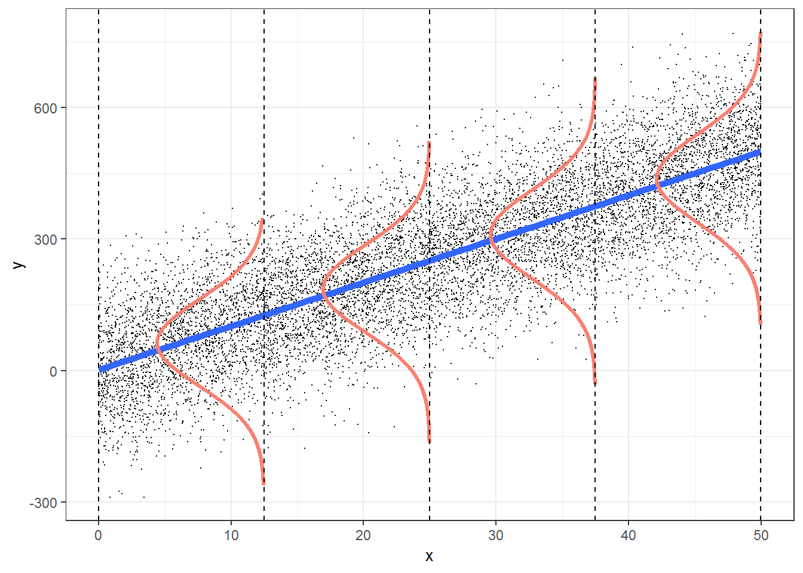
```

The model assumptions are: 

- independent observations
- Y is continuous
- errors are normally distributed
- errors have constant variance
- error terms are uncorrelated

Here are some examples of what the residuals could look like when things go wrong: 

```{r, include=F}
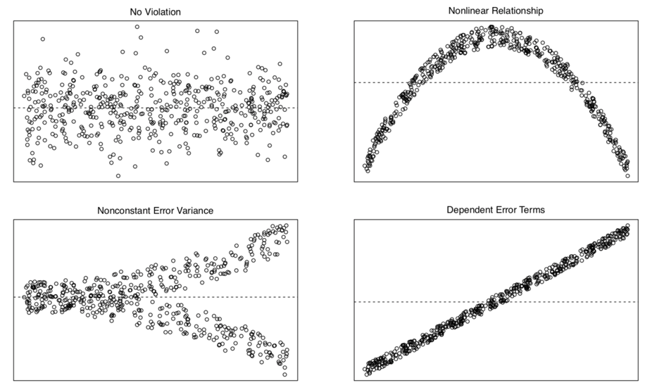
```

## Additional resources

### Datacamp

- [Statistical modeling 1](https://www.datacamp.com/courses/statistical-modeling-in-r-part-1)
- [Statistical modeling 2](https://www.datacamp.com/courses/statistical-modeling-in-r-part-2)
- [Correlation and regression](https://www.datacamp.com/courses/correlation-and-regression)

### Misc

- [Spurious correlations](http://www.tylervigen.com/spurious-correlations)

## Session info

Information about this R session including which version of R was used, and what packages were loaded. 

```{r}
sessionInfo()
```

<!--chapter:end:10-linear_model1.Rmd-->

# Linear model 2

## Learning goals

- Multiple regression. 
  - Appreciate model assumptions. 
- Several continuous predictors. 
  - Hypothesis tests. 
  - Interpreting parameters. 
  - Reporting results. 
- One categorical predictor. 
- Both continuous and categorical predictors. 
- Interpreting interactions. 

## Load packages and set plotting theme

```{r, message=FALSE}
library("knitr")      # for knitting RMarkdown 
library("kableExtra") # for making nice tables
library("janitor")    # for cleaning column names
library("broom")      # for tidying up linear models 
library("corrr")      # for calculating correlations between many variables
library("corrplot")   # for plotting correlations
library("GGally")     # for running ggpairs() function
library("tidyverse")  # for wrangling, plotting, etc. 

# include references for used packages
knitr::write_bib(.packages(), "packages.bib") 
```

```{r}
theme_set(theme_classic() + #set the theme 
    theme(text = element_text(size = 20))) #set the default text size


opts_chunk$set(comment = "",
               fig.show = "hold")
```

## Load data sets

Let's load the data sets that we'll explore in this class: 

```{r, warning=F, message=FALSE}
# credit data set
df.credit = read_csv("data/credit.csv") %>% 
  rename(index = `...1`) %>% 
  clean_names()

# advertising data set 
df.ads = read_csv("data/advertising.csv") %>% 
  rename(index = `...1`) %>% 
  clean_names()
```

```{r, echo=F, fig.cap="Description of the different variables in the df.credit data set."}
tibble(variable = c("income", "limit", "rating", "cards", "age", "education",
                    "gender", "student", "married", "ethnicity", "balance"),
       description = c("in thousand dollars",
                       "credit limit",
                       "credit rating",
                       "number of credit cards",
                       "in years",
                       "years of education",
                       "male or female",
                       "student or not",
                       "married or not",
                       "African American, Asian, Caucasian",
                       "average credit card debt")) %>% 
  kable() %>% 
  kable_styling(bootstrap_options = "striped",
                full_width = F)
```

## Multiple continuous variables

Let's take a look at a case where we have multiple continuous predictor variables. In this case, we want to make sure that our predictors are not too highly correlated with each other (as this makes the interpration of how much each variable explains the outcome difficult). So we first need to explore the pairwise correlations between variables. 

### Explore correlations

The `corrr` package is great for exploring correlations between variables. To find out more how `corrr` works, take a look at this vignette: 

```{r, eval=F}
vignette(topic = "using-corrr",
         package = "corrr")
```

Here is an example that illustrates some of the key functions in the `corrr` package (using the advertisement data): 

```{r}
df.ads %>% 
  select(where(is.numeric)) %>% 
  correlate(quiet = T) %>% 
  shave() %>%
  fashion()
```

#### Visualize correlations

##### Correlations with the dependent variable

```{r, fig.cap="Bar plot illustrating how strongly different variables correlate with income."}
df.credit %>% 
  select(where(is.numeric)) %>%
  correlate(quiet = T) %>%
  select(term, income) %>% 
  mutate(term = reorder(term, income)) %>%
  drop_na() %>% 
  ggplot(aes(x = term, 
             y = income,
             fill = income)) +
  geom_hline(yintercept = 0) +
  geom_col(color = "black",
           show.legend = F) + 
  scale_fill_gradient2(low = "indianred2",
                       mid = "white",
                       high = "skyblue1",
                       limits = c(-1, 1)) + 
  coord_flip() +
  theme(axis.title.y = element_blank())
```

##### All pairwise correlations

```{r, fig.caption = "Correlation plot showing the pairwise correlations between different variables."}
tmp = df.credit %>%
  select(where(is.numeric), -index) %>%
  correlate(diagonal = 0,
            quiet = T) %>%
  rearrange() %>%
  select(-term) %>% 
  as.matrix() %>%
  corrplot()
```

```{r, fig.cap="Pairwise correlations with scatter plots, correlation values, and densities on the diagonal."}
df.ads %>%
  select(-index) %>% 
  ggpairs()
```

With some customization: 

```{r, fig.cap="Pairwise correlations with scatter plots, correlation values, and densities on the diagonal (customized)."}
df.ads %>% 
  select(-index) %>%
  ggpairs(lower = list(continuous = wrap("points",
                                         alpha = 0.3)),
          upper = list(continuous = wrap("cor", size = 8))) + 
  theme(panel.grid.major = element_blank())
```

### Multipe regression

Now that we've explored the correlations, let's have a go at the multiple regression. 

#### Visualization

We'll first take another look at the pairwise relationships: 

```{r}
tmp.x = "tv"
# tmp.x = "radio"
# tmp.x = "newspaper"
# tmp.y = "radio"
tmp.y = "radio"
# tmp.y = "tv"

ggplot(df.ads, 
       aes_string(x = tmp.x, y = tmp.y)) + 
  stat_smooth(method = "lm",
              color = "black",
              fullrange = T) +
  geom_point(alpha = 0.3) +
  annotate(geom = "text",
           x = -Inf, 
           y = Inf,
           hjust = -0.5,
           vjust = 1.5,
           label = str_c("r = ", cor(df.ads[[tmp.x]], df.ads[[tmp.y]]) %>% 
                           round(2) %>%  # round 
                           str_remove("^0+") # remove 0
                         ),
           size = 8) +
  theme(text = element_text(size = 30))
```

TV ads and radio ads aren't correlated. Yay! 

#### Fitting, hypothesis testing, evaluation

Let's see whether adding radio ads is worth it (over and above having TV ads).

```{r}
# fit the models 
fit_c = lm(sales ~ 1 + tv, data = df.ads)
fit_a = lm(sales ~ 1 + tv + radio, data = df.ads)

# do the F test
anova(fit_c, fit_a)
```

It's worth it! 

Let's evaluate how well the model actually does. We do this by taking a look at the residual plot, and check whether the residuals are normally distributed.

```{r}
tmp.fit = lm(sales ~ 1 + tv + radio, data = df.ads)

df.plot = tmp.fit %>% 
  augment() %>% 
  clean_names() 

# residual plot
ggplot(df.plot, 
       aes(x = fitted, 
           y = resid)) + 
  geom_point()

# density of residuals 
ggplot(df.plot, 
       aes(x = resid)) + 
  stat_density(geom = "line")

# QQ plot 
ggplot(df.plot,
       aes(sample = resid)) + 
  geom_qq() + 
  geom_qq_line() 

```

There is a slight non-linear trend in the residuals. We can also see that the residuals aren't perfectly normally distributed. We'll see later what we can do about this ... 

Let's see how well the model does overall: 

```{r}
fit_a %>% 
  glance() %>% 
    kable(digits = 3) %>% 
    kable_styling(bootstrap_options = "striped",
                full_width = F)
```

As we can see, the model almost explains 90% of the variance. That's very decent! 

#### Visualizing the model fits

Here is a way of visualizing how both tv ads and radio ads affect sales: 

```{r}
df.plot = lm(sales ~ 1 + tv + radio, data =  df.ads) %>% 
  augment() %>% 
  clean_names()

df.tidy = lm(sales ~ 1 + tv + radio, data =  df.ads) %>% 
  tidy()

ggplot(df.plot, aes(x = radio, y = sales, color = tv)) + 
  geom_point() +
  scale_color_gradient(low = "gray80", high = "black") +
  theme(legend.position = c(0.1, 0.8))
```

We used color here to encode TV ads (and the x-axis for the radio ads). 

In addition, we might want to illustrate what relationship between radio ads and sales the model predicts for three distinct values for TV ads. Like so: 

```{r}
df.plot = lm(sales ~ 1 + tv + radio, data =  df.ads) %>% 
  augment() %>% 
  clean_names()

df.tidy = lm(sales ~ 1 + tv + radio, data =  df.ads) %>% 
  tidy()

ggplot(df.plot, aes(x = radio, y = sales, color = tv)) + 
  geom_point() +
  geom_abline(intercept = df.tidy$estimate[1] + df.tidy$estimate[2] * 200,
              slope = df.tidy$estimate[3]) +
  geom_abline(intercept = df.tidy$estimate[1] + df.tidy$estimate[2] * 100,
              slope = df.tidy$estimate[3]) +
  geom_abline(intercept = df.tidy$estimate[1] + df.tidy$estimate[2] * 0,
              slope = df.tidy$estimate[3]) +
  scale_color_gradient(low = "gray80", high = "black") +
  theme(legend.position = c(0.1, 0.8))
```

#### Interpreting the model fits

Fitting the augmented model yields the following estimates for the coefficients in the model: 

```{r}
fit_a %>% 
  tidy(conf.int = T) %>% 
    head(10) %>% 
    kable(digits = 2) %>% 
    kable_styling(bootstrap_options = "striped",
                full_width = F)
  
```

#### Standardizing the predictors

One thing we can do to make different predictors more comparable is to standardize them. 

```{r}
df.ads = df.ads %>% 
  mutate(across(.cols = c(tv, radio),
                .fns = ~ scale(.),
                .names = "{.col}_scaled"))
  
df.ads %>% 
  select(-newspaper) %>%
  head(10) %>% 
  kable(digits = 2) %>% 
  kable_styling(bootstrap_options = "striped",
                full_width = F)

```

We can standardize (z-score) variables using the `scale()` function.

```{r}
# tmp.variable = "tv"
tmp.variable = "tv_scaled" 

ggplot(df.ads,
       aes(x = .data[[tmp.variable]])) +
  stat_density(geom = "line",
               size = 1) + 
  annotate(geom = "text", 
           x = median(df.ads[[tmp.variable]]),
           y = -Inf,
           label = str_c("sd = ", sd(df.ads[[tmp.variable]]) %>% round(2)),
           size = 10,
           vjust = -1,
           hjust = 0.5) + 
  annotate(geom = "text", 
           x = median(df.ads[[tmp.variable]]),
           y = -Inf,
           label = str_c("mean = ", mean(df.ads[[tmp.variable]]) %>% round(2)),
           size = 10,
           vjust = -3,
           hjust = 0.5)
```

Scaling a variable leaves the distribution intact, but changes the mean to 0 and the SD to 1. 

## One categorical variable

Let's compare a compact model that only predicts the mean, with a model that uses the student variable as an additional predictor. 

```{r}
# fit the models
fit_c = lm(balance ~ 1, data = df.credit)
fit_a = lm(balance ~ 1 + student, data = df.credit)

# run the F test 
anova(fit_c, fit_a)

fit_a %>% 
  summary()
```

The `summary()` shows that it's worth it: the augmented model explains a signifcant amount of the variance (i.e. it significantly reduces the proportion in error PRE). 

### Visualization of the model predictions

Let's visualize the model predictions. Here is the compact model: 

```{r}
ggplot(df.credit,
       aes(x = index, 
           y = balance)) +
  geom_hline(yintercept = mean(df.credit$balance),
             size = 1) +
  geom_segment(aes(xend = index,
                   yend = mean(df.credit$balance)),
               alpha = 0.1) +
  geom_point(alpha = 0.5) 
```

It just predicts the mean (the horizontal black line). The vertical lines from each data point to the mean illustrate the residuals. 

And here is the augmented model:

```{r}
df.fit = fit_a %>% 
  tidy() %>% 
  mutate(estimate = round(estimate,2))

ggplot(df.credit,
       aes(x = index, 
           y = balance,
           color = student)) +
  geom_hline(yintercept = df.fit$estimate[1],
             size = 1,
             color = "#E41A1C") +
  geom_hline(yintercept = df.fit$estimate[1] + df.fit$estimate[2],
             size = 1,
             color = "#377EB8") +
  geom_segment(data = df.credit %>%
                 filter(student == "No"),
                 aes(xend = index,
                   yend = df.fit$estimate[1]),
               alpha = 0.1,
               color = "#E41A1C") +
  geom_segment(data = df.credit %>%
                 filter(student == "Yes"),
                 aes(xend = index,
                   yend = df.fit$estimate[1] + df.fit$estimate[2]),
               alpha = 0.1,
               color = "#377EB8") +
  geom_point(alpha = 0.5) +
  scale_color_brewer(palette = "Set1") +
  guides(color = guide_legend(reverse = T))
```

Note that this model predicts two horizontal lines. One for students, and one for non-students. 

Let's make simple plot that shows the means of both groups with bootstrapped confidence intervals. 

```{r}
ggplot(data = df.credit,
       mapping = aes(x = student, y = balance, fill = student)) + 
  stat_summary(fun = "mean",
               geom = "bar",
               color = "black",
               show.legend = F) +
  stat_summary(fun.data = "mean_cl_boot",
               geom = "linerange",
               size = 1) +
  scale_fill_brewer(palette = "Set1")
```

And let's double check that we also get a signifcant result when we run a t-test instead of our model comparison procedure: 

```{r}
t.test(x = df.credit$balance[df.credit$student == "No"],
       y = df.credit$balance[df.credit$student == "Yes"])
```

### Dummy coding

When we put a variable in a linear model that is coded as a character or as a factor, R automatically recodes this variable using dummy coding. It uses level 1 as the reference category for factors, or the value that comes first in the alphabet for characters. 

```{r}
df.credit %>% 
  select(income, student) %>% 
  mutate(student_dummy = ifelse(student == "No", 0, 1))%>% 
    head(10) %>% 
    kable(digits = 2) %>% 
    kable_styling(bootstrap_options = "striped",
                full_width = F)
```

### Reporting the results

To report the results, we could show a plot like this:  

```{r}
df.plot = df.credit

ggplot(df.plot,
       aes(x = student,
           y = balance)) +
  geom_point(alpha = 0.1,
             position = position_jitter(height = 0, width = 0.1)) +
  stat_summary(fun.data = "mean_cl_boot",
               size = 1)
```

And then report the means and standard deviations together with the result of our signifance test: 

```{r}
df.credit %>% 
  group_by(student) %>% 
  summarize(mean = mean(balance),
            sd = sd(balance)) %>% 
  mutate(across(where(is.numeric), ~ round(., 2)))
```

## One continuous and one categorical variable

Now let's take a look at a case where we have one continuous and one categorical predictor variable. Let's first formulate and fit our models: 

```{r}
# fit the models
fit_c = lm(balance ~ 1 + income, df.credit)
fit_a = lm(balance ~ 1 + income + student, df.credit)

# run the F test 
anova(fit_c, fit_a)
```

We see again that it's worth it. The augmented model explains significantly more variance than the compact model. 

### Visualization of the model predictions

Let's visualize the model predictions again. Let's start with the compact model: 

```{r}
df.augment = fit_c %>% 
  augment() %>% 
  clean_names()

ggplot(df.augment,
       aes(x = income,
           y = balance)) + 
  geom_smooth(method = "lm", se = F, color = "black") +
  geom_segment(aes(xend = income,
                   yend = fitted),
               alpha = 0.3) +
  geom_point(alpha = 0.3)

```

This time, the compact model still predicts just one line (like above) but note that this line is not horizontal anymore. 

```{r}
df.tidy = fit_a %>% 
  tidy() %>% 
  mutate(estimate = round(estimate,2))

df.augment = fit_a %>% 
  augment() %>% 
  clean_names()

ggplot(df.augment,
       aes(x = income,
           y = balance,
           group = student,
           color = student)) + 
  geom_segment(data = df.augment %>% 
                 filter(student == "No"),
               aes(xend = income,
                   yend = fitted),
               color = "#E41A1C",
               alpha = 0.3) +
  geom_segment(data = df.augment %>% 
                 filter(student == "Yes"),
               aes(xend = income,
                   yend = fitted),
               color = "#377EB8",
               alpha = 0.3) +
  geom_abline(intercept = df.tidy$estimate[1],
              slope = df.tidy$estimate[2],
              color = "#E41A1C",
              size = 1) +
  geom_abline(intercept = df.tidy$estimate[1] + df.tidy$estimate[3],
              slope = df.tidy$estimate[2],
              color = "#377EB8",
              size = 1) +
  geom_point(alpha = 0.3) +
  scale_color_brewer(palette = "Set1") +
  theme(legend.position = c(0.1, 0.9)) +
  guides(color = guide_legend(reverse = T))

```

The augmented model predicts two lines again, each with the same slope (but the intercept differs).

## Interactions

Let's check whether there is an interaction between how income affects balance for students vs. non-students. 

### Visualization

Let's take a look at the data first. 

```{r}
ggplot(data = df.credit,
       mapping = aes(x = income,
                     y = balance,
                     group = student,
                     color = student)) +
  geom_smooth(method = "lm", se = F) + 
  geom_point(alpha = 0.3) +
  scale_color_brewer(palette = "Set1") +
  theme(legend.position = c(0.1, 0.9)) +
  guides(color = guide_legend(reverse = T))
```

Note that we just specified here that we want to have a linear model (via `geom_smooth(method = "lm")`). By default, `ggplot2` assumes that we want a model that includes interactions. We can see this by the fact that two fitted lines are not parallel. 

But is the interaction in the model worth it? That is, does a model that includes an interaction explain significantly more variance in the data, than a model that does not have an interaction. 

### Hypothesis test

Let's check: 

```{r}
# fit models 
fit_c = lm(formula = balance ~ income + student, data = df.credit)
fit_a = lm(formula = balance ~ income * student, data = df.credit)

# F-test 
anova(fit_c, fit_a)
```

Nope, not worth it! The F-test comes out non-significant. 

## Additional resources

### Datacamp

- [Statistical modeling 1](https://www.datacamp.com/courses/statistical-modeling-in-r-part-1)
- [Statistical modeling 2](https://www.datacamp.com/courses/statistical-modeling-in-r-part-2)
- [Correlation and regression](https://www.datacamp.com/courses/correlation-and-regression)

### Misc

- [Nice review of multiple regression in R](https://bookdown.org/roback/bookdown-bysh/ch-MLRreview.html)

## Session info

Information about this R session including which version of R was used, and what packages were loaded. 

```{r}
sessionInfo()
```

## References

<!--chapter:end:11-linear_model2.Rmd-->

# Linear model 3

## Learning goals

- Linear model with one multi-level categorical predictor (One-way ANOVA).
- Linear model with multiple categorical predictors (N-way ANOVA).

## Load packages and set plotting theme

```{r, message=FALSE}
library("knitr")      # for knitting RMarkdown 
library("kableExtra") # for making nice tables
library("janitor")    # for cleaning column names
library("broom")      # for tidying up linear models 
library("car")        # for running ANOVAs
library("afex")       # also for running ANOVAs
library("emmeans")    # for calculating constrasts
library("tidyverse")  # for wrangling, plotting, etc. 
```

```{r}
theme_set(theme_classic() + #set the theme 
            theme(text = element_text(size = 20))) #set the default text size

# these options here change the formatting of how comments are rendered
opts_chunk$set(comment = "",
               fig.show = "hold")

# suppress grouping warnings 
options(dplyr.summarise.inform = F)
```

## Load data sets

```{r, message=F, warning=FALSE}
df.poker = read_csv("data/poker.csv") %>% 
  mutate(skill = factor(skill,
                        levels = 1:2,
                        labels = c("expert", "average")),
         skill = fct_relevel(skill, "average", "expert"),
         hand = factor(hand,
                       levels = 1:3,
                       labels = c("bad", "neutral", "good")),
         limit = factor(limit,
                        levels = 1:2,
                        labels = c("fixed", "none")),
         participant = 1:n()) %>% 
  select(participant, everything())
```

Selection of the data: 

```{r}
df.poker %>% 
  group_by(skill, hand, limit) %>% 
  filter(row_number() < 3) %>% 
  head(10) %>% 
  kable(digits = 2) %>% 
  kable_styling(bootstrap_options = "striped",
              full_width = F)

```

## One-way ANOVA

### Visualization

```{r}
df.poker %>% 
  ggplot(mapping = aes(x = hand,
                       y = balance,
                       fill = hand)) + 
  geom_point(alpha = 0.2,
             position = position_jitter(height = 0, width = 0.1)) + 
  stat_summary(fun.data = "mean_cl_boot",
               geom = "linerange",
               size = 1) + 
  stat_summary(fun = "mean",
               geom = "point",
               shape = 21,
               size = 4) +
  labs(y = "final balance (in Euros)") + 
  scale_fill_manual(values = c("red", "orange", "green")) +
  theme(legend.position = "none")
```

### Model fitting

We pass the result of the `lm()` function to `anova()` to calculate an analysis of variance like so: 

```{r}
lm(formula = balance ~ hand, 
   data = df.poker) %>% 
  anova()
```

### Hypothesis test

The F-test reported by the ANOVA compares the fitted model with a compact model that only predicts the grand mean: 

```{r}
# fit the models 
fit_c = lm(formula = balance ~ 1, data = df.poker)
fit_a = lm(formula = balance ~ hand, data = df.poker)

# compare via F-test
anova(fit_c, fit_a)
```

### Visualize the model's predictions

Here is the model prediction of the compact model:

```{r}
set.seed(1)

df.plot = df.poker %>% 
  mutate(hand_jitter = 1 + runif(n(), min = -0.25, max = 0.25))

df.augment = fit_c %>% 
  augment() %>% 
  clean_names() %>% 
  bind_cols(df.plot %>% 
              select(hand, hand_jitter))

ggplot(data = df.plot, 
       mapping = aes(x = hand_jitter,
                     y = balance,
                     fill = hand)) + 
  geom_hline(yintercept = mean(df.poker$balance)) +
  geom_point(alpha = 0.5) + 
  geom_segment(data = df.augment,
               mapping = aes(xend = hand_jitter,
                             yend = fitted),
               alpha = 0.2) +
  labs(y = "balance") + 
  theme(legend.position = "none",
        axis.text.x = element_blank(),
        axis.title.x = element_blank())

```

> Note that since we have a categorical variable here, we don't really have a continuous x-axis. I've just jittered the values so it's easier to show the residuals. 

And here is the prediction of the augmented model (which predicts different means for each group).

```{r}
set.seed(1)

df.plot = df.poker %>% 
  mutate(hand_jitter = hand %>% as.numeric(),
         hand_jitter = hand_jitter + runif(n(), min = -0.4, max = 0.4))

df.tidy = fit_a %>% 
  tidy() %>% 
  select(where(is.numeric)) %>% 
  mutate(across(.fns = ~ round(., digits = 2)))

df.augment = fit_a %>% 
  augment() %>%
  clean_names() %>% 
  bind_cols(df.plot %>% 
              select(hand_jitter))

ggplot(data = df.plot,
       mapping = aes(x = hand_jitter,
                     y = balance,
                     color = hand)) + 
  geom_point(alpha = 0.8) +
  geom_segment(data = NULL,
               mapping = aes(x = 0.6,
                             xend = 1.4,
                             y = df.tidy$estimate[1],
                             yend = df.tidy$estimate[1]),
               color = "red",
               size = 1) +
  geom_segment(data = NULL,
               aes(x = 1.6,
                   xend = 2.4,
                   y = df.tidy$estimate[1] + df.tidy$estimate[2],
                   yend = df.tidy$estimate[1] + df.tidy$estimate[2]),
               color = "orange",
               size = 1) +
  geom_segment(data = NULL,
               aes(x = 2.6,
                   xend = 3.4,
                   y = df.tidy$estimate[1] + df.tidy$estimate[3],
                   yend = df.tidy$estimate[1] + df.tidy$estimate[3]),
               color = "green",
               size = 1) +
  geom_segment(data = df.augment,
               aes(xend = hand_jitter,
                   y = balance,
                   yend = fitted),
               alpha = 0.3) +
  labs(y = "balance") + 
  scale_color_manual(values = c("red", "orange", "green")) + 
  scale_x_continuous(breaks = 1:3, labels = c("bad", "neutral", "good")) + 
  theme(legend.position = "none",
        axis.title.x = element_blank())
```

The vertical lines illustrate the residual sum of squares. 

We can illustrate the model sum of squares like so: 

```{r}
set.seed(1)

df.plot = df.poker %>% 
  mutate(hand_jitter = hand %>% as.numeric(),
         hand_jitter = hand_jitter + runif(n(), min = -0.4, max = 0.4)) %>% 
  group_by(hand) %>% 
  mutate(mean_group = mean(balance)) %>% 
  ungroup() %>% 
  mutate(mean_grand = mean(balance))

df.means = df.poker %>% 
  group_by(hand) %>% 
  summarize(mean = mean(balance)) %>% 
  pivot_wider(names_from = hand, 
              values_from = mean)

ggplot(data = df.plot,
       mapping = aes(x = hand_jitter,
                     y = mean_group,
                     color = hand)) + 
  geom_point(alpha = 0.8) +
  geom_segment(data = NULL,
               mapping = aes(x = 0.6,
                             xend = 1.4,
                             y = df.means$bad,
                             yend = df.means$bad),
               color = "red",
               size = 1) +
  geom_segment(data = NULL,
               mapping = aes(x = 1.6,
                             xend = 2.4,
                             y = df.means$neutral,
                             yend = df.means$neutral),
               color = "orange",
               size = 1) +
  geom_segment(data = NULL,
               mapping = aes(x = 2.6,
                             xend = 3.4,
                             y = df.means$good,
                             yend = df.means$good),
               color = "green",
               size = 1) +
  geom_segment(mapping = aes(xend = hand_jitter,
                             y = mean_group,
                             yend = mean_grand),
               alpha = 0.3) +
  geom_hline(yintercept = mean(df.poker$balance),
             size = 1) + 
  labs(y = "balance") + 
  scale_color_manual(values = c("red", "orange", "green")) + 
  scale_x_continuous(breaks = 1:3, labels = c("bad", "neutral", "good")) + 
  scale_y_continuous(breaks = c(0, 10, 20), labels = c(0, 10, 20), limits = c(0, 25)) + 
  theme(legend.position = "none",
        axis.title.x = element_blank())

```

This captures the variance in the data that is accounted for by the `hand` variable. 

Just for kicks, let's calculate our cherished proportion of reduction in error PRE:

```{r}
df.c = fit_c %>% 
  augment() %>% 
  clean_names() %>% 
  summarize(sse = sum(resid^2) %>% round)

df.a = fit_a %>% 
  augment() %>% 
  clean_names() %>% 
  summarize(sse = sum(resid^2) %>% round)

pre = 1 - df.a$sse/df.c$sse
print(pre %>% round(2))
```
Note that this is the same as the $R^2$ for the augmented model: 

```{r}
fit_a %>% 
  summary()
```

### Dummy coding

Let's check that we understand how dummy-coding works for a variable with more than 2 levels: 

```{r}
# dummy code the hand variable
df.poker = df.poker %>% 
  mutate(hand_neutral = ifelse(hand == "neutral", 1, 0),
         hand_good = ifelse(hand == "good", 1, 0))

# show the dummy coded variables 
df.poker %>% 
  select(participant, contains("hand"), balance) %>% 
  group_by(hand) %>% 
  top_n(3) %>% 
  head(10) %>% 
  kable(digits = 3) %>% 
  kable_styling(bootstrap_options = "striped",
              full_width = F)

# fit the model
fit.tmp = lm(balance ~ 1 + hand_neutral + hand_good, df.poker)

# show the model summary 
fit.tmp %>% 
  summary()

```
Here, I've directly put the dummy-coded variables as predictors into the `lm()`. We get the same model as if we used the `hand` variable instead. 

### Follow up questions

Here are some follow up questions we may ask about the data. 

Are bad hands different from neutral hands? 

```{r}
df.poker %>% 
  filter(hand %in% c("bad", "neutral")) %>% 
  lm(formula = balance ~ hand, 
     data = .) %>% 
  summary()
```

Are neutral hands different from good hands? 

```{r}
df.poker %>% 
  filter(hand %in% c("neutral", "good")) %>% 
  lm(formula = balance ~ hand, 
     data = .) %>% 
  summary()
```

Doing the same thing by recoding our hand factor and taking "neutral" to be the reference category:

```{r}
df.poker %>% 
  mutate(hand = fct_relevel(hand, "neutral")) %>% 
  lm(formula = balance ~ hand,
     data = .) %>% 
  summary()
```

### Variance decomposition

Let's first run the model 

```{r}
fit = lm(formula = balance ~ hand, 
         data = df.poker)

fit %>%
  anova()
```

#### Calculate sums of squares

And then let's make sure that we understand how the variance is broken down:  

```{r}
df.poker %>% 
  mutate(mean_grand = mean(balance)) %>% 
  group_by(hand) %>% 
  mutate(mean_group = mean(balance)) %>% 
  ungroup() %>% 
  summarize(variance_total = sum((balance - mean_grand)^2),
            variance_model = sum((mean_group - mean_grand)^2),
            variance_residual = variance_total - variance_model)
```

#### Visualize model predictions

##### Total variance

```{r}
set.seed(1)

fit_c = lm(formula = balance ~ 1,
           data = df.poker)

df.plot = df.poker %>% 
  mutate(hand_jitter = 1 + runif(n(), min = -0.25, max = 0.25))

df.augment = fit_c %>% 
  augment() %>% 
  clean_names() %>% 
  bind_cols(df.plot %>% select(hand, hand_jitter))

ggplot(data = df.plot, 
       mapping = aes(x = hand_jitter,
                       y = balance,
                       fill = hand)) + 
  geom_hline(yintercept = mean(df.poker$balance)) +
  geom_point(alpha = 0.5) + 
  geom_segment(data = df.augment,
               aes(xend = hand_jitter,
                   yend = fitted),
               alpha = 0.2) +
  labs(y = "balance") + 
  theme(legend.position = "none",
        axis.text.x = element_blank(),
        axis.title.x = element_blank())

```

##### Model variance

```{r}
set.seed(1)

df.plot = df.poker %>% 
  mutate(hand_jitter = hand %>% as.numeric(),
         hand_jitter = hand_jitter + runif(n(), min = -0.4, max = 0.4)) %>% 
  group_by(hand) %>% 
  mutate(mean_group = mean(balance)) %>% 
  ungroup() %>% 
  mutate(mean_grand = mean(balance))

df.means = df.poker %>% 
  group_by(hand) %>% 
  summarize(mean = mean(balance)) %>% 
  pivot_wider(names_from = hand,
              values_from = mean)

ggplot(data = df.plot,
       mapping = aes(x = hand_jitter,
                     y = mean_group,
                     color = hand)) + 
  geom_point(alpha = 0.8) +
  geom_segment(data = NULL,
               aes(x = 0.6,
                   xend = 1.4,
                   y = df.means$bad,
                   yend = df.means$bad),
               color = "red",
               size = 1) +
  geom_segment(data = NULL,
               aes(x = 1.6,
                   xend = 2.4,
                   y = df.means$neutral,
                   yend = df.means$neutral),
               color = "orange",
               size = 1) +
  geom_segment(data = NULL,
               aes(x = 2.6,
                   xend = 3.4,
                   y = df.means$good,
                   yend = df.means$good),
               color = "green",
               size = 1) +
  geom_segment(aes(xend = hand_jitter,
                   y = mean_group,
                   yend = mean_grand),
               alpha = 0.3) +
  geom_hline(yintercept = mean(df.poker$balance),
             size = 1) + 
  labs(y = "balance") + 
  scale_color_manual(values = c("red", "orange", "green")) + 
  scale_x_continuous(breaks = 1:3, labels = c("bad", "neutral", "good")) + 
  scale_y_continuous(breaks = c(0, 10, 20), labels = c(0, 10, 20), limits = c(0, 25)) + 
  theme(legend.position = "none",
        axis.title.x = element_blank())
```

##### Residual variance

```{r}
set.seed(1)

fit_a = lm(formula = balance ~ hand,
           data = df.poker)

df.plot = df.poker %>% 
  mutate(hand_jitter = hand %>% as.numeric(),
         hand_jitter = hand_jitter + runif(n(), min = -0.4, max = 0.4))

df.tidy = fit_a %>% 
  tidy() %>% 
  select(where(is.numeric)) %>% 
  mutate(across(.fns = ~ round(., digits = 2)))

df.augment = fit_a %>% 
  augment() %>%
  clean_names() %>% 
  bind_cols(df.plot %>% select(hand_jitter))

ggplot(data = df.plot,
       mapping = aes(x = hand_jitter,
                     y = balance,
                     color = hand)) + 
  geom_point(alpha = 0.8) +
  geom_segment(data = NULL,
               aes(x = 0.6,
                   xend = 1.4,
                   y = df.tidy$estimate[1],
                   yend = df.tidy$estimate[1]),
               color = "red",
               size = 1) +
  geom_segment(data = NULL,
               aes(x = 1.6,
                   xend = 2.4,
                   y = df.tidy$estimate[1] + df.tidy$estimate[2],
                   yend = df.tidy$estimate[1] + df.tidy$estimate[2]),
               color = "orange",
               size = 1) +
  geom_segment(data = NULL,
               aes(x = 2.6,
                   xend = 3.4,
                   y = df.tidy$estimate[1] + df.tidy$estimate[3],
                   yend = df.tidy$estimate[1] + df.tidy$estimate[3]),
               color = "green",
               size = 1) +
  geom_segment(data = df.augment,
               aes(xend = hand_jitter,
                   y = balance,
                   yend = fitted),
               alpha = 0.3) +
  labs(y = "balance") + 
  scale_color_manual(values = c("red", "orange", "green")) + 
  scale_x_continuous(breaks = 1:3, labels = c("bad", "neutral", "good")) + 
  theme(legend.position = "none",
        axis.title.x = element_blank())
```


## Two-way ANOVA

Now let's take a look at a case where we have multiple categorical predictors. 

### Visualization

Let's look at the overall effect of skill: 

```{r}
ggplot(data = df.poker,
       mapping = aes(x = skill,
                     y = balance)) +
  geom_point(position = position_jitter(width = 0.2,
                                             height = 0),
             alpha = 0.2) + 
  stat_summary(fun.data = "mean_cl_boot",
               geom = "linerange",
               color = "black",
               position = position_dodge(0.9)) + 
  stat_summary(fun = "mean",
               geom = "point",
               color = "black",
               position = position_dodge(0.9),
               aes(shape = skill),
               size = 3,
               fill = "black") +
  scale_shape_manual(values = c(21, 22)) +
  guides(shape = F)
  
```

And now let's take a look at the means for the full the 3 (hand) x 2 (skill) design:

```{r}
ggplot(data = df.poker,
       mapping = aes(x = hand,
                     y = balance,
                     group = skill,
                     fill = hand)) +
  geom_point(position = position_jitterdodge(jitter.width = 0.3,
                                             jitter.height = 0,
                                             dodge.width = 0.9),
             alpha = 0.2) + 
  stat_summary(fun.data = "mean_cl_boot",
               geom = "linerange",
               color = "black",
               position = position_dodge(0.9)) + 
  stat_summary(fun = "mean",
               geom = "point",
               aes(shape = skill),
               color = "black",
               position = position_dodge(0.9),
               size = 3) +
  scale_fill_manual(values = c("red", "orange", "green")) +
  scale_shape_manual(values = c(21, 22)) +
  guides(fill = F)
  
```

### Model fitting

For N-way ANOVAs, we need to be careful about what sums of squares we are using. The standard (based on the SPSS output) is to use type III sums of squares. We set this up in the following way: 

```{r}
lm(formula = balance ~ hand * skill,
   data = df.poker,
   contrasts = list(hand = "contr.sum",
                    skill = "contr.sum")) %>% 
  Anova(type = 3)
```

So, we fit our linear model, but set the contrasts to "contr.sum" (which yields effect coding instead of dummy coding), and then specify the desired type of sums of squares in the `Anova()` function call.  

Alternatively, we could use the `afex` package and specify the ANOVA like so: 

```{r}
aov_ez(id = "participant",
       dv = "balance",
       data = df.poker,
       between = c("hand", "skill")
)
```

The `afex` package uses effect coding and type 3 sums of squares by default.

### Interpreting interactions

Code I've used to generate the different plots in the competition: 

```{r}
set.seed(1)

b0 = 15
nsamples = 30
sd = 5

# simple effect of condition
b1 = 10
b2 = 1
b1_2 = 1

# two simple effects
# b1 = 5
# b2 = -5
# b1_2 = 0
 
# interaction effect
# b1 = 10
# b2 = 10
# b1_2 = -20

# interaction and simple effect
# b1 = 10
# b2 = 0
# b1_2 = -20

# all three
# b1 = 2
# b2 = 2
# b1_2 = 10

df.data = tibble(
  condition = rep(c(0, 1), each = nsamples),
  treatment = rep(c(0, 1), nsamples),
  rating = b0 + b1 * condition + b2 * treatment + (b1_2 * condition * treatment) + rnorm(nsamples, sd = sd)) %>%
  mutate(condition = factor(condition, labels = c("A", "B")),
  treatment = factor(treatment, labels = c("1", "2")))

ggplot(df.data,
       aes(x = condition,
           y = rating,
           group = treatment,
           fill = treatment)) + 
  stat_summary(fun = "mean",
               geom = "bar",
               color = "black",
               position = position_dodge(0.9)) +
  stat_summary(fun.data = "mean_cl_boot",
               geom = "linerange",
               size = 1,
               position = position_dodge(0.9)) +
  scale_fill_brewer(palette = "Set1")
```

And here is one specific example. Let's generate the data first: 

```{r}
# make example reproducible 
set.seed(1)

# set parameters
nsamples = 30

b0 = 15
b1 = 10 # simple effect of condition
b2 = 0 # simple effect of treatment
b1_2 = -20 # interaction effect
sd = 5

# generate data
df.data = tibble(
  condition = rep(c(0, 1), each = nsamples),
  treatment = rep(c(0, 1), nsamples),
  rating = b0 + 
    b1 * condition + 
    b2 * treatment + (b1_2 * condition * treatment) + 
    rnorm(nsamples, sd = sd)) %>%
  mutate(condition = factor(condition, labels = c("A", "B")),
  treatment = factor(treatment, labels = c("1", "2")))
```

Show part of the generated data frame: 

```{r}
# show data frame
df.data %>% 
  group_by(condition, treatment) %>% 
  filter(row_number() < 3) %>% 
  ungroup() %>% 
  kable(digits = 2) %>% 
  kable_styling(bootstrap_options = "striped",
                full_width = F)
  
```

Plot the data:

```{r}
# plot data
ggplot(df.data,
       aes(x = condition,
           y = rating,
           group = treatment,
           fill = treatment)) + 
  stat_summary(fun = "mean",
               geom = "bar",
               color = "black",
               position = position_dodge(0.9)) +
  stat_summary(fun.data = "mean_cl_boot",
               geom = "linerange",
               size = 1,
               position = position_dodge(0.9)) +
  scale_fill_brewer(palette = "Set1")
```

And check whether we can successfully infer the parameters that we used to generate the data: 

```{r}
# infer parameters
lm(formula = rating ~ 1 + condition + treatment + condition:treatment,
   data = df.data) %>% 
  summary()
```

### Variance decomposition

Let's fit the model first:

```{r}
fit = lm(formula = balance ~ hand * skill, 
         data = df.poker)

fit %>%
  anova()
```

#### Calculate sums of squares

```{r}
df.poker %>% 
  mutate(mean_grand = mean(balance)) %>% 
  group_by(skill) %>% 
  mutate(mean_skill = mean(balance)) %>%
  group_by(hand) %>% 
  mutate(mean_hand = mean(balance)) %>%
  ungroup() %>%
  summarize(variance_total = sum((balance - mean_grand)^2),
            variance_skill = sum((mean_skill - mean_grand)^2),
            variance_hand = sum((mean_hand - mean_grand)^2),
            variance_residual = variance_total - variance_skill - variance_hand)
```

#### Visualize model predictions

##### `Skill` factor

```{r}
set.seed(1)

df.plot = df.poker %>% 
  mutate(skill_jitter = skill %>% as.numeric(),
         skill_jitter = skill_jitter + runif(n(), min = -0.4, max = 0.4)) %>% 
  group_by(skill) %>% 
  mutate(mean_group = mean(balance)) %>% 
  ungroup() %>% 
  mutate(mean_grand = mean(balance))
  
df.means = df.poker %>% 
  group_by(skill) %>% 
  summarize(mean = mean(balance)) %>% 
  pivot_wider(names_from = skill,
              values_from = mean)

ggplot(data = df.plot,
       mapping = aes(x = skill_jitter,
                       y = mean_group,
                       color = skill)) + 
  geom_point(alpha = 0.8) +
  geom_segment(data = NULL,
               aes(x = 0.6,
                   xend = 1.4,
                   y = df.means$average,
                   yend = df.means$average),
               color = "black",
               size = 1) +
  geom_segment(data = NULL,
               aes(x = 1.6,
                   xend = 2.4,
                   y = df.means$expert,
                   yend = df.means$expert),
               color = "gray50",
               size = 1) +
  geom_segment(aes(xend = skill_jitter,
                   y = mean_group,
                   yend = mean_grand),
               alpha = 0.3) +
  geom_hline(yintercept = mean(df.poker$balance),
             size = 1) + 
  labs(y = "balance") + 
  scale_color_manual(values = c("black", "gray50")) + 
  scale_x_continuous(breaks = 1:2, labels = c("average", "expert")) + 
  scale_y_continuous(breaks = c(0, 10, 20), labels = c(0, 10, 20), limits = c(0, 25)) +
  theme(legend.position = "none",
        axis.title.x = element_blank())

```

## Two-way ANOVA (with interaction)

Let's fit a two-way ANOVA with the interaction term. 

```{r}
fit = lm(formula = balance ~ hand * skill, data = df.poker)
fit %>% 
  anova()
```

And let's compute how the the sums of squares are decomposed:

```{r}
df.poker %>% 
  mutate(mean_grand = mean(balance)) %>% 
  group_by(skill) %>% 
  mutate(mean_skill = mean(balance)) %>% 
  group_by(hand) %>% 
  mutate(mean_hand = mean(balance)) %>%
  group_by(hand, skill) %>% 
  mutate(mean_hand_skill = mean(balance)) %>%
  ungroup() %>%
  summarize(variance_total = sum((balance - mean_grand)^2),
            variance_skill = sum((mean_skill - mean_grand)^2),
            variance_hand = sum((mean_hand - mean_grand)^2),
            variance_hand_skill = sum((mean_hand_skill - mean_skill - mean_hand + 
                                         mean_grand)^2),
            variance_residual = variance_total - variance_skill - variance_hand - 
              variance_hand_skill)
```
## Additional resources

### Datacamp

- [Statistical modeling 1](https://www.datacamp.com/courses/statistical-modeling-in-r-part-1)
- [Statistical modeling 2](https://www.datacamp.com/courses/statistical-modeling-in-r-part-2)
- [Correlation and regression](https://www.datacamp.com/courses/correlation-and-regression)

### Misc

- [Explanation of different types of sums of squares](https://mcfromnz.wordpress.com/2011/03/02/anova-type-iiiiii-ss-explained/)
- [Blog posts on marginal effects](https://www.andrewheiss.com/blog/2022/05/20/marginalia/)

## Session info

Information about this R session including which version of R was used, and what packages were loaded. 

```{r session}
sessionInfo()
```

<!--chapter:end:12-linear_model3.Rmd-->

# Linear model 4

## Load packages and set plotting theme

```{r load-packages, message=FALSE}
library("knitr")      # for knitting RMarkdown 
library("kableExtra") # for making nice tables
library("janitor")    # for cleaning column names
library("broom")      # for tidying up linear models 
library("afex")       # for running ANOVAs
library("emmeans")    # for calculating contrasts
library("car")        # for calculating ANOVAs
library("tidyverse")  # for wrangling, plotting, etc.
```

```{r}
theme_set(
  theme_classic() + #set the theme 
    theme(text = element_text(size = 20)) #set the default text size
)

# these options here change the formatting of how comments are rendered
opts_chunk$set(comment = "",
               fig.show = "hold")

```

## Load data sets

Read in the data:

```{r, message=FALSE}
df.poker = read_csv("data/poker.csv") %>% 
  mutate(skill = factor(skill,
                        levels = 1:2,
                        labels = c("expert", "average")),
         skill = fct_relevel(skill, "average", "expert"),
         hand = factor(hand,
                       levels = 1:3,
                       labels = c("bad", "neutral", "good")),
         limit = factor(limit,
                        levels = 1:2,
                        labels = c("fixed", "none")),
         participant = 1:n()) %>% 
  select(participant, everything())

# creating an unbalanced data set by removing the first 10 participants 
df.poker.unbalanced = df.poker %>% 
  filter(!participant %in% 1:10)
```

## ANOVA with unbalanced design

For the standard `anova()` function, the order of the independent predictors matters when the design is unbalanced. 

There are two reasons for why this happens. 

1) In an unbalanced design, the predictors in the model aren't uncorrelated anymore. 
2) The standard `anova()` function computes Type I (sequential) sums of squares. 

Sequential sums of squares means that the predictors are added to the model in the order in which the are specified. 

```{r}
# one order 
lm(formula = balance ~ skill + hand, 
         data = df.poker.unbalanced) %>% 
  anova()

# another order 
lm(formula = balance ~ hand + skill, 
         data = df.poker.unbalanced) %>% 
  anova()
```
We should compute an ANOVA with type 3 sums of squares, and set the contrast to sum contrasts. I like to use the `joint_tests()` function from the "emmeans" package for doing so. It does both of these things for us. 

```{r}
# one order
lm(formula = balance ~ hand * skill,
   data = df.poker.unbalanced) %>% 
  joint_tests()

# another order
lm(formula = balance ~ skill + hand,
   data = df.poker.unbalanced) %>% 
  joint_tests()
```

Now, the order of the independent variables doesn't matter anymore. 

Alternatively,we can also use the `aov_ez()` function from the `afex` package. 

```{r}
lm(formula = balance ~ skill * hand,
   data = df.poker.unbalanced) %>% 
  joint_tests()

fit = aov_ez(id = "participant",
             dv = "balance",
             data = df.poker.unbalanced,
             between = c("hand", "skill"))
fit$Anova
```

## Interpreting parameters (very important!)

```{r}
fit = lm(formula = balance ~ skill * hand,
         data = df.poker)

fit %>% 
  summary()
```

> Important: The t-statistic for `skillexpert` is not telling us that there is a main effect of skill. Instead, it shows the difference between `skill = average` and `skill = expert` when all other predictors in the model are 0!!

Here, this parameter just captures whether there is a significant difference between average and skilled players **when they have a bad hand** (because that's the reference category here). Let's check that this is true. 

```{r}
df.poker %>% 
  group_by(skill, hand) %>% 
  summarize(mean = mean(balance)) %>% 
  filter(hand == "bad") %>% 
  pivot_wider(names_from = skill,
              values_from = mean) %>% 
  mutate(difference = expert - average)
```

We see here that the difference in balance between the average and expert players when they have a bad hand is 2.7098. This is the same value as the `skillexpert` parameter in the `summary()` table above, and the corresponding significance test captures whether this difference is significantly different from 0. It doesn't capture, whether there is an effect of skill overall! To test this, we need to do an analysis of variance (using the `Anova(type = 3)` function).

## Linear contrasts

Here is a linear contrast that assumes that there is a linear relationship between the quality of one's hand, and the final balance.  

```{r}
df.poker = df.poker %>% 
  mutate(hand_contrast = factor(hand,
                                levels = c("bad", "neutral", "good"),
                                labels = c(-1, 0, 1)),
         hand_contrast = hand_contrast %>% 
           as.character() %>% 
           as.numeric())

fit.contrast = lm(formula = balance ~ hand_contrast,
                  data = df.poker)
```

Here is a visualization of the model prediction together with the residuals. 

```{r}
df.plot = df.poker %>% 
  mutate(hand_jitter = hand %>% as.numeric(),
         hand_jitter = hand_jitter + runif(n(), min = -0.4, max = 0.4))

df.tidy = fit.contrast %>% 
  tidy() %>% 
  select_if(is.numeric) %>% 
  mutate_all(~ round(., 2))

df.augment = fit.contrast %>% 
  augment() %>%
  clean_names() %>% 
  bind_cols(df.plot %>% select(hand_jitter))

ggplot(data = df.plot,
       mapping = aes(x = hand_jitter,
                       y = balance,
                       color = as.factor(hand_contrast))) + 
  geom_point(alpha = 0.8) +
  geom_segment(data = NULL,
               aes(x = 0.6,
                   xend = 1.4,
                   y = df.tidy$estimate[1]-df.tidy$estimate[2],
                   yend = df.tidy$estimate[1]-df.tidy$estimate[2]),
               color = "red",
               size = 1) +
  geom_segment(data = NULL,
               aes(x = 1.6,
                   xend = 2.4,
                   y = df.tidy$estimate[1],
                   yend = df.tidy$estimate[1]),
               color = "orange",
               size = 1) +
  geom_segment(data = NULL,
               aes(x = 2.6,
                   xend = 3.4,
                   y = df.tidy$estimate[1] + df.tidy$estimate[2],
                   yend = df.tidy$estimate[1] + df.tidy$estimate[2]),
               color = "green",
               size = 1) +
  geom_segment(data = df.augment,
               aes(xend = hand_jitter,
                   y = balance,
                   yend = fitted),
               alpha = 0.3) +
  labs(y = "balance") + 
  scale_color_manual(values = c("red", "orange", "green")) + 
  scale_x_continuous(breaks = 1:3, labels = c("bad", "neutral", "good")) + 
  theme(legend.position = "none",
        axis.title.x = element_blank())
```

### Hypothetical data

Here is some code to generate a hypothetical developmental data set. 

```{r}
# make example reproducible 
set.seed(1)

# means = c(5, 10, 5)
means = c(3, 5, 20)
# means = c(3, 5, 7)
# means = c(3, 7, 12)
sd = 2
sample_size = 20

# generate data 
df.development = tibble(
  group = rep(c("3-4", "5-6", "7-8"), each = sample_size),
  performance = NA) %>% 
  mutate(performance = ifelse(group == "3-4",
                              rnorm(sample_size,
                                    mean = means[1],
                                    sd = sd),
                              performance),
         performance = ifelse(group == "5-6",
                              rnorm(sample_size,
                                    mean = means[2],
                                    sd = sd),
                              performance),
         performance = ifelse(group == "7-8",
                              rnorm(sample_size,
                                    mean = means[3],
                                    sd = sd),
                              performance),
         group = factor(group, levels = c("3-4", "5-6", "7-8")),
         group_contrast = group %>% 
           fct_recode(`-1` = "3-4",
                      `0` = "5-6",
                      `1` = "7-8") %>% 
           as.character() %>%
           as.numeric())
```

Let's define a linear contrast using the `emmeans` package, and test whether it's significant. 

```{r}
fit = lm(formula = performance ~ group,
         data = df.development)

fit %>% 
  emmeans("group",
          contr = list(linear = c(-0.5, 0, 0.5)),
          adjust = "bonferroni") %>% 
  pluck("contrasts")
```

Yes, we see that there is a significant positive linear contrast with an estimate of 8.45. This means, it predicts a difference of 8.45 in performance between each of the consecutive age groups. For a visualization of the predictions of this model, see Figure \@ref{fig:linear-contrast-model}. 

### Visualization

Total variance: 

```{r}
set.seed(1)

fit_c = lm(formula = performance ~ 1,
           data = df.development)

df.plot = df.development %>% 
  mutate(group_jitter = 1 + runif(n(),
                                  min = -0.25,
                                  max = 0.25))

df.augment = fit_c %>% 
  augment() %>% 
  clean_names() %>% 
  bind_cols(df.plot %>% select(group, group_jitter))

ggplot(data = df.plot, 
       mapping = aes(x = group_jitter,
                       y = performance,
                       fill = group)) + 
  geom_hline(yintercept = mean(df.development$performance)) +
  geom_point(alpha = 0.5) + 
  geom_segment(data = df.augment,
               aes(xend = group_jitter,
                   yend = fitted),
               alpha = 0.2) +
  labs(y = "performance") + 
  theme(legend.position = "none",
        axis.text.x = element_blank(),
        axis.title.x = element_blank())

```

With contrast

```{r linear-contrast-model, fig.cap="Predictions of the linear contrast model"}
# make example reproducible 
set.seed(1)

fit = lm(formula = performance ~ group_contrast,
         data = df.development)

df.plot = df.development %>% 
  mutate(group_jitter = group %>% as.numeric(),
         group_jitter = group_jitter + runif(n(), min = -0.4, max = 0.4))

df.tidy = fit %>% 
  tidy() %>% 
  select(where(is.numeric)) %>% 
  mutate(across(.fns = ~ round(. , 2)))

df.augment = fit %>% 
  augment() %>%
  clean_names() %>% 
  bind_cols(df.plot %>% select(group_jitter))

ggplot(data = df.plot,
       mapping = aes(x = group_jitter,
                       y = performance,
                       color = as.factor(group_contrast))) + 
  geom_point(alpha = 0.8) +
  geom_segment(data = NULL,
               aes(x = 0.6,
                   xend = 1.4,
                   y = df.tidy$estimate[1]-df.tidy$estimate[2],
                   yend = df.tidy$estimate[1]-df.tidy$estimate[2]),
               color = "red",
               size = 1) +
  geom_segment(data = NULL,
               aes(x = 1.6,
                   xend = 2.4,
                   y = df.tidy$estimate[1],
                   yend = df.tidy$estimate[1]),
               color = "orange",
               size = 1) +
  geom_segment(data = NULL,
               aes(x = 2.6,
                   xend = 3.4,
                   y = df.tidy$estimate[1] + df.tidy$estimate[2],
                   yend = df.tidy$estimate[1] + df.tidy$estimate[2]),
               color = "green",
               size = 1) +
  geom_segment(data = df.augment,
               aes(xend = group_jitter,
                   y = performance,
                   yend = fitted),
               alpha = 0.3) +
  labs(y = "performance") + 
  scale_color_manual(values = c("red", "orange", "green")) + 
  scale_x_continuous(breaks = 1:3, labels = levels(df.development$group)) +
  theme(legend.position = "none",
        axis.title.x = element_blank())
```

Results figure

```{r}
df.development %>% 
  ggplot(mapping = aes(x = group,
                       y = performance)) + 
  geom_point(alpha = 0.3, 
             position = position_jitter(width = 0.1,
                                        height = 0)) +
  stat_summary(fun.data = "mean_cl_boot",
               shape = 21, 
               fill = "white",
               size = 0.75)
```

Here we test some more specific hypotheses: the the two youngest groups of children are different from the oldest group, and that the 3 year olds are different from the 5 year olds. 

```{r}
#  fit the linear model 
fit = lm(formula = performance ~ group,
         data = df.development)

# check factor levels 
levels(df.development$group)

# define the contrasts of interest 
contrasts = list(young_vs_old = c(-0.5, -0.5, 1),
                 three_vs_five = c(-0.5, 0.5, 0))

# compute significance test on contrasts 
fit %>% 
  emmeans("group",
          contr = contrasts,
          adjust = "bonferroni") %>% 
  pluck("contrasts")
```

### Post-hoc tests

Post-hoc tests for a single predictor (using the poker data set). 

```{r}
fit = lm(formula = balance ~ hand,
         data = df.poker)

# post hoc tests 
fit %>% 
  emmeans(pairwise ~ hand,
          adjust = "bonferroni") %>% 
  pluck("contrasts")
```

Post-hoc tests for two predictors (:

```{r}
# fit the model
fit = lm(formula = balance ~ hand + skill,
         data = df.poker)

# post hoc tests 
fit %>% 
  emmeans(pairwise ~ hand + skill,
          adjust = "bonferroni") %>% 
  pluck("contrasts")
```


```{r}
fit = lm(formula = balance ~ hand,
         data = df.poker)

# comparing each to the mean 
fit %>% 
  emmeans(eff ~ hand) %>% 
  pluck("contrasts")

# one vs. all others 
fit %>% 
  emmeans(del.eff ~ hand) %>% 
  pluck("contrasts")
```

### Understanding dummy coding

```{r}
fit = lm(formula = balance ~ 1 + hand,
         data = df.poker)

fit %>% 
  summary()

model.matrix(fit) %>% 
  as_tibble() %>% 
  distinct()

df.poker %>% 
  select(participant, hand, balance) %>% 
  group_by(hand) %>% 
  top_n(3, wt = -participant) %>% 
  kable(digits = 2) %>% 
  kable_styling(bootstrap_options = "striped",
                full_width = F)
```

### Understanding sum coding

```{r}
fit = lm(formula = balance ~ 1 + hand,
         contrasts = list(hand = "contr.sum"),
         data = df.poker)

fit %>% 
  summary()

model.matrix(fit) %>% 
  as_tibble() %>% 
  distinct() %>% 
  kable(digits = 2) %>% 
  kable_styling(bootstrap_options = "striped",
                full_width = F)
```

## Additional resources

### Misc

- [Overview of different regression models in R](https://strengejacke.github.io/regressionmodels/?s=09)

## Session info

Information about this R session including which version of R was used, and what packages were loaded. 

```{r session}
sessionInfo()
```


<!--chapter:end:13-linear_model4.Rmd-->

# Power analysis

## Learning goals

- Making decisions based on statistical inference.
- The concept of statistical power. 
- Calculating power. 
- Common effect size measures. 
- Determining sample size via simulation.
  - Understanding `map()` and its children. 
  - Understanding `nest()` and `unnest()`.

## Load packages and set plotting theme

```{r, message=FALSE}
library("knitr")      # for knitting RMarkdown 
library("kableExtra") # for making nice tables
library("broom")      # for tidying up model fits
library("magrittr")   # for going all in with the pipe
library("effectsize") # for computing effect size measures
library("pwr")        # for power calculations
library("tidyverse")  # for wrangling, plotting, etc. 
```

```{r}
theme_set(theme_classic() + #set the theme 
    theme(text = element_text(size = 20))) #set the default text size

# markdown settings for rendered code chunks 
opts_chunk$set(comment = "",
               fig.show = "hold")

# suppress summary warnings 
options(dplyr.summarise.inform = F)
```

## Load data sets

```{r, warning=F, message=F}
df.poker = read_csv("data/poker.csv")
```

## Decision-making

Figures to illustrate power: 

```{r}
mu0 = 10
mu1 = 18
# mu0 = 8
# mu1 = 20
# sd0 = 3
# sd1 = 3
sd0 = 2
sd1 = 2
alpha = 0.05
# alpha = 0.01

ggplot(data = tibble(x = c(0, 30)),
       mapping = aes(x = x)) + 
  stat_function(fun = "dnorm",
                size = 1,
                color = "blue",
                args = list(mean = mu0,
                            sd = sd0)) +
  stat_function(fun = "dnorm",
                size = 1,
                color = "red",
                args = list(mean = mu1,
                            sd = sd1)) +
  stat_function(fun = "dnorm",
                geom = "area",
                size = 1,
                fill = "blue",
                alpha = 0.5,
                args = list(mean = mu0,
                            sd = sd0),
                xlim = c(qnorm(1-alpha, mean = mu0, sd = sd0), 20)) +
  stat_function(fun = "dnorm",
                geom = "area",
                size = 1,
                fill = "red",
                alpha = 0.5,
                args = list(mean = mu1,
                            sd = sd1),
                xlim = c(0, c(qnorm(1-alpha, mean = mu0, sd = sd0)))) +
  geom_vline(xintercept = qnorm(1-alpha, mean = mu0, sd = sd0),
             size = 1) +
  coord_cartesian(expand = F)

```

## Effect sizes

### Cohen's d

Cohen's $d$ is defined as: 

$$
d = \frac{\overline y_1 - \overline y_2}{s_p}
$$

where

$$
s_p = \sqrt\frac{(n_1-1)s_1^2 + (n_2-1)s_2^2}{n_1 + n_2 - 2}
$$


```{r}
# using the effectsize package 
cohens_d(x = balance ~ skill,
         data = df.poker)

# compute by hand
df.cohen = df.poker %>% 
  group_by(skill) %>% 
  summarize(mean = mean(balance),
            var = var(balance),
            n = n()) %>% 
  ungroup() %>% 
  pivot_wider(names_from = skill,
              values_from = c(mean, var, n),
              names_sep = "") %>% 
  mutate(sp = sqrt(((n1 - 1) * var1 + (n2 - 1) * var2) / (n1 + n2 - 2)),
         d = abs(mean1 - mean2) / sp)

print(df.cohen)
```

## Determining sample size

One way to determine sample size is by using the `pwr` package. While this packages is very convenient, we cannot compute power for all the hypotheses that we might be interested in testing. 

### `pwr` package

The `pwr` package has a number of functions that we can use do determine the desired sample size for different experimental designs. Check out this vignette [here](https://cran.r-project.org/web/packages/pwr/vignettes/pwr-vignette.html) for more information. 

#### Binomial test

We can determine what sample size we need for a Binomial test that compares two different proportions like so: 

```{r}
pwr.p.test(h = ES.h(p1 = 0.75, p2 = 0.50), 
           sig.level = 0.05, 
           power = 0.80, 
           alternative = "greater")
```

The `pwr.p.test()` function wants the effect size h as an argument which we can compute via the `ES.h()` function that takes two proportions as arguments. I then further defined the desired significance level, power, and whether the test is one-sided or two-sided. 

To have an 80% chance of detecting a difference between a proportion of `p1 = 0.75` and `p2 = 0.50`, we would need to run a study with 23 participants. 

We can use the `plot()` function to illustrate what power we would get for different sample sizes. 

```{r}
pwr.p.test(h = ES.h(p1 = 0.75, p2 = 0.50), 
           sig.level = 0.05, 
           power = 0.80, 
           alternative = "greater") %>% 
  plot()
```

Notice that this is a ggplot object, so we could tweak it further if we'd like to, like so: 

```{r}
pwr.p.test(h = ES.h(p1 = 0.75, p2 = 0.50), 
           sig.level = 0.05, 
           power = 0.80, 
           alternative = "greater") %>% 
  plot() + 
  geom_hline(yintercept = 0.5,
             linetype = 2,
             color = "blue") +
  theme(plot.title = element_text(size = 20))
```

#### t-test (two independent samples)

Here is how we could calculate the desired sample size for a t-test with two independent samples. 

```{r}
pwr.t.test(d = 0.3,
           power = 0.8,
           type = "two.sample",
           alternative = "two.sided")
```

So, to achieve a power of 0.8 for an effect size of d = 0.3, we would need to have 176 participants in each condition! 

### Power analysis

While the `pwr` package works great for relatively simple designs, it quickly reaches its limits. For example, you may be interested in the sample size required to achieve adequate power for detecting an interaction, or for a specific linear contrast. 

Luckily, there is a very flexible approach to determining sample size: via simulation! 

#### The general recipe

- assume: significance level, n, effect size
- simulate a large number of data sets of size n with the specified effect size
- for each data set, run a statistical test to calculate the p-value
- determine the probability of rejecting the H0 (given that H1 is true)

#### Using `map()` and list columns

##### Understanding `map()`

`map()` is a powerful family of functions that's part of the `purrr` package (which is included in the `tidyverse`, so we don't have to load it separately). Using `map()` allows us to avoid nasty for-loops! 

Let's take a look at the help function. 

```{r, eval=F}
help(map)
```

As the help function says, `map()` allows us to apply a function to each element of a vector. Here is a simple example: 

```{r}
map(.x = 1:3, .f = ~ .x^2)
```

I've passed the vector of numbers `.x = 1:3` to `map()`, and then applied the anonymous function `.f = ~ .x^2` to each of the elements in that vector. 

> Always make sure to use the `~` for defining anonymous functions! 

As with many R functions, you can achieve the same outcome in many different ways. Here are a number of ways to do the same thing: 

```{r, echo=F}
# omitting arguments, and using . instead of .x
tmp1 = map(1:3, ~ .^2) 

# longer form function definition 
tmp2 = map(1:3, function(x) x^2) 

# explicit function definition 
squared = function(x){
  return(x^2)
}
tmp3 = map(1:3, squared)

str_c("Is tmp1 identical to tmp2? ", identical(tmp1, tmp2))
str_c("Is tmp2 identical to tmp3? ", identical(tmp2, tmp3))
```

###### Understanding `map()`'s children

Notice that the output of `map()` is a list. 

```{r}
map(.x = 1:3, .f = ~ .x^2)
```
The `map()` function has many children that differ in what they output. For example, `map_dbl()` outputs a numeric vector instead of a list. 

```{r}
map_dbl(.x = 1:3, .f = ~ .x^2)
```

And `map_lgl()` returns logical values. 

```{r}
map_lgl(.x = 1:3, .f = ~ .x == 1)
```

We can also return data frames by using either `map_dfr()` which binds data frames by row, or `map_dfc()` which binds data frames by column. Here is an example:

```{r}
set.seed(1)

# function to create a data frame 
fun_make_df = function(x){
  tibble(number = x,
         group = sample(c("A", "B"),
                        size = 3,
                        replace = T),
         value = rnorm(n = 3))
}

# bind data frames by row 
map_dfr(.x = 1:3, 
        .f = ~ fun_make_df(.))
```

A nice use-case of the `map_dfr()` function can be to read in a number of csv files from individual participants into one larger data frame. Let's simulate some data first, and save the data of each participant as a separate csv file (using `map()` of course). 

```{r}
set.seed(1)

fun_simulate_csv = function(x){
  n_observations = sample(3:6, size = 1)
  df = tibble(age = sample(18:99, size = n_observations),
              responses = rnorm(n = n_observations, mean = 100, sd = 10))
  write_csv(df, file = str_c("data/participant", x, ".csv"))
}

map(.x = 1:3, 
    .f = ~ fun_simulate_csv(.))
```

Now, let's read in the data from the three participants and combine it into a single data frame.

```{r, warning=F, message=F}
map_dfr(.x = 1:3,
        .f = ~ read_csv(str_c("data/participant", .x, ".csv")),
        .id = "participant")
```
Notice how I used the `.id = ` argument of the function to add a `participant` column to my data frame in this case. 

###### Use `map2()` for functions with more than one input

If you have a function with more than one input, `map2()` is your friend. Here is a silly example: 

```{r}
map2_dbl(.x = c(1.23, 2.13, 5.32),
         .y = c(0, 1, 2),
         .f = ~ round(.x, digits = .y))
```

Here, I took the vector of numbers `.x` and rounded it to a different number of digits according to what I've specified it `.y`. 
The same works with data frames, too, like so: 

```{r}
tibble(x = c(1.23, 2.13, 5.32),
       n = c(0, 1, 2)) %>% 
  mutate(rounded = map2_dbl(.x = x,
                            .y = n,
                            .f = ~ round(.x, digits = .y)))
```

###### Use pmap() to go all out (i.e. for functions with more than two arguments)

`pmap()` is your friend for functions that have more than two arguments. Here is an example: 

```{r}
tibble(x = c(1, 2, 3),
       y = c(23, 12, 1),
       z = c(4, 5, 4)) %>% 
  mutate(result = pmap_dbl(.l = ., 
                           .f = ~ ..1 * ..2 + ..3))
```

Notice than when using more than two arguments, we refer to each function argument with ..1, ..2, ..3, etc. 

###### Practice 1 -- Having fun with `map()`

Use the `map2_dbl()` function to create a new variable in this data frame that's the maximum of each row across columns `a` and `b`. 

```{r}
df.practice = tibble(a = c(12, 14, 52, 23, 23),
                     b = c(29, 12, 4, 48, 37))
# write your code here 
```

For the fast ones: For each row in the data frame, write a function that calculates the mean of columns `a` and `b`, and the rounds to the number of digits specified in column `d`. 

```{r}
df.practice = tibble(a = c(12.123, 53.234, 23.324, 54.232, 12.454),
                     b = c(12.456, 23.234, 6.736, 3.346, 7.232),
                     d = c(1, 2, 2, 3, 1))
# write your code here
```

##### List columns

`map()` becomes particularly powerful when combined with list columns. List columns allow you to put data frames into a column of your data frame. For example, you can do something like this: 

```{r}
df.data = tibble(participant = 1, 
                 age = 23,
                 data = list(tibble(trial = c(1, 2, 3),
                                    response = c(23, 95, 37))))

print(df.data)
```

We could access what's in this data column like so 

```{r}
df.data %>% 
  pluck("data", 1)
```

###### `unnest()`

For getting data frames out of list columns, we can use the `unnest()` function. 

```{r}
df.data %>% 
  unnest(cols = data)
```

###### `nest()`

We can use the `nest()` function to create list columns. `nest()` works particularly well in combination with `group_by()`. For example, here I'm created three separate data sets where the size of each data set is determined by the `x` column.

```{r}
# original data frame 
df.data = tibble(participant = c(1, 1, 1, 2, 2, 3),
                 response1 = 1:6,
                 response2 = 6:1)
print(df.data)

# nested data frame 
df.data = df.data %>% 
  group_by(participant) %>% 
  nest() %>% 
  ungroup()

print(df.data)

# and back to the original data frame  
df.data = df.data %>% 
  unnest(cols = data)
print(df.data)
```

And, of course, I can use unnest() to get back to my original data frame. 

##### Combining `nest()` and `map()`

`nest()` and `map()` unfold their power together when it comes to fitting models. For example, consider that you want to fit a separate linear to subests of your data. Here is how you can do that using `nest()` and `map()`. 

I'll demonstrate via the infamous `mtcars` data set that comes with R. 

```{r}
mtcars %>% 
  head(10)
```

What I want to do is to fit separate regression models predicting `mpg` (miles per gallon) as a function of `wt` (the car's weight) for cars with different numbers of cylinders. Here is how that works. 

```{r}
df.data = mtcars %>%
  group_by(cyl) %>% 
  nest() %>% 
  mutate(fit = map(.x = data,
                   .f = ~ lm(formula = mpg ~ 1 + wt,
                             data = .)))
```

I first grouped by the `cyl` (the number of cylinders), used `nest()` to put the rest of the data into a list column, and then used `mutate()` to run a separate linear model on each data set and saved the modle result into the `fit` column. 

With some more wrangling, I could, for example, extract the coefficients of each model like so: 

```{r}
mtcars %>%
  group_by(cyl) %>% 
  nest() %>% 
  mutate(fit = map(.x = data, 
                   .f = ~ lm(mpg ~ 1 + wt, data = .)),
         coef = map(.x = fit, 
                    .f = ~ tidy(.))) %>% 
  unnest(cols = coef) %>% 
  select(-c(data, fit))
```

Voila! A data frame that contains the coefficients for each of the three models. 

Base R has a number of functions like `apply()`, `sapply()`, `lapply()`, etc. that do similar things to `map()`. However, the `map()` family of functions works very well with the rest of the `tidyverse`, that's why we'll use it. 

#### Power analysis via simulation

So, after this long detour via `map()`, list columns, `nest()`, and `unnest()`, we can finally start doing some power analysis via simulation, yay! 

##### Simulating the Binomial test

Let's start with the Binomial test that we played around with above. We want to use simulation to determine the sample size we need to have an 80% of detecting a difference between two proportions p = 0.75 and p = 0.5. 

I'll first do it step by step, and then afterwards put all the code in one place together 

###### Step by step

Here is how we would go about this. First, I'll set up a simulation grid.

```{r}
# number of simulations
n_simulations = 10

# set up simulation grid 
df.power = expand_grid(n = seq(10, 40, 2),
                       simulation = 1:n_simulations,
                       p = 0.75) %>%
  mutate(index = 1:n(),
         .before = n) # add an index column

df.power
```

The `expand_grid()` function creates a data frame that contains all the combinations of the variables. 

Now, let's generate data according to our hypothesis. 

```{r}
set.seed(1)

df.power = df.power %>% 
  group_by(index, n, simulation) %>% 
  mutate(response = rbinom(n = 1,
                           size = n,
                           prob = p))

df.power
```

The `response` variable now contains samples from the sample size `n` according to the probability specified in `p`. Now it's time for `group_by()` and `nest()` because we want to calculate the p-value for observing this response if in fact the null hypothesis was true (i.e. p = 0.5). 

```{r}
df.power = df.power %>% # generate random data
  mutate(fit = map2(.x = response,
                    .y = n,
                    .f = ~ binom.test(x = .x, # define formula
                                      n = .y,
                                      p = 0.5,
                                      alternative = "two.sided")))
df.power
```

Now that we've fitted a bunch of binomial models, we only need to get at the p-values. Again, we can use the `tidy()` function from the `broom` package for help, like so: 

```{r}
df.power = df.power %>% 
  mutate(coef = map(.x = fit,
                    .f = ~ tidy(.))) %>% 
  select(simulation, p, index, coef) %>% 
  unnest(cols = coef) %>% 
  select(index, n, simulation, p.value)
df.power
```

Finally, all that's left is to calculate power by looking at the proportion of times in which we rejected the null hypothesis. 

```{r}
df.power %>% 
  group_by(n) %>% 
  summarize(power = sum(p.value < 0.05) / n())
```

Notice here that the power values fluctuate quite a bit. This is because we only ran 10 simulations for each sample size. To have more robust results, we need to increase the number of simulations. 

But first, let's make a plot that visualizes what we found: 

```{r, message=FALSE}
df.plot = df.power %>% 
  group_by(n) %>% 
  summarize(power = sum(p.value < 0.05) / n())

ggplot(data = df.plot, 
       mapping = aes(x = n, y = power)) +
  geom_hline(yintercept = seq(0, 1, 0.1),
             linetype = 2,
             color = "gray50",
             size = 0.1) + 
  geom_smooth(method = "loess",
              formula = "y ~ x") +
  geom_point()
```

As expected, the power increases with the sample size n. 

###### All in one

Here is a slightly different way to run the same simulation we just did before in one go: 

```{r}
# make reproducible 
set.seed(1)

# number of simulations
n_simulations = 5

# run simulation 
expand_grid(n = seq(10, 40, 2),
            simulation = 1:n_simulations,
            p = 0.75) %>% 
  mutate(index = 1:n(),
         .before = n) %>% 
  group_by(index, n, p, simulation) %>% 
  mutate(response = rbinom(n = 1,
                           size = n,
                           prob = p),
         p.value = binom.test(x = response,
                              n = n,
                              p = 0.5,
                              alternative = "two.sided")$p.value) %>% 
  group_by(n, p) %>% 
  summarize(power = sum(p.value < 0.05) / n()) %>% 
  ungroup()
```

And another time with a larger sample size, and also for two different alternative hypotheses: p1 = 0.75, and p2 = 0.9. 

```{r, message=FALSE}
# make reproducible 
set.seed(1)

# number of simulations
n_simulations = 100

# run simulation 
df.power = expand_grid(n = seq(10, 40, 2),
                       simulation = 1:n_simulations,
                       p = c(0.75, 0.9)) %>% # added another hypothesis here 
  mutate(index = 1:n(),
         .before = n) %>% 
  group_by(index, n, simulation) %>%
  mutate(response = rbinom(n = 1,
                           size = n,
                           prob = p)) %>% 
  ungroup() %>% 
  mutate(fit = map2(.x = response,
                    .y = n,
                    .f = ~ binom.test(x = .x,
                                      n = .y,
                                      p = 0.5,
                                      alternative = "two.sided"))) %>% 
  mutate(coef = map(.x = fit,
                    .f = ~ tidy(.))) %>% 
  unnest(cols = coef) %>% 
  select(index, n, p, p.value) %>% 
  group_by(n, p) %>% 
  summarize(power = sum(p.value < 0.05) / n()) %>% 
  ungroup()

# visualize results
ggplot(data = df.power, 
       mapping = aes(x = n,
                     y = power,
                     fill = as.factor(p),
                     group = p)) +
  geom_hline(yintercept = seq(0, 1, 0.1),
             linetype = 2,
             color = "gray50",
             size = 0.1) + 
  geom_smooth(method = "loess",
              formula = "y ~ x",
              color = "black") +
  geom_point(shape = 21) +
  labs(fill = "alternative") +
  guides(fill = guide_legend(reverse = T))
```

##### Simulating an independent samples t-test

Let's simulate data for an independent samples t-test. To do so, we need to make some assumptions about what we expect the distribution of the data to look like. Here, I assume that we get normally distributed data with some mean and standard deviation. 

The procedure will be very similar to the Binomial test above. The only thing that changes really is how we generate the data (and then some small wrangling differences). 

Let's say that we collected the following pilot data set: 

```{r}
set.seed(1)

# parameters
n = 10 
mean1 = 10 
sd1 = 2
mean2 = 11
sd2 = 3

df.ttest = tibble(group1 = rnorm(n = n,
                                 mean = mean1,
                                 sd = sd1),
                  group2 = rnorm(n = n,
                                 mean = mean2,
                                 sd = sd2)) %>% 
  pivot_longer(cols = everything()) %>% 
  arrange(name)
```

The two groups in our sample don't differ significantly from each other. 

```{r, message=FALSE}
# visualize the data 
ggplot(data = df.ttest,
       mapping = aes(x = name,
                     y = value)) + 
  stat_summary(fun.data = "mean_cl_boot")

# compute a t-test
t.test(formula = value ~ name, 
         data = df.ttest)
```

Let's calculate what the effect size was in our sample. Remember that Cohen's d is defined as 

$$d = \frac{\lvert\overline y_1 - \overline y_2\rvert}{s_p}$$

where 

$$s_p = \sqrt\frac{(n_1-1)s_1^2 + (n_2-1)s_2^2}{n_1 + n_2 - 2}$$

In our sample, the effect size Cohen's d was: 

```{r}
df.sample = df.ttest %>% 
  group_by(name) %>% 
  summarize(mean = mean(value),
            sd = sd(value),
            n = n()) %>% 
  ungroup()

# compute the pooled standard deviation 
sp = sqrt(((df.sample$n[1] - 1) * df.sample$sd[1]^2 + (df.sample$n[2] - 1) * 
             df.sample$sd[2]^2) / (df.sample$n[1] + df.sample$n[2] - 2))

d = abs(df.sample$mean[1] - df.sample$mean[2]) / sp

d
```

Let's double check that we got it right: 

```{r}
cohens_d(x = value ~ name, 
         data = df.ttest)
```

We did! 

So let's now calculate the means and standard deviations based on our pilot data and run a power analysis to determine how many participants we would need, to have an 80% chance of rejecting the null hypothesis for the estimated effect size. 

```{r, message=FALSE}
# make reproducible 
set.seed(1)

# parameters 
mean1 = df.sample$mean[1]
mean2 = df.sample$mean[2]
sd1 = df.sample$sd[1]
sd2 = df.sample$sd[2]

# number of simulations
n_simulations = 10
# n_simulations = 100

# run simulation 
df.power2 = expand_grid(n = seq(from = 10, to = 60, by = 5),
                        simulation = 1:n_simulations) %>%
  mutate(index = 1:n(),
         .before = n) %>% 
  group_by(index, n, simulation) %>% 
  mutate(data = list(tibble(group1 = rnorm(n = n,
                                           mean = mean1,
                                           sd = sd1),
                            group2 = rnorm(n = n,
                                           mean = mean2,
                                           sd = sd2)) %>% 
                       pivot_longer(cols = everything()))) %>% 
  mutate(fit = map(.x = data,
                   .f = ~ lm(formula = value ~ 1 + name,
                             data = .)),
         parameters = map(.x = fit,
                          .f = ~ tidy(.))) %>%
  select(index, n, simulation,  parameters) %>% 
  unnest(cols = parameters) %>% 
  filter(term != "(Intercept)") %>% 
  select(index, n, simulation, p.value) %>% 
  group_by(n) %>% 
  summarize(power = sum(p.value < 0.05) / n()) %>% 
  ungroup()

# visualize results
ggplot(data = df.power2, 
       mapping = aes(x = n,
                     y = power)) +
  geom_hline(yintercept = seq(0, 1, 0.1),
             linetype = 2,
             color = "gray50",
             size = 0.1) + 
  geom_smooth(method = "loess",
              color = "black",
              formula = "y ~ x") +
  geom_point(shape = 21) + 
  scale_x_continuous(breaks = seq(10, 60, 10),
                     labels = seq(10, 60, 10)) + 
  scale_y_continuous(breaks = seq(0, 1, 0.1),
                     labels = seq(0, 1, 0.1))
```

Let's compare to what we'd get from the `pwr` package. 

```{r}
pwr.t.test(d = 0.5874251,
           power = 0.8,
           type = "two.sample",
           alternative = "two.sided")
```

Looks pretty similar! 

##### Practice 2 -- Simulation of an interaction effect

Try to run a simulation to determine how many participants you would need to have an 80% chance of rejecting the null hypothesis that there is no interaction based on the following pilot data set:  

```{r}
set.seed(1)
# population parameters 
b0 = 1
b1 = 2
b2 = 3
b1_2 = -2
sd = 2
n = 10 

df.linear = tibble(x = runif(n = n),
                   y = rep(c(0, 1), each = n/2),
                   z = b0 + b1 * x + b2 * y + b1_2 * x * y + rnorm(n = n, sd = sd))
```

Let's visualize the pilot data first: 

```{r, message=FALSE}
ggplot(data = df.linear,
       mapping = aes(x = x,
                     y = z,
                     group = y,
                     fill = as.factor(y),
                     color = as.factor(y))) + 
  geom_smooth(method = "lm",
              se = F,
              show.legend = F) +
  geom_point(shape = 21,
             color = "black",
             show.legend = F)
```

Let's estimate the parameters based on our sample: 

```{r}
# parameter estimates for the coefficients based on the sample 
b = lm(formula = z ~ x * y,
   data = df.linear) %>% 
  tidy() %>% 
  select(term, estimate, p.value)

# parameter estimate of the residual standard deviation 
sigma = lm(formula = z ~ x * y,
           data = df.linear) %>% 
  glance() %>% 
  pull(sigma)
```

Run a power analysis to see how many participants you would need to have an 80% of rejecting the null hypothesis that there is no interaction. Use the parameter estimates (the beta coefficients and the standard deviation of the residuals `sigma`) based on your pilot data to simulate new data. 

Here is the strategy: 

- Try to closely emulate what we've been doing for the independent samples t-test above.
- However, this time, we have a different way of generating the data (namely by using the regression equation: $z \sim b_0 + b_1 \cdot x + b_2 \cdot y + b_{1\_2} \cdot x \cdot y + e)$, where $e \sim N(0, \sigma)$.
- Fit the model first to extract the estimates for the beta coefficients, and the standard deviation of the residuals `sigma`. 
- Then use these parameters to generate new data assuming that `x` is a continuous predictor between 0 and 1 (`x = runif(n = n)`) and `y` is a binary, dummy-coded variable (`y = rep(c(0, 1), each = n/2)`).
- Extract the coefficients of each model fit, and check whether the interaction is significant. 
- Make a plot that shows how power changes with the sample size n. 

```{r}
set.seed(1)
# write your code here 
```

Run the same power analysis this time assuming the ground truth parameters from the population (rather than the parameters that we've estimated from the sample). 

```{r}
set.seed(1)
# write your code here 
```

## Additional resources

### Datacamp

- [Functional programming with purrr](https://www.datacamp.com/courses/foundations-of-functional-programming-with-purrr)

### Cheatsheets

- [purrr](figures/purrr.pdf) 

### Misc

- [Sample size justification](https://lakens.github.io/statistical_inferences/08-samplesizejustification.html)
- [Guide to reporting effect sizes and confidence intervals](https://matthewbjane.quarto.pub/)
- [Getting started with `pwr`](https://cran.r-project.org/web/packages/pwr/vignettes/pwr-vignette.html)
- [Visualize power](https://rpsychologist.com/d3/NHST/)
- [Calculating and reporting effect sizes to facilitate cumulative science: a practical primer for t-tests and ANOVAs](https://www.frontiersin.org/articles/10.3389/fpsyg.2013.00863/full)
- [purrr tutorial](https://emoriebeck.github.io/R-tutorials/purrr/)
- [simr](https://cran.r-project.org/web/packages/simr/index.html): R Package for running power analysis for generalized linear mixed effects models. 
- [simglm](https://cran.r-project.org/web/packages/simglm/index.html): Alternative R package for running power analysis via simulation. 
- [cautionary tale about using pilot studies for power calculations](https://nccih.nih.gov/grants/whatnccihfunds/pilot_studies)

## Session info

Information about this R session including which version of R was used, and what packages were loaded. 

```{r}
sessionInfo()
```

<!--chapter:end:14-power_analysis.Rmd-->

# Model comparison

## Learning goals

- Model comparison. 
- Underfitting vs. overfitting. 
- Cross-validation.
  - Leave-one-out cross-validation.
  - k-fold cross-validation.
  - Monte Carlo cross-validation.
- Information criteria: AIC and BIC. 

## Load packages and set plotting theme

```{r, message=FALSE}
library("knitr")      # for knitting RMarkdown 
library("kableExtra") # for making nice tables
library("janitor")    # for cleaning column names
library("broom")      # for tidying up linear models 
library("patchwork")  # for figure panels
library("modelr")     # for cross-validation
library("tidyverse")  # for wrangling, plotting, etc. 
```

```{r}
theme_set(theme_classic() + #set the theme 
            theme(text = element_text(size = 20))) #set the default text size

opts_chunk$set(comment = "",
               fig.show = "hold")
```

## Model comparison

In general, we want our models to explain the data we observed, and correctly predict future data. Often, there is a trade-off between how well the model fits the data we have (e.g. how much of the variance it explains), and how well the model will predict future data. If our model is too complex, then it will not only capture the systematicity in the data but also fit to the noise in the data. If our mdoel is too simple, however, it will not capture some of the systematicity that's actually present in the data. The goal, as always in statistical modeling, is to find a model that finds the sweet spot between simplicity and complexity. 

### Fitting vs. predicting

Let's illustrate the trade-off between complexity and simplicty for fitting vs. prediction. We generate data from a model of the following form: 

$$
Y_i = \beta_0 + \beta_1 \cdot X_i + \beta_2 + X_i^2 + \epsilon_i
$$
where 

$$
\epsilon_i \sim \mathcal{N}(\text{mean} = 0, ~\text{sd} = 20)
$$
Here, I'll use the following parameters: $\beta_0 = 10$, $\beta_1 = 3$, and $\beta_2 = 2$ to generate the data:

```{r, warning=FALSE}
set.seed(1)

n_plots = 3

# sample size 
n_samples = 20 

# number of parameters in the polynomial regression
n_parameters = c(1:4, seq(7, 19, length.out = 5)) 

# generate data 
df.data = tibble(x = runif(n_samples, min = 0, max = 10), 
                 y = 10 + 3 * x + 3 * x^2 + rnorm(n_samples, sd = 20))

# plotting function
plot_fit = function(i){
  # calculate RMSE
  rmse = lm(formula = y ~ poly(x, degree = i, raw = TRUE),
            data = df.data) %>% 
    rmse(data = df.data)
  
  # make a plot
  ggplot(data = df.data,
         mapping = aes(x = x,
                       y = y)) +
    geom_point(size = 2) +
    geom_smooth(method = "lm", se = F,
                formula = y ~ poly(x, degree = i, raw = TRUE)) +
    annotate(geom = "text",
             x = Inf,
             y = -Inf,
             label = str_c("RMSE = ", round(rmse, 2)),
             hjust = 1.1,
             vjust = -0.3) + 
    theme(axis.ticks = element_blank(),
          axis.title = element_blank(),
          axis.text = element_blank())
}

# save plots in a list
l.p = map(.x = n_parameters,
          .f = ~ plot_fit(.))

# make figure panel 
wrap_plots(plotlist = l.p, ncol = 3)
```

As we can see, RMSE becomes smaller and smaller the more parameters the model has to fit the data. But how does the RMSE look like for new data that is generated from the same underlying ground truth? 

```{r, warning=FALSE}
set.seed(1)

n_plots = 3

# sample size 
n_samples = 20 

# number of parameters in the polynomial regression
n_parameters = c(1:4, seq(7, 19, length.out = 5)) 

# generate data 
df.data = tibble(
  x = runif(n_samples, min = 0, max = 10), 
  y = 10 + 3 * x + 3 * x^2 + rnorm(n_samples, sd = 20)
)

# generate some more data 
df.more_data = tibble(x = runif(50, min = 0, max = 10), 
                      y = 10 + 3 * x + 3 * x^2 + rnorm(50, sd = 20))

# list for plots 
l.p = list()

# plotting function
plot_fit = function(i){
  # calculate RMSE for fitted data 
  fit = lm(formula = y ~ poly(x, degree = i, raw = TRUE),
           data = df.data)
  
  # calculate RMSE for training data
  rmse = fit %>% 
    rmse(data = df.data)
  
  # calculate RMSE for new data 
  rmse_new = fit %>% 
    rmse(data = df.more_data)
  
  # make a plot
  ggplot(data = df.data,
         mapping = aes(x = x,
                       y = y)) +
    geom_point(size = 2) +
    geom_point(data = df.more_data,
               size = 2, 
               color = "red") +
    geom_smooth(method = "lm", se = F,
                formula = y ~ poly(x, degree = i, raw = TRUE)) +
    annotate(geom = "text",
             x = Inf,
             y = -Inf,
             label = str_c("RMSE = ", round(rmse, 2)),
             hjust = 1.1,
             vjust = -0.3) + 
    annotate(geom = "text",
             x = Inf,
             y = -Inf,
             label = str_c("RMSE = ", round(rmse_new, 2)),
             hjust = 1.1,
             vjust = -2,
             color = "red") + 
    theme(axis.ticks = element_blank(),
          axis.title = element_blank(),
          axis.text = element_blank())
}

# map over the parameters
l.p = map(.x = n_parameters,
          .f = ~ plot_fit(.))

# make figure panel 
wrap_plots(plotlist = l.p, ncol = 3)
```

The RMSE in black shows the root mean squared error for the data that the model was fit on. The RMSE in red shows the RMSE on the new data. As you can see, the complex models do really poorly. They overfit the noise in the original data which leads to make poor predictions for new data. The simplest model (with two parameters) doesn't do particularly well either since it misses out on the quadratic trend in the data. Both the model with the quadratic term (top middle) and a model that includes a cubic term (top right) provide a good balance -- their RMSE on the new data is lowest. 

Let's generate another data set: 

```{r}
# make example reproducible 
set.seed(1)

# parameters
sample_size = 100
b0 = 1
b1 = 2
b2 = 3
sd = 0.5

# sample
df.data = tibble(participant = 1:sample_size,
                 x = runif(sample_size, min = 0, max = 1),
                 y = b0 + b1*x + b2*x^2 + rnorm(sample_size, sd = sd)) 
```

And plot it: 

```{r}
ggplot(data = df.data,
       mapping = aes(x = x,
                    y = y)) + 
  geom_smooth(method = "lm",
              formula = y ~ x + I(x^2)) +
  geom_point()
```

### F-test

Let's fit three models of increasing complexity to the data. The model which fits the way in which the data were generated has the following form: 

$$
\widehat Y_i = b_0 + b_1 \cdot X_i + b_2 \cdot X_i^2
$$

```{r}
# fit models to the data 
fit_simple = lm(y ~ 1 + x, data = df.data)
fit_correct = lm(y ~ 1 + x + I(x^2), data = df.data)
fit_complex = lm(y ~ 1 + x + I(x^2) + I(x^3), data = df.data)

# compare the models using an F-test 
anova(fit_simple, fit_correct)
anova(fit_correct, fit_complex)
```

The F-test tells us that `fit_correct` explains significantly more variance than `fit_simple`, whereas `fit_complex` doesn't explain significantly more variance than `fit_correct`. 

But, as discussed in class, there are many situations in which we cannot use the F-test to compare models. Namely, whenever we want to compare unnested models where one models does not include all the predictors of the other model. But, we can still use cross-validation in this case. 

Let's take a look.

### Cross-validation

Cross-validation is a powerful technique for finding the sweet spot between simplicity and complexity. Moreover, we can use cross-validation to compare models that we cannot compare using the F-test approach that we've been using up until now. 

There are many different kinds of cross-validation. All have the same idea in common though: 

- we first fit the model to a subset of the data, often called _training data_ 
- and then check how well the model captures the held-out data, often called _test data_

Different versions of cross-validation differ in how the training and test data sets are defined. We'll look at three different cross-validation techniques: 

1. Leave-on-out cross-validation
2. k-fold cross-validation
3. Monte Carlo cross-validation 

#### Leave-one-out cross-validation

I've used code similar to this one to illustrate how LOO works in class. Here is a simple data set with 9 data points. We fit 9 models, where for each model, the training set includes one of the data points, and then we look at how well the model captures the held-out data point. We can then characterize the model's performance by calculating the mean squared error across the 9 runs. 

```{r, warning=FALSE, message=FALSE}
# make example reproducible 
set.seed(1)

# sample
df.loo = tibble(x = 1:9,
                y = c(5, 2, 4, 10, 3, 4, 10, 2, 8)) 

df.loo_cross = df.loo %>% 
  crossv_loo() %>% 
  mutate(fit = map(.x = train,
                   .f = ~ lm(y ~ x, data = .)),
         tidy = map(.x = fit,
                    .f = ~ tidy(.))) %>% 
  unnest(tidy)

# original plot 
df.plot = df.loo %>% 
  mutate(color = 1)

# fit to all data except one 
fun.cv_plot = function(data_point){
  
  # determine which point to leave out 
  df.plot = df.plot %>% 
    mutate(color = ifelse(row_number() == data_point, 2, color))
  
  # fit 
  df.fit = df.plot %>% 
    filter(color != 2) %>% 
    lm(formula = y ~ x, data = .) %>% 
    augment(newdata = df.plot %>% 
              filter(color == 2)) %>% 
    clean_names()
  
  p = ggplot(df.plot,
             aes(x, y, color = as.factor(color))) + 
    geom_segment(aes(xend = x,
                     yend = fitted),
                 data = df.fit,
                 color = "red",
                 size = 1) +
    geom_point(size = 2) +
    geom_smooth(method = "lm",
                formula = "y ~ x",
                se = F,
                color = "black", 
                fullrange = T,
                data = df.plot %>% filter(color != 2))  +
    scale_color_manual(values = c("black", "red")) + 
    theme(legend.position = "none",
          axis.title = element_blank(),
          axis.ticks = element_blank(),
          axis.text = element_blank())
  return(p)
}

# save plots in list 
l.plots = map(.x = 1:9,
              .f = ~ fun.cv_plot(.))

# make figure panel 
wrap_plots(plotlist = l.plots, ncol = 3)

```

As you can see, the regression line changes quite a bit depending on which data point is in the test set. 

Now, let's use LOO to evaluate the models on the data set I've created above: 

```{r}
# fit the models and calculate the RMSE for each model on the test set 
df.cross = df.data %>% 
  crossv_loo() %>% # function which generates training and test data sets 
  mutate(model_simple = map(.x = train,
                            .f = ~ lm(y ~ 1 + x, data = .)),
         model_correct = map(.x = train,
                             .f = ~ lm(y ~ 1 + x + I(x^2), data = .)),
         model_complex = map(.x = train,
                             .f = ~ lm(y ~ 1 + x + I(x^2) + I(x^3), data = .))) %>% 
  pivot_longer(cols = contains("model"),
               names_to = "model",
               values_to = "fit") %>% 
  mutate(rmse = map2_dbl(.x = fit,
                         .y = test,
                         .f = ~ rmse(.x, .y)))

# show the average RMSE for each model 
df.cross %>% 
  group_by(model) %>% 
  summarize(mean_rmse = mean(rmse) %>% 
              round(3))
```

As we can see, the `model_correct` has the lowest average RMSE on the test data. 

One downside with LOO is that it becomes unfeasible when the number of data points is very large, as the number of cross validation runs equals the number of data points. The next cross-validation procedures help in this case. 

#### k-fold cross-validation

For k-fold cross-validation, we split the data set in k folds, and then use k-1 folds as the training set, and the remaining fold as the test set. 

The code is almost identical as before. Instead of `crossv_loo()`, we use the `crossv_kfold()` function instead and say how many times we want to "fold" the data. 

```{r}
# crossvalidation scheme 
df.cross = df.data %>% 
  crossv_kfold(k = 10) %>% 
  mutate(model_simple = map(.x = train,
                            .f = ~ lm(y ~ 1 + x, data = .)),
         model_correct = map(.x = train,
                             .f = ~ lm(y ~ 1 + x + I(x^2), data = .)),
         model_complex = map(.x = train,
                             .f = ~ lm(y ~ 1 + x + I(x^2) + I(x^3), data = .))) %>% 
  pivot_longer(cols = contains("model"),
               names_to = "model",
               values_to = "fit") %>% 
  mutate(rsquare = map2_dbl(.x = fit,
                            .y = test,
                            .f = ~ rsquare(.x, .y)))

df.cross %>% 
  group_by(model) %>% 
  summarize(median_rsquare = median(rsquare))
```

Note, for this example, I've calculated $R^2$ (the variance explained by each model) instead of RMSE -- just to show you that you can do this, too. Often it's useful to do both: show how well the model correlates, but also show the error. 

#### Monte Carlo cross-validation

Finally, let's consider another very flexible version of cross-validation. For this version of cross-validation, we determine how many random splits into training set and test set we would like to do, and what proportion of the data should be in the test set. 

```{r}
# crossvalidation scheme 
df.cross = df.data %>% 
  crossv_mc(n = 50, test = 0.5) %>% # number of samples, and percentage of test 
  mutate(model_simple = map(.x = train,
                            .f = ~ lm(y ~ 1 + x, data = .x)),
         model_correct = map(.x = train,
                             .f = ~ lm(y ~ 1 + x + I(x^2), data = .x)),
         model_complex = map(.x = train,
                             .f = ~ lm(y ~ 1 + x + I(x^2) + I(x^3), data = .))) %>% 
  pivot_longer(cols = contains("model"),
               names_to = "model",
               values_to = "fit") %>% 
  mutate(rmse = map2_dbl(.x = fit,
                         .y = test,
                         .f = ~ rmse(.x, .y)))

df.cross %>% 
  group_by(model) %>% 
  summarize(mean_rmse = mean(rmse))
```

In this example, I've asked for $n = 50$ splits and for each split, half of the data was in the training set, and half of the data in the test set. 

### Bootstrap

We can also use the `modelr` package for bootstrapping. The idea is the same as when we did cross-validation. We create a number of data sets from our original data set. Instead of splitting the data set in a training and test data set, for bootstrapping, we sample values from the original data set with replacement. Doing so, we can, for example, calculate the confidence interval of different statistics of interest. 

Here is an example for how to boostrap confidence intervals for a mean. 

```{r}
# make example reproducible 
set.seed(1)

sample_size = 10 

# sample
df.data = tibble(participant = 1:sample_size,
                 x = runif(sample_size, min = 0, max = 1)) 

# mean of the actual sample
mean(df.data$x)

# bootstrap to get confidence intervals around the mean 
df.data %>%
  bootstrap(n = 1000) %>% # create 1000 bootstrapped samples
  mutate(estimate = map_dbl(.x = strap,
                            .f = ~ .x %>% 
                              as_tibble() %>% 
                              pull(x) %>% 
                              mean())) %>% 
  summarize(mean = mean(estimate),
            low = quantile(estimate, 0.025), # calculate the 2.5 / 97.5 percentiles
            high = quantile(estimate, 0.975))
```

### AIC and BIC

The Akaike Information Criterion (AIC) and the Bayesian Information Criterion (BIC) are defined as follows: 

$$
\text{AIC} = 2k-2\ln(\hat L)
$$

$$
\text{BIC} = \ln(n)k-2\ln(\hat L)
$$

where $k$ is the number of parameters in the model, $n$ is the number of observations, and $\hat L$ is the maximized value of the likelihood function of the model. Both AIC and BIC trade off model fit (as measured by the maximum likelihood of the data $\hat L$) and the number of parameters in the model. 

Calculating AIC and BIC in R is straightforward. We simply need to fit a linear model, and then call the `AIC()` or `BIC()` functions on the fitted model like so: 

```{r}
set.seed(0)

# let's generate some data 
df.example = tibble(x = runif(20, min = 0, max = 1),
                    y = 1 + 3 * x + rnorm(20, sd = 2))

# fit a linear model 
fit = lm(formula = y ~ 1 + x,
         data = df.example)

# get AIC 
AIC(fit)

# get BIC
BIC(fit)
```

We can also just use the `broom` package to get that information: 

```{r}
fit %>% 
  glance()
```

Both AIC and BIC take the number of parameters and the model's likelihood into account. BIC additionally considers the number of observations. But how is the likelihood of a linear model determined? 

Let's visualize the data first: 

```{r, message=FALSE}
# plot the data with a linear model fit  
ggplot(data = df.example,
       mapping = aes(x = x,
                     y = y)) + 
  geom_point(size = 2) +
  geom_smooth(method = "lm",
              color = "black")
```

Now, let's take a look at the residuals by plotting the fitted values on the x axis, and the residuals on the y axis. 

```{r}
# residual plot 
df.plot = df.example %>% 
  lm(formula = y ~ x,
     data = .) %>% 
  augment() %>% 
  clean_names()

ggplot(data = df.plot,
       mapping = aes(x = fitted, 
                     y = resid)) + 
  geom_point(size = 2)
```

Remember that the linear model makes the assumption that the residuals are normally distributed with mean 0 (which is always the case if we fit a linear model) and some fitted standard deviation. In fact, the standard deviation of the normal distribution is fitted such that the overall likelihood of the data is maximized. 

Let's make a plot that shows a normal distribution alongside the residuals: 

```{r}
# define a normal distribution 
df.normal = tibble(y = seq(-5, 5, 0.1),
                   x = dnorm(y, sd = 2) + 3.75)

# show the residual plot together with the normal distribution
ggplot(data = df.plot ,
       mapping = aes(x = fitted, y = resid)) + 
  geom_point() +
  geom_path(data = df.normal,
            aes(x = x, y = y),
            size = 2)
```

To determine the likelihood of the data given the model $\hat L$, we now calculate the likelihood of each point (with the `dnorm()` function), and then multiply the likelihood of each data point to get the overall likelihood. We can simply multiply the data points since we also assume that the data points are independent. 
Instead of multiplying likelihoods, we often sum the log likelihoods instead. This is because if we multiply many small values, the overall value gets to close to 0 so that computers get confused. By taking logs instead, we avoid these nasty precision errors. 

To better understand AIC and BIC, let's calculate them by hand: 

```{r}
# we first get the estimate of the standard deviation of the residuals 
sigma = fit %>% 
  glance() %>% 
  pull(sigma)

# then we calculate the log likelihood of the model 
log_likelihood = fit %>% 
  augment() %>% 
  mutate(likelihood = dnorm(.resid, sd = sigma)) %>% 
  summarize(logLik = sum(log(likelihood))) %>% 
  as.numeric()

# then we calculate AIC and BIC using the formulas introduced above
aic = 2*3 - 2 * log_likelihood
bic = log(nrow(df.example)) * 3 - 2 * log_likelihood

print(aic)
print(bic)

```

Cool! The values are the same as when we use the `glance()` function like so (except for a small difference due to rounding): 

```{r}
fit %>% 
  glance() %>% 
  select(AIC, BIC)
```

#### log() is your friend

```{r}
ggplot(data = tibble(x = c(0, 1)),
       mapping = aes(x = x)) + 
  stat_function(fun = "log",
                size = 1) +
  labs(x = "probability",
       y = "log(probability)") +
  theme(axis.text = element_text(size = 24),
        axis.title = element_text(size = 26))
```


## Additional resources

### Datacamp course

- [Foundations of Functional Programming with purrr](https://www.datacamp.com/courses/foundations-of-functional-programming-with-purrr)
- [Intermediate functional programming with purrr](https://www.datacamp.com/courses/intermediate-functional-programming-with-purrr)

### Reading

- [R for Data Science: Chapter 25](https://r4ds.had.co.nz/many-models.html)

## Session info

Information about this R session including which version of R was used, and what packages were loaded. 

```{r}
sessionInfo()
```


<!--chapter:end:15-model_comparison.Rmd-->

# Causation

Some of these notes are adapted from this tutorial: [Mediation and moderation](https://ademos.people.uic.edu/Chapter14.html)

## Learning goals

- Understanding what controlling for variables means. 
- Learning a graphical procedure that helps identify when it's good vs. bad to control for variables. 
- Simulating a mediation analysis.
- Baron and Kenny's (1986) steps for mediation. 
- Testing the significance of a mediation. 
  - Sobel test. 
  - Bootstrapping. 
  - Bayesian approach. 
- Limitations of mediation analysis. 
- Simulating a moderator effect. 

## Recommended reading

- @fiedler2011mediation
- @mackinnon2007mediationa

## Load packages and set plotting theme

```{r load-packages, message=FALSE}
library("knitr")         # for knitting RMarkdown 
library("kableExtra")    # for making nice tables
library("janitor")       # for cleaning column names
library("mediation")     # for mediation and moderation analysis 
library("multilevel")    # Sobel test
library("broom")         # tidying up regression results
library("DiagrammeR")    # for drawing diagrams
library("DiagrammeRsvg") # for exporting pdfs of graphs 
library("rsvg")          # for exporting pdfs of graphs 
library("tidyverse")     # for wrangling, plotting, etc. 
```

```{r set-theme}
theme_set(theme_classic() + #set the theme 
            theme(text = element_text(size = 20))) #set the default text size

opts_chunk$set(comment = "",
               fig.show = "hold")

options(dplyr.summarise.inform = FALSE) # Disable summarize ungroup messages
```

## Bayesian networks

### Sprinkler example

```{r probability-19, echo=FALSE}
grViz("
digraph dot{
  
  # general settings for all nodes
  node [
    shape = circle,
    style = filled,
    color = black,
    label = ''
    fontname = 'Helvetica',
    fontsize = 10,
    fillcolor = lightblue,
    fixedsize=true,
    width = 0.8
    ]
  
  # edges between nodes
  edge [color = black,
        fontname = 'Helvetica',
        fontsize = 10]
  1 -> 2 [label = '']
  1 -> 3 [label = '']
  2 -> 4 [label = ''] 
  3 -> 4 [label = '']
  
  # labels for each node
  1 [label = 'Cloudy']
  2 [label = 'Sprinkler']
  3 [label = 'Rain']
  4 [label = 'Wet grass']
  }"
)
```

```{r probability-20}
# cloudy 
df.cloudy = tibble(`p(C)` = 0.5)

df.cloudy %>% 
  kable() %>% 
  kable_styling(bootstrap_options = "striped",
                full_width = F,
                font_size = 20)

# sprinkler given cloudy 
df.sprinkler_given_cloudy = tibble(C = c("F", "T"),
                                   `p(S)`= c(0.5, 0.1))

df.sprinkler_given_cloudy %>% 
  kable() %>% 
  kable_styling(bootstrap_options = "striped",
                full_width = F,
                font_size = 20)

# rain given cloudy 
df.rain_given_cloudy = tibble(C = c("F", "T"),
                              `p(R)`= c(0.2, 0.8))

df.rain_given_cloudy %>% 
  kable() %>% 
  kable_styling(bootstrap_options = "striped",
                full_width = F,
                font_size = 20)

# wet given sprinkler and rain  
df.rain_given_sprinkler_and_rain = tibble(
  S = rep(c("F", "T"), 2),
  R = rep(c("F", "T"), each = 2),
  `p(W)`= c(0, 0.9, 0.9, 0.99)
)

df.rain_given_sprinkler_and_rain %>% 
  kable() %>% 
  kable_styling(bootstrap_options = "striped",
                full_width = F,
                font_size = 20)
```

## Controlling for variables

### Illustration of the d-separation algorithm

- Question: Are D and E independent? 

#### Full DAG

```{r, warning=F, message=F}
g = grViz("
digraph neato {
  
  graph[layout = neato]
  
  # general settings for all nodes
  node [
    shape = circle,
    style = filled,
    color = black,
    label = ''
    fontname = 'Helvetica',
    fontsize = 16,
    fillcolor = lightblue
    ]
  
  # labels for each node
  a [label = 'A' pos = '0,0!']
  b [label = 'B'  pos = '2,0!']
  c [label = 'C' pos = '1,-1!']
  d [label = 'D' pos = '0,-2!']
  e [label = 'E' pos = '2,-2!']
  f [label = 'F' pos = '1,-3!']
  g [label = 'G' pos = '0,-4!']
  
  # edges between nodes
  edge [color = black]
  a -> c
  b -> c
  c -> {d e}
  d -> f
  f -> g

  # direction in which arrows are drawn (from left to right)
  rankdir = LR
}
") 

# export as pdf 
# g %>% 
#   export_svg %>% 
#   charToRaw %>% 
#   rsvg_pdf("figures/dag.pdf")

# show plot
g
```

#### Draw the ancestral graph

```{r, warning=F, message=F}
g = grViz("
digraph neato {
  
  graph[layout = neato]
  
  # general settings for all nodes
  node [
    shape = circle,
    style = filled,
    color = black,
    label = ''
    fontname = 'Helvetica',
    fontsize = 16,
    fillcolor = lightblue
    ]
  
  # labels for each node
  a [label = 'A' pos = '0,0!']
  b [label = 'B'  pos = '2,0!']
  c [label = 'C' pos = '1,-1!']
  d [label = 'D' pos = '0,-2!']
  e [label = 'E' pos = '2,-2!']
  
  # edges between nodes
  edge [color = black]
  a -> c
  b -> c
  c -> {d e}

  # direction in which arrows are drawn (from left to right)
  rankdir = LR
}
") 

# export as pdf 
# g %>% 
#   export_svg %>% 
#   charToRaw %>% 
#   rsvg_pdf("figures/ancestral_graph.pdf")

# show plot
g
```

#### "Moralize" the ancestral graph by "marrying" any parents, and disorient by replacing arrows with edges

```{r, warning=F, message=F}
g = grViz("
graph neato {
  
  graph[layout = neato]
  
  # general settings for all nodes
  node [
    shape = circle,
    style = filled,
    color = black,
    label = ''
    fontname = 'Helvetica',
    fontsize = 16,
    fillcolor = lightblue
    ]
  
  # labels for each node
  a [label = 'A' pos = '0,0!']
  b [label = 'B'  pos = '2,0!']
  c [label = 'C' pos = '1,-1!']
  d [label = 'D' pos = '0,-2!']
  e [label = 'E' pos = '2,-2!']
  
  # edges between nodes
  edge [color = black]
  a -- c
  b -- c
  c -- {d e}
  
  edge [color = black]
  a -- b

  # direction in which arrows are drawn (from left to right)
  rankdir = LR
}
") 

# export as pdf 
# g %>% 
#   export_svg %>% 
#   charToRaw %>% 
#   rsvg_pdf("figures/moralize_and_disorient.pdf")

# show plot
g
```

- For the case in which we check whether D and E are independent conditioned on C

```{r, warning=F, message=F}
g = grViz("
graph neato {
  
  graph[layout = neato]
  
  # general settings for all nodes
  node [
    shape = circle,
    style = filled,
    color = black,
    label = ''
    fontname = 'Helvetica',
    fontsize = 16,
    fillcolor = lightblue
    ]
  
  # labels for each node
  a [label = 'A' pos = '0,0!']
  b [label = 'B'  pos = '2,0!']
  d [label = 'D' pos = '0,-2!']
  e [label = 'E' pos = '2,-2!']
  
  # edges between nodes
  edge [color = black]

  edge [color = black]
  a -- b

  # direction in which arrows are drawn (from left to right)
  rankdir = LR
}
") 

## export as pdf 
#g %>% 
#  export_svg %>% 
#  charToRaw %>% 
#  rsvg_pdf("figures/moralize_and_disorient2.pdf")

# show plot
g
```


### Good controls

#### Common cause (with direct link between X and Y)

##### DAG

```{r, warning=F, message=F}
g = grViz("
digraph neato {
  
  graph[layout = neato]
  
  # general settings for all nodes
  node [
    shape = circle,
    style = filled,
    color = black,
    label = ''
    fontname = 'Helvetica',
    fontsize = 16,
    fillcolor = lightblue
    ]
  
  # labels for each node
  x [label = 'X' pos = '0,0!']
  y [label = 'Y'  pos = '2,0!']
  z [label = 'Z' pos = '1,1!', fontcolor = 'red']
  
  # edges between nodes
  edge [color = black]
  x -> y
  z -> {x y}
  
  # direction in which arrows are drawn (from left to right)
  rankdir = LR
}
") 

# export as pdf 
# g %>% 
#   export_svg %>% 
#   charToRaw %>% 
#   rsvg_pdf("figures/common_cause1.pdf")

# show plot
g
```

##### Regression

```{r}
set.seed(1)

n = 1000
b_zx = 2
b_xy = 2
b_zy = 2
sd = 1

df = tibble(z = rnorm(n = n, sd = sd),
            x = b_zx * z + rnorm(n = n, sd = sd),
            y = b_zy * z + b_xy * x + rnorm(n = n, sd = sd))

# without control
lm(formula = y ~ x,
   data = df) %>% 
  summary()

# with control
lm(formula = y ~ x + z,
   data = df) %>% 
  summary()
```

##### Moralize and disorient the ancestral graph

```{r, warning=F, message=F}
g = grViz("
graph neato {
  
  graph[layout = neato]
  
  # general settings for all nodes
  node [
    shape = circle,
    style = filled,
    color = black,
    label = ''
    fontname = 'Helvetica',
    fontsize = 16,
    fillcolor = lightblue
    ]
  
  # labels for each node
  x [label = 'X' pos = '0,0!']
  y [label = 'Y'  pos = '2,0!']
  z [label = 'Z' pos = '1,1!', fontcolor = 'red']
  
  # edges between nodes
  edge [color = black]
  x -- y
  z -- {x y}
  
  # direction in which arrows are drawn (from left to right)
  rankdir = LR
}
") 

# export as pdf 
# g %>% 
#   export_svg %>% 
#   charToRaw %>% 
#   rsvg_pdf("figures/common_cause1_undirected.pdf")
#   # rsvg_pdf("figures/common_cause1_undirected2.pdf")

# show plot
g
```


#### Common cause (without direct link between X and Y)

##### DAG

```{r}
g = grViz("
digraph neato {
  
  graph[layout = neato]
  
  # general settings for all nodes
  node [
    shape = circle,
    style = filled,
    color = black,
    label = ''
    fontname = 'Helvetica',
    fontsize = 16,
    fillcolor = lightblue
    ]
  
  # labels for each node
  x [label = 'X' pos = '0,0!']
  y [label = 'Y'  pos = '2,0!']
  z [label = 'Z' pos = '1,1!', fontcolor = 'red']
  
  # edges between nodes
  edge [color = black]
  z -> {x y}
  
  # direction in which arrows are drawn (from left to right)
  rankdir = LR
}
")

# export as pdf 
# g %>% 
#   export_svg %>% 
#   charToRaw %>% 
#   rsvg_pdf("figures/common_cause2.pdf")

# show plot
g
```

##### Regression

```{r}
set.seed(1)
n = 1000
b_zx = 2
b_zy = 2
sd = 1

df = tibble(z = rnorm(n = n, sd = sd),
            x = b_zx * z + rnorm(n = n, sd = sd),
            y = b_zy * z + rnorm(n = n, sd = sd))

# without control
lm(formula = y ~ x,
   data = df) %>% 
  summary()

# with control
lm(formula = y ~ x + z,
   data = df) %>% 
  summary()
```

### Bad controls

#### Common effect

##### DAG

```{r}
g = grViz("
digraph neato {
  
  graph[layout = neato]
  
  # general settings for all nodes
  node [
    shape = circle,
    style = filled,
    color = black,
    label = ''
    fontname = 'Helvetica',
    fontsize = 16,
    fillcolor = lightblue
    ]
  
  # labels for each node
  x [label = 'X' pos = '0,0!']
  y [label = 'Y'  pos = '2,0!']
  z [label = 'Z' pos = '1,-1!', fontcolor = 'red']
  
  # edges between nodes
  edge [color = black]
  x -> z
  y -> z
  
  # direction in which arrows are drawn (from left to right)
  rankdir = LR
}
")

# export as pdf 
# g %>%
#   export_svg %>%
#   charToRaw %>%
#   rsvg_pdf("figures/common_effect.pdf")

# show plot
g
```

##### Regression

```{r}
set.seed(1)

n = 1000
b_xz = 2
b_yz = 2
sd = 1

df = tibble(x = rnorm(n = n, sd = sd),
            y = rnorm(n = n, sd = sd),
            z = x * b_xz + y * b_yz + rnorm(n = n, sd = sd))

# without control
lm(formula = y ~ x,
   data = df) %>% 
  summary()

# with control
lm(formula = y ~ x + z,
   data = df) %>% 
  summary()
```

##### Moralize and disorient the ancestral graph

```{r}
g = grViz("
graph neato {
  
  graph[layout = neato]
  
  # general settings for all nodes
  node [
    shape = circle,
    style = filled,
    color = black,
    label = ''
    fontname = 'Helvetica',
    fontsize = 16,
    fillcolor = lightblue
    ]
  
  # labels for each node
  x [label = 'X' pos = '0,0!']
  y [label = 'Y'  pos = '2,0!']
  z [label = 'Z' pos = '1,-1!', fontcolor = 'red']
  
  # edges between nodes
  edge [color = black]
  x -- y
  x -- z
  y -- z
  
  # direction in which arrows are drawn (from left to right)
  rankdir = LR
}
")

# export as pdf 
# g %>%
#   export_svg %>%
#   charToRaw %>%
#   rsvg_pdf("figures/common_effect_undirected1.pdf")
#   rsvg_pdf("figures/common_effect_undirected2.pdf")

# show plot
g
```

#### Causal chain 1

##### DAG

```{r}
g = grViz("
digraph neato {
  
  graph[layout = neato]
  
  # general settings for all nodes
  node [
    shape = circle,
    style = filled,
    color = black,
    label = ''
    fontname = 'Helvetica',
    fontsize = 16,
    fillcolor = lightblue
    ]
  
  # labels for each node
  x [label = 'X' pos = '0,0!']
  y [label = 'Y'  pos = '2,0!']
  z [label = 'Z' pos = '1, 0!', fontcolor = 'red']
  
  # edges between nodes
  edge [color = black]
  x -> z
  z -> y
  
  # direction in which arrows are drawn (from left to right)
  rankdir = LR
}
")

# # export as pdf 
# g %>% 
#   export_svg %>% 
#   charToRaw %>% 
#   rsvg_pdf("figures/causal_chain.pdf")

# show plot
g
```

##### Regression

```{r}
set.seed(1)
n = 20
b_xz = 2
b_zy = 2
sd = 1

df = tibble(x = rnorm(n = n, sd = sd),
            z = x * b_xz + rnorm(n = n, sd = sd),
            y = z * b_zy + rnorm(n = n, sd = sd))

# without control
lm(formula = y ~ x,
   data = df) %>% 
  summary()

# with control
lm(formula = y ~ x + z,
   data = df) %>% 
  summary()
```

#### Causal chain 2

##### DAG

```{r}
g = grViz("
digraph neato {
  
  graph[layout = neato]
  
  # general settings for all nodes
  node [
    shape = circle,
    style = filled,
    color = black,
    label = ''
    fontname = 'Helvetica',
    fontsize = 16,
    fillcolor = lightblue
    ]
  
  # labels for each node
  x [label = 'X' pos = '0,0!']
  y [label = 'Y'  pos = '1,0!']
  z [label = 'Z' pos = '2, 0!', fontcolor = 'red']
  
  # edges between nodes
  edge [color = black]
  x -> y
  y -> z
  
  # direction in which arrows are drawn (from left to right)
  rankdir = LR
}
")

# # export as pdf 
# g %>% 
#   export_svg %>% 
#   charToRaw %>% 
#   rsvg_pdf("figures/causal_chain2.pdf")

# show plot
g
```

##### Regression

```{r}
set.seed(1)
n = 20
b_xy = 2
b_yz = 2
sd = 1

df = tibble(x = rnorm(n = n, sd = sd),
            y = x * b_xy + rnorm(n = n, sd = sd),
            z = y * b_yz + rnorm(n = n, sd = sd),)

# without control
lm(formula = y ~ x,
   data = df) %>% 
  summary()

# with control
lm(formula = y ~ x + z,
   data = df) %>% 
  summary()
```

#### Bias amplification

##### DAG

```{r}
g = grViz("
digraph neato {
  
  graph[layout = neato]
  
  # general settings for all nodes
  node [
    shape = circle,
    style = filled,
    color = black,
    label = ''
    fontname = 'Helvetica',
    fontsize = 16,
    fillcolor = lightblue
    ]
  
  # labels for each node
  x [label = 'X' pos = '0,0!']
  y [label = 'Y'  pos = '2,0!']
  z [label = 'Z' pos = '-1, 1!', fontcolor = 'red']
  u [label = 'U' pos = '1, 1!', fillcolor = 'white']
  
  # edges between nodes
  edge [color = black]
  x -> y
  z -> x
  u -> {x y}
  
  # direction in which arrows are drawn (from left to right)
  rankdir = LR
}
")

# # export as pdf 
# g %>% 
#   export_svg %>% 
#   charToRaw %>% 
#   rsvg_pdf("figures/bias_amplification.pdf")

# show plot
g
```

#### Regression

```{r}
set.seed(1)
n = 20
b_xy = 2
b_ux = 2
b_uy = 2
b_zx = 2
sd = 1

df = tibble(u = rnorm(n = n, sd = sd),
            z = rnorm(n = n, sd = sd),
            x = u * b_ux + z * b_zx + rnorm(n = n, sd = sd),
            y = u * b_uy + x * b_xy + rnorm(n = n, sd = sd))

# without control
lm(formula = y ~ x,
   data = df) %>% 
  summary()

# with control
lm(formula = y ~ x + z,
   data = df) %>% 
  summary()
```

## Mediation

```{r mediation, echo=FALSE, out.width="75%", fig.cap="__Basic mediation model__. c = the total effect of X on Y; c = c’ + ab; c’ = the direct effect of X on Y after controlling for M; c’ = c - ab; ab = indirect effect of X on Y."}
include_graphics("figures/mediation.png")
```

Mediation tests whether the effects of __X__ (the independent variable) on __Y__ (the dependent variable) operate through a third variable, __M__ (the mediator). In this way, mediators explain the causal relationship between two variables or "how" the relationship works, making it a very popular method in psychological research.

Figure \@ref(fig:mediation) shows the standard mediation model. Perfect mediation occurs when the effect of __X__ on __Y__ decreases to 0 with __M__ in the model. Partial mediation occurs when the effect of __X__ on __Y__ decreases by a nontrivial amount (the actual amount is up for debate) with __M__ in the model.

__Important__: Both mediation and moderation assume that the DV __did not CAUSE the mediator/moderator__.

### Generate data

```{r}
# make example reproducible
set.seed(123)

# number of participants
n = 100 

# generate data
df.mediation = tibble(x = rnorm(n, 75, 7), # grades
  m = 0.7 * x + rnorm(n, 0, 5), # self-esteem
  y = 0.4 * m + rnorm(n, 0, 5)) # happiness
```

### Method 1: Baron & Kenny’s (1986) indirect effect method

The @baron1986moderator method is among the original methods for testing for mediation but tends to have low statistical power. It is covered in this chapter because it provides a very clear approach to establishing relationships between variables and is still occassionally requested by reviewers.

__The three steps__:

1. Estimate the relationship between $X$ and $Y$ (hours since dawn on degree of wakefulness). Path “c” must be significantly different from 0; must have a total effect between the IV & DV. 

2. Estimate the relationship between $X$ and $M$ (hours since dawn on coffee consumption). Path “a” must be significantly different from 0; IV and mediator must be related.

3. Estimate the relationship between $M$ and $Y$ controlling for $X$ (coffee consumption on wakefulness, controlling for hours since dawn). Path “b” must be significantly different from 0; mediator and DV must be related. The effect of $X$ on $Y$ decreases with the inclusion of $M$ in the model. 


#### Total effect

Total effect of X on Y (not controlling for M).

```{r}
# fit the model
fit.y_x = lm(formula = y ~ 1 + x,
            data = df.mediation)

# summarize the results
fit.y_x %>% summary()
```

#### Path a

```{r}
fit.m_x = lm(formula = m ~ 1 + x,
            data = df.mediation)

fit.m_x %>% summary()
```

#### Path b and c'

Effect of M on Y controlling for X. 

```{r}
fit.y_mx = lm(formula = y ~ 1 + m + x,
            data = df.mediation)

fit.y_mx %>% summary()
```

#### Interpretation

```{r}
fit.y_x %>% 
  tidy() %>% 
  mutate(path = "c") %>% 
  bind_rows(fit.m_x %>% 
              tidy() %>% 
              mutate(path = "a"),
            fit.y_mx %>% 
              tidy() %>% 
              mutate(path = c("(Intercept)", "b", "c'"))) %>% 
  filter(term != "(Intercept)") %>% 
  mutate(significance = p.value < .05,
         dv = ifelse(path %in% c("c'", "b"), "y", "m")) %>% 
  select(path, iv = term, dv, estimate, p.value, significance)
```

Here we find that our total effect model shows a significant positive relationship between hours since dawn (X) and wakefulness (Y). Our Path A model shows that hours since down (X) is also positively related to coffee consumption (M). Our Path B model then shows that coffee consumption (M) positively predicts wakefulness (Y) when controlling for hours since dawn (X). 

Since the relationship between hours since dawn and wakefulness is no longer significant when controlling for coffee consumption, this suggests that coffee consumption does in fact mediate this relationship. However, this method alone does not allow for a formal test of the indirect effect so we don’t know if the change in this relationship is truly meaningful.

### Method 2: Sobel Test

The Sobel Test tests whether the indirect effect from X via M to Y is significant. 

```{r}
# run the sobel test
fit.sobel = sobel(pred = df.mediation$x,
                  med = df.mediation$m,
                  out = df.mediation$y)

# calculate the p-value 
(1 - pnorm(fit.sobel$z.value))*2
```

The relationship between "hours since dawn" and "wakefulness" is significantly mediated by "coffee consumption".

The Sobel Test is largely considered an outdated method since it assumes that the indirect effect (ab) is normally distributed and tends to only have adequate power with large sample sizes. Thus, again, it is highly recommended to use the mediation bootstrapping method instead.

### Method 3: Bootstrapping

The "mediation" packages uses the more recent bootstrapping method of @preacher2004spss to address the power limitations of the Sobel Test.

This method does not require that the data are normally distributed, and is particularly suitable for small sample sizes. 

```{r}
# bootstrapped mediation 
fit.mediation = mediate(model.m = fit.m_x,
                        model.y = fit.y_mx,
                        treat = "x",
                        mediator = "m",
                        boot = T)

# summarize results
summary(fit.mediation)
```

- ACME = Average causal mediation effect 
- ADE = Average direct effect
- Total effect = ACME + ADE 

Plot the results: 

```{r}
plot(fit.mediation)
```

#### Interpretation

The `mediate()` function gives us our Average Causal Mediation Effects (ACME), our Average Direct Effects (ADE), our combined indirect and direct effects (Total Effect), and the ratio of these estimates (Prop. Mediated). The ACME here is the indirect effect of M (total effect - direct effect) and thus this value tells us if our mediation effect is significant.


### Be careful about mediation!

Different causal structures can lead to the same "mediation" effects. So it's difficult to tell from a pattern of regression results what the relationships between variables is. 

Here are three different causal structures that lead to similar effects 

```{r}
set.seed(1)

n = 100 # number of observations

# causal chain
df.causal_chain = tibble(x = rnorm(n, 0, 1), 
                         z = 2 * x + rnorm(n, 0, 1),
                         y = 2 * z + rnorm(n, 0, 1)) 

# visualize the graph 
g = grViz("
digraph neato {
  
  graph[layout = neato]
  
  # general settings for all nodes
  node [
    shape = circle,
    style = filled,
    color = black,
    label = ''
    fontname = 'Helvetica',
    fontsize = 16,
    fillcolor = lightblue
    ]
  
  # labels for each node
  x [label = 'X' pos = '0,0!']
  z [label = 'Z'  pos = '1,1!']
  y [label = 'Y' pos = '2,0!']
  
  # edges between nodes
  edge [color = black]
  x -> z
  z -> y

  # direction in which arrows are drawn (from left to right)
  rankdir = LR
}
") 
g

# fit models 
fit.yx = lm(formula = y ~ 1 + x,
    data = df.causal_chain)

fit.zx = lm(formula = z ~ 1 + x,
    data = df.causal_chain)

fit.yxz = lm(formula = y ~ 1 + x + z,
    data = df.causal_chain)

# print models 
summary(fit.yx)
summary(fit.zx)
summary(fit.yxz)

# mediation analysis 
fit.m = mediate(model.m = fit.zx,
              model.y = fit.yxz,
              treat = "x",
              mediator = "z",
              boot = T)

summary(fit.m)
```

```{r}
set.seed(1)

n = 100 # number of observations

# common cause
df.common_cause = tibble(z = rnorm(n, 0, 1),
                         x = 2 * z + rnorm(n, 0, 1), 
                         y = 2 * z + rnorm(n, 0, 1)) 

# visualize the graph 
g = grViz("
digraph neato {
  
  graph[layout = neato]
  
  # general settings for all nodes
  node [
    shape = circle,
    style = filled,
    color = black,
    label = ''
    fontname = 'Helvetica',
    fontsize = 16,
    fillcolor = lightblue
    ]
  
  # labels for each node
  x [label = 'X' pos = '0,0!']
  z [label = 'Z'  pos = '1,1!']
  y [label = 'Y' pos = '2,0!']
  
  # edges between nodes
  edge [color = black]
  z -> x
  z -> y

  # direction in which arrows are drawn (from left to right)
  rankdir = LR
}
") 
g

# fit models 
fit.yx = lm(formula = y ~ 1 + x,
    data = df.common_cause)

fit.zx = lm(formula = z ~ 1 + x,
    data = df.common_cause)

fit.yxz = lm(formula = y ~ 1 + x + z,
    data = df.common_cause)

# print models 
summary(fit.yx)
summary(fit.zx)
summary(fit.yxz)

# mediation analysis 
fit.m = mediate(model.m = fit.zx,
                model.y = fit.yxz,
                treat = "x",
                mediator = "z",
                boot = T)

summary(fit.m)
```
Both models here lead to the same pattern of "mediation". However, only the first one is a chain: X-->Z-->Y. The second one is a common cause X<--Z-->Y (where X does not cause Y). 

## Moderation

```{r moderation, echo=FALSE, out.width="75%", fig.cap="__Basic moderation model__."}
include_graphics("figures/moderation.png")
```

Moderation can be tested by looking for significant interactions between the moderating variable (Z) and the IV (X). Notably, it is important to mean center both your moderator and your IV to reduce multicolinearity and make interpretation easier.

### Generate data

```{r}
# make example reproducible 
set.seed(123)

# number of participants
n  = 100 

df.moderation = tibble(x  = abs(rnorm(n, 6, 4)), # hours of sleep
                       x1 = abs(rnorm(n, 60, 30)), # adding some systematic variance to our DV
                       z  = rnorm(n, 30, 8), # ounces of coffee consumed
                       y  = abs((-0.8 * x) * (0.2 * z) - 0.5 * x - 0.4 * x1 + 10 + 
                                  rnorm(n, 0, 3))) # attention Paid
```

### Moderation analysis

```{r}
# scale the predictors 
df.moderation = df.moderation %>%
  mutate_at(vars(x, z), ~ scale(.)[,])

# run regression model with interaction 
fit.moderation = lm(formula = y ~ 1 + x * z,
                    data = df.moderation)

# summarize result 
fit.moderation %>% 
  summary()
```

#### Visualize result

```{r}
# generate data grid with three levels of the moderator 
df.newdata = df.moderation %>% 
  expand(x = c(min(x), 
               max(x)), 
         z = c(mean(z) - sd(z),
               mean(z),
               mean(z) + sd(z))) %>% 
  mutate(moderator = rep(c("low", "average", "high"), nrow(.)/3))

# predictions for the three levels of the moderator 
df.prediction = fit.moderation %>% 
  augment(newdata = df.newdata) %>% 
  mutate(moderator = factor(moderator, levels = c("high", "average", "low")))

# visualize the result 
df.moderation %>% 
  ggplot(aes(x = x,
             y = y)) +
  geom_point() + 
  geom_line(data = df.prediction,
            mapping = aes(y = .fitted,
                          group = moderator,
                          color = moderator),
            size = 1) +
  labs(x = "hours of sleep (z-scored)",
       y = "attention paid",
       color = "coffee consumed") + 
  scale_color_brewer(palette = "Set1")
```

```{r}
df.prediction %>% 
  head(9) %>% 
  kable(digits = 2) %>% 
  kable_styling(bootstrap_options = "striped",
              full_width = F)

```


## Additional resources

### Books

- [Introduction to Mediation, Moderation, and Conditional Process Analysis (Second Edition): A Regression-Based Approach](https://www.guilford.com/books/Introduction-to-Mediation-Moderation-and-Conditional-Process-Analysis/Andrew-Hayes/9781462534654)
  - [Recoded with BRMS and Tidyverse](https://bookdown.org/connect/#/apps/1523/access)

### Tutorials

- [R tutorial on mediation and moderation](https://ademos.people.uic.edu/Chapter14.html)
- [R tutorial on moderated mediation](https://ademos.people.uic.edu/Chapter15.html)
- [Path analysis with brms](http://www.imachordata.com/bayesian-sem-with-brms/)
- [Understanding d-separation](http://web.mit.edu/jmn/www/6.034/d-separation.pdf)

### Misc

- [Judea Pearl on good, bad, and neutral controls](http://causality.cs.ucla.edu/blog/index.php/2019/08/14/a-crash-course-in-good-and-bad-control/)
- [Mike Frank on covariates vs. confounds](http://babieslearninglanguage.blogspot.com/2019/10/confounds-and-covariates.html)

## Session info

Information about this R session including which version of R was used, and what packages were loaded. 

```{r session}
sessionInfo()
```

<!--chapter:end:16-causation.Rmd-->

# Linear mixed effects models 1

## Learning goals

- Understanding sources of dependence in data. 
  - fixed effects vs. random effects. 
- `lmer()` syntax in R. 
- Understanding the `lmer()` summary. 
- Simulating data from an `lmer()`.

## Load packages and set plotting theme

```{r, message=FALSE}
library("knitr")        # for knitting RMarkdown 
library("kableExtra")   # for making nice tables
library("janitor")      # for cleaning column names
library("broom.mixed")  # for tidying up linear models 
library("patchwork")    # for making figure panels
library("lme4")         # for linear mixed effects models
library("tidyverse")    # for wrangling, plotting, etc. 
```

```{r}
theme_set(theme_classic() + #set the theme 
            theme(text = element_text(size = 20))) #set the default text size

opts_chunk$set(comment = "",
               fig.show = "hold")
```

## Dependence

Let's generate a data set in which two observations from the same participants are dependent, and then let's also shuffle this data set to see whether taking into account the dependence in the data matters. 

```{r}
# make example reproducible 
set.seed(1)

df.dependence = tibble(participant = 1:20,
                       condition1 = rnorm(20),
                       condition2 = condition1 + rnorm(20, mean = 0.2, sd = 0.1)) %>% 
  mutate(condition2shuffled = sample(condition2)) # shuffles the condition label
```

Let's visualize the original and shuffled data set: 

```{r}
df.plot = df.dependence %>% 
  pivot_longer(cols = -participant,
               names_to = "condition",
               values_to = "value") %>% 
  mutate(condition = str_replace(condition, "condition", ""))

p1 = ggplot(data = df.plot %>% 
              filter(condition != "2shuffled"), 
            mapping = aes(x = condition, y = value)) +
  geom_line(aes(group = participant), alpha = 0.3) +
  geom_point() +
  stat_summary(fun = "mean", 
               geom = "point",
               shape = 21, 
               fill = "red",
               size = 4) +
  labs(title = "original",
       tag = "a)")

p2 = ggplot(data = df.plot %>% 
              filter(condition != "2"), 
            mapping = aes(x = condition, y = value)) +
  geom_line(aes(group = participant), alpha = 0.3) +
  geom_point() +
  stat_summary(fun = "mean", 
               geom = "point",
               shape = 21, 
               fill = "red",
               size = 4) +
  labs(title = "shuffled",
       tag = "b)")

p1 + p2 
```

Let's save the two original and shuffled data set as two separate data sets.

```{r}
# separate the data sets 
df.original = df.dependence %>% 
  pivot_longer(cols = -participant,
               names_to = "condition",
               values_to = "value") %>% 
  mutate(condition = str_replace(condition, "condition", "")) %>% 
  filter(condition != "2shuffled")

df.shuffled = df.dependence %>% 
  pivot_longer(cols = -participant,
               names_to = "condition",
               values_to = "value") %>% 
  mutate(condition = str_replace(condition, "condition", "")) %>% 
  filter(condition != "2")
```

Let's run a linear model, and independent samples t-test on the original data set. 

```{r}
# linear model (assuming independent samples)
lm(formula = value ~ condition,
   data = df.original) %>% 
  summary() 

t.test(df.original$value[df.original$condition == "1"],
       df.original$value[df.original$condition == "2"],
       alternative = "two.sided",
       paired = F)
```

The mean difference between the conditions is extremely small, and non-significant (if we ignore the dependence in the data). 

Let's fit a linear mixed effects model with a random intercept for each participant: 

```{r}
# fit a linear mixed effects model 
lmer(formula = value ~ condition + (1 | participant),
     data = df.original) %>% 
  summary()
```

To test for whether condition is a significant predictor, we need to use our model comparison approach: 

```{r}
# fit models
fit.compact = lmer(formula = value ~ 1 + (1 | participant),
                   data = df.original)
fit.augmented = lmer(formula = value ~ condition + (1 | participant),
                     data = df.original)

# compare via Chisq-test
anova(fit.compact, fit.augmented)
```

This result is identical to running a paired samples t-test: 

```{r}
t.test(df.original$value[df.original$condition == "1"],
       df.original$value[df.original$condition == "2"],
       alternative = "two.sided",
       paired = T)
```

But, unlike in the paired samples t-test, the linear mixed effects model explicitly models the variation between participants, and it's a much more flexible approach for modeling dependence in data. 

Let's fit a linear model and a linear mixed effects model to the original (non-shuffled) data. 

```{r}
# model assuming independence
fit.independent = lm(formula = value ~ 1 + condition,
                     data = df.original)

# model assuming dependence
fit.dependent = lmer(formula = value ~ 1 + condition + (1 | participant),
                     data = df.original)
```

Let's visualize the linear model's predictions: 

```{r}
# plot with predictions by fit.independent 
fit.independent %>% 
  augment() %>% 
  bind_cols(df.original %>%
              select(participant)) %>% 
  clean_names() %>% 
  ggplot(data = .,
         mapping = aes(x = condition,
                       y = value,
                       group = participant)) +
  geom_point(alpha = 0.5) +
  geom_line(alpha = 0.5) +
  geom_point(aes(y = fitted),
             color = "red") + 
  geom_line(aes(y = fitted),
            color = "red")
```

And this is what the residuals look like: 

```{r}
# make example reproducible 
set.seed(1)

fit.independent %>% 
  augment() %>% 
  bind_cols(df.original %>%
              select(participant)) %>% 
  clean_names() %>% 
  mutate(index = as.numeric(condition),
         index = index + runif(n(), min = -0.3, max = 0.3)) %>% 
  ggplot(data = .,
         mapping = aes(x = index,
                       y = value,
                       group = participant,
                       color = condition)) +
  geom_point() + 
  geom_smooth(method = "lm",
              se = F,
              formula = "y ~ 1",
              aes(group = condition)) +
  geom_segment(aes(xend = index,
                   yend = fitted),
               alpha = 0.5) +
  scale_color_brewer(palette = "Set1") +
  scale_x_continuous(breaks = 1:2, 
                     labels = 1:2) +
  labs(x = "condition") +
  theme(legend.position = "none")

```

It's clear from this residual plot, that fitting two separate lines (or points) is not much better than just fitting one line (or point). 

Let's visualize the predictions of the linear mixed effects model: 

```{r}
# plot with predictions by fit.independent 
fit.dependent %>% 
  augment() %>% 
  clean_names() %>% 
  ggplot(data = .,
         mapping = aes(x = condition,
                       y = value,
                       group = participant)) +
  geom_point(alpha = 0.5) +
  geom_line(alpha = 0.5) +
  geom_point(aes(y = fitted),
             color = "red") + 
  geom_line(aes(y = fitted),
            color = "red")
```

Let's compare the residuals of the linear model with that of the linear mixed effects model: 

```{r}
# linear model 
p1 = fit.independent %>% 
  augment() %>% 
  clean_names() %>% 
  ggplot(data = .,
         mapping = aes(x = fitted,
                       y = resid)) +
  geom_point() +
  coord_cartesian(ylim = c(-2.5, 2.5))

# linear mixed effects model 
p2 = fit.dependent %>% 
  augment() %>% 
  clean_names() %>% 
  ggplot(data = .,
         mapping = aes(x = fitted,
                       y = resid)) +
  geom_point() + 
  coord_cartesian(ylim = c(-2.5, 2.5))

p1 + p2
```

The residuals of the linear mixed effects model are much smaller. Let's test whether taking the individual variation into account is worth it (statistically speaking). 

```{r}
# fit models (without and with dependence)
fit.compact = lm(formula = value ~ 1 + condition,
                 data = df.original)

fit.augmented = lmer(formula = value ~ 1 + condition + (1 | participant),
                     data = df.original)

# compare models
# note: the lmer model has to be supplied first 
anova(fit.augmented, fit.compact) 
```

Yes, the likelihood of the data given the linear mixed effects model is significantly higher compared to its likelihood given the linear model. 

## Additional resources

### Readings

- [Linear mixed effects models tutorial by Bodo Winter](https://arxiv.org/pdf/1308.5499.pdf)

## Session info

Information about this R session including which version of R was used, and what packages were loaded. 

```{r}
sessionInfo()
```

<!--chapter:end:17-linear_mixed_effects_models1.Rmd-->

# Linear mixed effects models 2

## Learning goals

- An `lmer()` worked example
  - complete pooling vs. no pooling vs. partial pooling
  - getting p-values 
  - checking model assumptions
- Simulating mixed effects models
  - effect of outliers 
  - non-homogeneity of variance 
  - Simpson's paradox 

## Load packages and set plotting theme

```{r, message=FALSE, warning=FALSE}
library("knitr")       # for knitting RMarkdown 
library("kableExtra")  # for making nice tables
library("janitor")     # for cleaning column names
library("broom.mixed") # for tidying up linear models 
library("ggeffects")   # for plotting marginal effects
library("emmeans")     # for the joint_tests() function 
library("lme4")        # for linear mixed effects models
library("performance") # for assessing model performance
library("see")         # for assessing model performance
library("tidyverse")   # for wrangling, plotting, etc. 
```

```{r, warning=FALSE}
theme_set(theme_classic() + #set the theme 
            theme(text = element_text(size = 20))) #set the default text size

opts_chunk$set(comment = "",
               fig.show = "hold")
```

## A worked example

Let's illustrate the concept of pooling and shrinkage via the sleep data set that comes with the lmer package. 

```{r}
# load sleepstudy data set 
df.sleep = sleepstudy %>% 
  as_tibble() %>% 
  clean_names() %>% 
  mutate(subject = as.character(subject)) %>% 
  select(subject, days, reaction)
```

```{r}
# add two fake participants (with missing data)
df.sleep = df.sleep %>% 
  bind_rows(tibble(subject = "374",
                   days = 0:1,
                   reaction = c(286, 288)),
            tibble(subject = "373",
                   days = 0,
                   reaction = 245))
```

Let's start by visualizing the data 

```{r}
# visualize the data
ggplot(data = df.sleep,
       mapping = aes(x = days, y = reaction)) + 
  geom_point() +
  facet_wrap(~subject, ncol = 5) +
  labs(x = "Days of sleep deprivation", 
       y = "Average reaction time (ms)") + 
  scale_x_continuous(breaks = 0:4 * 2) +
  theme(strip.text = element_text(size = 12),
        axis.text.y = element_text(size = 12))
```

The plot shows the effect of the number of days of sleep deprivation on the average reaction time (presumably in an experiment). Note that for participant 373 and 374 we only have one and two data points respectively. 

### Complete pooling

Let's first fit a model the simply combines all the data points. This model ignores the dependence structure in the data (i.e. the fact that we have repeated observations from the same participants). 

```{r}
fit.complete = lm(formula = reaction ~ days,
                  data = df.sleep)

fit.params = tidy(fit.complete)

summary(fit.complete)
```

And let's visualize the predictions of this model.

```{r}
# visualization (aggregate) 
ggplot(data = df.sleep,
       mapping = aes(x = days, y = reaction)) + 
  geom_abline(intercept = fit.params$estimate[1],
              slope = fit.params$estimate[2],
              color = "blue") +
  geom_point() +
  labs(x = "Days of sleep deprivation", 
       y = "Average reaction time (ms)") + 
  scale_x_continuous(breaks = 0:4 * 2) +
  theme(strip.text = element_text(size = 12),
        axis.text.y = element_text(size = 12))
```

And here is what the model's predictions look like separated by participant.

```{r}
# visualization (separate participants) 
ggplot(data = df.sleep,
       mapping = aes(x = days, y = reaction)) + 
  geom_abline(intercept = fit.params$estimate[1],
              slope = fit.params$estimate[2],
              color = "blue") +
  geom_point() +
  facet_wrap(~subject, ncol = 5) +
  labs(x = "Days of sleep deprivation", 
       y = "Average reaction time (ms)") + 
  scale_x_continuous(breaks = 0:4 * 2) +
  theme(strip.text = element_text(size = 12),
        axis.text.y = element_text(size = 12))
```

The model predicts the same relationship between sleep deprivation and reaction time for each participant (not surprising since we didn't even tell the model that this data is based on different participants). 

### No pooling

We could also fit separate regressions for each participant. Let's do that.

```{r}
# fit regressions and extract parameter estimates 
df.no_pooling = df.sleep %>% 
  group_by(subject) %>% 
  nest(data = c(days, reaction)) %>% 
  mutate(fit = map(data, ~ lm(reaction ~ days, data = .)),
         params = map(fit, tidy)) %>% 
  ungroup() %>% 
  unnest(c(params)) %>% 
  select(subject, term, estimate) %>% 
  complete(subject, term, fill = list(estimate = 0)) %>% 
  pivot_wider(names_from = term,
              values_from = estimate) %>% 
  clean_names()
```

And let's visualize what the predictions of these separate regressions would look like: 

```{r}
ggplot(data = df.sleep,
       mapping = aes(x = days,
                     y = reaction)) + 
  geom_abline(data = df.no_pooling %>% 
                filter(subject != 373),
              aes(intercept = intercept,
                  slope = days),
              color = "blue") +
  geom_point() +
  facet_wrap(~subject, ncol = 5) +
  labs(x = "Days of sleep deprivation", 
       y = "Average reaction time (ms)") + 
  scale_x_continuous(breaks = 0:4 * 2) +
  theme(strip.text = element_text(size = 12),
        axis.text.y = element_text(size = 12))
```

When we fit separate regression, no information is shared between participants. 

### Partial pooling

By usign linear mixed effects models, we are partially pooling information. That is, the estimates for one participant are influenced by the rest of the participants.

We'll fit a number of mixed effects models that differ in their random effects structure. 

#### Random intercept and random slope

This model allows for random differences in the intercepts and slopes between subjects (and also models the correlation between intercepts and slopes). 

Let's fit the model

```{r}
fit.random_intercept_slope = lmer(formula = reaction ~ 1 + days + (1 + days | subject),
                                  data = df.sleep)
```

and take a look at the model's predictions: 

```{r, warning=FALSE, message=F}
fit.random_intercept_slope %>% 
  augment() %>% 
  clean_names() %>% 
ggplot(data = .,
       mapping = aes(x = days,
                     y = reaction)) + 
  geom_line(aes(y = fitted),
            color = "blue") + 
  geom_point() +
  facet_wrap(~subject, ncol = 5) +
  labs(x = "Days of sleep deprivation", 
       y = "Average reaction time (ms)") + 
  scale_x_continuous(breaks = 0:4 * 2) +
  theme(strip.text = element_text(size = 12),
        axis.text.y = element_text(size = 12))
```

As we can see, the lines for each participant are different. We've allowed for the intercept as well as the relationship between sleep deprivation and reaction time to be different between participants. 

#### Only random intercepts

Let's fit a model that only allows for the intercepts to vary between participants. 

```{r}
fit.random_intercept = lmer(formula = reaction ~ 1 + days + (1 | subject),
                            data = df.sleep)
```

And let's visualize what these predictions look like: 

```{r, warning=FALSE, message=F}
fit.random_intercept %>% 
  augment() %>% 
  clean_names() %>% 
ggplot(data = .,
       mapping = aes(x = days,
                     y = reaction)) + 
  geom_line(aes(y = fitted),
            color = "blue") + 
  geom_point() +
  facet_wrap(~subject, ncol = 5) +
  labs(x = "Days of sleep deprivation", 
       y = "Average reaction time (ms)") + 
  scale_x_continuous(breaks = 0:4 * 2) +
  theme(strip.text = element_text(size = 12),
        axis.text.y = element_text(size = 12))
```

Now, all the lines are parallel but the intercept differs between participants. 

#### Only random slopes

Finally, let's compare a model that only allows for the slopes to differ but not the intercepts. 

```{r}
fit.random_slope = lmer(formula = reaction ~ 1 + days + (0 + days | subject),
                        data = df.sleep)
```

And let's visualize the model fit: 

```{r, warning=FALSE, message=F}
fit.random_slope %>% 
  augment() %>% 
  clean_names() %>% 
ggplot(data = .,
       mapping = aes(x = days,
                     y = reaction)) + 
  geom_line(aes(y = fitted),
            color = "blue") + 
  geom_point() +
  facet_wrap(vars(subject), ncol = 5) +
  labs(x = "Days of sleep deprivation", 
       y = "Average reaction time (ms)") + 
  scale_x_continuous(breaks = 0:4 * 2) +
  theme(strip.text = element_text(size = 12),
        axis.text.y = element_text(size = 12))
```

Here, all the lines have the same starting point (i.e. the same intercept) but the slopes are different. 

### Compare results

Let's compare the results of the different methods -- complete pooling, no pooling, and partial pooling (with random intercepts and slopes). 

```{r, warning=F, message=F}
# complete pooling
fit.complete_pooling = lm(formula = reaction ~ days,
                          data = df.sleep)  

df.complete_pooling =  fit.complete_pooling %>% 
  augment() %>% 
  bind_rows(fit.complete_pooling %>% 
              augment(newdata = tibble(subject = c("373", "374"),
                                       days = rep(10, 2)))) %>% 
  clean_names() %>% 
  select(reaction, days, complete_pooling = fitted)

# no pooling
df.no_pooling = df.sleep %>% 
  group_by(subject) %>% 
  nest(data = c(days, reaction)) %>% 
  mutate(fit = map(data, ~ lm(reaction ~ days, data = .)),
         augment = map(fit, augment)) %>% 
  unnest(c(augment)) %>% 
  ungroup() %>% 
  clean_names() %>% 
  select(subject, reaction, days, no_pooling = fitted)

# partial pooling
fit.lmer = lmer(formula = reaction ~ 1 + days + (1 + days | subject),
                data = df.sleep) 

df.partial_pooling = fit.lmer %>% 
  augment() %>% 
  bind_rows(fit.lmer %>% 
              augment(newdata = tibble(subject = c("373", "374"),
                                       days = rep(10, 2)))) %>% 
  clean_names() %>% 
  select(subject, reaction, days, partial_pooling = fitted)

# combine results
df.pooling = df.partial_pooling %>% 
  left_join(df.complete_pooling,
            by = c("reaction", "days")) %>% 
  left_join(df.no_pooling,
            by = c("subject", "reaction", "days"))
```

Let's compare the predictions of the different models visually: 

```{r, warning=FALSE, message=F}
ggplot(data = df.pooling,
       mapping = aes(x = days,
                     y = reaction)) + 
  geom_smooth(method = "lm",
              se = F,
              color = "orange",
              fullrange = T) + 
  geom_line(aes(y = complete_pooling),
            color = "green") + 
  geom_line(aes(y = partial_pooling),
            color = "blue") + 
  geom_point() +
  facet_wrap(~subject, ncol = 5) +
  labs(x = "Days of sleep deprivation", 
       y = "Average reaction time (ms)") + 
  scale_x_continuous(breaks = 0:4 * 2) +
  theme(strip.text = element_text(size = 12),
        axis.text.y = element_text(size = 12))
```

To better see the differences between the approaches, let's focus on the predictions for the participants with incomplete data: 

```{r, warning=FALSE, message=F}
# subselection
ggplot(data = df.pooling %>% 
         filter(subject %in% c("373", "374")),
       mapping = aes(x = days,
                     y = reaction)) + 
  geom_smooth(method = "lm",
              se = F,
              color = "orange",
              fullrange = T) + 
  geom_line(aes(y = complete_pooling),
            color = "green") + 
  geom_line(aes(y = partial_pooling),
            color = "blue") + 
  geom_point() +
  facet_wrap(vars(subject)) +
  labs(x = "Days of sleep deprivation", 
       y = "Average reaction time (ms)") + 
  scale_x_continuous(breaks = 0:4 * 2) +
  theme(strip.text = element_text(size = 12),
        axis.text.y = element_text(size = 12))
```

#### Coefficients

One good way to get a sense for what the different models are doing is by taking a look at the coefficients: 

```{r}
coef(fit.complete_pooling)
```

```{r}
coef(fit.random_intercept)
```

```{r}
coef(fit.random_slope)
```

```{r}
coef(fit.random_intercept_slope)
```

#### Shrinkage

In mixed effects models, the variance of parameter estimates across participants shrinks compared to a no pooling model (where we fit a different regression to each participant). Expressed differently, individual parameter estimates are borrowing strength from the overall data set in mixed effects models. 

```{r}
# get estimates from partial pooling model
df.partial_pooling = fit.random_intercept_slope %>% 
  coef() %>% 
  .$subject %>% 
  rownames_to_column("subject") %>% 
  clean_names()

# combine estimates from no pooling with partial pooling model 
df.plot = df.sleep %>% 
  group_by(subject) %>% 
  nest(data = c(days, reaction)) %>% 
  mutate(fit = map(data, ~ lm(reaction ~ days, data = .)),
         tidy = map(fit, tidy)) %>% 
  unnest(c(tidy)) %>% 
  select(subject, term, estimate) %>% 
  pivot_wider(names_from = term,
              values_from = estimate) %>% 
  clean_names() %>% 
  mutate(method = "no pooling") %>% 
  bind_rows(df.partial_pooling %>% 
              mutate(method = "partial pooling")) %>% 
  pivot_longer(cols = -c(subject, method),
               names_to = "index", 
               values_to = "value") %>% 
  mutate(index = factor(index, levels = c("intercept", "days")))

# visualize the results  
ggplot(data = df.plot,
       mapping = aes(x = value,
                     group = method,
                     fill = method)) + 
  stat_density(position = "identity",
               geom = "area",
               color = "black",
               alpha = 0.3) +
  facet_grid(cols = vars(index),
             scales = "free")
```

### Getting p-values

To get p-values for mixed effects models, I recommend using the `joint_tests()` function from the `emmeans` package.

```{r}
lmer(formula = reaction ~ 1 + days + (1 + days | subject),
     data = df.sleep) %>% 
  joint_tests()
```

Our good ol' model comparison approach produces a Likelihood ratio test in this case: 

```{r}
fit1 = lmer(formula = reaction ~ 1 + days + (1 + days | subject),
            data = df.sleep)

fit2 = lmer(formula = reaction ~ 1 + (1 + days | subject),
            data = df.sleep)

anova(fit1, fit2)
```

### Reporting results

#### Plotting marginal effects

```{r}
# library("ggeffects")

# using the plot() function
ggpredict(model = fit.random_intercept_slope,
          terms = "days",
          type = "fe") %>% 
  plot()

# using our own ggplot magic
df.plot = ggpredict(model = fit.random_intercept_slope,
                    terms = "days",
                    type = "fe")

ggplot(data = df.plot,
       mapping = aes(x = x, 
                     y = predicted,
                     ymin = conf.low,
                     ymax = conf.high)) + 
  geom_ribbon(fill = "lightblue") +
  geom_line(size = 1)
```

#### Checking model performance

```{r, message=FALSE, warning=FALSE}
lmer(formula = reaction ~ 1 + days + (1 + days | subject),
     data = df.sleep) %>% 
  check_model()
```

## Simulating a linear mixed effects model

To generate some data for a linear mixed effects model with random intercepts, we do pretty much what we are used to doing when we generated data for a linear model. However, this time, we have an additional parameter that captures the variance in the intercepts between participants. So, we draw a separate (offset from the global) intercept for each participant from this distribution.  

```{r}
# make example reproducible 
set.seed(1)

# parameters
sample_size = 100
b0 = 1
b1 = 2
sd_residual = 1
sd_participant = 0.5 

# generate the data 
df.mixed = tibble(participant = rep(1:sample_size, 2),
                  condition = rep(0:1, each = sample_size)) %>% 
  group_by(participant) %>% 
  mutate(intercepts = rnorm(n = 1, sd = sd_participant)) %>% 
  ungroup() %>% 
  mutate(value = b0 + b1 * condition + intercepts + rnorm(n(), sd = sd_residual)) %>% 
  arrange(participant, condition)

df.mixed
```

Let's fit a model to this data now and take a look at the summary output: 

```{r}
# fit model
fit.mixed = lmer(formula = value ~ 1 + condition + (1 | participant),
                data = df.mixed)

summary(fit.mixed)
```

Let's visualize the model's predictions: 

```{r}
fit.mixed %>%
  augment() %>%
  clean_names() %>%
  ggplot(data = .,
         mapping = aes(x = condition,
                       y = value,
                       group = participant)) +
  geom_point(alpha = 0.5) +
  geom_line(alpha = 0.5) +
  geom_point(aes(y = fitted),
             color = "red") +
  geom_line(aes(y = fitted),
             color = "red")
```

Let's simulate some data from this fitted model: 

```{r}
# simulated data 
fit.mixed %>% 
  simulate() %>% 
  bind_cols(df.mixed) %>% 
  ggplot(data = .,
         mapping = aes(x = condition,
                       y = sim_1,
                       group = participant)) +
  geom_line(alpha = 0.5) +
  geom_point(alpha = 0.5)
```

Even though we only fitted random intercepts in this model, when we simulate from the model, we get different slopes since, when simulating new data, the model takes our uncertainty in the residuals into account as well. 

Let's see whether fitting random intercepts was worth it in this case: 

```{r}
# using chisq test
fit.compact = lm(formula = value ~ 1 +  condition,
                data = df.mixed)

fit.augmented = lmer(formula = value ~ 1 + condition +  (1 | participant),
                data = df.mixed)

anova(fit.augmented, fit.compact)
```

Nope, it's not worth it in this case. That said, even though having random intercepts does not increase the likelihood of the data given the model significantly, we should still include random intercepts to capture the dependence in the data. 

### The effect of outliers

Let's take 20 participants from our `df.mixed` data set, and make one of the participants be an outlier: 

```{r}
# let's make one outlier
df.outlier = df.mixed %>%
  mutate(participant = participant %>% as.character() %>% as.numeric()) %>% 
  filter(participant <= 20) %>%
  mutate(value = ifelse(participant == 20, value + 30, value),
         participant = as.factor(participant))
```

Let's fit the model and look at the summary: 

```{r}
# fit model
fit.outlier = lmer(formula = value ~ 1 + condition + (1 | participant),
                   data = df.outlier)

summary(fit.outlier)
```
The variance of the participants' intercepts has increased dramatically! 

Let's visualize the data together with the model's predictions: 

```{r}
fit.outlier %>%
  augment() %>%
  clean_names() %>%
  ggplot(data = .,
         mapping = aes(x = condition,
                       y = value,
                       group = participant)) +
  geom_point(alpha = 0.5) +
  geom_line(alpha = 0.5) +
  geom_point(aes(y = fitted),
             color = "red") +
  geom_line(aes(y = fitted),
             color = "red")
```

The model is still able to capture the participants quite well. But note what its simulated data looks like now: 

```{r}
# simulated data from lmer with outlier
fit.outlier %>% 
  simulate() %>% 
  bind_cols(df.outlier) %>% 
  ggplot(data = .,
         mapping = aes(x = condition,
                       y = sim_1,
                       group = participant)) +
  geom_line(alpha = 0.5) +
  geom_point(alpha = 0.5)
```

The simulated data doesn't look like our original data. This is because one normal distribution is used to model the variance in the intercepts between participants. 

### Different slopes

Let's generate data where the effect of condition is different for participants: 

```{r}
# make example reproducible 
set.seed(1)

tmp = rnorm(n = 20)

df.slopes = tibble(
  condition = rep(1:2, each = 20), 
  participant = rep(1:20, 2),
  value = ifelse(condition == 1, tmp,
                 mean(tmp) + rnorm(n = 20, sd = 0.3)) # regression to the mean
) %>% 
  mutate(condition = as.factor(condition),
         participant = as.factor(participant))
```

Let's fit a model with random intercepts. 

```{r}
fit.slopes = lmer(formula = value ~ 1 + condition + (1 | participant),
                data = df.slopes)

summary(fit.slopes)
```

Note how the summary says "singular fit", and how the variance for random intercepts is 0. Here, fitting random intercepts did not help the model fit at all, so the lmer gave up ... 

How about fitting random slopes? 

```{r, eval=F}
# fit model
lmer(formula = value ~ 1 + condition + (1 + condition | participant),
     data = df.slopes)
```

This won't work because the model has more parameters than there are data points. To fit random slopes, we need more than 2 observations per participants. 

### Simpson's paradox

Taking dependence in the data into account is extremely important. The Simpson's paradox is an instructive example for what can go wrong when we ignore the dependence in the data. 

Let's start by simulating some data to demonstrate the paradox. 

```{r}
# make example reproducible 
set.seed(2)

n_participants = 20
n_observations = 10
slope = -10 
sd_error = 0.4
sd_participant = 5
intercept = rnorm(n_participants, sd = sd_participant) %>% sort()

df.simpson = tibble(x = runif(n_participants * n_observations, min = 0, max = 1)) %>%
  arrange(x) %>% 
  mutate(intercept = rep(intercept, each = n_observations),
         y = intercept + x * slope + rnorm(n(), sd = sd_error),
         participant = factor(intercept, labels = 1:n_participants))
```

Let's visualize the overall relationship between `x` and `y` with a simple linear model. 

```{r, message=FALSE}
# overall effect 
ggplot(data = df.simpson,
       mapping = aes(x = x,
                     y = y)) +
  geom_point() +
  geom_smooth(method = "lm",
              color = "black")
```

As we see, overall, there is a positive relationship between `x` and `y`.

```{r}
lm(formula = y ~ x,
   data = df.simpson) %>% 
  summary()
```

And this relationship is significant. 

Let's take another look at the data use different colors for the different participants.

```{r, message=FALSE}
# effect by participant 
ggplot(data = df.simpson,
       mapping = aes(x = x,
                     y = y,
                     color = participant)) +
  geom_point() +
  geom_smooth(method = "lm",
              color = "black") +
  theme(legend.position = "none")
```

And let's fit a different regression for each participant:

```{r, message=FALSE}
# effect by participant 
ggplot(data = df.simpson,
       mapping = aes(x = x,
                     y = y,
                     color = participant,
                     group = participant)) +
  geom_point() +
  geom_smooth(method = "lm",
              color = "black") +
  theme(legend.position = "none")
```

What this plot shows, is that for almost all individual participants, the relationship between `x` and `y` is negative. The different participants where along the `x` spectrum they are. 

Let's fit a linear mixed effects model with random intercepts: 

```{r}
fit.lmer = lmer(formula = y ~ 1 + x + (1 | participant),
     data = df.simpson)

fit.lmer %>% 
  summary()
```

As we can see, the fixed effect for `x` is now negative! 

```{r}

fit.lmer %>% 
  augment() %>% 
  clean_names() %>% 
  ggplot(data = .,
         aes(x = x,
             y = y,
             group = participant,
             color = participant)) +
  geom_point() +
  geom_line(aes(y = fitted),
            size = 1,
            color = "black") +
  theme(legend.position = "none")

```

Lesson learned: taking dependence into account is critical for drawing correct inferences! 


## Additional resources

### Readings

- [Linear mixed effects models tutorial by Bodo Winter](https://arxiv.org/pdf/1308.5499.pdf)
- [Simpson's paradox](https://paulvanderlaken.com/2017/09/27/simpsons-paradox-two-hr-examples-with-r-code/)
- [Tutorial on pooling](https://www.tjmahr.com/plotting-partial-pooling-in-mixed-effects-models/)

## Session info

Information about this R session including which version of R was used, and what packages were loaded. 

```{r}
sessionInfo()
```

<!--chapter:end:18-linear_mixed_effects_models2.Rmd-->

# Linear mixed effects models 3

## Learning goals

- Pitfalls in fitting `lmers()`s (and what to do about it). 
- Understanding `lmer()` syntax even better.
- ANOVA vs. Lmer 

## Load packages and set plotting theme

```{r, message=FALSE}
library("knitr")       # for knitting RMarkdown 
library("kableExtra")  # for making nice tables
library("janitor")     # for cleaning column names
library("broom.mixed") # for tidying up linear mixed effects models 
library("patchwork")   # for making figure panels
library("lme4")        # for linear mixed effects models
library("afex")        # for ANOVAs
library("car")         # for ANOVAs
library("datarium")    # for ANOVA dataset
library("modelr")      # for bootstrapping
library("boot")        # also for bootstrapping
library("ggeffects")   # for plotting marginal effects
library("emmeans")     # for marginal effects
library("tidyverse")   # for wrangling, plotting, etc. 
```

```{r}
theme_set(theme_classic() + #set the theme 
            theme(text = element_text(size = 20))) #set the default text size

# knitr display options 
opts_chunk$set(comment = "",
               fig.show = "hold")

# # set contrasts to using sum contrasts
# options(contrasts = c("contr.sum", "contr.poly"))

# suppress grouping warning messages
options(dplyr.summarise.inform = F)
```

## Load data sets

### Sleep data

```{r}
# load sleepstudy data set 
df.sleep = sleepstudy %>% 
  as_tibble() %>% 
  clean_names() %>% 
  mutate(subject = as.character(subject)) %>% 
  select(subject, days, reaction)

# add two fake participants (with missing data)
df.sleep = df.sleep %>% 
  bind_rows(tibble(subject = "374",
                   days = 0:1,
                   reaction = c(286, 288)),
            tibble(subject = "373",
                   days = 0,
                   reaction = 245))
```

### Reasoning data

```{r}
df.reasoning = sk2011.1
```

### Weight loss data

```{r}
data("weightloss", package = "datarium")

# Modify it to have three-way mixed design
df.weightloss = weightloss %>%
  mutate(id = rep(1:24, 2)) %>% 
  pivot_longer(cols = t1:t3,
               names_to = "timepoint",
               values_to = "score") %>% 
  arrange(id)
```

### Politness data

```{r}
df.politeness = read_csv("data/politeness_data.csv") %>% 
  mutate(scenario = as.factor(scenario))
```

## Understanding the lmer() syntax

Here is an overview of how to specify different kinds of linear mixed effects models.

```{r, echo=F}
tibble(formula = c("`dv ~ x1 + (1 | g)`",
                   "`dv ~ x1 + (0 + x1 | g)`",
                   "`dv ~ x1 + (x1 | g)`",
                   "`dv ~ x1 + (x1 || g)`",
                   "`dv ~ x1 + (1 | school) + (1 | teacher)`",
                   "`dv ~ x1 + (1 | school/teacher)`"),
       description = c("Random intercept for each level of `g`",
                       "Random slope for each level of `g`",
                       "Correlated random slope and intercept for each level of `g`",
                       "Uncorrelated random slope and intercept for each level of `g`",
                       "Random intercept for each level of `school` and for each level of `teacher` (crossed)",
                       "Random intercept for each level of `school` and for each level of `teacher` in `school` (nested)")) %>% 
  kable()
```

Note that this `(1 | school/teacher)` is equivalent to `(1 | school) + (1 | teacher:school)` (see [here](https://stats.stackexchange.com/questions/228800/crossed-vs-nested-random-effects-how-do-they-differ-and-how-are-they-specified)). 

## ANOVA vs. Lmer

### Between subjects ANOVA

Let's start with a between subjects ANOVA (which means we are in `lm()` world). We'll take a look whether what type of `instruction` participants received made a difference to their `response`. 

First, we use the `aov_ez()` function from the "afex" package to do so. 

```{r}
aov_ez(id = "id",
       dv = "response",
       between = "instruction",
       data = df.reasoning)
```

Looks like there was no main effect of `instruction` on participants' responses. 

An alternative route for getting at the same test, would be via combining `lm()` with `Anova()` (as we've done before in class). 

```{r}
lm(formula = response ~ instruction,
   data = df.reasoning %>% 
     group_by(id, instruction) %>% 
     summarize(response = mean(response)) %>% 
     ungroup()) %>% 
  joint_tests()
```

The two routes yield the same result. Notice that for the `lm()` approach, I calculated the means for each participant in each condition first (using `group_by()` and `summarize()`). 

### Repeated-measures ANOVA

Now let's take a look whether `validity` and `plausibility` affected participants' responses in the reasoning task. These two factors were varied within participants. Again, we'll use the `aov_ez()` function like so: 

```{r}
aov_ez(id = "id",
       dv = "response",
       within = c("validity", "plausibility"),
       data = df.reasoning %>% 
         filter(instruction == "probabilistic"))
```

For the linear model route, given that we have repeated observations from the same participants, we need to use `lmer()`. The repeated measures anova has the random effect structure as shown below: 

```{r}
lmer(formula = response ~ validity * plausibility + (1 | id) + (1 | validity:id) + (1 | plausibility:id),
     data = df.reasoning %>% 
        filter(instruction == "probabilistic") %>%
        group_by(id, validity, plausibility) %>%
        summarize(response = mean(response))) %>% 
  joint_tests()
```

Again, we get a similar result using the `joint_tests()` function. 

Note though that the results of the ANOVA route and the `lmer()` route weren't identical here (although they were very close). For more information as to why this happens, see [this post](https://stats.stackexchange.com/questions/117660/what-is-the-lme4lmer-equivalent-of-a-three-way-repeated-measures-anova).

### Mixed ANOVA

Now let's take a look at both between- as well as within-subjects factors. Let's compare the `aov_ez()` route

```{r}
aov_ez(id = "id",
       dv = "response",
       between = "instruction",
       within = c("validity", "plausibility"),
       data = df.reasoning)
```

with the `lmer()` route: 

```{r}
lmer(formula = response ~ instruction * validity * plausibility + (1 | id) + (1 | validity:id) + (1 | plausibility:id),
      data = df.reasoning %>%
        group_by(id, validity, plausibility, instruction) %>%
        summarize(response = mean(response))) %>% 
  joint_tests()
```

Here, both routes yield the same results. 

## Session info

Information about this R session including which version of R was used, and what packages were loaded. 

```{r}
sessionInfo()
```

<!--chapter:end:19-linear_mixed_effects_models3.Rmd-->

# Linear mixed effects models 4

## Learning goals

- Some worked examples. 
- Doing follow-up tests with the emmeans package

## Load packages and set plotting theme

```{r, message=FALSE}
library("knitr")       # for knitting RMarkdown 
library("kableExtra")  # for making nice tables
library("janitor")     # for cleaning column names
library("broom.mixed") # for tidying up linear mixed effects models 
library("lme4")        # for linear mixed effects models
library("afex")        # for ANOVAs
library("car")         # for ANOVAs
library("datarium")    # for ANOVA dataset
library("modelr")      # for bootstrapping
library("boot")        # also for bootstrapping
library("ggeffects")   # for plotting marginal effects
library("emmeans")     # for marginal effects
library("tidyverse")   # for wrangling, plotting, etc. 
```

```{r}
theme_set(theme_classic() + #set the theme 
            theme(text = element_text(size = 20))) #set the default text size

# knitr display options 
opts_chunk$set(comment = "",
               fig.show = "hold")

# suppress grouping warning messages
options(dplyr.summarise.inform = F)
```

## Load data sets

### Sleep data

```{r}
# load sleepstudy data set 
df.sleep = sleepstudy %>% 
  as_tibble() %>% 
  clean_names() %>% 
  mutate(subject = as.character(subject)) %>% 
  select(subject, days, reaction)

# add two fake participants (with missing data)
df.sleep = df.sleep %>% 
  bind_rows(tibble(subject = "374",
                   days = 0:1,
                   reaction = c(286, 288)),
            tibble(subject = "373",
                   days = 0,
                   reaction = 245))
```

### Reasoning data

```{r}
df.reasoning = sk2011.1
```

### Weight loss data

```{r}
data("weightloss", package = "datarium")

# Modify it to have three-way mixed design
df.weightloss = weightloss %>%
  mutate(id = rep(1:24, 2)) %>% 
  pivot_longer(cols = t1:t3,
               names_to = "timepoint",
               values_to = "score") %>% 
  arrange(id)
```

### Politness data

```{r}
df.politeness = read_csv("data/politeness_data.csv") %>% 
  mutate(scenario = as.factor(scenario))
```

## Follow-up tests with emmeans

Just like with the linear model `lm()`, we can use linear contrasts to test more specific hypotheses with `lmer()`. The `emmeans()` function from the `emmeans` package will be our friend. 

### Sleep study

Let's ask some more specific question aboust the sleep study. 

1. Do reaction times differ between day 0 and the first day of sleep deprivation? 
2. Do reaction times differ between the first and the second half of the study? 

Let's visualize the data first: 

```{r}
ggplot(data = df.sleep %>% 
         mutate(days = as.factor(days)),
       mapping = aes(x = days,
                     y = reaction)) + 
  geom_point(position = position_jitter(width = 0.1),
             alpha = 0.1) + 
  stat_summary(fun.data = "mean_cl_boot")
```

And now let's fit the model, and compute the contrasts: 

```{r}
fit = lmer(formula = reaction ~ 1 + days + (1 | subject),
           data = df.sleep %>% 
             mutate(days = as.factor(days)))

contrast = list(first_vs_second = c(-1, 1, rep(0, 8)),
                early_vs_late = c(rep(-1, 5)/5, rep(1, 5)/5))

fit %>% 
  emmeans(specs = "days",
          contr = contrast) %>% 
  pluck("contrasts")

df.sleep %>% 
  # filter(days %in% c(0, 1)) %>% 
  group_by(days) %>% 
  summarize(reaction = mean(reaction))

df.sleep %>% 
  mutate(index = ifelse(days %in% 0:4, "early", "late")) %>% 
  group_by(index) %>% 
  summarize(reaction = mean(reaction))
```

### Weight loss study

For the weight loss data set, we want to check: 

1. Whether there was a difference between the first two vs. the last time point. 
2. Whether there was a linear trend across the time points. 

Let's first visualize again: 

```{r}
ggplot(data = df.weightloss,
       mapping = aes(x = timepoint,
                     y = score,
                     group = diet,
                     color = diet)) + 
  geom_point(position = position_jitterdodge(dodge.width = 0.5,
                                  jitter.width = 0.1,
                                  jitter.height = 0),
             alpha = 0.1) + 
  stat_summary(fun.data = "mean_cl_boot",
               position = position_dodge(width = 0.5)) +
  facet_wrap(~ exercises) + 
  scale_color_brewer(palette = "Set1")

ggplot(data = df.weightloss,
       mapping = aes(x = timepoint,
                     y = score)) + 
  geom_point(position = position_jitter(width = 0.1),
             alpha = 0.1) + 
  stat_summary(fun.data = "mean_cl_boot") +
  scale_color_brewer(palette = "Set1")
```
And then fit the model, and compute the contrasts:

```{r}
fit = aov_ez(id = "id",
       dv = "score",
       between = "exercises",
       within = c("diet", "timepoint"),
       data = df.weightloss)

contrasts = list(first_two_vs_last = c(-0.5, -0.5, 1),
                 linear_increase = c(-1, 0, 1))

fit %>% 
  emmeans(spec = "timepoint",
          contr = contrasts)
```

Because we only had one observation in each cell of our design, the ANOVA was appropriate here (no data points needed to be aggregated). 

Both contrasts are significant. 

### Politeness study

For the politeness study, we'll be interested in one particular contrast: 

1. Was there an effect of attitude on frequency for female participants? 

Let's visualize first: 

```{r}
# overview of the data 
ggplot(data = df.politeness,
        mapping = aes(x = attitude,
                      y = frequency,
                      group = gender,
                      color = gender)) + 
  geom_point(position = position_jitter(width = 0.1),
             alpha = 0.1) + 
  stat_summary(fun.data = "mean_cl_boot") + 
  scale_color_brewer(palette = "Set1")

# variation across scenarios 
ggplot(data = df.politeness,
        mapping = aes(x = scenario,
                      y = frequency)) + 
  geom_point(position = position_jitter(width = 0.1),
             alpha = 0.1) + 
  stat_summary(fun.data = "mean_cl_boot") + 
  scale_color_brewer(palette = "Set1")

# variation across participants
ggplot(data = df.politeness,
        mapping = aes(x = subject,
                      y = frequency)) + 
  geom_point(position = position_jitter(width = 0.1),
             alpha = 0.1) + 
  stat_summary(fun.data = "mean_cl_boot") + 
  scale_color_brewer(palette = "Set1")
```

We fit the model and compute the contrasts. 

```{r, message=FALSE}
fit = lmer(formula = frequency ~ 1 + attitude * gender + (1 | subject) + (1 | scenario),
           data = df.politeness)

fit %>% 
  emmeans(specs = pairwise ~ attitude + gender,
          adjust = "none")
```

Here, I've computed all pairwise contrasts. We were only interested in one: `inf F - pol F` and that one is significant. So the frequency of female participants' pitch differed between the informal and polite condition. 

If we had used an ANOVA approach for this data set, we could have done it like so: 

```{r}
aov_ez(id = "subject",
       dv = "frequency",
       between = "gender",
       within = "attitude",
       data = df.politeness)
```

This approach ignores the variation across scenarios (and just computed the mean instead). Arguably, the `lmer()` approach is better here as it takes all of the data into account. 

## Mixtures of participants

What if we have groups of participants who differ from each other? Let's generate data for which this is the case.

```{r}
# make example reproducible 
set.seed(1)

sample_size = 20
b0 = 1
b1 = 2
sd_residual = 0.5
sd_participant = 0.5
mean_group1 = 1
mean_group2 = 10

df.mixed = tibble(
  condition = rep(0:1, each = sample_size), 
  participant = rep(1:sample_size, 2)) %>% 
  group_by(participant) %>% 
  mutate(group = sample(1:2, size = 1),
         intercept = ifelse(group == 1,
                            rnorm(n(), mean = mean_group1, sd = sd_participant),
                            rnorm(n(), mean = mean_group2, sd = sd_participant))) %>% 
  group_by(condition) %>% 
  mutate(value = b0 + b1 * condition + intercept + rnorm(n(), sd = sd_residual)) %>% 
  ungroup %>% 
  mutate(condition = as.factor(condition),
         participant = as.factor(participant))
```

#### Ignoring mixture

Let' first fit a model that ignores the fact that there are two different groups of participants. 

```{r}
# fit model
fit.mixed = lmer(formula = value ~ 1 + condition + (1 | participant),
                 data = df.mixed)

summary(fit.mixed)
```

Let's look at the model's predictions: 

```{r}
fit.mixed %>%
  augment() %>%
  clean_names() %>%
  ggplot(data = .,
         mapping = aes(x = condition,
                       y = value,
                       group = participant)) +
  geom_point(alpha = 0.5) +
  geom_line(alpha = 0.5) +
  geom_point(aes(y = fitted),
             color = "red") +
  geom_line(aes(y = fitted),
             color = "red")
```


And let's simulate some data from the fitted model: 

```{r}
# simulated data 
fit.mixed %>%
  simulate() %>%
  bind_cols(df.mixed) %>%
  ggplot(data = .,
         mapping = aes(x = condition,
                       y = sim_1,
                       group = participant)) +
  geom_line(alpha = 0.5) +
  geom_point(alpha = 0.5)
```

As we can see, the simulated data doesn't look like the data that was used to fit the model.  

#### Modeling mixture

Now, let's fit a model that takes the differences between groups into account by adding a fixed effect for `group`.

```{r}
# fit model
fit.grouped = lmer(formula = value ~ 1 + group + condition + (1 | participant),
                   data = df.mixed)

summary(fit.grouped)
```

Note how the variance of the random intercepts is much smaller now that we've taken the group structure in the data into account. 

Let's visualize the model's predictions:

```{r}
fit.grouped %>%
  augment() %>%
  clean_names() %>%
  ggplot(data = .,
         mapping = aes(x = condition,
                       y = value,
                       group = participant)) +
  geom_point(alpha = 0.5) +
  geom_line(alpha = 0.5) +
  geom_point(aes(y = fitted),
             color = "red") +
  geom_line(aes(y = fitted),
             color = "red")
```

And simulate some data from the model: 

```{r}
# simulated data 
fit.grouped %>%
  simulate() %>%
  bind_cols(df.mixed) %>%
  ggplot(data = .,
         mapping = aes(x = condition,
                       y = sim_1,
                       group = participant)) +
  geom_line(alpha = 0.5) +
  geom_point(alpha = 0.5)
```

This time, the simulated data looks much more like the data that was used to fit the model. Yay! 


```{r}
ggpredict(model = fit.grouped,
          terms = "condition") %>% 
  plot()

ggpredict(model = fit.mixed,
          terms = "condition") %>% 
  plot()
```


#### Heterogeneity in variance

The example above has shown that we can take overall differences between groups into account by adding a fixed effect. Can we also deal with heterogeneity in variance between groups? For example, what if the responses of one group exhibit much more variance than the responses of another group? 

Let's first generate some data with heterogeneous variance: 

```{r}
# make example reproducible 
set.seed(1)

sample_size = 20
b0 = 1
b1 = 2
sd_residual = 0.5
mean_group1 = 1
sd_group1 = 1
mean_group2 = 30
sd_group2 = 10

df.variance = tibble(
  condition = rep(0:1, each = sample_size), 
  participant = rep(1:sample_size, 2)) %>% 
  group_by(participant) %>% 
  mutate(group = sample(1:2, size = 1),
         intercept = ifelse(group == 1,
                            rnorm(n(), mean = mean_group1, sd = sd_group1),
                            rnorm(n(), mean = mean_group2, sd = sd_group2))) %>% 
  group_by(condition) %>% 
  mutate(value = b0 + b1 * condition + intercept + rnorm(n(), sd = sd_residual)) %>% 
  ungroup %>% 
  mutate(condition = as.factor(condition),
         participant = as.factor(participant))
```

Let's fit the model: 

```{r}
# fit model
fit.variance = lmer(formula = value ~ 1 + group + condition + (1 | participant),
                    data = df.variance)

summary(fit.variance)
```

Look at the data and model predictions: 

```{r}
fit.variance %>%
  augment() %>%
  clean_names() %>%
  ggplot(data = .,
         mapping = aes(x = condition,
                       y = value,
                       group = participant)) +
  geom_point(alpha = 0.5) +
  geom_line(alpha = 0.5) +
  geom_point(aes(y = fitted),
             color = "red") +
  geom_line(aes(y = fitted),
             color = "red")
```

And the simulated data: 

```{r}
# simulated data 
fit.variance %>%
  simulate() %>%
  bind_cols(df.mixed) %>%
  ggplot(data = .,
         mapping = aes(x = condition,
                       y = sim_1,
                       group = participant)) +
  geom_line(alpha = 0.5) +
  geom_point(alpha = 0.5)
```

The `lmer()` fails here. It uses one normal distribution to model the variance between participants. It cannot account for the fact that the answers of one group of participants vary more than the answers from another groups of participants. Again, the simulated data doesn't look like the original data, even though we did take the grouping into account. 

We will later see that it's straightforward in Bayesian models to explicitly model heterogeneity in variance. 

## Bootstrapping

Bootstrapping is a good way to estimate our uncertainty on the parameter estimates in the model. 

### Linear model

Let's briefly review how to do bootstrapping in a simple linear model. 

```{r}
# fit model 
fit.lm = lm(formula = reaction ~ 1 + days,
            data = df.sleep)

# coefficients
coef(fit.lm)

# bootstrapping 
df.boot = df.sleep %>% 
  bootstrap(n = 100,
            id = "id") %>% 
  mutate(fit = map(.x = strap,
                   .f = ~ lm(formula = reaction ~ 1 + days, data = .)),
         tidy = map(.x = fit, 
                    .f = tidy)) %>% 
  unnest(tidy) %>% 
  select(id, term, estimate) %>% 
  spread(term, estimate) %>% 
  clean_names() 
```

Let's illustrate the linear model with a confidence interval (making parametric assumptions using the t-distribution). 

```{r, message=FALSE}
ggplot(data = df.sleep,
       mapping = aes(x = days,
                     y = reaction)) + 
  geom_smooth(method = "lm") + 
  geom_point(alpha = 0.3)
```

And let's compare this with the different regression lines that we get out of our bootstrapped samples:

```{r}
ggplot(data = df.sleep,
       mapping = aes(x = days,
                     y = reaction)) + 
  geom_abline(data = df.boot,
              aes(intercept = intercept,
                  slope = days,
                  group = id),
              alpha = 0.1) +
  geom_point(alpha = 0.3)
```

#### bootmer() function

For the linear mixed effects model, we can use the `bootmer()` function to do bootstrapping. 

```{r, message=F, warning=F}
set.seed(1)

# fit the model 
fit.lmer = lmer(formula = reaction ~ 1 + days + (1 + days | subject),
                data = df.sleep)

# bootstrap parameter estimates 
boot.lmer = bootMer(fit.lmer,
                    FUN = fixef,
                    nsim = 100)

# compute confidence interval 
boot.ci(boot.lmer, index = 2, type = "perc")

# plot estimates 
boot.lmer$t %>% 
  as_tibble() %>% 
  clean_names() %>% 
  mutate(id = 1:n()) %>% 
  pivot_longer(cols = -id,
               names_to = "index",
               values_to = "value") %>% 
  ggplot(data = .,
         mapping = aes(x = value)) + 
  geom_density() + 
  facet_grid(cols = vars(index),
             scales = "free") +
  coord_cartesian(expand = F)
```

## Session info

Information about this R session including which version of R was used, and what packages were loaded. 

```{r}
sessionInfo()
```

<!--chapter:end:20-linear_mixed_effects_models4.Rmd-->

# Generalized linear model

## Learning goals

- Logistic regression. 
- Logit transform. 
- Fitting a logistic regression in R.
- Visualizing and interpreting model predictions. 
- Simulating data from a logistic regression. 
- Assessing model fit. 
- Testing hypotheses. 
- Reporting results.
- Mixed effects logistic regression.

## Load packages and set plotting theme

```{r, message=FALSE}
library("knitr")      # for knitting RMarkdown 
library("titanic")    # titanic dataset
library("kableExtra") # for making nice tables
library("janitor")    # for cleaning column names
library("broom")      # for tidying up linear models 
library("lme4")       # for linear mixed effects models
library("boot")       # for bootstrapping (also has an inverse logit function)
library("ggeffects")  # for showing effects in linear, generalized linear, and other models
library("afex")       # for significance testing of mixed effects models 
library("emmeans")    # for the joint_tests() function
library("tidyverse")  # for wrangling, plotting, etc. 
```

```{r}
theme_set(theme_classic() + #set the theme 
    theme(text = element_text(size = 20))) #set the default text size

opts_chunk$set(comment = "",
               fig.show = "hold")
```

## Load data set

```{r}
df.titanic = titanic_train %>% 
  clean_names() %>% 
  mutate(sex = as.factor(sex))
```

Let's take a quick look at the data: 

```{r}
df.titanic %>% 
  glimpse()
```

```{r}
# Table of the first 10 entries
df.titanic %>% 
  head(10) %>% 
  kable(digits = 2) %>% 
  kable_styling(bootstrap_options = "striped",
                full_width = F)
```

## Logistic regression

Let's see if we can predict whether or not a passenger survived based on the price of their ticket. 

Let's run a simple regression first: 

```{r}
# fit a linear model 
fit.lm = lm(formula = survived ~ 1 + fare,
            data = df.titanic)

# summarize the results
fit.lm %>% 
  summary()
```

Look's like `fare` is a significant predictor of whether or not a person survived. Let's visualize the model's predictions:

```{r, message=FALSE}
ggplot(data = df.titanic,
       mapping = aes(x = fare,
                     y = survived)) + 
  geom_smooth(method = "lm") + 
  geom_point() +
  labs(y = "survived")
```

This doesn't look good! The model predicts intermediate values of `survived` (which doesn't make sense given that a person either survived or didn't survive). Furthermore, the model predicts values greater than 1 for fares greather than ~ 300.  

Let's run a logistic regression instead. 

```{r}
# fit a logistic regression 
fit.glm = glm(formula = survived ~ 1 + fare,
              family = "binomial",
              data = df.titanic)

fit.glm %>% 
  summary()
```

And let's visualize the predictions of the logistic regression: 

```{r, message=FALSE}
ggplot(data = df.titanic,
       mapping = aes(x = fare,
                     y = survived)) + 
  geom_smooth(method = "glm",
              method.args = list(family = "binomial")) +
  geom_point() +
  labs(y = "p(survived)")
```

Much better! Note that we've changed the interpretation of our dependent variable. We are now predicting the _probability that a person survived_ based on their fare. The model now only predicts values between 0 and 1. To achieve this, we apply a logit transform to the outcome variable like so: 

$$
\ln(\frac{\pi_i}{1-\pi_i}) = b_0 + b_1 \cdot X_i + e_i
$$
where $\pi_i$ is the probability of passenger $i$ having survived. Importantly, this affects our interpretation of the model parameters. They are now defined in log-odds, and can apply an inverse logit transformation to turn this back into a probability: 

With

$$
\pi = P(Y = 1)
$$
and the logit transformation 

$$
\ln(\frac{\pi}{1-\pi}) = V,
$$
where $V$ is just a placeholder for our linear model formula, we can go back to $\pi$ through the inverse logit transformation like so: 

$$
\pi = \frac{e^V}{1 + e^V}
$$
In R, we can use `log(x)` to calculate the natural logarithm $\ln(x)$, and `exp(x)` to calculate `e^x`. 

### Interpreting the parameters

```{r}
fit.glm %>% 
  summary()
```

The estimate for the intercept and fare are in log-odds. 

Let's take a look at the linear model's predictions in log-odds space. 

```{r}
df.plot = fit.glm %>% 
  augment() %>% 
  clean_names()

ggplot(data = df.plot,
       mapping = aes(x = fare,
                     y = fitted)) + 
  geom_line()
```
Nice, looks like a good old linear model. But what's the y-axis here? It's in log-odds (buh!). This is difficult to interpret. Let's transform the y-axis back to probabilities to make it easier to see what's going on. 


```{r}
ggplot(data = df.plot,
       mapping = aes(x = fare,
                     y = inv.logit(fitted))) + 
  geom_line()
```
Great! Now the y-axis is back in probability space. We used the inverse logit function `inv.logit()` to transfer to log-odds back into probabilities. 

Let's check what the intercept of our model is in probability space: 

```{r}
fit.glm %>% 
  pluck(coefficients, 1) %>% 
  inv.logit()
```

Here, we see that the intercept is $p = 0.28$. That is, the predicted chance of survival for someone who didn't pay any fare at all is 28% according to the model. Interpreting the slope is a little more tricky. Let's look at a situation first where we have a binary predictor. 


#### Logit transform

Here is a visualization of what the odds and log odds transformation look like.

```{r} 
# going from probabilities to odds (ranges from 0 to +infinity)
ggplot(data = tibble(x = seq(0, 1, 0.1)),
       mapping = aes(x = x)) + 
  stat_function(fun = ~ ./(1 - .),
                size = 1)

# going from probabilities to log odds (ranges from -infinity to +infinity)
ggplot(data = tibble(x = seq(0, 1, 0.1)),
       mapping = aes(x = x)) + 
  stat_function(fun = ~ log(./(1 - .)),
                size = 1)
```


### Binary predictor

Let's see whether the probability of survival differed between male and female passengers. 

```{r}
fit.glm2 = glm(formula = survived ~ 1 + sex,
               family = "binomial",
               data = df.titanic)

fit.glm2 %>% 
  summary()
```

It looks like it did! Let's visualize: 

```{r}
df.titanic %>% 
  mutate(survived = factor(survived, labels = c("died", "survived"))) %>% 
  ggplot(data = .,
         mapping = aes(x = sex,
                       fill = survived)) +
  geom_bar(position = "fill",
           color = "black") +
  scale_fill_brewer(palette = "Set1")  +
  labs(x = "",
       fill = "",
       y = "probability")
```

And let's interpret the parameters by applying the inverse logit transform. To get the prediction for female passengers we get 

$$
\widehat{\ln(\frac{\pi_i}{1-\pi_i})} = b_0 + b_1 \cdot \text{sex}_i = b_0 + b_1 \cdot 0 = b_0
$$
since we dummy coded the predictor and female is our reference category. To get the predicted probability of survival for women we do the logit transform: 

$$
\pi = \frac{e^{b_0}}{1 + e^{b_0}}
$$
The predicted probability is: 

```{r}
fit.glm2 %>% 
  pluck(coefficients, 1) %>% 
  inv.logit()
```

To get the prediction for male passengers we have: 

$$
\widehat{\ln(\frac{\pi_i}{1-\pi_i})} = b_0 + b_1 \cdot \text{sex}_i = b_0 + b_1 \cdot 1 = b_0 + b_1
$$
Applying the logit transform like so

$$
\pi = \frac{e^{b_0 + b_1}}{1 + e^{b_0 + b_1}}
$$

The predicted probability of male passengers surviving is: 

```{r}
fit.glm2 %>% 
  pluck(coefficients) %>% 
  sum() %>% 
  inv.logit()
```

Here is the same information in a table: 

```{r}
df.titanic %>% 
  count(sex, survived) %>% 
  mutate(p = n / sum(n)) %>% 
  group_by(sex) %>% 
  mutate(`p(survived|sex)` = p / sum(p))
```

### Continuous predictor

To interpret the predictions when a continuous predictor is involved, it's easiest to consider a few concrete cases. Here, I use the `augment()` function from the "broom" package to get the model's predictions for some values of interest: 

```{r}
fit.glm %>% 
  augment(newdata = tibble(fare = c(0, 10, 50, 100, 500))) %>% 
  clean_names() %>% 
  select(fare, prediction = fitted) %>% 
  mutate(`p(survival)` = inv.logit(prediction))
```

### Several predictors

Let's fit a logistic regression that predicts the probability of survival based both on the passenger's sex and what fare they paid (allowing for an interaction of the two predictors): 

```{r}
fit.glm3 = glm(formula = survived ~ 1 + sex * fare,
               family = "binomial",
               data = df.titanic)

fit.glm3 %>% 
  summary()
```

Make sure not to interpret the significance test on the coefficients here as main effects. Based on this summary table, you cannot say whether there is a significant difference between male vs. female passenger in their probability of survival. What coefficient for `sexmale` captures is whether there is a significant difference between male and female passengers who paid a fare of 0. That is, it's the predicted difference between the reference category (female) and the other category (male) when all other predictors are 0. 

Let's visualize the model predictions: 

```{r, message=FALSE}
ggplot(data = df.titanic,
       mapping = aes(x = fare,
                     y = survived,
                     color = sex)) +
  geom_point(alpha = 0.1, size = 2) + 
  geom_smooth(method = "glm",
              method.args = list(family = "binomial"),
              alpha = 0.2,
              aes(fill = sex)) +
  scale_color_brewer(palette = "Set1")
```
Just for kicks, to get a better sense for what the interaction looks like, here is the visualization in log-odds space: 

```{r}
fit.glm3 %>% 
  augment() %>% 
  clean_names() %>% 
  ggplot(data = .,
         mapping = aes(x = fare,
                       color = sex,
                       y = fitted)) + 
  geom_line() + 
  scale_color_brewer(palette = "Set1")
```


Let's see how large the difference between genders is once we take into account how much each person paid for the fair:

```{r} 
ggpredict(fit.glm3,
          terms = c("sex"))
```


We notice that there is one outlier who was male and paid a $500 fare (or maybe this is a mistake in the data entry?!). Let's remove this outlier and see what happens: 

```{r, message=FALSE}
fit.glm3_no_outlier = glm(formula = survived ~ 1 + sex * fare,
                          family = "binomial",
                          data = df.titanic %>% 
                            filter(fare < 500))

fit.glm3_no_outlier %>% 
  summary()

df.titanic %>% 
  filter(fare < 500) %>% 
  mutate(sex = as.factor(sex)) %>% 
  ggplot(data = .,
         mapping = aes(x = fare,
                       y = survived,
                       color = sex)) +
  geom_point(alpha = 0.1, size = 2) + 
  stat_smooth(method = "glm",
              method.args = list(family = "binomial"),
              alpha = 0.2,
              fullrange = T,
              aes(fill = sex)) +
  scale_color_brewer(palette = "Set1") +
  scale_x_continuous(limits = c(0, 500))
```

There is still a clear difference between female and male passengers, but the prediction for male passengers has changed a bit. Let's look at a concrete example: 

```{r}
# with the outlier: 

# predicted probability of survival for a male passenger who paid $200 for their fare 
inv.logit(fit.glm3$coefficients[1] + fit.glm3$coefficients[2] + 
            fit.glm3$coefficients[3] * 200 + fit.glm3$coefficients[4] * 200)
  
# without the outlier: 

# predicted probability of survival for a male passenger who paid $200 for their fare 
inv.logit(fit.glm3_no_outlier$coefficients[1] + 
            fit.glm3_no_outlier$coefficients[2] + 
            fit.glm3_no_outlier$coefficients[3] * 200 + 
            fit.glm3_no_outlier$coefficients[4] * 200)
```

With the outlier removed, the predicted probability of survival for a male passenger who paid $200 decreases from 49% to 47%. 

### Using the "ggeffects" package

The "ggeffects" package helps with the interpretation of the results. It applies the inverse logit transform for us, and shows the predictions for a range of cases. 

```{r}
# show effects 
ggeffect(model = fit.glm,
         terms = "fare [1, 100, 200, 300, 400, 500]")
```

I've used the `[]` construction to specify for what values of the predictor `fare`, I'd like get the predicted values. Here, the prediction is marginalized across both women and men. 

We can also get a plot of the model predictions like so: 

```{r}
ggeffect(model = fit.glm,
         terms = "fare [1, 100, 200, 300, 400, 500]") %>% 
  plot()
```

And, we can also get the predicted probability of survival for sex marginalized over the fare, using the model which included both sex and fare, as well as its interaction as predictors. 

```{r}
ggeffect(model = fit.glm3,
         terms = "sex")
```

Finally, we can ask for predictions for specific combinations of our predictor variables, by using the `ggpredict()` function. 

```{r}
ggpredict(model = fit.glm3,
          terms = c("sex", "fare [200]"))
```

The example above, shows the predicted probability of survival for male vs. female passengers, assuming that they paid 200 for the fare. 

## Simulate a logistic regression

As always, to better understand a statistical modeling procedure, it's helpful to simulate data from the assumed data-generating process, fit the model, and see whether we can reconstruct the parameters.  

```{r}
# make example reproducible 
set.seed(1)

# set parameters 
sample_size = 1000 
b0 = 0
b1 = 1
# b1 = 8

# generate data 
df.data = tibble(x = rnorm(n = sample_size),
                 y = b0 + b1 * x,
                 p = inv.logit(y)) %>% 
  mutate(response = rbinom(n(), size = 1, p = p))

# fit model 
fit = glm(formula = response ~ 1 + x,
          family = "binomial",
          data = df.data)

# model summary 
fit %>% 
  summary()

df.data %>% 
  head(10) %>% 
  kable(digits = 2) %>% 
  kable_styling(bootstrap_options = "striped",
                full_width = F)
```

Nice! The inferred estimates are very close to the parameter values we used to simulate the data. 

Let's visualize the result: 

```{r, message=FALSE}
ggplot(data = df.data,
       mapping = aes(x = x,
                     y = response)) + 
  geom_smooth(method = "glm",
              method.args = list(family = "binomial")) + 
  geom_point(alpha = 0.1) +
  labs(y = "p(response)")
```

### Calculate the model's likelihood

To calculate the likelihood of the data for a given logistic model, we look at the actual response, and the probability of the predicted response, and then determine the likelihood of the observation assuming a Bernoulli process. To get the overall likelihood of the data, we then multiply the likelihood of each data point (or take the logs first and then the sum to get the log-likelihood). 

This table illustrate the steps involved: 

```{r}
fit %>% 
  augment() %>% 
  clean_names() %>% 
  mutate(p = inv.logit(fitted)) %>% 
  select(response, p) %>% 
  mutate(p_response = ifelse(response == 1, p, 1-p),
         log_p = log(p_response)) %>% 
  rename(`p(Y = 1)` = p, `p(Y = response)` = p_response,
         `log(p(Y = response))` = log_p)
```

Let's calculate the log-likelihood by hand:

```{r}
fit %>% 
  augment() %>% 
  clean_names() %>% 
  mutate(p = inv.logit(fitted),
         log_likelihood = response * log(p) + (1 - response) * log(1 - p)) %>% 
  summarize(log_likelihood = sum(log_likelihood))
```

And compare it with the model summary

```{r}
fit %>% 
  glance() %>% 
  select(logLik, AIC, BIC)
```

We're getting the same result -- neat! Now we know how the likelihood of the data is calculated for a logistic regression model. 

## Testing hypotheses

To test hypotheses, we can use our good old model comparison approach: 

```{r}
# fit compact model
fit.compact = glm(formula = survived ~ 1 + fare,
                  family = "binomial",
                  data = df.titanic)

# fit augmented model
fit.augmented = glm(formula = survived ~ 1 + sex + fare,
                    family = "binomial",
                    data = df.titanic)

# likelihood ratio test
anova(fit.compact, fit.augmented, test = "LRT")
```

Note that in order to get a p-value out of this, we need to specify what statistical test we'd like to run. In this case, we use the likelihood ratio test ("LRT").

We can also test for both effects of survived and fare in one go using the `joint_tests()` function from the "emmeans" package like so: 

```{r}
glm(formula = survived ~ 1 + sex + fare,
    family = "binomial",
    data = df.titanic) %>% 
  joint_tests()
```

Notice that the F.ratio reported using `joint_tests()` (201.881) is not quite the same as the deviance value that we get through the likelihood ratio test (233.26). You can read more about why these two can come apart [here](https://stats.stackexchange.com/questions/400101/using-emmeans-with-clmm-to-look-at-joint-effects). 

## Logistic mixed effects model

Just like we can build linear mixed effects models using `lmer()` instead of `lm()`, we can also build a logistic mixed effects regression using `glmer()` instead of `glm()`. 

Let's read in some data: 

```{r}
# load bdf data set from nlme package
data(bdf, package = "nlme")

df.language = bdf %>% 
  clean_names() %>% 
  filter(repeatgr != 2) %>% 
  mutate(repeatgr = repeatgr %>% 
           as.character() %>% 
           as.numeric())

rm(bdf)
```

Fit the model, and print out the results: 

```{r}
fit =  glmer(repeatgr ~ 1 + ses + minority + (1 | school_nr),
             data = df.language,
             family = "binomial")

fit %>%
  summary()
```

To visualize the results, we can use the `ggeffects` package. 

```{r} 
ggpredict(model = fit,
          terms = c("ses [all]", "minority")) %>% 
  plot()
```

And for significance testing, we can use the the `joint_tests()` function from the "emmeans" package

```{r}
glmer(formula = repeatgr ~ 1 + ses + minority + (1 | school_nr),
      data = df.language,
      family = "binomial") %>% 
  joint_tests()
```

The results show that there was both a significant effect of ses and of minority. 

Note: This post [here](https://stats.stackexchange.com/questions/400101/using-emmeans-with-clmm-to-look-at-joint-effects) says a little more about the relationship of the F.ratio in the `joint_tests()` function, and what a likelihood ratio test yields. In short, it's roughly the same thing. 

If you'd like to compute the likelihood ratio test, a convenient way of doing so is by using the `mixed()` function from the "afex" package.

```{r}
mixed(formula = repeatgr ~ 1 + ses + minority + (1 | school_nr),
      family = "binomial",
      data = df.language,
      method = "LRT")
```
And we can compare that the model comparison approach gives us the same result: 

```{r}
fit_a =  glmer(repeatgr ~ 1 + ses + minority + (1 | school_nr),
             data = df.language,
             family = "binomial")

# dropping ses as a predictor
fit_c =  glmer(repeatgr ~ 1 +  minority + (1 | school_nr),
             data = df.language,
             family = "binomial")

anova(fit_a, fit_c, test = "LRT")
```


## Additional information

### Misc 

- [Nice logistic regression explainer](https://cims.nyu.edu/~brenden/courses/labincp/chapters/14/00-logisticregression.html)
- [StatQuest: Logistic regression](https://www.youtube.com/watch?v=yIYKR4sgzI8)

### Datacamp

- [Multiple and logistic regression](https://www.datacamp.com/courses/multiple-and-logistic-regression)
- [Generalized linear models in R](https://www.datacamp.com/courses/generalized-linear-models-in-r)
- [Categorical data in the tidyverse](https://www.datacamp.com/courses/categorical-data-in-the-tidyverse)

## Session info

Information about this R session including which version of R was used, and what packages were loaded. 

```{r}
sessionInfo()
```

<!--chapter:end:21-generalized_linear_model.Rmd-->

```{r, eval=FALSE, include=FALSE}
# Note: To get greta to work on my mac, I had to run the following commands 
devtools::install_github("greta-dev/greta")
greta::install_greta_deps()
```

# Bayesian data analysis 1

## Learning goals

- Doing Bayesian inference "by hand"
- Understanding the effect that prior, likelihood, and sample size have on the posterior. 
- Doing Bayesian data analysis with `greta`
  - A simple linear regression.

## Load packages and set plotting theme

```{r, message=FALSE}
library("knitr")      # for knitting RMarkdown
library("janitor")    # for cleaning column names
library("patchwork")  # for figure panels
library("tidybayes")  # tidying up results from Bayesian models
library("greta")      # for writing Bayesian models
library("gganimate")  # for animations
library("extraDistr") # additional probability distributions
library("broom")      # for tidy regression results
library("tidyverse")  # for wrangling, plotting, etc. 
```

```{r}
theme_set(theme_classic() + #set the theme 
    theme(text = element_text(size = 20))) #set the default text size

opts_chunk$set(comment = "",
               fig.show = "hold")
```

## Doing Bayesian inference "by hand"

### Sequential updating based on the Beta distribution

```{r}
# data 
data = c(0, 1, 1, 0, 1, 1, 1, 1)

# whether observation is a success or failure 
success = c(0, cumsum(data)) 
failure = c(0, cumsum(1 - data))
# I've added 0 at the beginning to show the prior

# plotting function
fun.plot_beta = function(success, failure){
  ggplot(data = tibble(x = c(0, 1)),
         mapping = aes(x = x)) +
    stat_function(fun = dbeta,
                  args = list(shape1 = success + 1, shape2 = failure + 1),
                  geom = "area",
                  color = "black",
                  fill = "lightblue") +
    coord_cartesian(expand = F) +
    scale_x_continuous(breaks = seq(0.25, 0.75, 0.25)) + 
    theme(axis.title = element_blank(),
          axis.text.y = element_blank(),
          axis.ticks.y = element_blank(),
          plot.margin = margin(r = 1, t = 0.5, unit = "cm"))
}

# generate the plots 
plots = map2(success, failure, ~ fun.plot_beta(.x, .y))

# make a grid of plots
wrap_plots(plots, ncol = 3)
```

### Coin flip example

Is the coin biased? 

```{r}
# data 
data = rep(0:1, c(8, 2))

# parameters 
theta = c(0.1, 0.5, 0.9)

# prior 
prior = c(0.25, 0.5, 0.25)
# prior = c(0.1, 0.1, 0.8) # alternative setting of the prior
# prior = c(0.000001, 0.000001, 0.999998) # another prior setting 

# likelihood 
likelihood = dbinom(sum(data == 1), size = length(data), prob = theta)

# posterior 
posterior = likelihood * prior / sum(likelihood * prior)

# store in data frame 
df.coins = tibble(theta = theta,
                  prior = prior,
                  likelihood = likelihood,
                  posterior = posterior) 

```

Visualize the results: 

```{r}
df.coins %>% 
  pivot_longer(cols = -theta,
               names_to = "index",
               values_to = "value") %>% 
  mutate(index = factor(index, levels = c("prior", "likelihood", "posterior")),
         theta = factor(theta, labels = c("p = 0.1", "p = 0.5", "p = 0.9"))) %>% 
  ggplot(data = .,
         mapping = aes(x = theta,
                       y = value,
                       fill = index)) + 
  geom_bar(stat = "identity",
           color = "black") +
  facet_grid(rows = vars(index),
             switch = "y",
             scales = "free") + 
  annotate("segment", x = -Inf, xend = Inf, y = -Inf, yend = -Inf) + 
  annotate("segment", x = -Inf, xend = -Inf, y = -Inf, yend = Inf) + 
  theme(legend.position = "none",
        strip.background = element_blank(),
        axis.title.y = element_blank(),
        axis.text.y = element_blank(),
        axis.ticks.y = element_blank(),
        axis.title.x = element_blank(),
        axis.line = element_blank())
```

### Bayesian inference by discretization

#### Effect of the prior

```{r, fig.cap="Illustration of how the prior affects the posterior."}
# grid
theta = seq(0, 1, 0.01)

# data
data = rep(0:1, c(8, 2))

# calculate posterior
df.prior_effect = tibble(theta = theta, 
                  prior_uniform = dbeta(theta, shape1 = 1, shape2 = 1),
                  prior_normal = dbeta(theta, shape1 = 5, shape2 = 5),
                  prior_biased = dbeta(theta, shape1 = 8, shape2 = 2)) %>% 
  pivot_longer(cols = -theta,
               names_to = "prior_index",
               values_to = "prior") %>% 
  mutate(likelihood = dbinom(sum(data == 1),
                             size = length(data),
                             prob = theta)) %>% 
  group_by(prior_index) %>% 
  mutate(posterior = likelihood * prior / sum(likelihood * prior)) %>% 
  ungroup() %>% 
  pivot_longer(cols = -c(theta, prior_index),
               names_to = "index",
               values_to = "value")

# make the plot
df.prior_effect %>% 
  mutate(index = factor(index, levels = c("prior", "likelihood", "posterior")),
         prior_index = factor(prior_index,
                              levels = c("prior_uniform", "prior_normal", "prior_biased"),
                              labels = c("uniform", "symmetric", "asymmetric"))) %>% 
  ggplot(data = .,
         mapping = aes(x = theta,
                       y = value,
                       color = index)) +
  geom_line(size = 1) + 
  facet_grid(cols = vars(prior_index),
             rows = vars(index),
             scales = "free",
             switch = "y") +
  scale_x_continuous(breaks = seq(0, 1, 0.2)) +
  annotate("segment", x = -Inf, xend = Inf, y = -Inf, yend = -Inf) + 
  annotate("segment", x = -Inf, xend = -Inf, y = -Inf, yend = Inf) + 
  theme(legend.position = "none",
        strip.background = element_blank(),
        axis.title.y = element_blank(),
        axis.text.y = element_blank(),
        axis.ticks.y = element_blank(),
        axis.text.x = element_text(size = 10),
        axis.line = element_blank())
```

#### Effect of the likelihood

```{r, fig.cap="Illustration of how the likelihood of the data affects the posterior."}
# grid
theta = seq(0, 1, 0.01)

df.likelihood_effect = tibble(theta = theta, 
                              prior = dbeta(theta, shape1 = 2, shape2 = 8),
                              likelihood_left = dbeta(theta, shape1 = 1, shape2 = 9),
                              likelihood_center = dbeta(theta, shape1 = 5, shape2 = 5),
                              likelihood_right = dbeta(theta, shape1 = 9, shape2 = 1)) %>% 
  pivot_longer(cols = -c(theta, prior),
               names_to = "likelihood_index",
               values_to = "likelihood") %>% 
  group_by(likelihood_index) %>% 
  mutate(posterior = likelihood * prior / sum(likelihood * prior)) %>% 
  ungroup() %>% 
  pivot_longer(cols = -c(theta, likelihood_index),
               names_to = "index",
               values_to = "value")

df.likelihood_effect %>% 
  mutate(index = factor(index, levels = c("prior", "likelihood", "posterior")),
         likelihood_index = factor(likelihood_index,
                                   levels = c("likelihood_left",
                                              "likelihood_center",
                                              "likelihood_right"),
                                   labels = c("left", "center", "right"))) %>% 
  ggplot(data = .,
         mapping = aes(x = theta,
                       y = value,
                       color = index)) +
  geom_line(size = 1) + 
  facet_grid(cols = vars(likelihood_index),
             rows = vars(index),
             scales = "free",
             switch = "y") +
  scale_x_continuous(breaks = seq(0, 1, 0.2)) +
  annotate("segment", x = -Inf, xend = Inf, y = -Inf, yend = -Inf) + 
  annotate("segment", x = -Inf, xend = -Inf, y = -Inf, yend = Inf) + 
  theme(legend.position = "none",
        strip.background = element_blank(),
        axis.title.y = element_blank(),
        axis.text.y = element_blank(),
        axis.ticks.y = element_blank(),
        axis.text.x = element_text(size = 10),
        axis.line = element_blank(),
        strip.text.x = element_blank())
  
```

#### Effect of the sample size

```{r}
# grid
theta = seq(0, 1, 0.01)

df.sample_size_effect = tibble(theta = theta, 
                               prior = dbeta(theta, shape1 = 5, shape2 = 5),
                               likelihood_low = dbeta(theta, shape1 = 2, shape2 = 8),
                               likelihood_medium = dbeta(theta,
                                                         shape1 = 10,
                                                         shape2 = 40),
                               likelihood_high = dbeta(theta,
                                                       shape1 = 20,
                                                       shape2 = 80)) %>% 
  pivot_longer(cols = -c(theta, prior),
               names_to = "likelihood_index",
               values_to = "likelihood") %>% 
  group_by(likelihood_index) %>% 
  mutate(posterior = likelihood * prior / sum(likelihood * prior)) %>% 
  ungroup() %>% 
  pivot_longer(cols = -c(theta, likelihood_index),
               names_to = "index",
               values_to = "value")

df.sample_size_effect %>% 
  mutate(index = factor(index, levels = c("prior", "likelihood", "posterior")),
         likelihood_index = factor(likelihood_index,
                                   levels = c("likelihood_low",
                                              "likelihood_medium",
                                              "likelihood_high"),
                                   labels = c("n = low", "n = medium", "n = high"))) %>% 
  ggplot(data = .,
         mapping = aes(x = theta,
                       y = value,
                       color = index)) +
  geom_line(size = 1) + 
  facet_grid(cols = vars(likelihood_index),
             rows = vars(index),
             scales = "free",
             switch = "y") +
  scale_x_continuous(breaks = seq(0, 1, 0.2)) +
  annotate("segment", x = -Inf, xend = Inf, y = -Inf, yend = -Inf) + 
  annotate("segment", x = -Inf, xend = -Inf, y = -Inf, yend = Inf) + 
  theme(legend.position = "none",
        strip.background = element_blank(),
        axis.title.y = element_blank(),
        axis.text.y = element_blank(),
        axis.ticks.y = element_blank(),
        axis.text.x = element_text(size = 10),
        axis.line = element_blank())
```

## Doing Bayesian inference with Greta

You can find out more about how get started with "greta" here: [https://greta-stats.org/articles/get_started.html](https://greta-stats.org/articles/get_started.html). Make sure to install the development version of "greta" (as shown in the "install-packages" code chunk above: `devtools::install_github("greta-dev/greta")`).

### Attitude data set

```{r}
# load the attitude data set 
df.attitude = attitude
```

Visualize relationship between how well complaints are handled and the overall rating of an employee

```{r}
ggplot(data = df.attitude,
       mapping = aes(x = complaints,
                     y = rating)) +
  geom_point()
```

### Frequentist analysis

```{r}
# fit model 
fit.lm = lm(formula = rating ~ 1 + complaints, 
            data = df.attitude)

# print summary
fit.lm %>% 
  summary()
```

Visualize the model's predictions

```{r, message=FALSE}
ggplot(data = df.attitude,
       mapping = aes(x = complaints,
                     y = rating)) +
  geom_smooth(method = "lm",
              formula = "y ~ x", 
              color = "black") + 
  geom_point()
```

### Bayesian regression

#### Fit the model

```{r, eval=FALSE}
set.seed(1)

# variables & priors
b0 = normal(0, 10)
b1 = normal(0, 10)
sd = cauchy(0, 3, truncation = c(0, Inf))

# linear predictor
mu = b0 + b1 * df.attitude$complaints

# observation model (likelihood)
distribution(df.attitude$rating) = normal(mu, sd)

# define the model
m = model(b0, b1, sd)
```

Visualize the model as graph: 

```{r, eval=FALSE}
# plotting
plot(m)
```

Draw samples from the posterior distribution: 

```{r, message=FALSE, cache=TRUE, eval=FALSE}
set.seed(1)

# sampling
draws = mcmc(m, n_samples = 1000)

# tidy up the draws
df.draws = tidy_draws(draws) %>% 
  clean_names()
```

#### Visualize the priors

These are the priors I used for the intercept, regression weights, and the standard deviation of the Gaussian likelihood function:  

```{r, eval=FALSE}
# Gaussian
ggplot(tibble(x = c(-30, 30)),
       aes(x = x)) +
  stat_function(fun = "dnorm", 
                size = 2,
                args = list(sd = 10))

# Cauchy
ggplot(tibble(x = c(0, 30)),
       aes(x = x)) +
  stat_function(fun = "dcauchy", 
                size = 2,
                args = list(location = 0,
                            scale = 3))
```

#### Visualize the posteriors

This is what the posterior looks like for the three parameters in the model: 

```{r, eval=FALSE}
df.draws %>% 
  select(draw:sd) %>% 
  pivot_longer(cols = -draw,
               names_to = "index",
               values_to = "value") %>% 
  ggplot(data = .,
         mapping = aes(x = value)) + 
  stat_density(geom = "line") + 
  facet_grid(rows = vars(index),
             scales = "free_y",
             switch = "y") + 
  annotate("segment", x = -Inf, xend = Inf, y = -Inf, yend = -Inf) + 
  annotate("segment", x = -Inf, xend = -Inf, y = -Inf, yend = Inf) + 
  theme(legend.position = "none",
        strip.background = element_blank(),
        axis.title.y = element_blank(),
        axis.text.y = element_blank(),
        axis.ticks.y = element_blank(),
        axis.text.x = element_text(size = 10),
        axis.line = element_blank(),
        strip.text.x = element_blank())
```

#### Credible interval vs. confidence interval

```{r, eval=FALSE}
fit.lm %>% 
  tidy(conf.int = T) %>% 
  ggplot(mapping = aes(y = term,
                       x = estimate,
                       xmin = conf.low,
                       xmax = conf.high)) +
  geom_pointrange()

```


#### Visualize model predictions

Let's take some samples from the posterior to visualize the model predictions: 

```{r, eval=FALSE}
ggplot(data = df.attitude,
       mapping = aes(x = complaints, 
                     y = rating)) + 
  geom_abline(data = df.draws %>% 
                slice_sample(n = 50),
              mapping = aes(intercept = b0, 
                            slope = b1),
              alpha = 0.3,
              color = "lightblue") + 
  geom_point() 
```

#### Posterior predictive check

Let's make an animation that illustrates what predicted data sets (based on samples from the posterior) would look like: 

```{r, message=FALSE, eval=FALSE}
p = df.draws %>% 
  slice_sample(n = 10) %>%  
  mutate(complaints = list(seq(min(df.attitude$complaints),
                               max(df.attitude$complaints),
                               length.out = nrow(df.attitude)))) %>% 
  unnest(c(complaints)) %>% 
  mutate(prediction = b0 + b1 * complaints + rnorm(n(), sd = sd)) %>% 
  ggplot(aes(x = complaints, y = prediction)) + 
  geom_point(alpha = 0.8,
             color = "lightblue") +
  geom_point(data = df.attitude,
             aes(y = rating,
                 x = complaints)) +
  coord_cartesian(xlim = c(20, 100),
                  ylim = c(20, 100)) +
  transition_manual(draw)

animate(p,
        nframes = 60,
        width = 800,
        height = 600,
        res = 96,
        type = "cairo")

# anim_save("posterior_predictive.gif")
```

#### Prior predictive check

And let's illustrate what data we would have expected to see just based on the information that we encoded in our priors. 

```{r, message=FALSE, eval=FALSE}
sample_size = 10

p = tibble(b0 = rnorm(sample_size, mean = 0, sd = 10),
           b1 = rnorm(sample_size, mean = 0, sd = 10),
           sd = rhcauchy(sample_size, sigma = 3),
           draw = 1:sample_size) %>% 
  mutate(complaints = list(runif(nrow(df.attitude),
                                 min = min(df.attitude$complaints),
                                 max = max(df.attitude$complaints)))) %>% 
  unnest(c(complaints)) %>% 
  mutate(prediction = b0 + b1 * complaints + rnorm(n(), sd = sd)) %>% 
  ggplot(aes(x = complaints, y = prediction)) + 
  geom_point(alpha = 0.8,
             color = "lightblue") +
  geom_point(data = df.attitude,
             aes(y = rating,
                 x = complaints)) +
  transition_manual(draw)

animate(p,
        nframes = 60,
        width = 800,
        height = 600,
        res = 96,
        type = "cairo")

# anim_save("prior_predictive.gif")
```

## Additional resources

### Books and chapters

- [Bayes rules book](https://www.bayesrulesbook.com/)


## Session info

Information about this R session including which version of R was used, and what packages were loaded. 

```{r}
sessionInfo()
```

<!--chapter:end:22-bayesian_data_analysis1.Rmd-->

# Bayesian data analysis 2

## Learning goals

- Building Bayesian models with `brms`.
	- Model evaluation: 
		- Visualizing and interpreting results. 
		- Testing hypotheses. 
	- Inference evaluation: Did things work out? 

## Load packages and set plotting theme

```{r, message=FALSE}
library("knitr")       # for knitting RMarkdown 
library("kableExtra")  # for making nice tables
library("janitor")     # for cleaning column names
library("tidybayes")   # tidying up results from Bayesian models
library("brms")        # Bayesian regression models with Stan
library("patchwork")   # for making figure panels
library("GGally")      # for pairs plot
library("broom.mixed") # for tidy lmer results
library("bayesplot")   # for visualization of Bayesian model fits 
library("modelr")      # for modeling functions
library("lme4")        # for linear mixed effects models 
library("afex")        # for ANOVAs
library("car")         # for ANOVAs
library("emmeans")     # for linear contrasts
library("ggeffects")   # for help with logistic regressions
library("titanic")     # titanic dataset
library("gganimate")   # for animations
library("parameters")  # for getting parameters
library("transformr")  # for gganimate
# install via: devtools::install_github("thomasp85/transformr")
library("tidyverse")   # for wrangling, plotting, etc. 
```

```{r}
theme_set(theme_classic() + # set the theme 
            theme(text = element_text(size = 20))) # set the default text size

opts_chunk$set(comment = "",
               fig.show = "hold")

options(dplyr.summarise.inform = F)

# set default color scheme in ggplot 
options(ggplot2.discrete.color = RColorBrewer::brewer.pal(9,"Set1"))
```

## Load data sets

```{r, message=FALSE}
# poker 
df.poker = read_csv("data/poker.csv") %>% 
  mutate(skill = factor(skill,
                        levels = 1:2,
                        labels = c("expert", "average")),
         skill = fct_relevel(skill, "average", "expert"),
         hand = factor(hand,
                       levels = 1:3,
                       labels = c("bad", "neutral", "good")),
         limit = factor(limit,
                        levels = 1:2,
                        labels = c("fixed", "none")),
         participant = 1:n()) %>% 
  select(participant, everything())

# sleep
df.sleep = sleepstudy %>% 
  as_tibble() %>% 
  clean_names() %>% 
  mutate(subject = as.character(subject)) %>% 
  select(subject, days, reaction) %>% 
  bind_rows(tibble(subject = "374",
                   days = 0:1,
                   reaction = c(286, 288)),
            tibble(subject = "373",
                   days = 0,
                   reaction = 245))

# titanic 
df.titanic = titanic_train %>% 
  clean_names() %>% 
  mutate(sex = as.factor(sex))

# politeness
df.politeness = read_csv("data/politeness_data.csv") %>% 
  rename(pitch = frequency)
```

## Poker

### 1. Visualize the data

Let's visualize the data first. 

```{r, warning=FALSE}
set.seed(1)

df.poker %>% 
  ggplot(mapping = aes(x = hand,
                       y = balance,
                       fill = hand,
                       group = skill,
                       shape = skill)) + 
  geom_point(alpha = 0.2,
             position = position_jitterdodge(dodge.width = 0.5,
                                             jitter.height = 0, 
                                             jitter.width = 0.2)) + 
  stat_summary(fun.data = "mean_cl_boot",
               position = position_dodge(width = 0.5),
               size = 1) + 
  labs(y = "final balance (in Euros)") + 
  scale_shape_manual(values = c(21, 22)) + 
  guides(fill = guide_legend(override.aes = list(shape = 21,
                                                 fill = RColorBrewer::brewer.pal(3, "Set1"))),
         shape = guide_legend(override.aes = list(alpha = 1, fill = "black")))
```

### 2. Specify and fit the model

#### Frequentist model

And let's now fit a simple (frequentist) ANOVA model. You have multiple options to do so: 

```{r}
# Option 1: Using the "afex" package
aov_ez(id = "participant",
       dv = "balance",
       between = c("hand", "skill"),
       data = df.poker)

# Option 2: Using the car package (here we have to remember to set the contrasts to sum
# contrasts!)
lm(balance ~ hand * skill,
   contrasts = list(hand = "contr.sum",
                    skill = "contr.sum"),
   data = df.poker) %>% 
  car::Anova(type = 3)

# Option 3: Using the emmeans package (I like this one the best! It let's us use the 
# general lm() syntax and we don't have to remember to set the contrast)
fit.lm_poker = lm(balance ~ hand * skill,
                  data = df.poker) 

fit.lm_poker %>% 
  joint_tests()
```

All three options give the same result. Personally, I like Option 3 the best. 

#### Bayesian model

Now, let's fit a Bayesian regression model using the `brm()` function (starting with a simple model that only considers `hand` as a predictor):

```{r}
fit.brm_poker = brm(formula = balance ~ 1 + hand,
                    data = df.poker,
                    seed = 1, 
                    file = "cache/brm_poker")

# we'll use this model here later 
fit.brm_poker2 = brm(formula = balance ~ 1 + hand * skill,
                    data = df.poker,
                    seed = 1, 
                    file = "cache/brm_poker2")

fit.brm_poker %>%
  summary()
```

I use the `file = ` argument to save the model's results so that when I run this code chunk again, the model doesn't need to be fit again (fitting Bayesian models takes a while ...). And I used the `seed = ` argument to make this example reproducible. 

##### Full specification

So far, we have used the defaults that `brm()` comes with and not bothered about specifiying the priors, etc. 

Notice that we didn't specify any priors in the model. By default, "brms" assigns weakly informative priors to the parameters in the model. We can see what these are by running the following command: 

```{r}
fit.brm_poker %>% 
  prior_summary()
```

We can also get information about which priors need to be specified before fitting a model:

```{r}
get_prior(formula = balance ~ 1 + hand,
          family = "gaussian",
          data = df.poker)
```

Here is an example for what a more complete model specification could look like: 

```{r, message=FALSE}
fit.brm_poker_full = brm(formula = balance ~ 1 + hand,
                         family = "gaussian",
                         data = df.poker,
                         prior = c(prior(normal(0, 10),
                                         class = "b",
                                         coef = "handgood"),
                                   prior(normal(0, 10),
                                         class = "b",
                                         coef = "handneutral"),
                                   prior(student_t(3, 3, 10),
                                         class = "Intercept"),
                                   prior(student_t(3, 0, 10),
                                         class = "sigma")),
                         inits = list(list(Intercept = 0,
                                           sigma = 1,
                                           handgood = 5,
                                           handneutral = 5),
                                      list(Intercept = -5,
                                           sigma = 3,
                                           handgood = 2,
                                           handneutral = 2),
                                      list(Intercept = 2,
                                           sigma = 1,
                                           handgood = -1,
                                           handneutral = 1),
                                      list(Intercept = 1,
                                           sigma = 2,
                                           handgood = 2,
                                           handneutral = -2)),
                         iter = 4000,
                         warmup = 1000,
                         chains = 4,
                         file = "cache/brm_poker_full",
                         seed = 1)

fit.brm_poker_full %>%
  summary()
```

We can also take a look at the Stan code that the `brm()` function creates: 

```{r}
fit.brm_poker_full %>%
  stancode()
```

One thing worth noticing: by default, "brms" centers the predictors which makes it easier to assign a default prior over the intercept. 

### 3. Model evaluation

#### a) Did the inference work?

So far, we've assumed that the inference has worked out. We can check this by running `plot()` on our brm object:  

```{r, fig.height=8, fig.width=10}
plot(fit.brm_poker,
     N = 7,
     ask = F)
```

The posterior distributions (left hand side), and the trace plots of the samples from the posterior (right hand side) look good. 

Let's make our own version of a trace plot for one parameter in the model:

```{r}
fit.brm_poker %>% 
  spread_draws(b_Intercept) %>% 
  clean_names() %>% 
  mutate(chain = as.factor(chain)) %>% 
  ggplot(aes(x = iteration,
             y = b_intercept,
             group = chain,
             color = chain)) + 
  geom_line() + 
  scale_color_brewer(type = "seq",
                     direction = -1)
```

We can also take a look at the auto-correlation plot. Ideally, we want to generate independent samples from the posterior. So we don't want subsequent samples to be strongly correlated with each other. Let's take a look: 

```{r}
variables = fit.brm_poker %>%
  get_variables() %>%
  .[1:4]

fit.brm_poker %>% 
  as_draws() %>% 
  mcmc_acf(pars = variables,
           lags = 4)
```

Looking good! The autocorrelation should become very small as the lag increases (indicating that we are getting independent samples from the posterior). 

###### When things go wrong

Let's try to fit a model to very little data (just two observations) with extremely uninformative priors: 

```{r}
df.data = tibble(y = c(-1, 1))

fit.brm_wrong = brm(data = df.data,
                    family = gaussian,
                    formula = y ~ 1,
                    prior = c(prior(uniform(-1e10, 1e10), class = Intercept),
                              prior(uniform(0, 1e10), class = sigma)),
                    inits = list(list(Intercept = 0, sigma = 1),
                                 list(Intercept = 0, sigma = 1)),
                    iter = 4000,
                    warmup = 1000,
                    chains = 2,
                    file = "cache/brm_wrong")
```

Let's take a look at the posterior distributions of the model parameters: 

```{r}
summary(fit.brm_wrong)
```

Not looking good -- The estimates and credible intervals are off the charts. And the effective samples sizes in the chains are very small. 

Let's visualize the trace plots:

```{r, fig.height=6, fig.width=12}
plot(fit.brm_wrong,
     N = 2, 
     ask = F)
```

```{r}
fit.brm_wrong %>% 
  spread_draws(b_Intercept) %>% 
  clean_names() %>% 
  mutate(chain = as.factor(chain)) %>% 
  ggplot(aes(x = iteration,
             y = b_intercept,
             group = chain,
             color = chain)) + 
  geom_line() + 
  scale_color_brewer(direction = -1)
```

Given that we have so little data in this case, we need to help the model a little bit by providing some slighlty more specific priors. 

```{r}
fit.brm_right = brm(data = df.data,
                    family = gaussian,
                    formula = y ~ 1,
                    prior = c(prior(normal(0, 10), class = Intercept), # more reasonable priors
                              prior(cauchy(0, 1), class = sigma)),
                    iter = 4000,
                    warmup = 1000,
                    chains = 2,
                    seed = 1,
                    file = "cache/brm_right")
```

Let's take a look at the posterior distributions of the model parameters: 

```{r}
summary(fit.brm_right)
```

This looks much better. There is still quite a bit of uncertainty in our paremeter estimates, but it has reduced dramatically. 

Let's visualize the trace plots:

```{r}
plot(fit.brm_right,
     N = 2, 
     ask = F)
```

```{r}
fit.brm_right %>% 
  spread_draws(b_Intercept, sigma) %>% 
  clean_names() %>% 
  mutate(chain = as.factor(chain)) %>% 
  pivot_longer(cols = c(b_intercept, sigma)) %>% 
  ggplot(aes(x = iteration,
             y = value,
             group = chain,
             color = chain)) + 
  geom_line() + 
  facet_wrap(vars(name), ncol = 1) + 
  scale_color_brewer(direction = -1)
```

Looking mostly good!

#### b) Visualize model predictions

##### Posterior predictive check

To check whether the model did a good job capturing the data, we can simulate what future data the Bayesian model predicts, now that it has learned from the data we feed into it.  

```{r}
pp_check(fit.brm_poker, ndraws = 100)
```

This looks good! The predicted shaped of the data based on samples from the posterior distribution looks very similar to the shape of the actual data.  

Let's make a hypothetical outcome plot that shows what concrete data sets the model would predict.  The `add_predicted_draws()` function from the "tidybayes" package is helpful for generating predictions from the posterior.

```{r}
df.predictive_samples = df.poker %>% 
  add_predicted_draws(newdata = .,
                      object = fit.brm_poker2,
                      ndraws = 10)

p = ggplot(data = df.predictive_samples,
           mapping = aes(x = hand,
                         y = .prediction,
                         fill = hand,
                         group = skill,
                         shape = skill)) + 
  geom_point(alpha = 0.2,
             position = position_jitterdodge(dodge.width = 0.5,
                                             jitter.height = 0, 
                                             jitter.width = 0.2)) + 
  stat_summary(fun.data = "mean_cl_boot",
               position = position_dodge(width = 0.5),
               size = 1) + 
  labs(y = "final balance (in Euros)") + 
  scale_shape_manual(values = c(21, 22)) + 
  guides(fill = guide_legend(override.aes = list(shape = 21)),
         shape = guide_legend(override.aes = list(alpha = 1, fill = "black"))) + 
  transition_manual(.draw)

animate(p, nframes = 120, width = 800, height = 600, res = 96, type = "cairo")
```

##### Prior predictive check

```{r}
fit.brm_poker_prior = brm(formula = balance ~ 0 + Intercept + hand * skill,
                          family = "gaussian",
                          data = df.poker,
                          prior = c(prior(normal(0, 10), class = "b"),
                                    prior(student_t(3, 0, 10), class = "sigma")),
                          iter = 4000,
                          warmup = 1000,
                          chains = 4,
                          file = "cache/brm_poker_prior",
                          sample_prior = "only",
                          seed = 1)

# generate prior samples 
df.prior_samples = df.poker %>% 
  add_predicted_draws(newdata = .,
                      object = fit.brm_poker_prior,
                      ndraws = 10)

# plot the results as an animation
p = ggplot(data = df.prior_samples,
           mapping = aes(x = hand,
                         y = .prediction,
                         fill = hand,
                         group = skill,
                         shape = skill)) + 
  geom_point(alpha = 0.2,
             position = position_jitterdodge(dodge.width = 0.5,
                                             jitter.height = 0, 
                                             jitter.width = 0.2)) + 
  stat_summary(fun.data = "mean_cl_boot",
               position = position_dodge(width = 0.5),
               size = 1) + 
  labs(y = "final balance (in Euros)") + 
  scale_shape_manual(values = c(21, 22)) + 
  guides(fill = guide_legend(override.aes = list(shape = 21,
                                                 fill = RColorBrewer::brewer.pal(3, "Set1"))),
         shape = guide_legend(override.aes = list(alpha = 1, fill = "black"))) + 
  transition_manual(.draw)

animate(p, nframes = 120, width = 800, height = 600, res = 96, type = "cairo")

# anim_save("poker_prior_predictive.gif")
```


### 4. Interpret the model parameters

#### Visualize the posteriors

Let's visualize what the posterior for the different parameters looks like. We use the `stat_halfeye()` function from the "tidybayes" package to do so: 


```{r, warning=FALSE}
fit.brm_poker %>% 
  as_draws_df() %>%
  select(starts_with("b_"), sigma) %>%
  pivot_longer(cols = everything(),
               names_to = "variable",
               values_to = "value") %>% 
  ggplot(data = .,
         mapping = aes(y = fct_rev(variable),
                       x = value)) +
  stat_halfeye(fill = "lightblue") + 
  theme(axis.title.y = element_blank())
```

#### Compute highest density intervals

To compute the MAP (maximum a posteriori probability) estimate and highest density interval, we use the `mean_hdi()` function that comes with the "tidybayes" package.

```{r, warning=FALSE}
fit.brm_poker %>% 
  as_draws_df() %>%
  select(starts_with("b_"), sigma) %>% 
  mean_hdi() %>% 
  pivot_longer(cols = -c(.width:.interval),
               names_to = "index",
               values_to = "value") %>% 
  select(index, value) %>% 
  mutate(index = ifelse(str_detect(index, fixed(".")), index, str_c(index, ".mean"))) %>% 
  separate(index, into = c("parameter", "type"), sep = "\\.") %>% 
  pivot_wider(names_from = type, 
              values_from = value)
```

### 5. Test specific hypotheses

#### with `hypothesis()`

One key advantage of Bayesian over frequentist analysis is that we can test hypothesis in a very flexible manner by directly probing our posterior samples in different ways. 

We may ask, for example, what the probability is that the parameter for the difference between a bad hand and a neutral hand (`b_handneutral`) is greater than 0. Let's plot the posterior distribution together with the criterion: 

```{r,warning=FALSE}
fit.brm_poker %>% 
  as_draws_df() %>% 
  select(b_handneutral) %>% 
  pivot_longer(cols = everything(),
               names_to = "variable",
               values_to = "value") %>% 
  ggplot(data = .,
         mapping = aes(y = variable, x = value)) +
  stat_halfeye(fill = "lightblue") + 
  geom_vline(xintercept = 0,
             color = "red")
```

We see that the posterior is definitely greater than 0. 

We can ask many different kinds of questions about the data by doing basic arithmetic on our posterior samples. The `hypothesis()` function makes this even easier. Here are some examples: 

```{r}
# the probability that the posterior for handneutral is less than 0
hypothesis(fit.brm_poker,
           hypothesis = "handneutral < 0")
```

```{r}
# the probability that the posterior for handneutral is greater than 4
hypothesis(fit.brm_poker,
           hypothesis = "handneutral > 4") %>% 
  plot()
```

```{r}
# the probability that good hands make twice as much as bad hands
hypothesis(fit.brm_poker,
           hypothesis = "Intercept + handgood > 2 * Intercept")
```

We can also make a plot of what the posterior distribution of the hypothesis looks like: 

```{r}
hypothesis(fit.brm_poker,
           hypothesis = "Intercept + handgood > 2 * Intercept") %>% 
  plot()
```


```{r}
# the probability that neutral hands make less than the average of bad and good hands
hypothesis(fit.brm_poker,
           hypothesis = "Intercept + handneutral < (Intercept + Intercept + handgood) / 2")
```

Let's double check one example, and calculate the result directly based on the posterior samples: 

```{r}
df.hypothesis = fit.brm_poker %>% 
  as_draws_df() %>% 
  clean_names() %>% 
  select(starts_with("b_")) %>% 
  mutate(neutral = b_intercept + b_handneutral,
         bad_good_average = (b_intercept + b_intercept + b_handgood)/2,
         hypothesis = neutral < bad_good_average)

df.hypothesis %>% 
  summarize(p = sum(hypothesis)/n())
```

#### with `emmeans()`

We can also use the `emmeans()` function to compute contrasts. 

```{r}
fit.brm_poker %>% 
  emmeans(specs = consec ~ hand)
```

Here, it computed the estimated means for each group for us, as well as the consecutive contrasts between each group. 

Let's visualize the contrasts. First, let's just use the `plot()` function as it's been adapted by the emmeans package: 

```{r}
fit.brm_poker %>% 
  emmeans(specs = consec ~ hand) %>% 
  pluck("contrasts") %>% 
  plot()
```

To get full posterior distributions instead of summaries, we can use the "tidybayes" package like so: 

```{r}
fit.brm_poker %>% 
  emmeans(specs = consec ~ hand) %>% 
  pluck("contrasts") %>% 
  gather_emmeans_draws() %>% 
  ggplot(mapping = aes(y = contrast,
                       x = .value)) + 
  stat_halfeye(fill = "lightblue",
               point_interval = mean_hdi,
               .width = c(0.5, 0.75, 0.95))
```


To see whether neutral hands did differently from bad and good hands (combined), we can define the following contrast.

```{r}
contrasts = list(neutral_vs_rest = c(-1, 2, -1))

fit.brm_poker %>% 
  emmeans(specs = "hand",
          contr = contrasts) %>% 
  pluck("contrasts") %>% 
  gather_emmeans_draws() %>% 
  mean_hdi()
```

Here, the HDP does not exclude 0. 

Let's double check that we get the same result using the `hypothesis()` function, or by directly computing from the posterior samples. 

```{r}
# using hypothesis()
fit.brm_poker %>% 
  hypothesis("(Intercept + handneutral)*2 < (Intercept + Intercept + handgood)")

# directly computing from the posterior
fit.brm_poker %>% 
  as_draws_df() %>% 
  clean_names() %>% 
  mutate(contrast = (b_intercept + b_handneutral) * 2 - (b_intercept + b_intercept + b_handgood)) %>% 
  summarize(contrast = mean(contrast))
```

The `emmeans()` function becomes particularly useful when our model has several categorical predictors, and we are interested in comparing differences along one predictor while marginalizing over the values of the other predictor. 

Let's take a look for a model that considers both `skill` and `hand` as predictors (as well as the interaction). 

```{r}
fit.brm_poker2 = brm(formula = balance ~ hand * skill,
                     data = df.poker,
                     seed = 1, 
                     file = "cache/brm_poker2")

fit.brm_poker2 %>% 
  summary()
```

In the summary table above, `skillexpert` captures the difference between an expert and an average player **when they have a bad hand**. To see whether there was a difference in expertise overall (i.e. across all three kinds of hands), we can calculate a linear contrast. 

```{r}
fit.brm_poker2 %>% 
  emmeans(pairwise ~ skill)
```

It looks like overall, skilled players weren't doing much better than average players. 

We can even do something like an equivalent of an ANOVA using `emmeans()`, like so: 

```{r}
joint_tests(fit.brm_poker2)
```

The values we get here are very similar to what we would get from a frequentist ANOVA: 

```{r}
aov_ez(id = "participant",
       dv = "balance",
       between = c("hand", "skill"),
       data = df.poker)
```

#### Bayes factor

Another way of testing hypothesis is via the Bayes factor. Let's fit the two models we are interested in comparing with each other: 

```{r, message=FALSE}
fit.brm_poker_bf1 = brm(formula = balance ~ 1 + hand,
                        data = df.poker,
                        save_pars = save_pars(all = T),
                        file = "cache/brm_poker_bf1")

fit.brm_poker_bf2 = brm(formula = balance ~ 1 + hand + skill,
                        data = df.poker,
                        save_pars = save_pars(all = T),
                        file = "cache/brm_poker_bf2")
```

And then compare the models using the `bayes_factor()` function: 

```{r}
bayes_factor(fit.brm_poker_bf2, fit.brm_poker_bf1)
```

Bayes factors don't have a very good reputation (see here and here). Instead, the way to go these days appears to be via approximate leave one out cross-validation. 

#### Approximate leave one out cross-validation

```{r}
fit.brm_poker_bf1 = add_criterion(fit.brm_poker_bf1,
                                  criterion = "loo",
                                  reloo = T,
                                  file = "cache/brm_poker_bf1")

fit.brm_poker_bf2 = add_criterion(fit.brm_poker_bf2,
                                  criterion = "loo",
                                  reloo = T,
                                  file = "cache/brm_poker_bf2")

loo_compare(fit.brm_poker_bf1,
            fit.brm_poker_bf2)
```


## Sleep study

### 1. Visualize the data

```{r}
set.seed(1)

ggplot(data = df.sleep %>% 
         mutate(days = as.factor(days)),
       mapping = aes(x = days,
                     y = reaction)) + 
  geom_point(alpha = 0.2,
             position = position_jitter(width = 0.1)) + 
  stat_summary(fun.data = "mean_cl_boot") 
```

### 2. Specify and fit the model

#### Frequentist analysis

```{r}
fit.lmer_sleep = lmer(formula = reaction ~ 1 + days + (1 + days | subject),
                      data = df.sleep)

fit.lmer_sleep %>% 
  summary()
```


#### Bayesian analysis

```{r}
fit.brm_sleep = brm(formula = reaction ~ 1 + days + (1 + days | subject),
                    data = df.sleep,
                    seed = 1,
                    file = "cache/brm_sleep")
```

### 3. Model evaluation

#### a) Did the inference work?

```{r, fig.height=16, fig.width=8}
fit.brm_sleep %>% 
  summary()

fit.brm_sleep %>% 
  plot(N = 6)
```

#### b) Visualize model predictions

```{r}
pp_check(fit.brm_sleep,
         ndraws = 100)
```

### 4. Interpret the parameters

```{r}
fit.brm_sleep %>% 
  tidy(conf.method = "HPDinterval")
```

#### Summary of posterior distributions

```{r, warning=FALSE}
# all parameters
fit.brm_sleep %>% 
  as_draws_df() %>% 
  select(-c(lp__, contains("["))) %>%
  pivot_longer(cols = everything(),
               names_to = "variable",
               values_to = "value") %>% 
  ggplot(data = .,
         mapping = aes(x = value)) +
  stat_halfeye(point_interval = mode_hdi,
               fill = "lightblue") + 
  facet_wrap(~ variable,
             ncol = 2,
             scales = "free") +
  theme(text = element_text(size = 12))

# just the parameter of interest
fit.brm_sleep %>% 
  as_draws_df() %>% 
  select(b_days) %>%
  ggplot(data = .,
         mapping = aes(x = b_days)) +
  stat_halfeye(point_interval = mode_hdi,
               fill = "lightblue") + 
  theme(text = element_text(size = 12))
```

### 5. Test specific hypotheses

Here, we were just interested in how the number of days of sleep deprivation affected reaction time (and we can see that by inspecting the posterior for the `days` predictor in the model). 

### 6. Report results

#### Model prediction with posterior draws (aggregate)

```{r}
df.model = tibble(days = 0:9) %>% 
  add_linpred_draws(newdata = .,
                    object = fit.brm_sleep,
                    ndraws = 10,
                    seed = 1,
                    re_formula = NA)

ggplot(data = df.sleep,
       mapping = aes(x = days,
                     y = reaction)) + 
  geom_point(alpha = 0.2,
             position = position_jitter(width = 0.1)) + 
  geom_line(data = df.model,
            mapping = aes(y = .linpred,
                          group = .draw),
            color = "lightblue") +
  stat_summary(fun.data = "mean_cl_boot") +
  scale_x_continuous(breaks = 0:9)
```

#### Model prediction with credible intervals (aggregate)

```{r}
df.model = fit.brm_sleep %>% 
  fitted(re_formula = NA,
         newdata = tibble(days = 0:9)) %>% 
  as_tibble() %>% 
  mutate(days = 0:9) %>% 
  clean_names()
  
ggplot(data = df.sleep,
       mapping = aes(x = days,
                     y = reaction)) + 
  geom_point(alpha = 0.2,
             position = position_jitter(width = 0.1)) + 
  geom_ribbon(data = df.model,
              mapping = aes(y = estimate,
                            ymin = q2_5,
                            ymax = q97_5),
              fill = "lightblue",
              alpha = 0.5) +
  geom_line(data = df.model,
            mapping = aes(y = estimate),
            color = "lightblue",
            size = 1) +
  stat_summary(fun.data = "mean_cl_boot") +
  scale_x_continuous(breaks = 0:9)
```


#### Model prediction with credible intervals (individual participants)

```{r, warning=FALSE, message=FALSE}
fit.brm_sleep %>% 
  fitted() %>% 
  as_tibble() %>% 
  clean_names() %>% 
  bind_cols(df.sleep) %>% 
  ggplot(data = .,
       mapping = aes(x = days,
                     y = reaction)) + 
  geom_ribbon(aes(ymin = q2_5,
                  ymax = q97_5),
              fill = "lightblue") +
  geom_line(aes(y = estimate),
            color = "blue") +
  geom_point() +
  facet_wrap(~subject, ncol = 5) +
  labs(x = "Days of sleep deprivation", 
       y = "Average reaction time (ms)") + 
  scale_x_continuous(breaks = 0:4 * 2) +
  theme(strip.text = element_text(size = 12),
        axis.text.y = element_text(size = 12))
```

#### Model prediction for random samples

```{r}
df.model = df.sleep %>% 
  complete(subject, days) %>% 
  add_linpred_draws(newdata = .,
                    object = fit.brm_sleep,
                    ndraws = 10,
                    seed = 1)

df.sleep %>% 
  ggplot(data = .,
         mapping = aes(x = days,
                       y = reaction)) + 
  geom_line(data = df.model,
            aes(y = .linpred,
                group = .draw),
            color = "lightblue",
            alpha = 0.5) + 
  geom_point() +
  facet_wrap(~subject, ncol = 5) +
  labs(x = "Days of sleep deprivation", 
       y = "Average reaction time (ms)") + 
  scale_x_continuous(breaks = 0:4 * 2) +
  theme(strip.text = element_text(size = 12),
        axis.text.y = element_text(size = 12))
```

#### Animated model prediction for random samples

```{r}
df.model = df.sleep %>% 
  complete(subject, days) %>% 
  add_linpred_draws(newdata = .,
                    object = fit.brm_sleep,
                    ndraws = 10,
                    seed = 1)

p = df.sleep %>% 
  ggplot(data = .,
         mapping = aes(x = days,
                       y = reaction)) + 
  geom_line(data = df.model,
            aes(y = .linpred,
                group = .draw),
            color = "black") + 
  geom_point() +
  facet_wrap(~subject, ncol = 5) +
  labs(x = "Days of sleep deprivation", 
       y = "Average reaction time (ms)") + 
  scale_x_continuous(breaks = 0:4 * 2) +
  theme(strip.text = element_text(size = 12),
        axis.text.y = element_text(size = 12)) + 
  transition_states(.draw, 0, 1) +
  shadow_mark(past = TRUE, alpha = 1/5, color = "gray50")

animate(p, nframes = 10, fps = 1, width = 800, height = 600, res = 96, type = "cairo")

# anim_save("sleep_posterior_predictive.gif")
```

## Titanic study

### 1. Visualize the data

```{r, message=FALSE}
df.titanic %>% 
  mutate(sex = as.factor(sex)) %>% 
  ggplot(data = .,
         mapping = aes(x = fare,
                       y = survived,
                       color = sex)) +
  geom_point(alpha = 0.1, size = 2) + 
  geom_smooth(method = "glm",
              method.args = list(family = "binomial"),
              alpha = 0.2,
              aes(fill = sex)) +
  scale_color_brewer(palette = "Set1")
```

### 2. Specify and fit the model

#### Frequentist analysis

```{r}
fit.glm_titanic = glm(formula = survived ~ 1 + fare * sex,
                      family = "binomial",
                      data = df.titanic)

fit.glm_titanic %>% 
  summary()
```

#### Bayesian analysis

```{r}
fit.brm_titanic = brm(formula = survived ~ 1 + fare * sex,
                      family = "bernoulli",
                      data = df.titanic,
                      file = "cache/brm_titanic",
                      seed = 1)
```

### 3. Model evaluation

#### a) Did the inference work?

```{r, fig.height=8, fig.width=10}
fit.brm_titanic %>% 
  summary()

fit.brm_titanic %>% 
  plot()
```

#### b) Visualize model predictions

```{r}
pp_check(fit.brm_titanic,
         ndraws = 100)
```

Let's visualize what the posterior predictive would have looked like for a linear model (instead of a logistic model). 

```{r}
fit.brm_titanic_linear = brm(formula = survived ~ 1 + fare * sex,
                             data = df.titanic,
                             file = "cache/brm_titanic_linear",
                             seed = 1)

pp_check(fit.brm_titanic_linear,
         ndraws = 100)
```

### 4. Interpret the parameters

```{r,warning=FALSE}
fit.brm_titanic %>% 
  as_draws_df() %>% 
  select(-lp__) %>%
  pivot_longer(cols = everything(),
               names_to = "variable",
               values_to = "value") %>% 
  ggplot(data = .,
         mapping = aes(y = variable,
                       x = value)) +
  stat_intervalh() + 
  scale_color_brewer()
```

```{r, eval=FALSE}
fit.brm_titanic %>% 
  parameters(centrality = "mean",
             ci = 0.95)
```

```{r, warning=F}
fit.brm_titanic %>% 
  ggpredict(terms = c("fare [0:500]", "sex")) %>% 
  plot()
```

### 5. Test specific hypotheses

Difference between men and women in survival? 

```{r}
fit.brm_titanic %>% 
  emmeans(specs = pairwise ~ sex,
          type = "response")
```

Difference in how fare affected the chances of survival for men and women? 

```{r}
fit.brm_titanic %>% 
  emtrends(specs = pairwise ~ sex,
           var = "fare")
```

### 6. Report results

```{r}
df.model = add_linpred_draws(newdata = expand_grid(sex = c("female", "male"),
                                                   fare = 0:500) %>% 
                               mutate(sex = factor(sex, levels = c("female", "male"))),
                             object = fit.brm_titanic,
                             ndraws = 10)
ggplot(data = df.titanic,
       mapping = aes(x = fare,
                     y = survived,
                     color = sex)) +
  geom_point(alpha = 0.1, size = 2) + 
  geom_line(data = df.model %>% 
              filter(sex == "male"),
            aes(y = .linpred,
                group = .draw,
                color = sex)) + 
  geom_line(data = df.model %>% 
              filter(sex == "female"),
            aes(y = .linpred,
                group = .draw,
                color = sex)) + 
  scale_color_brewer(palette = "Set1")
```

## Politeness data

The data is drawn from @winter2012phonetic, and this section follows the excellent tutorial by @franke2019bayesian.

(I'm skipping some of the steps of our recipe for Bayesian data analysis here.)

### 1. Visualize the data

```{r}
ggplot(data = df.politeness,
       mapping = aes(x = attitude,
                     y = pitch,
                     fill = gender,
                     color = gender)) + 
  geom_point(alpha = 0.2,
             position = position_jitter(width = 0.1, height = 0)) + 
  stat_summary(fun.data = "mean_cl_boot",
               shape = 21,
               size = 1,
               color = "black")
```

### 2. Specify and fit the model

#### Frequentist analysis

```{r}
fit.lm_polite = lm(formula = pitch ~ gender * attitude,
                   data = df.politeness)
```

#### Bayesian analysis

```{r}
fit.brm_polite = brm(formula = pitch ~ gender * attitude, 
                     data = df.politeness, 
                     file = "cache/brm_polite",
                     seed = 1)
```


### 5. Test specific hypotheses

#### Frequentist

```{r}
fit.lm_polite %>% 
  joint_tests()
```

It looks like there are significant main effects of gender and attitude, but no interaction effect. 

Let's check whether there is a difference in attitude separately for each gender: 

```{r}
fit.lm_polite %>% 
  emmeans(specs = pairwise ~ attitude | gender) %>% 
  pluck("contrasts")
```

There was a significant difference of attitude for female participants but not for male participants. 

#### Bayesian

Let's whether there was a main effect of gender.

```{r}
# main effect of gender
fit.brm_polite %>% 
  emmeans(specs = pairwise ~ gender) %>% 
  pluck("contrasts")

```

Let's take a look what the full posterior distribution over this contrast looks like: 

```{r}
fit.brm_polite %>% 
  emmeans(specs = pairwise ~ gender) %>% 
  pluck("contrasts") %>% 
  gather_emmeans_draws() %>% 
  ggplot(mapping = aes(x = .value)) + 
  stat_halfeye()
```

Looks neat! 

And let's confirm that we really estimated the main effect here. Let's fit a model that only has gender as a predictor, and then compare: 

```{r, warning=FALSE}
fit.brm_polite_gender = brm(formula = pitch ~ 1 + gender, 
                            data = df.politeness, 
                            file = "cache/brm_polite_gender",
                            seed = 1)

# using the gather_emmeans_draws to get means rather than medians 
fit.brm_polite %>% 
  emmeans(spec = pairwise ~ gender) %>% 
  pluck("contrasts") %>% 
  gather_emmeans_draws() %>% 
  mean_hdi()

fit.brm_polite_gender %>% 
  fixef() %>% 
  as_tibble(rownames = "term")
```

Yip, both of these methods give us the same result (the sign is flipped but that's just because emmeans computed F-M, whereas the other method computed M-F)! Again, the `emmeans()` route is more convenient because we can more easily check for several main effects (and take a look at specific contrast, too). 

```{r}
# main effect attitude
fit.brm_polite %>% 
  emmeans(specs = pairwise ~ attitude) %>% 
  pluck("contrasts")

# effect of attitude separately for each gender
fit.brm_polite %>% 
  emmeans(specs = pairwise ~ attitude | gender) %>% 
  pluck("contrasts")

# in case you want the means instead of medians 
fit.brm_polite %>% 
  emmeans(specs = pairwise ~ attitude | gender) %>% 
  pluck("contrasts") %>% 
  gather_emmeans_draws() %>% 
  mean_hdi()
```

Here is a way to visualize the contrasts: 

```{r}
fit.brm_polite %>% 
  emmeans(specs = pairwise ~ attitude | gender) %>% 
  pluck("contrasts") %>% 
  gather_emmeans_draws() %>% 
  ggplot(aes(x = .value,
             y = gender,
             fill = stat(x > 0))) + 
  facet_wrap(~ contrast) +
  stat_halfeye(show.legend = F) + 
  geom_vline(xintercept = 0, 
             linetype = 2) + 
  scale_fill_manual(values = c("gray80", "skyblue"))
```

Here is one way to check whether there was an interaction between attitude and gender (see [this vignette](https://cran.r-project.org/web/packages/emmeans/vignettes/interactions.html) for more info).

```{r}
fit.brm_polite %>% 
  emmeans(pairwise ~ attitude | gender) %>% 
  pluck("emmeans") %>% 
  contrast(interaction = c("consec"),
           by = NULL)
```


## Additional resources

- [Bayesian regression: Theory & Practice](https://michael-franke.github.io/Bayesian-Regression/)
- [Tutorial on visualizing brms posteriors with tidybayes](https://mjskay.github.io/tidybayes/articles/tidy-brms.html)
- [Hypothetical outcome plots](https://mucollective.northwestern.edu/files/2018-HOPsTrends-InfoVis.pdf)
- [Visual MCMC diagnostics](https://cran.r-project.org/web/packages/bayesplot/vignettes/visual-mcmc-diagnostics.html#general-mcmc-diagnostics)
- [Visualization of different MCMC algorithms](https://chi-feng.github.io/mcmc-demo/)
- [Article describing the different inference algorithms](https://elevanth.org/blog/2017/11/28/build-a-better-markov-chain/)

## Session info

Information about this R session including which version of R was used, and what packages were loaded.

```{r}
sessionInfo()
```

<!--chapter:end:23-bayesian_data_analysis2.Rmd-->

# Bayesian data analysis 3

## Learning goals

- Evidence for null results. 
- Only positive predictors. 
- Dealing with unequal variance. 
- Modeling slider data: Zero-one inflated beta binomial model. 
- Modeling Likert scale data: Ordinal logistic regression. 

## Load packages and set plotting theme

```{r, message=FALSE}
library("knitr")       # for knitting RMarkdown 
library("kableExtra")  # for making nice tables
library("janitor")     # for cleaning column names
library("tidybayes")   # tidying up results from Bayesian models
library("brms")        # Bayesian regression models with Stan
library("patchwork")   # for making figure panels
library("GGally")      # for pairs plot
library("broom.mixed") # for tidy lmer results
library("bayesplot")   # for visualization of Bayesian model fits 
library("modelr")      # for modeling functions
library("lme4")        # for linear mixed effects models 
library("afex")        # for ANOVAs
library("car")         # for ANOVAs
library("emmeans")     # for linear contrasts
library("ggeffects")   # for help with logistic regressions
library("titanic")     # titanic dataset
library("gganimate")   # for animations
library("parameters")  # for getting parameters
library("transformr")  # for gganimate
library("rstanarm")    # for Bayesian models
library("ggrepel")     # for labels in ggplots
library("scales")      # for percent y-axis
library("tidyverse")   # for wrangling, plotting, etc. 
```

```{r}
theme_set(theme_classic() + #set the theme 
            theme(text = element_text(size = 20))) #set the default text size

# set rstan options
rstan::rstan_options(auto_write = TRUE)
options(mc.cores = parallel::detectCores())

opts_chunk$set(comment = "",
               fig.show = "hold")
```

## Evidence for the null hypothesis

See [this tutorial](https://mvuorre.github.io/posts/2017-03-21-bayes-factors-with-brms/) and this paper [@wagenmakers2010bayesiana] for more information. 

### Bayes factor

#### Fit the model

- Define a binomial model
- Give a uniform prior `beta(1, 1)`
- Get samples from the prior

```{r}
df.null = tibble(s = 6, k = 10)

fit.brm_bayes = brm(s | trials(k) ~ 0 + Intercept, 
               family = binomial(link = "identity"),
               prior = set_prior("beta(1, 1)", class = "b", lb = 0, ub = 1),
               data = df.null,
               sample_prior = TRUE,
               cores = 4,
               file = "cache/brm_bayes")
```

#### Visualize the results

Visualize the prior and posterior samples: 

```{r, warning=FALSE}
fit.brm_bayes %>%
  as_draws_df(variable = "[b]",
              regex = T) %>%
  pivot_longer(cols = -contains(".")) %>% 
  ggplot(mapping = aes(x = value,
                       fill = name)) + 
  geom_density(alpha = 0.5) + 
  scale_fill_brewer(palette = "Set1")
```


```{r}
fit.brm_bayes %>% 
  as_draws_df(variable = "[b]",
              regex = T)
```


We test the H0: $\theta = 0.5$ versus the H1: $\theta \neq 0.5$ using the Savage-Dickey Method, according to which we can compute the Bayes factor like so:  

$BF_{01} = \frac{p(D|H_0)}{p(D|H_1)} = \frac{p(\theta = 0.5|D, H_1)}{p(\theta = 0.5|H_1)}$

```{r}
fit.brm_bayes %>% 
  hypothesis(hypothesis = "Intercept = 0.5")
```

The result shows that the evidence ratio is in favor of the H0 with $BF_{01} = 2.22$. This means that H0 is 2.2 more likely than H1 given the data. 

### LOO

Another way to test different models is to compare them via approximate leave-one-out cross-validation. 

```{r}
set.seed(1)
df.loo = tibble(x = rnorm(n = 50),
                y = rnorm(n = 50))

# visualize 
ggplot(data = df.loo,
       mapping = aes(x = x, 
                     y = y)) + 
  geom_point()

# fit the frequentist model 
fit.lm_loo = lm(formula = y ~ 1 + x,
                data = df.loo)

fit.lm_loo %>% 
  summary()

# fit and compare bayesian models 
fit.brm_loo1 = brm(formula = y ~ 1,
                   data = df.loo,
                   seed = 1, 
                   file = "cache/brm_loo1")

fit.brm_loo2 = brm(formula = y ~ 1 + x,
                   data = df.loo,
                   seed = 1, 
                   file = "cache/brm_loo2")

fit.brm_loo1 = add_criterion(fit.brm_loo1,
                             criterion = "loo",
                             file = "cache/brm_loo1")

fit.brm_loo2 = add_criterion(fit.brm_loo2,
                             criterion = "loo",
                             file = "cache/brm_loo2")

loo_compare(fit.brm_loo1, fit.brm_loo2)
model_weights(fit.brm_loo1, fit.brm_loo2)
```


## Dealing with heteroscedasticity

Let's generate some fake developmental data where the variance in the data is greatest for young children, smaller for older children, and even smaller for adults:  

```{r}
# make example reproducible 
set.seed(1)

df.variance = tibble(group = rep(c("3yo", "5yo", "adults"), each = 20),
                     response = rnorm(n = 60,
                                      mean = rep(c(0, 5, 8), each = 20),
                                      sd = rep(c(3, 1.5, 0.3), each = 20)))

```

### Visualize the data

```{r}
df.variance %>%
  ggplot(aes(x = group, y = response)) +
  geom_jitter(height = 0,
              width = 0.1,
              alpha = 0.7)
```

### Frequentist analysis

#### Fit the model

```{r}
fit.lm_variance = lm(formula = response ~ 1 + group,
                     data = df.variance)

fit.lm_variance %>% 
  summary()

fit.lm_variance %>% 
  glance()
```

#### Visualize the model predictions

```{r}
set.seed(1)

fit.lm_variance %>% 
  simulate() %>% 
  bind_cols(df.variance) %>% 
  ggplot(aes(x = group, y = sim_1)) +
  geom_jitter(height = 0,
              width = 0.1,
              alpha = 0.7)
```

Notice how the model predicts that the variance is equal for each group.

### Bayesian analysis

While frequentist models (such as a linear regression) assume equality of variance, Bayesian models afford us with the flexibility of inferring both the parameter estimates of the groups (i.e. the means and differences between the means), as well as the variances. 

#### Fit the model

We define a multivariate model which tries to fit both the `response` as well as the variance `sigma`: 

```{r}
fit.brm_variance = brm(formula = bf(response ~ group,
                                    sigma ~ group),
                       data = df.variance,
                       file = "cache/brm_variance",
                       seed = 1)

summary(fit.brm_variance)
```

Notice that sigma is on the log scale. To get the standard deviations, we have to exponentiate the predictors, like so:  

```{r}
fit.brm_variance %>% 
  tidy(parameters = "^b_") %>% 
  filter(str_detect(term, "sigma")) %>% 
  select(term, estimate) %>% 
  mutate(term = str_remove(term, "b_sigma_")) %>% 
  pivot_wider(names_from = term,
              values_from = estimate) %>% 
  clean_names() %>% 
  mutate(across(-intercept, ~ exp(. + intercept))) %>% 
  mutate(intercept = exp(intercept))
```

#### Visualize the model predictions

```{r}
df.variance %>%
  expand(group) %>% 
  add_epred_draws(object = fit.brm_variance,
                  dpar = TRUE ) %>%
  select(group,
         .row,
         .draw,
         posterior = .epred,
         mu,
         sigma) %>%
  pivot_longer(cols = c(mu, sigma),
               names_to = "index",
               values_to = "value") %>% 
  ggplot(aes(x = value, y = group)) +
  stat_halfeye() +
  geom_vline(xintercept = 0,
             linetype = "dashed") +
  facet_grid(cols = vars(index))
```

This plot shows what the posterior looks like for both mu (the inferred means), and for sigma (the inferred variances) for the different groups. 

```{r}
set.seed(1)

df.variance %>% 
  add_predicted_draws(object = fit.brm_variance,
                      ndraws = 1) %>% 
  ggplot(aes(x = group, y = .prediction)) +
  geom_jitter(height = 0,
              width = 0.1,
              alpha = 0.7)
```

## Zero-one inflated beta binomial model

See this [blog post](https://mvuorre.github.io/posts/2019-02-18-analyze-analog-scale-ratings-with-zero-one-inflated-beta-models/). 

## Ordinal regression

Check out the following two papers: 

- @liddell2018analyzin
- @burkner2019ordinal

Let's read in some movie ratings: 

```{r, warning=F, message=F}
df.movies = read_csv(file = "data/MoviesData.csv")

df.movies = df.movies %>% 
  pivot_longer(cols = n1:n5,
               names_to = "stars",
               values_to = "rating") %>% 
  mutate(stars = str_remove(stars,"n"),
         stars = as.numeric(stars))

df.movies = df.movies %>% 
  uncount(weights = rating) %>% 
  mutate(id = as.factor(ID)) %>% 
  filter(ID <= 6)
```

### Ordinal regression (assuming equal variance)

#### Fit the model

```{r}
fit.brm_ordinal = brm(formula = stars ~ 1 + id,
                      family = cumulative(link = "probit"),
                      data = df.movies,
                      file = "cache/brm_ordinal",
                      seed = 1)

summary(fit.brm_ordinal)
```

#### Visualizations

##### Model parameters

The model infers the thresholds and the means of the Gaussian distributions in latent space. 

```{r, warning=FALSE, message=FALSE}
df.params = fit.brm_ordinal %>% 
  parameters(centrality = "mean") %>% 
  as_tibble() %>% 
  clean_names() %>% 
  select(term = parameter, estimate = mean)

ggplot(data = tibble(x = c(-3, 3)),
       mapping = aes(x = x)) + 
  stat_function(fun = ~ dnorm(.),
                size = 1,
                color = "black") +
  stat_function(fun = ~ dnorm(., mean = df.params %>% 
                                filter(str_detect(term, "id2")) %>% 
                                pull(estimate)),
                size = 1,
                color = "blue") +
  geom_vline(xintercept = df.params %>% 
               filter(str_detect(term, "Intercept")) %>% 
               pull(estimate))
```

##### MCMC inference

```{r, fig.height=20, fig.width=8}
fit.brm_ordinal %>% 
  plot(N = 9,
       variable = "^b_",
       regex = T)
```

```{r}
fit.brm_ordinal %>% 
  pp_check(ndraws = 20)
```


##### Model predictions

```{r}
conditional_effects(fit.brm_ordinal,
                    effects = "id",
                    categorical = T)
```

```{r}
df.model = add_epred_draws(newdata = expand_grid(id = 1:6),
                           object = fit.brm_ordinal,
                           ndraws = 10)

df.plot = df.movies %>% 
  count(id, stars) %>% 
  group_by(id) %>% 
  mutate(p = n / sum(n)) %>% 
  mutate(stars = as.factor(stars))

ggplot(data = df.plot,
       mapping = aes(x = stars,
                     y = p)) +
  geom_col(color = "black",
           fill = "lightblue") +
  geom_point(data = df.model,
             mapping = aes(x = .category,
                           y = .epred),
             alpha = 0.3,
             position = position_jitter(width = 0.3)) +
  facet_wrap(~id, ncol = 6) 
```

### Gaussian regression (assuming equal variance)

#### Fit the model

```{r}
fit.brm_metric = brm(formula = stars ~ 1 + id,
                     data = df.movies,
                     file = "cache/brm_metric",
                     seed = 1)

summary(fit.brm_metric)
```

#### Visualizations

##### Model predictions

```{r, message=FALSE}
# get the predictions for each value of the Likert scale 
df.model = fit.brm_metric %>% 
  parameters(centrality = "mean") %>% 
  as_tibble() %>% 
  select(term = Parameter, estimate = Mean) %>% 
  mutate(term = str_remove(term, "b_")) %>% 
  pivot_wider(names_from = term,
              values_from = estimate) %>% 
  clean_names() %>%
  mutate(across(.cols = id2:id6,
                .fns = ~ . + intercept)) %>% 
  rename_with(.fn = ~ c(str_c("mu_", 1:6), "sigma")) %>% 
  pivot_longer(cols = contains("mu"),
               names_to = c("parameter", "movie"),
               names_sep = "_",
               values_to = "value") %>% 
  pivot_wider(names_from = parameter, 
              values_from = value) %>% 
  mutate(data = map2(.x = mu, 
                     .y = sigma,
                     .f = ~ tibble(x = 1:5,
                                   y  = dnorm(x,
                                              mean = .x,
                                              sd = .y)))) %>% 
  select(movie, data) %>% 
  unnest(c(data)) %>% 
  group_by(movie) %>% 
  mutate(y = y/sum(y)) %>% 
  ungroup() %>% 
  rename(id = movie)

# visualize the predictions 
df.plot = df.movies %>% 
  count(id, stars) %>% 
  group_by(id) %>% 
  mutate(p = n / sum(n)) %>% 
  mutate(stars = as.factor(stars))

ggplot(data = df.plot,
       mapping = aes(x = stars,
                     y = p)) +
  geom_col(color = "black",
           fill = "lightblue") +
  geom_point(data = df.model,
            mapping = aes(x = x,
                          y = y)) +
  facet_wrap(~id, ncol = 6) 
```

### Oridnal regression (unequal variance)

#### Fit the model

```{r}
fit.brm_ordinal_variance = brm(formula = bf(stars ~ 1 + id) + 
                                 lf(disc ~ 0 + id, cmc = FALSE),
                               family = cumulative(link = "probit"),
                               data = df.movies,
                               file = "cache/brm_ordinal_variance",
                               seed = 1)

summary(fit.brm_ordinal_variance)
```

#### Visualizations

##### Model parameters

```{r}
df.params = fit.brm_ordinal_variance %>% 
  tidy(parameters = "^b_") %>% 
  select(term, estimate) %>% 
  mutate(term = str_remove(term, "b_"))

ggplot(data = tibble(x = c(-3, 3)),
       mapping = aes(x = x)) + 
  stat_function(fun = ~ dnorm(.),
                size = 1,
                color = "black") +
  stat_function(fun = ~ dnorm(.,
                              mean = 1,
                              sd = 2),
                size = 1,
                color = "blue") +
  geom_vline(xintercept = df.params %>% 
               filter(str_detect(term, "Intercept")) %>% 
               pull(estimate))
```

##### Model predictions

```{r}
df.model = add_epred_draws(newdata = expand_grid(id = 1:6),
                           object = fit.brm_ordinal_variance,
                           ndraws = 10)

df.plot = df.movies %>% 
  count(id, stars) %>% 
  group_by(id) %>% 
  mutate(p = n / sum(n)) %>% 
  mutate(stars = as.factor(stars))
  
ggplot(data = df.plot,
       mapping = aes(x = stars,
                     y = p)) +
  geom_col(color = "black",
           fill = "lightblue") +
  geom_point(data = df.model,
             mapping = aes(x = .category,
                           y = .epred),
             alpha = 0.3,
             position = position_jitter(width = 0.3)) +
  facet_wrap(~id, ncol = 6) 
```

### Gaussian regression (unequal variance)

#### Fit the model

```{r}
fit.brm_metric_variance = brm(formula = bf(stars ~ 1 + id,
                            sigma ~ 1 + id),
               data = df.movies,
               file = "cache/brm_metric_variance",
               seed = 1)

summary(fit.brm_metric_variance)
```

#### Visualizations

##### Model predictions

```{r}
df.model = fit.brm_metric_variance %>% 
  tidy(parameters = "^b_") %>% 
  select(term, estimate) %>% 
  mutate(term = str_remove(term, "b_")) %>% 
  pivot_wider(names_from = term,
              values_from = estimate) %>% 
  clean_names() %>%
  mutate(across(.cols = c(id2:id6),
                .fns = ~ . + intercept)) %>% 
  mutate(across(.cols = contains("sigma"),
                .fns = ~ 1/exp(.))) %>% 
  mutate(across(.cols = c(sigma_id2:sigma_id5),
                .fns = ~ . + sigma_intercept)) %>% 
  set_names(c("mu_1", "sigma_1", str_c("mu_", 2:6), str_c("sigma_", 2:6))) %>% 
  pivot_longer(cols = everything(),
               names_to = c("parameter", "movie"),
               names_sep = "_",
               values_to = "value") %>% 
  pivot_wider(names_from = parameter, 
              values_from = value) %>% 
  mutate(data = map2(.x = mu,
                     .y = sigma,
                     .f = ~ tibble(x = 1:5,
                                   y  = dnorm(x,
                                              mean = .x,
                                              sd = .y)))) %>% 
  select(movie, data) %>% 
  unnest(c(data)) %>% 
  group_by(movie) %>% 
  mutate(y = y/sum(y)) %>% 
  ungroup() %>% 
  rename(id = movie)

df.plot = df.movies %>% 
  count(id, stars) %>% 
  group_by(id) %>% 
  mutate(p = n / sum(n)) %>% 
  mutate(stars = as.factor(stars))

ggplot(data = df.plot,
       mapping = aes(x = stars,
                     y = p)) +
  geom_col(color = "black",
           fill = "lightblue") +
  geom_point(data = df.model,
             mapping = aes(x = x,
                           y = y)) +
  facet_wrap(~id, ncol = 6) 
```

### Model comparison

```{r, eval=FALSE}
# currently not working 

# ordinal regression with equal variance 
fit.brm_ordinal = add_criterion(fit.brm_ordinal,
                                criterion = "loo",
                                file = "cache/brm_ordinal")

# Gaussian regression with equal variance
fit.brm_ordinal_variance = add_criterion(fit.brm_ordinal_variance,
                                         criterion = "loo",
                                         file = "cache/brm_ordinal_variance")

loo_compare(fit.brm_ordinal, fit.brm_ordinal_variance)
```

## Additional resources

- [Tutorial on visualizing brms posteriors with tidybayes](https://mjskay.github.io/tidybayes/articles/tidy-brms.html)
- [Hypothetical outcome plots](https://mucollective.northwestern.edu/files/2018-HOPsTrends-InfoVis.pdf)
- [Visual MCMC diagnostics](https://cran.r-project.org/web/packages/bayesplot/vignettes/visual-mcmc-diagnostics.html#general-mcmc-diagnostics)
- [Visualiztion of different MCMC algorithms](https://chi-feng.github.io/mcmc-demo/)
- [Frequentist equivalence test](https://www.carlislerainey.com/blog/2023-08-18-equivalence-tests/?s=09)


For additional resources, I highly recommend the brms and tidyverse implementations of the Statistical rethinking book [@mcelreath2020statistical], as well as of the Doing Bayesian Data analysis book [@kruschke2014doing], by Solomon Kurz [@kurz2020statistical; @kurz2022doingbayesian]. 


## Session info

Information about this R session including which version of R was used, and what packages were loaded.

```{r}
sessionInfo()
```

<!--chapter:end:24-bayesian_data_analysis3.Rmd-->

# Model assumptions

## Learning goals 

- Review model assumptions.
- Explore how to test for model assumptions. 
- What to do if model assumptions aren't met. 

## Load packages and set plotting theme  

```{r, message=FALSE}
library("knitr")      # for knitting RMarkdown 
library("kableExtra") # for nice RMarkdown tables
library("tidybayes")  # tidying up results from Bayesian models
library("lme4")       # for linear mixed effects models 
library("brms")       # Bayesian regression models with Stan
library("car")        # for bootstrapping regression models 
library("broom")      # for tidy regression results
library("janitor")    # for cleaning up variable names 
library("patchwork")  # for figure panels
library("ggeffects")  # for visualizing estimated marginal means
library("stargazer")  # for latex regression tables 
library("sjPlot")     # for nice RMarkdown regression tables
library("xtable")     # for latex tables
library("ggrepel")    # for smart text annotation in ggplot
library("tidyverse")  # for wrangling, plotting, etc. 
```

```{r}
theme_set(theme_classic() + #set the theme 
            theme(text = element_text(size = 20))) #set the default text size

# set rstan options
rstan::rstan_options(auto_write = TRUE)
options(mc.cores = parallel::detectCores())
```

## Model assumptions and what to do if they are violated 

"Regression diagnostics are methods for determining whether a fitted regression model adequately represents the data." (p. 385) [@fox2018r]

### Influential data points 

Because linear regression models are fitted by minimizing the squared error between prediction and data, the results can be strongly influenced by outliers. There are a number of ways of checking for outliers. 

#### Leverage: Hat-values 

Data points that are far from the center of the predictor space have potentially greater influence on the results -- these points have *high leverage*. hat-values are a way of characterizing how much influence individual data points have.

```{r, message=F}
df.credit = read_csv("data/credit.csv") %>% 
  clean_names()

fit.credit = lm(formula = balance ~ income,
                data = df.credit)

# fit model without the data point of interest 
fit.credit2 = update(fit.credit,
                     data = df.credit %>% 
                       filter(x1 != 324))

res_with_outlier = fit.credit %>% 
  augment() %>% 
  filter(row_number() == 324) %>% 
  pull(.resid)

res_without_outlier = fit.credit2 %>% 
  augment(newdata = df.credit) %>% 
  mutate(.resid = balance - .fitted) %>% 
  filter(row_number() == 324) %>% 
  pull(.resid)

hat1 = 1 - (res_with_outlier/res_without_outlier) %>% 
  round(3)

hat2 = fit.credit %>% 
  augment() %>% 
  filter(row_number() == 324) %>% 
  pull(.hat) %>% 
  round(3)

print(str_c("hat1: ", hat1))
print(str_c("hat2: ", hat2))
```

Cook's distance is defined as 

$$D_i = \frac{e^2_{Si}}{k + 1} \times \frac{h_i}{1-h_1}$$,

where $e^2_{Si}$ is the squared standardized residual, $k$ is the number of coefficients in the model (excluding the intercept), and $h_i$ is the hat-value for case $i$. 

Let's double check here: 

```{r}
fit.credit %>% 
  augment() %>% 
  mutate(cook = ((.std.resid^2)/(2 + 1)) * (.hat/(1 - .hat))) %>% 
  select(contains("cook")) %>% 
  head(10)
```

Looking good! 

```{r}
fit.credit %>% 
  augment() %>% 
  ggplot(aes(x = .hat,
             y = .std.resid)) + 
  geom_point() +
  geom_line(aes(y = .cooksd),
            color = "red")
```

##### Toy example  

Generate some data with an outlier. 

```{r}
set.seed(1)
df.hat = tibble(x = runif(n = 5),
                y = 10 * x + rnorm(n = 5, sd = 2)) %>% 
  bind_rows(tibble(x = 0.7,
                   y = 15)) %>% 
  mutate(index = 1:n())
```

Illustrate the hat-values and cook's distance. 

```{r}
fit.hat = lm(formula = y ~ x,
             data = df.hat)

fit.hat %>% 
  augment() %>% 
  mutate(index = 1:n()) %>% 
  ggplot(aes(x = .hat,
             y = .std.resid)) + 
  geom_point() +
  geom_line(aes(y = .cooksd),
            color = "red") +
  geom_text(aes(label = index),
            nudge_y = -0.2)
```

Illustrate what the regression line looks like when all points are fit vs. one of the points is excluded. 

```{r}
ggplot(data = df.hat,
       mapping = aes(x = x,
                     y = y)) + 
  geom_point(size = 2) + 
  geom_smooth(method = "lm",
              se = F,
              color = "blue") + 
  geom_smooth(data = df.hat %>% 
                filter(index != 6),
                method = "lm",
              se = F,
              color = "red")
```

Summary of each observation. 

```{r}
fit.hat %>% 
  augment() %>% 
  clean_names() %>% 
  kable(digits = 2) %>% 
  kable_styling()
```

Compute cook's distance 

```{r}
fit.hat_with = lm(formula = y ~ x,
                  data = df.hat)

fit.hat_without = lm(formula = y ~ x,
                     data = df.hat %>% 
                       filter(index != 6))

residual_without = fit.hat_without %>% 
  augment(newdata = df.hat) %>% 
  clean_names() %>% 
  mutate(resid = y - fitted) %>% 
  filter(row_number() == 6) %>% 
  pull(resid)

residual_with = fit.hat %>% 
  augment() %>% 
  clean_names() %>% 
  filter(row_number() == 6) %>% 
  pull(resid)

hat = 1 - (residual_with/residual_without)
hat
```

### Linear and additive 

```{r}
df.car = mtcars
```

```{r}
df.car %>% 
  head(6) %>% 
  kable(digits = 2) %>% 
  kable_styling()
```


```{r}
fit.car = lm(formula = mpg ~ 1 + hp,
             data = df.car)

ggplot(data = df.car,
       mapping = aes(x = hp,
                     y = mpg)) + 
  geom_smooth(method = "lm") + 
  geom_smooth(color = "red",
              se = F) + 
  geom_point()
```

Residual plot 

```{r, message=F}
fit.car %>% 
  augment() %>% 
  clean_names() %>% 
  ggplot(data = .,
         mapping = aes(x = fitted,
                       y = resid)) + 
  geom_hline(yintercept = 0, 
             linetype = 2) + 
  geom_point() + 
  geom_smooth(color = "red",
              se = F)
```

Include a squared predictor

```{r}
ggplot(data = df.car,
       mapping = aes(x = hp,
                     y = mpg)) + 
  geom_smooth(method = "lm",
              formula = y ~ 1 + x + I(x^2)) +
  geom_point()
```


```{r}
fit.car2 = lm(formula = mpg ~ 1 + hp + I(hp^2),
             data = df.car)

fit.car2 %>% 
  augment() %>% 
  clean_names() %>% 
  ggplot(data = .,
         mapping = aes(x = fitted,
                       y = resid)) + 
  geom_hline(yintercept = 0, 
             linetype = 2) + 
  geom_point() + 
  geom_smooth(color = "red",
              se = F)
```


### Normally distributed residuals

Let's look at the residuals for the credit card model.

```{r}
fit.credit %>% 
  augment() %>% 
  clean_names() %>% 
  ggplot(data = ., 
       mapping = aes(x = fitted,
                     y = resid)) + 
  geom_point()  
```

This plot helps assess whether there is homogeneity of variance. Overall, the residual plot looks pretty ok. The diagonal points in the bottom left of th plot arise because credit card balance is not an unbounded variable, and some of the people have a credit card balance of 0. 

We can also check whether the residuals are normally distributed by plotting a density of the residuals, and a quantile quantile plot. 

```{r}
df.plot = fit.credit %>% 
  augment() %>% 
  clean_names()

p1 = ggplot(data = df.plot,
            mapping = aes(x = resid)) + 
  geom_density() +
  labs(title = "Density plot")

p2 = ggplot(data = df.plot,
            mapping = aes(sample = scale(resid))) +
  geom_qq_line() + 
  geom_qq() + 
  labs(title = "QQ plot",
       x = "theoretical",
       y = "standardized residuals")

p1 + p2
```

The residuals aren't really normally distributed. As both the density and the QQ plot show, residuals with low/negative values are more frequent than residuals with high/positive values. 

#### Transforming the outcome variable 

When the residuals aren't normally distributed and/or when the variance is not homogeneous, one option is to transform some of the variables. 

##### Logarithmic transform 

```{r}
df.un = UN %>% 
  clean_names() %>% 
  drop_na(infant_mortality, ppgdp)

df.un %>% 
  head(5) %>% 
  kable(digits = 2) %>% 
  kable_styling()
```

The linear model fit (blue) versus the "loess" (local regression) fit (red). 

```{r, message=F}
ggplot(data = df.un,
       mapping = aes(x = ppgdp,
                     y = infant_mortality)) + 
  geom_point() + 
  geom_smooth(method = "lm",
              aes(color = "lm"),
              fill = "blue",
              alpha = 0.1) + 
  geom_smooth(aes(color = "loess"),
              fill = "red",
              alpha = 0.1) +
  scale_color_manual(values = c("blue", "red")) +
  theme(legend.title = element_blank(),
        legend.position = c(1, 1),
        legend.justification = c(1, 1)) +
  guides(color = guide_legend(override.aes = list(fill = c("red", "blue")),
                              reverse = T))
```

Densities of the untransformed and log-transformed variables. 

```{r}
p1 = ggplot(data = df.un,
       mapping = aes(x = infant_mortality)) + 
  geom_density()

# log transformed 
p2 = ggplot(data = df.un,
       mapping = aes(x = log(infant_mortality))) + 
  geom_density()

p3 = ggplot(data = df.un,
       mapping = aes(x = ppgdp)) + 
  geom_density()

# log transformed 
p4 = ggplot(data = df.un,
       mapping = aes(x = log(ppgdp))) + 
  geom_density()

p1 + p2 + p3 + p4 + 
  plot_layout(nrow = 2)
```

Fitting different models with / without transformations. 

```{r}
fit.mortality1 = lm(formula = infant_mortality ~ ppgdp,
                   data = df.un)

fit.mortality2 = lm(formula = log(infant_mortality) ~ log(ppgdp),
                   data = df.un)

fit.mortality3 = lm(formula = log(infant_mortality) ~ ppgdp,
                   data = df.un)

fit.mortality4 = lm(formula = infant_mortality ~ log(ppgdp),
                   data = df.un)

summary(fit.mortality1)
summary(fit.mortality2)
summary(fit.mortality3)
summary(fit.mortality4)
```

Diagnostics plots for the model without transformed variables. 

```{r}
fit.mortality1 %>% 
  plot()
```

Residual plot using ggplot. 

```{r}
fit.mortality1 %>% 
  augment() %>% 
  clean_names() %>% 
  ggplot(data = .,
         mapping = aes(x = fitted,
                       y = resid)) + 
  geom_hline(yintercept = 0, 
             linetype = 2) + 
  geom_point() + 
  geom_smooth(color = "red",
              se = F)
```

Diagnostic plots for the log-log transformed model. 

```{r}
fit.mortality2 %>% 
  plot()
```

Model fit. 

```{r, message=F}
ggplot(data = df.un,
       mapping = aes(x = log(ppgdp),
                     y = log(infant_mortality))) + 
  geom_point() + 
  geom_smooth(method = "lm",
              color = "blue",
              fill = "blue",
              alpha = 0.1)
```

Illustration of the model predictions in the original scale. 

```{r}
fit.mortality2 %>% 
  ggpredict(terms = "ppgdp")

fit.mortality2 %>% 
  ggpredict(terms = "ppgdp [exp]") %>% 
  plot()
```

Model predictions for models with multiple predictors. 

```{r, warning=F, message=F}
# with log transforms 
fit.mortality5 = lm(formula = log(infant_mortality) ~ log(ppgdp) + group,
                   data = df.un)

# without log transforms 
fit.mortality6 = lm(formula = infant_mortality ~ ppgdp + group,
                   data = df.un)

p1 = ggpredict(fit.mortality5,
          terms = c("ppgdp [exp]", "group")) %>% 
  plot() + 
  labs(title = "Prediction with log transform") +
  coord_cartesian(xlim = c(0, 20000))

p2 = ggpredict(fit.mortality6,
          terms = c("ppgdp", "group")) %>% 
  plot() + 
  labs(title = "Prediction without log transform") +
  coord_cartesian(xlim = c(0, 20000))

p1 + p2
```


### Non-parametric tests 

#### Mann-Whitney 

```{r}
df.ttest = tibble(group1 = rnorm(n = 20, mean = 10, sd = 1),
                  group2 = rnorm(n = 20, mean = 8, sd = 3)) %>% 
  pivot_longer(cols = everything()) %>% 
  mutate(participant = 1:n())
```


```{r}
ggplot(data = df.ttest,
       mapping = aes(x = name,
                     y = value)) + 
  geom_point(alpha = 0.3,
             position = position_jitter(width = 0.1)) + 
  stat_summary(fun.data = "mean_cl_boot")
```

```{r}
t.test(formula = value ~ name,
       data = df.ttest)
```

```{r}
wilcox.test(formula = value ~ name,
            data = df.ttest)
```

### Bootstrapping regressions 

This section is based on this post [here](https://ademos.people.uic.edu/Chapter12.html#4_what_about_a_more_problematic_example). 

```{r}
# make reproducible
set.seed(1)

n = 250 
df.turkey = tibble(turkey_time = runif(n = n, min = 0, max = 50),
                   nap_time = 500 + turkey_time ^ 2 + rnorm(n, sd = 16))
```

Visualize the data 

```{r, message=F}
ggplot(data = df.turkey, 
       mapping = aes(x = turkey_time,
                     y = nap_time)) + 
  geom_smooth(method = "lm") +
  geom_point()  
```

A simple linear regression doesn't fit the data well (not suprising since we included a squared predictor). 

Let's fit a simple linear model and print out the model summary.  

```{r}
fit.turkey = lm(formula = nap_time ~ 1 + turkey_time,
                data = df.turkey)

summary(fit.turkey)
```

A regression with a squared predictor would fit well. 

```{r}
fit.turkey2 = lm(formula = nap_time ~ 1 + I(turkey_time ^ 2),
                data = df.turkey)

summary(fit.turkey2)

```

```{r}
fit.turkey2 %>% 
  augment() %>% 
  clean_names() %>% 
  ggplot(data = ., 
       mapping = aes(x = i_turkey_time_2,
                     y = nap_time)) + 
  geom_line(mapping = aes(y = fitted),
            color = "blue") +
  geom_point()  
```

Let's fit a bootstrap regression.

```{r}
boot.turkey = Boot(fit.turkey)
summary(boot.turkey)

fit.turkey %>% 
  tidy(conf.int = T) %>% 
  kable(digits = 2) %>% 
  kable_styling()

boot.turkey %>% 
  tidy(conf.int = T) %>% 
  kable(digits = 2) %>% 
  kable_styling()
```

We see that the confidence intervals using the bootstrap method are wider than the ones that use the linear regression model (particularly for the intercept). 

## Additional resources 

- [Assumptions of a linear regression](http://r-statistics.co-Linear-Regression.html)

## Session info 

Information about this R session including which version of R was used, and what packages were loaded.

```{r}
sessionInfo()
```

<!--chapter:end:25-assumptions.Rmd-->

# Reporting statistics 

```{r, message=FALSE, include=FALSE}
library("knitr")             # for knitting RMarkdown 
library("kableExtra")        # for making nice tables
library("janitor")           # for cleaning column names
library("papaja")            # for reporting statistical results
                             # install via: devtools::install_github("crsh/papaja")
library("broom")             # for tidying up model fits
library("lme4")              # mixed effects models 
library("brms")              # Bayesian regression
library("modelr")            # cross-validation and bootstrapping
library("tidybayes")         # tidying up results from Bayesian models
library("ggeffects")         # for marginal effects
library("statsExpressions")  # for extracting stats results APA style
library("tidyverse")         # for wrangling, plotting, etc. 

theme_set(theme_classic() +
            theme(text = element_text(size = 20)))
```

In this chapter, I'll give a few examples for how to report statistical analysis. 

## General advice

Here is some general advice first: 

1. Make good figures! 
2. Use statistical models to answer concrete research questions.
3. Illustrate the uncertainty in your statistical inferences. 
4. Report effect sizes. 

### Make good figures!

Chapters \@ref(visualization-1) and \@ref(visualization-2) go into how to make figures and also talk a little bit about what makes for a good figure. Personally, I like it when the figures give me a good sense for the actual data. For example, for an experimental study, I would like to get a good sense for the responses that participants gave in the different experimental conditions. 

Sometimes, papers just report the results of statistical tests, or only visually display estimates of the parameters in the model. I'm not a fan of that since, as we've learned, the parameters of the model are only useful in so far the model captures the data-generating process reasonably well. 

### Use statistical models to answer concrete research questions.

Ideally, we formulate our research questions as statistical models upfront and pre-register our planned analyses (e.g. as an RMarkdown script with a complete analysis based on simulated data). We can then organize the results section by going through the sequence of research questions. Each statistical analysis then provides an answer to a specific research question. 

### Illustrate the uncertainty in your statistical inferences. 

For frequentist statistics, we can calculate confidence intervals (e.g. using bootstrapping) and we should provide these intervals together with the point estimates of the model's predictors. 

For Bayesian statistics, we can calculate credible intervals based on the posterior over the model parameters. 

Our figures should also indicate the uncertainty that we have in our statistical inferences (e.g. by adding confidence bands, or by showing some samples from the posterior). 

### Report effect sizes.

Rather than just saying whether the results of a statistical test was significant or not, you should, where possible, provide a measure of the effect size. Chapter \@ref(power-analysis) gives an overview of commonly used measures of effect size. 

### Reporting statistical results using RMarkdown 

For reporting statistical results in RMarkdown, I recommend the `papaja` package (see this chapter in the [online book](https://crsh.github.io/papaja_man/reporting.html#results-from-statistical-tests)). 

## Some concrete example

In this section, I'll give a few concrete examples for how to report the results of statistical tests. Each example tries to implement the general advice mentioned above. I will discuss frequentist and Bayesian statistics separately.

### Frequentist statistics

#### Simple regression

```{r, message=FALSE, warning=F}
df.credit = read_csv("data/credit.csv") %>% 
  rename(index = `...1`) %>% 
  clean_names()
```

__Research question__: Do people with more income have a higher credit card balance? 

```{r income-figure, fig.cap="Relationship between income level and credit card balance. The error band indicates a 95% confidence interval.", fig.height=6, fig.width=8}
ggplot(data = df.credit,
       mapping = aes(x = income,
                     y = balance)) + 
  geom_smooth(method = "lm",
              color = "black") + 
  geom_point(alpha = 0.2) +
  coord_cartesian(xlim = c(0, max(df.credit$income))) + 
  labs(x = "Income in $1K per year",
       y = "Credit card balance in $")
```

```{r}
# fit a model 
fit = lm(formula = balance ~ income,
         data = df.credit)

summary(fit)
```

```{r}
# summarize the model results 
results_regression = fit %>% 
  apa_print()

results_prediction = fit %>% 
  ggpredict(terms = "income [20, 100]") %>% 
  mutate(across(where(is.numeric), ~ round(., 2)))
```

**Possible text**:

People with a higher income have a greater credit card balance `r results_regression$full_result$modelfit$r2` (see Table \@ref(tab:apa-table)). For each increase in income of \$1K per year, the credit card balance is predicted to increase by `r results_regression$estimate$income`. For example, the predicted credit card balance of a person with an income of \$20K per year is \$`r results_prediction$predicted[1]`, 95% CI [`r results_prediction$conf.low[1]`, `r results_prediction$conf.high[1]`], whereas for a person with an income of \$100K per year, it is \$`r results_prediction$predicted[2]`, 95% CI [`r results_prediction$conf.low[2]`, `r results_prediction$conf.high[2]`] (see Figure \@ref(fig:income-figure)).

```{r apa-table}
apa_table(results_regression$table,
          caption = "A full regression table.",
          escape = FALSE)
```

## Additional resources

### Misc

- [Guide to reporting effect sizes and confidence intervals](https://matthewbjane.quarto.pub/)

## Session info

```{r, echo=F}
sessionInfo()
```


<!--chapter:end:26-reporting.Rmd-->

# Cheatsheets

This chapter contains a selection of useful cheatsheets. 

- For updates check here: [https://www.rstudio.com/resources/](https://www.rstudio.com/resources/)
- To download the pdf of a cheatsheet, just click on the link in the figure caption.

```{r cheatsheets-01, include=FALSE, echo=FALSE}
library("knitr")
```


## Statistics 

```{r cheatsheets-02, fig.cap='[Stats cheatsheet](figures/stats-help.jpg)', fig.align='center', echo=FALSE, out.width = '95%'}
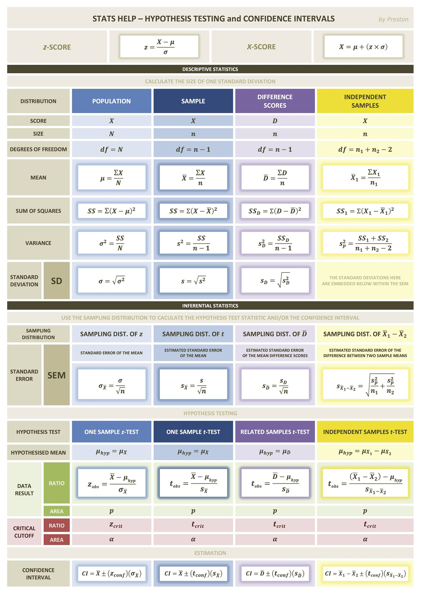 
```

## R 

```{r cheatsheets-03, fig.cap='[Data wrangling in the tidyverse](figures/data-wrangling.pdf)', fig.align='center', echo=FALSE, out.width = '95%'}
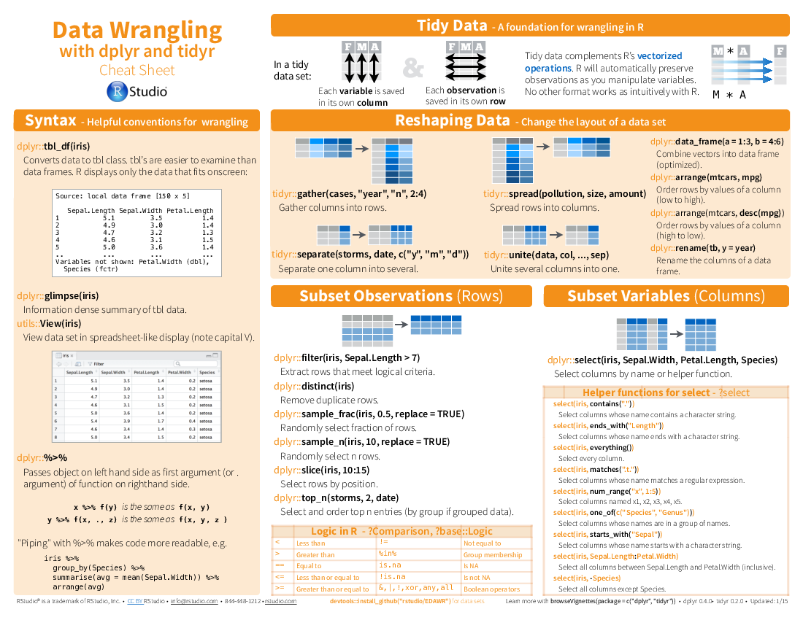 
```


```{r cheatsheets-04, fig.cap='[advancedr](figures/advancedr.pdf)', fig.align='center', echo=FALSE, out.width = '95%'}

```

```{r cheatsheets-05, fig.cap='[base-r](figures/base-r.pdf)', fig.align='center', echo=FALSE, out.width = '95%'}
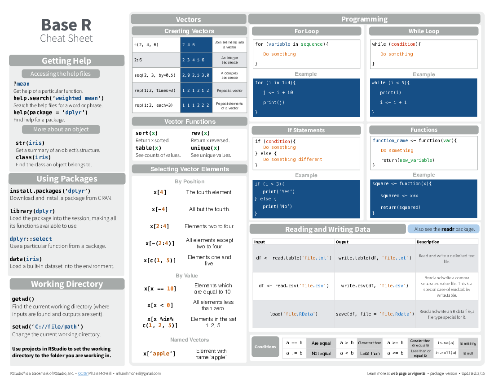
```

```{r cheatsheets-06, fig.cap='[data-import](figures/data-import.pdf)', fig.align='center', echo=FALSE, out.width = '95%'}

```

```{r cheatsheets-07, fig.cap='[data-transformation](figures/data-transformation.pdf)', fig.align='center', echo=FALSE, out.width = '95%'}
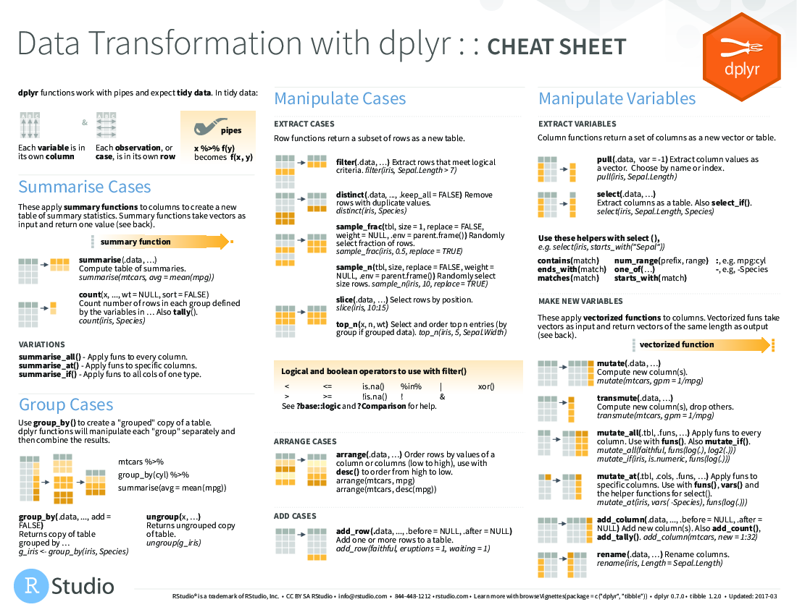
```

```{r cheatsheets-08, fig.cap='[data-visualization](figures/data-visualization.pdf)', fig.align='center', echo=FALSE, out.width = '95%'}

```

```{r cheatsheets-09, fig.cap='[how-big-is-your-graph](figures/how-big-is-your-graph.pdf)', fig.align='center', echo=FALSE, out.width = '95%'}

```

```{r cheatsheets-10, fig.cap='[latexsheet](figures/latexsheet.pdf)', fig.align='center', echo=FALSE, out.width = '95%'}

```

```{r cheatsheets-11, fig.cap='[leaflet](figures/leaflet.pdf)', fig.align='center', echo=FALSE, out.width = '95%'}

```

```{r cheatsheets-12, fig.cap='[lubridate](figures/lubridate.pdf)', fig.align='center', echo=FALSE, out.width = '95%'}

```

```{r cheatsheets-13, fig.cap='[mosaic](figures/mosaic.pdf)', fig.align='center', echo=FALSE, out.width = '95%'}
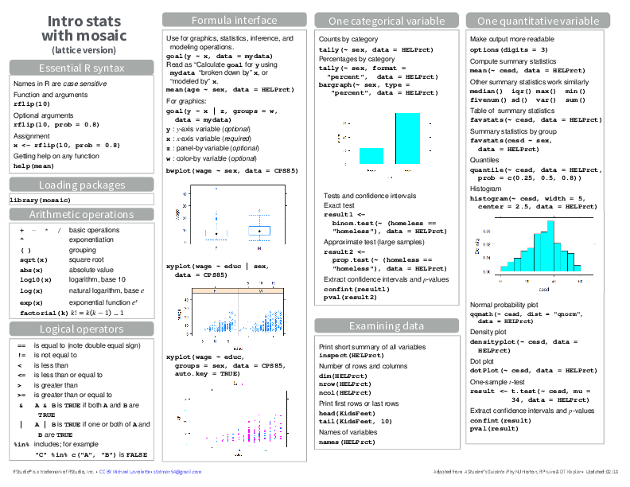
```

```{r cheatsheets-14, fig.cap='[purrr](figures/purrr.pdf)', fig.align='center', echo=FALSE, out.width = '95%'}

```

```{r cheatsheets-15, fig.cap='[regexcheatsheet](figures/regexcheatsheet.pdf)', fig.align='center', echo=FALSE, out.width = '95%'}
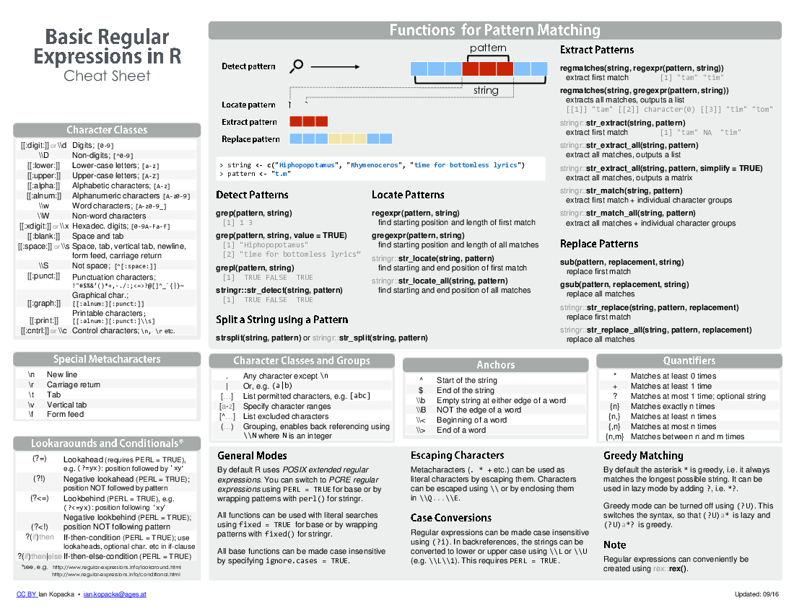
```

```{r cheatsheets-16, fig.cap='[rmarkdown-reference](figures/rmarkdown-reference.pdf)', fig.align='center', echo=FALSE, out.width = '95%'}
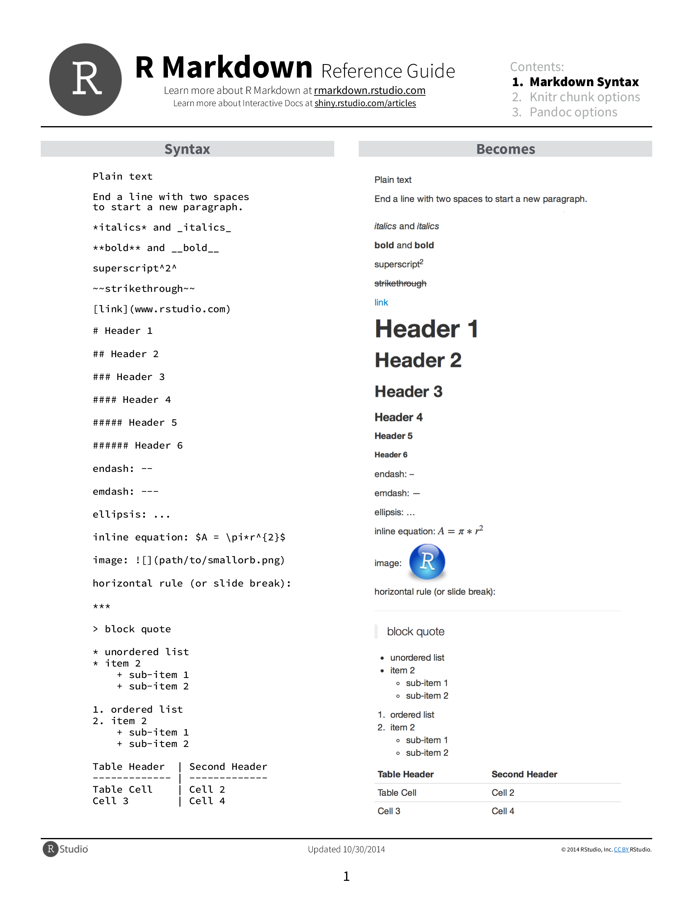
```

```{r cheatsheets-17, fig.cap='[rmarkdown](figures/rmarkdown.pdf)', fig.align='center', echo=FALSE, out.width = '95%'}

```

```{r cheatsheets-18, fig.cap='[rstudio-ide](figures/rstudio-ide.pdf)', fig.align='center', echo=FALSE, out.width = '95%'}

```

```{r cheatsheets-19, fig.cap='[shiny](figures/shiny.pdf)', fig.align='center', echo=FALSE, out.width = '95%'}

```

```{r cheatsheets-20, fig.cap='[strings](figures/strings.pdf)', fig.align='center', echo=FALSE, out.width = '95%'}
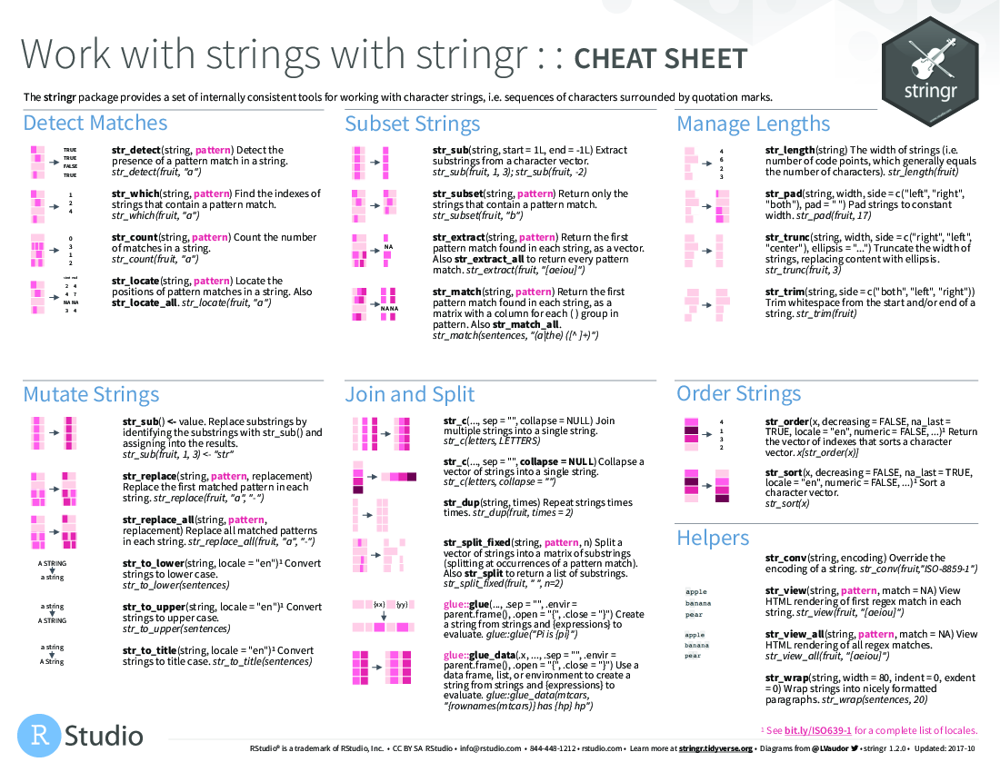
```

```{r cheatsheets-21, fig.cap='[syntax](figures/syntax.pdf)', fig.align='center', echo=FALSE, out.width = '95%'}
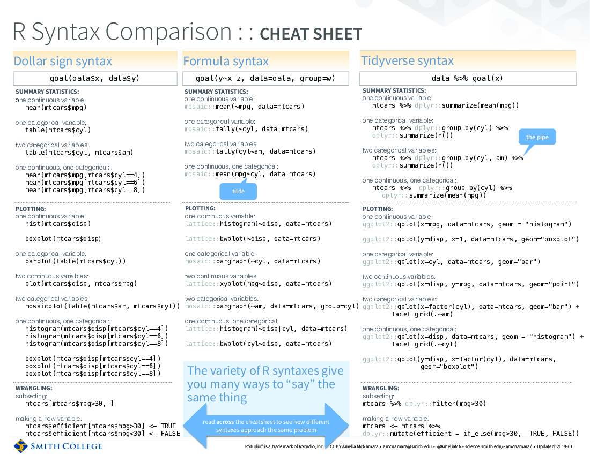
```

```{r cheatsheets-22, fig.cap='[tidyeval](figures/tidyeval.pdf)', fig.align='center', echo=FALSE, out.width = '95%'}

```

```{r cheatsheets-23, fig.cap='[visualization principles](figures/visualization-principles.pdf)', fig.align='center', echo=FALSE, out.width = '95%'}
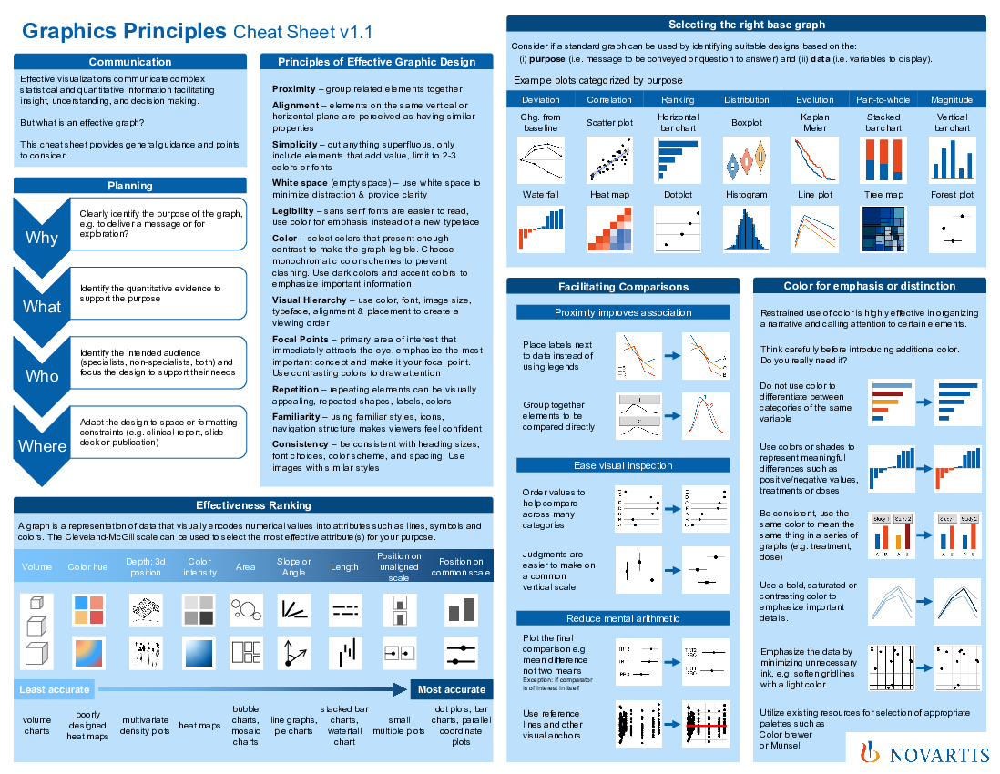
```


<!--chapter:end:27-cheatsheets.Rmd-->

`r if (knitr::is_html_output()) '# References {-}'`

<!--chapter:end:28-references.Rmd-->

